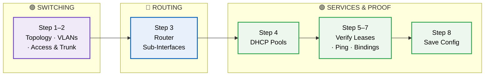
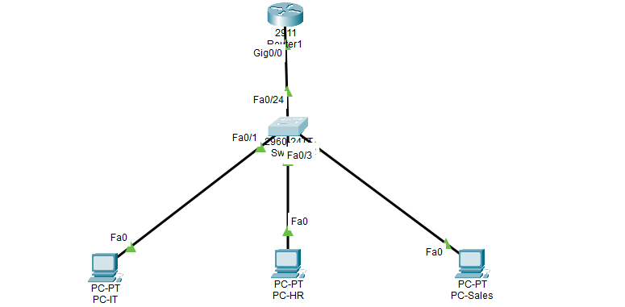
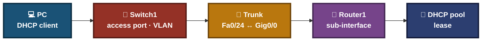
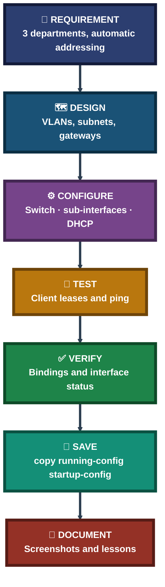
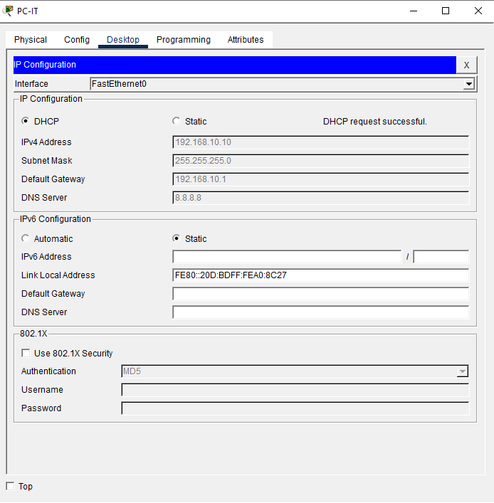
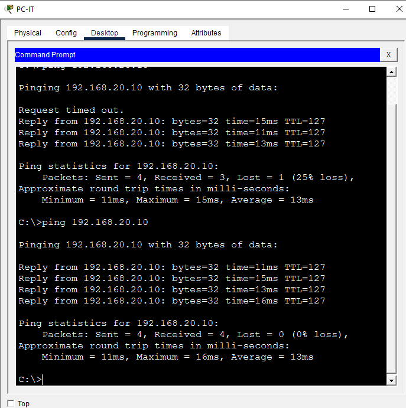
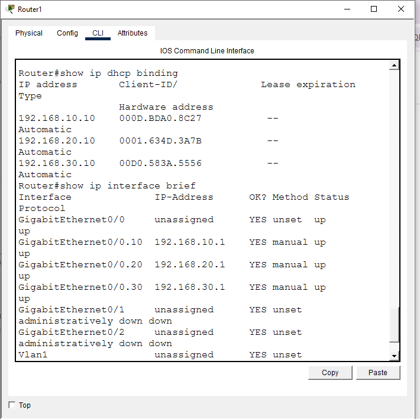

<div align="center">

# 🌐 Networking Labs — VLANs, Inter-VLAN Routing & DHCP
**Lab 02**


**1 Lab · Switching → Routing → Network Services · Cisco Packet Tracer**

A hands-on networking lab that builds three VLANs, routes between them with Router-on-a-Stick, and gives every client an address automatically from the gateway router — from the topology, to the configuration, to the proof that it works.


One method: design the plan, configure one layer at a time, test each step, and keep the evidence.

### [📂 Jump to the lab](#labs-index)

</div>

---

## 📑 Table of Contents

1. [At a Glance](#at-a-glance)
2. [About This Folder](#about)
3. [Tools & Technologies](#tools)
4. [The Lab Flow](#flow)
5. [Network Segmentation Plan](#plan)
6. [Topology & Connections](#topology)
7. [Where Traffic Can Break](#break)
8. [Coverage Snapshot](#coverage-snapshot)
9. [Network Method Pipeline](#pipeline)
10. [Verification, Not Assumption](#verification)
11. [Command & Setting Cheat Sheet](#cheat-sheet)
12. [Challenges & Fixes at a Glance](#problems-fixes)
13. [Scope & Limitations](#scope-limitations)
14. [What I Learned](#what-i-learned)
15. [Skills Demonstrated](#skills-demonstrated)
16. [Labs Index](#labs-index)
17. [Repo Structure](#repo-structure)

---

<a id="at-a-glance"></a>
## 📊 At a Glance

| 📄 Labs | 🧩 VLANs | 🖧 Devices | 📸 Screenshots | 🧱 Steps |
|:---:|:---:|:---:|:---:|:---:|
| **1** | **3** | **5** | **8** | **8** |

---

<a id="about"></a>
## 📖 About This Folder

This folder holds the **DHCP Multi-VLAN Deployment** lab (Domain: Networking · Difficulty: Intermediate). The lab has three departments (IT, HR and Sales) on one switch, each in its own VLAN and subnet. One router acts as the gateway for all three and also serves DHCP.

- **Switching:** Three VLANs, access ports for the PCs and one 802.1Q trunk to the router.
- **Routing:** Router-on-a-Stick with one sub-interface per VLAN.
- **Network services:** One DHCP pool per VLAN, served directly from the router.

> [!NOTE]
> This is a simulated lab built in Cisco Packet Tracer. Screenshots are in the `screenshots/` folder and the working file is `Lab4_DHCP_Multi_VLAN.pkt`.

<div align="center">

### 🧩 Lab Workflow at a Glance

<table>
<tr>
<td align="center" valign="top" width="18%">

**🗺 Design**<br>
<sub>VLANs, subnets<br>and gateways</sub>

</td>
<td align="center" valign="middle" width="5%">

**➜**

</td>
<td align="center" valign="top" width="20%">

**⚙️ Configure**<br>
<sub>Switch, router,<br>DHCP pools</sub>

</td>
<td align="center" valign="middle" width="5%">

**➜**

</td>
<td align="center" valign="top" width="18%">

**🔎 Test**<br>
<sub>Client leases and<br>inter-VLAN ping</sub>

</td>
<td align="center" valign="middle" width="5%">

**➜**

</td>
<td align="center" valign="top" width="18%">

**✅ Verify**<br>
<sub>DHCP bindings and<br>interface status</sub>

</td>
<td align="center" valign="middle" width="5%">

**➜**

</td>
<td align="center" valign="top" width="16%">

**💾 Save**<br>
<sub>Write config to<br>startup</sub>

</td>
</tr>
<tr>
<td colspan="9" align="center">


</td>
</tr>
</table>

</div>

---

<a id="tools"></a>
## 🛠️ Tools & Technologies

| Tool | Purpose |
|------|---------|
| Cisco Packet Tracer | Network simulation |
| Router 2911 (Router1) | Router-on-a-Stick gateway + DHCP server |
| Switch 2960 (Switch1) | VLAN segmentation, access + trunk ports |
| 802.1Q Trunking | Carries all 3 VLANs over a single uplink |
| DHCP | Per-VLAN address pools served from the router |

---

<a id="flow"></a>
## ⏱️ The Lab Flow



---

<a id="plan"></a>
## 🗂️ Network Segmentation Plan

| Department | VLAN | Subnet | Router Sub-Interface | Gateway IP | Client | Expected DHCP IP |
|---|:---:|---|---|---|---|---|
| IT | 10 | 192.168.10.0/24 | Gi0/0.10 | 192.168.10.1 | PC-IT | 192.168.10.10 |
| HR | 20 | 192.168.20.0/24 | Gi0/0.20 | 192.168.20.1 | PC-HR | 192.168.20.10 |
| Sales | 30 | 192.168.30.0/24 | Gi0/0.30 | 192.168.30.1 | PC-Sales | 192.168.30.10 |

**Excluded range:** `.1`–`.9` in every subnet, reserved for gateways and static infrastructure and kept out of the DHCP lease pool.

---

<a id="topology"></a>
## 🖧 Topology & Connections

**Devices:** Router1 (2911), Switch1 (2960), PC-IT, PC-HR, PC-Sales.

| From | To | Port |
|------|----|------|
| PC-IT | Switch1 | Fa0/1 |
| PC-HR | Switch1 | Fa0/2 |
| PC-Sales | Switch1 | Fa0/3 |
| Switch1 (trunk) | Router1 | Fa0/24 ↔ Gig0/0 |



---

<a id="break"></a>
## 🔍 Where Traffic Can Break



- **Access port** puts the PC in the right VLAN.
- **Trunk** carries all three VLANs to the router.
- **Sub-interface** is the gateway for each VLAN. The DHCP pool `network` statement must match its subnet.

---

<a id="coverage-snapshot"></a>
## 🌟 Coverage Snapshot

| 🛡️ Domain | 📌 Where It Appears | ✅ What Is Shown |
|---|---|---|
| Switching & VLANs | Steps 2 | Three named VLANs, access ports, one trunk |
| Inter-VLAN Routing | Step 3 | Router-on-a-Stick with `encapsulation dot1Q` |
| Network Services (DHCP) | Step 4–5 | Excluded ranges, per-VLAN pools, gateway and DNS options |
| Connectivity Testing | Step 6 | Ping from PC-IT to PC-HR across VLANs |
| Verification | Step 7 | `show ip dhcp binding` and `show ip interface brief` |
| Configuration Management | Step 8 | Saving running-config to startup-config |

---

<a id="pipeline"></a>
## 🧭 Network Method Pipeline

How the lab turns a requirement into a verified network



---

<a id="verification"></a>
## ✅ Verification, Not Assumption

A configuration is not done until it has been tested.

| Check | Evidence |
|---|---|
| Client DHCP lease | PC-IT shows 192.168.10.10, mask 255.255.255.0, gateway 192.168.10.1, DNS 8.8.8.8 |
| All three leases | `show ip dhcp binding` lists 192.168.10.10, 192.168.20.10 and 192.168.30.10 as Automatic |
| Sub-interfaces | `show ip interface brief` shows Gi0/0.10, .20 and .30 up/up |
| Inter-VLAN connectivity | `ping 192.168.20.10` from PC-IT: first attempt 3 of 4 replies (first packet timed out for ARP), second attempt 4 of 4 |
| Config saved | `copy running-config startup-config` returns `[OK]` |





---

<a id="cheat-sheet"></a>
## 🧾 Command & Setting Cheat Sheet

| Command | Purpose |
|---------|---------|
| `vlan <id>` / `name <name>` | Create and name a VLAN |
| `switchport mode access` / `switchport access vlan <id>` | Assign a port to a VLAN |
| `switchport mode trunk` | Carry multiple VLANs over one uplink |
| `interface g0/0.<id>` + `encapsulation dot1Q <id>` | Create a router sub-interface for ROAS |
| `ip dhcp excluded-address <start> <end>` | Reserve addresses out of the DHCP pool |
| `ip dhcp pool <name>` + `network` / `default-router` / `dns-server` | Define a DHCP pool per subnet |
| `show ip dhcp binding` | Confirm active DHCP leases |
| `show ip interface brief` | Confirm sub-interface status |

---

<a id="problems-fixes"></a>
## ⚠️ Challenges & Fixes at a Glance

| ❌ Challenge | ✅ Solution |
|---|---|
| First ping between VLANs (PC-IT → PC-HR) showed 1 timeout out of 4 | Expected: the first packet triggers ARP resolution across the new inter-VLAN path. The retry came back 4/4 |
| Two screenshots were both numbered "02-" in the original file set | Kept only the one with confirmed content (`02-switch-vlan-config.PNG`) and dropped the duplicate |

---

<a id="scope-limitations"></a>
## 🚧 Scope & Limitations

- **Simulated network:** Built in Cisco Packet Tracer, not on physical devices.
- **One inter-VLAN test shown:** The ping evidence is PC-IT to PC-HR.
- **DNS is handed out, not tested:** The pools give clients 8.8.8.8, but no name lookup test is shown.
- **No filtering between VLANs:** All three VLANs can reach each other. No ACLs are configured in this lab.
- **Cisco syntax:** Commands are for the Cisco 2911 and 2960 as used here. Other vendors differ.

These limits are stated so the lab is read as a demonstration, not a production design.

---

<a id="what-i-learned"></a>
## 🧠 What I Learned

- **Router-on-a-Stick uses one interface for many VLANs.** Sub-interfaces tagged with `encapsulation dot1Q` act as separate gateways, so no router port per VLAN is needed.
- **The pool does not create the gateway.** A DHCP pool's `network` statement and the router's sub-interface IP must be on the same subnet. The sub-interface creates the gateway.
- **Server-side proof can be stronger.** The binding table on the router shows every lease at once, while one client screenshot shows only one device.

---

<a id="skills-demonstrated"></a>
## 🛠️ Skills Demonstrated

- Creating and naming VLANs and assigning access ports
- Configuring 802.1Q trunks
- Setting up Router-on-a-Stick inter-VLAN routing
- Deploying per-VLAN DHCP pools with excluded ranges
- Verifying with `show ip dhcp binding` and `show ip interface brief`
- Testing inter-VLAN connectivity and reading ARP-related first-ping timeouts
- Saving and documenting a configuration with screenshots

---

<a id="labs-index"></a>
## 📂 Labs Index

| # | Lab | Domain | Difficulty | Tool |
|:---:|---|:---:|:---:|---|
| 1 | [Lab 04 — DHCP Multi-VLAN Deployment](./04-DHCP-Multi-VLAN-Deployment.md) | Networking | Intermediate | Cisco Packet Tracer |

---

<a id="repo-structure"></a>
## 📁 Repo Structure

```text
04-dhcp-multi-vlan/
|-- README.md
|-- Lab4_DHCP_Multi_VLAN.pkt
`-- screenshots/
    |-- 01-topology.PNG
    |-- 02-switch-vlan-config.PNG
    |-- 03-router-subinterfaces.PNG
    |-- 04-dhcp-pools-config.PNG
    |-- 05-dhcp-client-success.PNG
    |-- 06-inter-vlan-ping-test.PNG
    |-- 07-r1-dhcp-verification.PNG
    `-- 08-save-config.PNG
```

<div align="center">

📶 **[What is DHCP](https://www.cloudflare.com/learning/network-layer/what-is-dhcp/)** · 🔀 **[What is a LAN](https://www.cloudflare.com/learning/network-layer/what-is-a-lan/)** · 🪟 **[Windows Commands](https://learn.microsoft.com/windows-server/administration/windows-commands/windows-commands)**

[⬅️ Back to Portfolio Root](../README.md)

</div>
