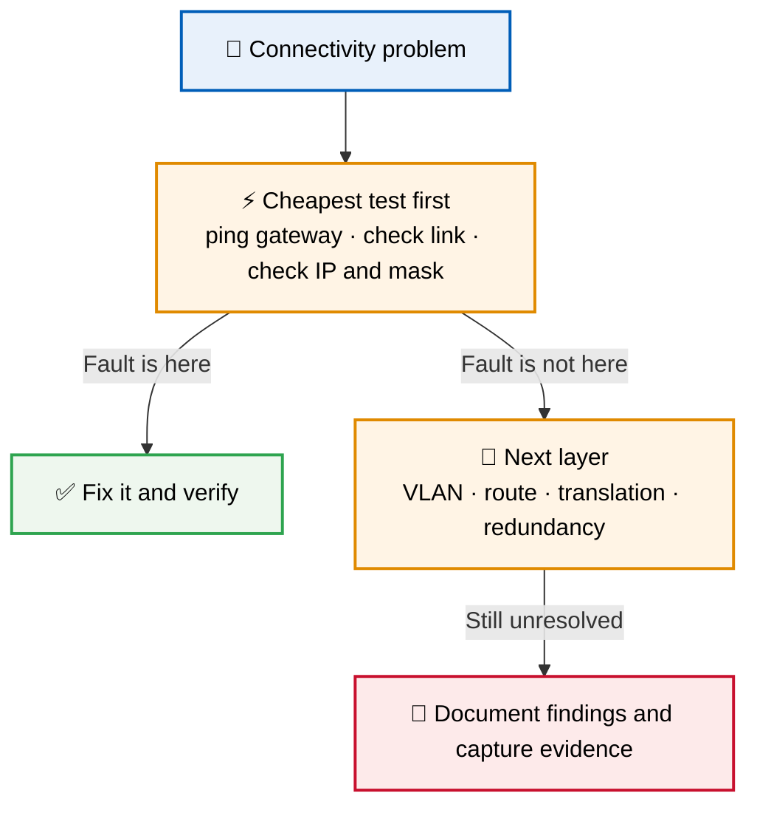
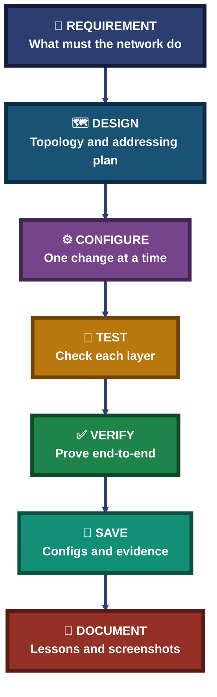

<div align="center">

# 🌐 Networking Labs — Switching, Addressing, Routing & Network Services

**11 Labs · VLANs → Addressing → Routing → Services & Redundancy · Cisco Packet Tracer**

Eleven hands-on Cisco networking labs, each documenting the topology, the configuration, the tests and the result — from the first design decision to the final verification.


Every lab follows one method: design the plan, configure one layer at a time, test each step, and keep the evidence.

### [📂 Jump to the labs](#labs-index)

</div>

---

## 📑 Table of Contents

1. [At a Glance](#at-a-glance)
2. [About This Folder](#about)
3. [Tools & Technologies](#tools)
4. [The Lab Flow](#flow)
5. [Which Lab Do I Need?](#which-lab)
6. [Addressing (1 lab)](#addressing)
7. [Switching & VLANs (3 labs)](#switching)
8. [Routing (4 labs)](#routing)
9. [Services & Redundancy (3 labs)](#services)
10. [Coverage Snapshot](#coverage-snapshot)
11. [Network Method Pipeline](#pipeline)
12. [Verification, Not Assumption](#verification)
13. [Command & Setting Cheat Sheet](#cheat-sheet)
14. [Challenges & Fixes at a Glance](#problems-fixes)
15. [Scope & Limitations](#scope-limitations)
16. [What I Learned](#what-i-learned)
17. [Skills Demonstrated](#skills-demonstrated)
18. [Labs Index](#labs-index)
19. [Repo Structure](#repo-structure)

---

<a id="at-a-glance"></a>
## 📊 At a Glance

| 📄 Labs | 🧩 Topic Groups | 🛠 Main Tool | 📁 Each Lab Has |
|:---:|:---:|:---:|:---:|
| **11** | **4** | **Cisco Packet Tracer** | **README · .pkt file · screenshots** |

---

<a id="about"></a>
## 📖 About This Folder

This folder holds eleven networking labs. Each lab lives in its own folder with a README that documents the objective, tools, topology, step-by-step configuration, screenshots, commands used, challenges and lessons learned.

- **Addressing:** Splitting one address block into right-sized subnets with VLSM and CIDR.
- **Switching & VLANs:** VLAN segmentation, inter-VLAN routing, DHCP per VLAN, and troubleshooting a VLAN network.
- **Routing:** Static, RIP, EIGRP and OSPF, single-area and multi-area OSPF, and redistribution between protocols.
- **Services & Redundancy:** NAT and PAT, HSRP gateway failover, and multi-site syslog logging.

> [!NOTE]
> These are simulated labs built in Cisco Packet Tracer. Screenshots and the working `.pkt` file are inside each lab folder.

<div align="center">

### 🧩 Lab Workflow at a Glance

<table>
<tr>
<td align="center" valign="top" width="18%">

**🗺 Design**<br>
<sub>Topology and<br>addressing plan</sub>

</td>
<td align="center" valign="middle" width="5%">

**➜**

</td>
<td align="center" valign="top" width="20%">

**⚙️ Configure**<br>
<sub>One change<br>at a time</sub>

</td>
<td align="center" valign="middle" width="5%">

**➜**

</td>
<td align="center" valign="top" width="18%">

**🔎 Test**<br>
<sub>Check each<br>layer</sub>

</td>
<td align="center" valign="middle" width="5%">

**➜**

</td>
<td align="center" valign="top" width="18%">

**✅ Verify**<br>
<sub>Prove end-to-end<br>connectivity</sub>

</td>
<td align="center" valign="middle" width="5%">

**➜**

</td>
<td align="center" valign="top" width="16%">

**📝 Document**<br>
<sub>Save configs<br>and evidence</sub>

</td>
</tr>
<tr>
<td colspan="9" align="center">


<br>
<sub>Cisco IOS show commands and simple client tests, all inside Packet Tracer</sub>

</td>
</tr>
</table>

</div>

---

<a id="tools"></a>
## 🛠️ Tools & Technologies

| Tool | Purpose |
|------|---------|
| Cisco Packet Tracer | Network simulation |
| Cisco 2911 routers / 2960 switches | Routing, gateways and switching in the labs |
| 802.1Q VLANs & Trunking | Segmenting departments and carrying VLANs over one uplink |
| VLSM / CIDR | Right-sizing each subnet to actual host need, no waste |
| Static, RIP, EIGRP, OSPF | Routing between networks, single and multi-area |
| Route Redistribution | Exchanging routes between OSPF and EIGRP |
| HSRP | First-hop redundancy and gateway failover |
| DHCP | Automatic addressing per VLAN from the gateway router |
| NAT / PAT | Address translation for private networks |
| Syslog | Central logging across multiple sites |

---

<a id="flow"></a>
## ⏱️ The Lab Flow

```mermaid
flowchart LR
    subgraph G1["🔵 ADDRESSING"]
        direction TB
        A1["VLSM &<br/>CIDR"]
    end
    subgraph G2["🟣 SWITCHING & VLANs"]
        direction TB
        B1["DHCP<br/>Multi-VLAN"]
        B2["VLAN &<br/>Inter-VLAN"]
        B3["VLAN<br/>Troubleshooting"]
    end
    subgraph G3["🟠 ROUTING"]
        direction TB
        C1["Static · RIP<br/>EIGRP · OSPF"]
        C2["OSPF<br/>Single Area"]
        C3["Multi-Area<br/>OSPF"]
        C4["OSPF-EIGRP<br/>Redistribution"]
    end
    subgraph G4["🟢 SERVICES & REDUNDANCY"]
        direction TB
        D1["NAT &<br/>PAT"]
        D2["HSRP<br/>Failover"]
        D3["Multi-Site<br/>Syslog"]
    end
    G1 ==> G2 ==> G3 ==> G4

    classDef ad fill:#e8f1fb,stroke:#005EB8,stroke-width:2px,color:#000
    classDef sw fill:#f0eaf8,stroke:#6f42c1,stroke-width:2px,color:#000
    classDef rt fill:#fff4e5,stroke:#e08a00,stroke-width:2px,color:#000
    classDef sv fill:#eef7ee,stroke:#2ea44f,stroke-width:2px,color:#000
    class A1 ad
    class B1,B2,B3 sw
    class C1,C2,C3,C4 rt
    class D1,D2,D3 sv
```



<p align="center"><em>The groups show which topic each lab belongs to. Lab numbers are in the Labs Index.</em></p>

---

<a id="which-lab"></a>
## 🧭 Which Lab Do I Need?

```mermaid
flowchart TD
    Start(["🎯 What do you want to learn or fix?"]):::start
    Start --> A["Split one address block<br/>into right-sized subnets"]:::q
    Start --> B["Separate departments<br/>on one switch"]:::q
    Start --> C["Clients need addresses<br/>automatically per VLAN"]:::q
    Start --> D["VLAN or inter-VLAN<br/>routing is broken"]:::q
    Start --> E["Routers should learn<br/>routes automatically"]:::q
    Start --> F["Large network with<br/>several OSPF areas"]:::q
    Start --> G["Two routing protocols<br/>must share routes"]:::q
    Start --> H["Private hosts need<br/>outside access"]:::q
    Start --> I["Gateway must not be a<br/>single point of failure"]:::q
    Start --> J["Collect logs from<br/>several sites"]:::q
    A --> S1(["VLSM & CIDR"]):::s
    B --> S2(["VLAN & Inter-VLAN Routing"]):::s
    C --> S3(["DHCP Multi-VLAN"]):::s
    D --> S4(["VLAN Troubleshooting"]):::s
    E --> S5(["Routing Protocols · OSPF Single Area"]):::s
    F --> S6(["Multi-Area OSPF"]):::s
    G --> S7(["OSPF-EIGRP Redistribution"]):::s
    H --> S8(["NAT & PAT"]):::s
    I --> S9(["HSRP Failover"]):::s
    J --> S10(["Multi-Site Syslog"]):::s

    classDef start fill:#943126,stroke:#571C16,stroke-width:3px,color:#FFFFFF,font-weight:bold
    classDef q fill:#1A5276,stroke:#0B2E43,stroke-width:3px,color:#FFFFFF,font-weight:bold
    classDef s fill:#1E8449,stroke:#0E4A28,stroke-width:3px,color:#FFFFFF,font-weight:bold
```



---

<a id="addressing"></a>
## 🔵 Addressing (1 lab)

**Goal:** Turn one allocated block into subnets that match the real host need.

| Focus | What the Lab Covers | Folder |
|---|---|:---:|
| VLSM & CIDR | Splits `172.16.0.0/20` into /22, /23, /24 building subnets and three /30 WAN links, then connects three routers with OSPF Area 0. | [📁 Lab](./01-enterprise-ip-addressing-vlsm-cidr/) |

---

<a id="switching"></a>
## 🟣 Switching & VLANs (3 labs)

**Goal:** Segment departments, route between them, and find faults in a VLAN network.

| Focus | What the Lab Covers | Folder |
|---|---|:---:|
| DHCP Multi-VLAN | Three VLANs, Router-on-a-Stick inter-VLAN routing and per-VLAN DHCP pools on the gateway router, verified with client leases and the binding table. | [📁 Lab](./02-dhcp-multi-vlan-deployment/) |
| VLAN & Inter-VLAN Routing | Enterprise VLAN design with routing between the VLANs. | [📁 Lab](./03-enterprise-network-vlan-intervlan-routing/) |
| VLAN Troubleshooting | Finding and fixing faults in a VLAN and inter-VLAN routing network. | [📁 Lab](./04-enterprise-network-troubleshooting-vlan-intervlan-routing/) |

### Where Traffic Can Break


---

<a id="routing"></a>
## 🟠 Routing (4 labs)

**Goal:** Get traffic between networks with static routes and dynamic routing protocols.

| Focus | What the Lab Covers | Folder |
|---|---|:---:|
| Routing Protocols | Static routing, RIP, EIGRP and OSPF. | [📁 Lab](./05-routing-protocols-ospf-eigrp-rip-static/) |
| OSPF Single Area | Enterprise network routed with single-area OSPF. | [📁 Lab](./06-enterprise-network-ospf-single-area-routing-lab/) |
| Multi-Area OSPF | OSPF with more than one area. | [📁 Lab](./07-multi-area-ospf-lab/) |
| OSPF–EIGRP Redistribution | Exchanging routes between OSPF and EIGRP. | [📁 Lab](./08-ospf-eigrp-redistribution/) |

---

<a id="services"></a>
## 🟢 Services & Redundancy (3 labs)

**Goal:** Keep the network reachable, translated and observable.

| Focus | What the Lab Covers | Folder |
|---|---|:---:|
| NAT & PAT | Address translation for private networks. | [📁 Lab](./09-nat-pat-address-translation/) |
| HSRP Failover | First-hop redundancy with gateway failover. | [📁 Lab](./10-hsrp-redundancy-failover/) |
| Multi-Site Syslog | Central logging across multiple sites. | [📁 Lab](./11-syslog-multisite-logging-enterprise/) |

### 🔍 Analyst Note — Why the Simple Test Comes First

Every lab starts with the cheapest test before deeper checks. It rules out a whole group of causes in seconds.



---

<a id="coverage-snapshot"></a>
## 🌟 Coverage Snapshot

| 🛡️ Domain | 📌 Where It Appears | ✅ What Is Shown |
|---|---|---|
| IP Addressing & Subnetting | VLSM & CIDR lab | Right-sized subnets, usable ranges, WAN /30 links |
| Switching & VLANs | DHCP Multi-VLAN, VLAN & Inter-VLAN labs | VLANs, access ports, trunks, Router-on-a-Stick |
| Network Services | DHCP Multi-VLAN, NAT & PAT, Syslog labs | DHCP pools, translation, central logging |
| Dynamic Routing | Routing Protocols, OSPF Single and Multi-Area labs | Static, RIP, EIGRP, OSPF |
| Route Redistribution | OSPF–EIGRP Redistribution lab | Sharing routes between two protocols |
| Redundancy | HSRP Failover lab | First-hop gateway failover |
| Troubleshooting | VLAN Troubleshooting lab | Finding faults layer by layer |

---

<a id="pipeline"></a>
## 🧭 Network Method Pipeline

How every lab turns a requirement into a verified network



---

<a id="verification"></a>
## ✅ Verification, Not Assumption

A recurring rule across the labs: a configuration is not done until it has been tested.

| Lab | Verification Step |
|---|---|
| VLSM & CIDR | Ping from PC-A to PC-B and PC-C, and `show ip route ospf` on all three routers |
| DHCP Multi-VLAN | Client leases, `show ip dhcp binding`, `show ip interface brief`, and an inter-VLAN ping |
| All other labs | See the verification step in each lab's README |

---

<a id="cheat-sheet"></a>
## 🧾 Command & Setting Cheat Sheet

| Command | Purpose |
|---------|---------|
| `vlan <id>` / `name <name>` | Create and name a VLAN |
| `switchport mode access` / `switchport access vlan <id>` | Assign a port to a VLAN |
| `switchport mode trunk` | Carry multiple VLANs over one uplink |
| `interface g0/0.<id>` + `encapsulation dot1Q <id>` | Router sub-interface for Router-on-a-Stick |
| `ip dhcp pool <name>` + `network` / `default-router` / `dns-server` | Define a DHCP pool per subnet |
| `ip address <ip> <mask>` | Assign IP to interface |
| `router ospf <process-id>` + `network <ip> <wildcard> area <id>` | Enable OSPF and advertise a network |
| `show ip route ospf` / `show ip dhcp binding` / `show ip interface brief` | Verify routes, leases and interface status |
| `copy running-config startup-config` | Save configuration |

> Commands from the VLSM and DHCP Multi-VLAN labs. Add commands from the other labs as needed.

---

<a id="problems-fixes"></a>
## ⚠️ Challenges & Fixes at a Glance

| ❌ Challenge | ✅ Solution |
|---|---|
| Wrong subnet mask on PC-C, but pings still worked | Proxy ARP on the router was answering for it. Corrected the mask to 255.255.255.0 and re-verified |
| First ping between VLANs showed 1 timeout out of 4 | Expected: the first packet triggers ARP resolution. The retry came back 4/4 |

---

<a id="scope-limitations"></a>
## 🚧 Scope & Limitations

- **Simulated networks:** Built in Cisco Packet Tracer, not on physical devices.
- **Evidence lives in the lab folders:** Screenshots and `.pkt` files are stored in each lab's folder.
- **Cisco syntax:** Commands shown are Cisco IOS. Other vendors use different syntax.
- **One design per lab:** Other valid designs for the same goal are not covered.
- **Not a production template:** Real networks need their own security review and change control.

These limits are stated so the labs are read as demonstrations, not as guaranteed designs.

---

<a id="what-i-learned"></a>
## 🧠 What I Learned

- **Plan the addressing first.** A clear plan prevents most later faults.
- **A ping success does not confirm a config is correct.** Proxy ARP can hide a wrong mask, so check the actual settings.
- **Server-side proof can be stronger.** A router's DHCP binding table shows every lease at once.
- **Change one thing at a time and test layer by layer.** Otherwise the real cause stays unknown.
- **Save the evidence.** Configs, outputs and screenshots make each lab repeatable.

---

<a id="skills-demonstrated"></a>
## 🛠️ Skills Demonstrated

- Designing IP addressing plans with VLSM and CIDR
- Building VLANs, trunks and inter-VLAN routing
- Configuring static routing, RIP, EIGRP and OSPF (single and multi-area)
- Redistributing routes between OSPF and EIGRP
- Setting up DHCP, NAT/PAT and HSRP
- Configuring multi-site syslog logging
- Troubleshooting VLAN networks layer by layer
- Documenting each lab with commands, screenshots and lessons

---

<a id="labs-index"></a>
## 📂 Labs Index

| Lab # | Lab | Group | Folder |
|:---:|---|:---:|---|
| 01 | IP Addressing, VLSM & CIDR | Addressing | [`01-enterprise-ip-addressing-vlsm-cidr`](./01-enterprise-ip-addressing-vlsm-cidr/) |
| 02 | DHCP Multi-VLAN Deployment | Switching | [`02-dhcp-multi-vlan-deployment`](./02-dhcp-multi-vlan-deployment/) |
| 03 | Enterprise VLAN & Inter-VLAN Routing | Switching | [`03-enterprise-network-vlan-intervlan-routing`](./03-enterprise-network-vlan-intervlan-routing/) |
| 04 | VLAN & Inter-VLAN Troubleshooting | Switching | [`04-enterprise-network-troubleshooting-vlan-intervlan-routing`](./04-enterprise-network-troubleshooting-vlan-intervlan-routing/) |
| 05 | Routing Protocols (Static, RIP, EIGRP, OSPF) | Routing | [`05-routing-protocols-ospf-eigrp-rip-static`](./05-routing-protocols-ospf-eigrp-rip-static/) |
| 06 | Enterprise OSPF Single-Area Routing | Routing | [`06-enterprise-network-ospf-single-area-routing-lab`](./06-enterprise-network-ospf-single-area-routing-lab/) |
| 07 | Multi-Area OSPF | Routing | [`07-multi-area-ospf-lab`](./07-multi-area-ospf-lab/) |
| 08 | OSPF–EIGRP Redistribution | Routing | [`08-ospf-eigrp-redistribution`](./08-ospf-eigrp-redistribution/) |
| 09 | NAT & PAT Address Translation | Services | [`09-nat-pat-address-translation`](./09-nat-pat-address-translation/) |
| 10 | HSRP Redundancy & Failover | Services | [`10-hsrp-redundancy-failover`](./10-hsrp-redundancy-failover/) |
| 11 | Multi-Site Syslog Logging | Services | [`11-syslog-multisite-logging-enterprise`](./11-syslog-multisite-logging-enterprise/) |

---

<a id="repo-structure"></a>
## 📁 Repo Structure

```text
Cisco-Networking-Lab-Portfolio/
|-- 01-Networking/
|   |-- README.md
|   |-- 01-enterprise-ip-addressing-vlsm-cidr/
|   |-- 02-dhcp-multi-vlan-deployment/
|   |-- 03-enterprise-network-vlan-intervlan-routing/
|   |-- 04-enterprise-network-troubleshooting-vlan-intervlan-routing/
|   |-- 05-routing-protocols-ospf-eigrp-rip-static/
|   |-- 06-enterprise-network-ospf-single-area-routing-lab/
|   |-- 07-multi-area-ospf-lab/
|   |-- 08-ospf-eigrp-redistribution/
|   |-- 09-nat-pat-address-translation/
|   |-- 10-hsrp-redundancy-failover/
|   `-- 11-syslog-multisite-logging-enterprise/
|-- 02-Network-Security/
|-- 03-IT-Support-Troubleshooting/
|-- LICENSE
`-- README.md
```

<div align="center">

📶 **[What is DHCP](https://www.cloudflare.com/learning/network-layer/what-is-dhcp/)** · 🧮 **[What is a subnet](https://www.cloudflare.com/learning/network-layer/what-is-a-subnet/)** · 🔀 **[What is a LAN](https://www.cloudflare.com/learning/network-layer/what-is-a-lan/)** · 🪟 **[Windows Commands](https://learn.microsoft.com/windows-server/administration/windows-commands/windows-commands)**

[⬅️ Back to Portfolio Root](../README.md)

</div>
