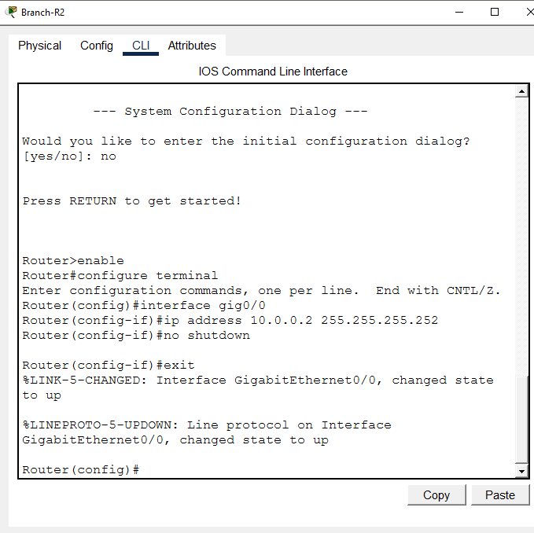
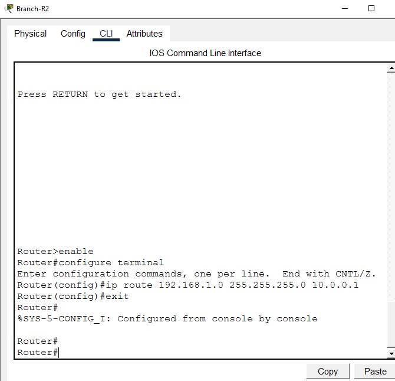
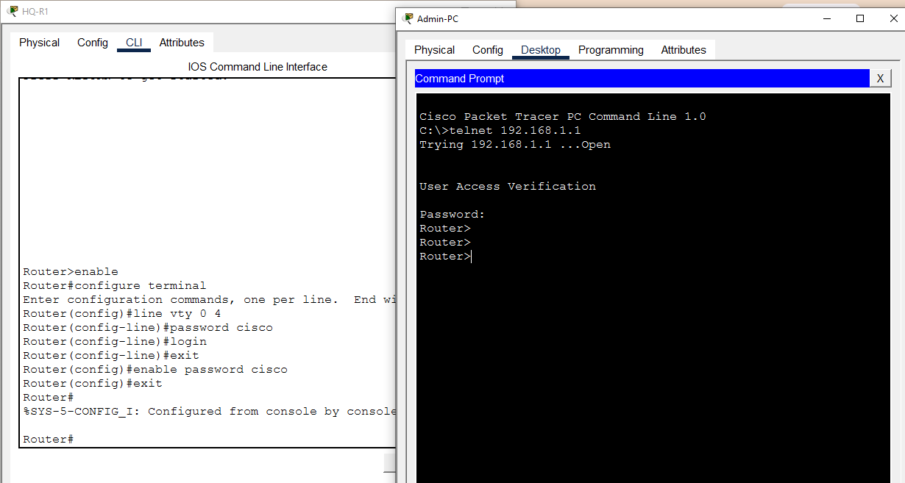
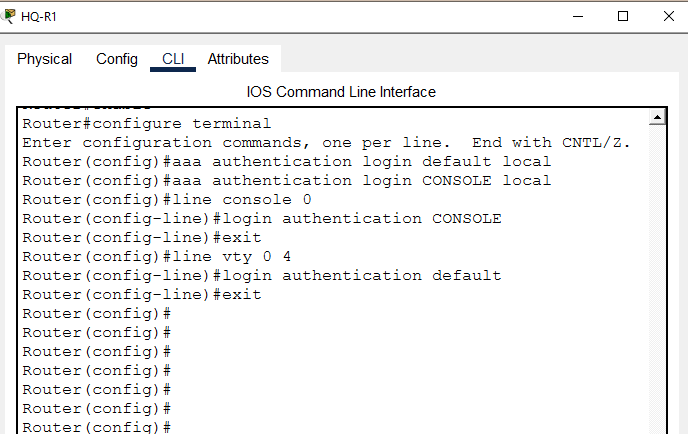
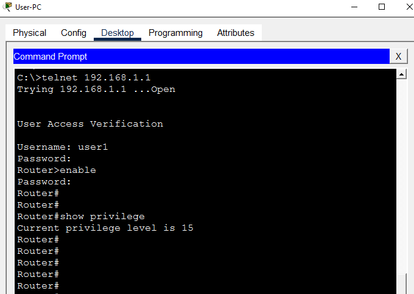
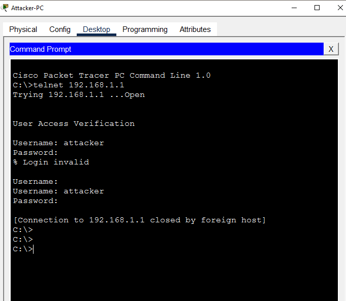
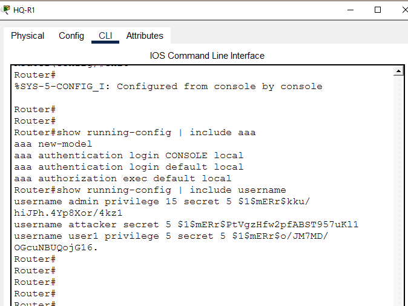
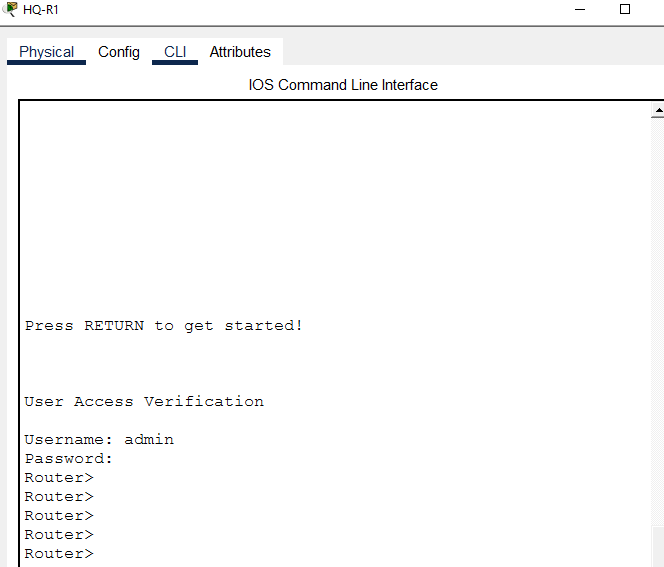
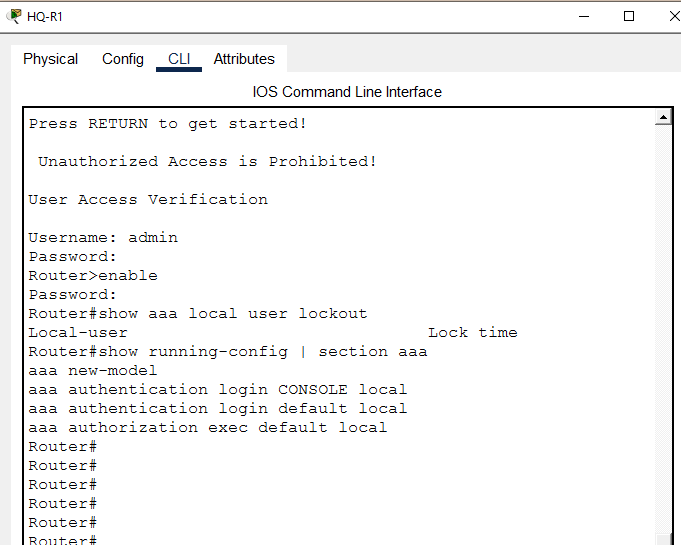

# AAA — Local Authentication

**Domain:** Network Security
**Difficulty:** Intermediate — Advanced
**Tools:** Cisco Packet Tracer, Router 2911, Switch 2960

---

## 🎯 Objective
Simulate, configure, and verify AAA (Authentication, Authorization, and Accounting) Local Authentication on a Cisco router — including local user database creation, privilege level assignment, AAA new-model configuration, console and VTY line authentication, login banner, attacker lockout simulation, and active session monitoring — using Cisco Packet Tracer.

---

## 🛠️ Tools & Technologies

| Tool | Purpose |
|------|---------|
| Cisco Packet Tracer | Network topology simulation |
| Router 2911 (x2) | HQ and Branch routers |
| Switch 2960 | Core LAN switching |
| AAA new-model | Enable AAA framework on router |
| Local Username Database | Store usernames and passwords locally |
| Privilege Levels | Control access level per user (1-15) |
| aaa authentication login | Define login authentication method |
| aaa authorization exec | Define exec authorization method |
| banner motd | Login warning banner |
| show users | View active login sessions |
| show aaa local user lockout | Check locked accounts |
| Telnet | Remote access for login testing |

---

## 🖧 Topology

### Devices
| Device | Model | Role |
|--------|-------|------|
| HQ-R1 | Router 2911 | AAA Server Router |
| Branch-R2 | Router 2911 | Branch Router |
| Core-SW1 | Switch 2960 | Core LAN Switch |
| Admin-PC | PC | Full Admin Access (Privilege 15) |
| User-PC | PC | Limited User Access (Privilege 5) |
| Attacker-PC | PC | Unauthorized Access Attempt |

### Physical Connections
| From | Port | To | Port | Cable |
|------|------|----|------|-------|
| Admin-PC | Fa0 | Core-SW1 | Fa0/1 | Copper Straight-Through |
| User-PC | Fa0 | Core-SW1 | Fa0/2 | Copper Straight-Through |
| Attacker-PC | Fa0 | Core-SW1 | Fa0/3 | Copper Straight-Through |
| Core-SW1 | Fa0/24 | HQ-R1 | Gig0/0 | Copper Straight-Through |
| HQ-R1 | Gig0/1 | Branch-R2 | Gig0/0 | Copper Straight-Through |

### IP Design
| Device | Interface | IP Address | Subnet Mask | Gateway |
|--------|-----------|------------|-------------|---------|
| HQ-R1 | Gig0/0 | 192.168.1.1 | 255.255.255.0 | — |
| HQ-R1 | Gig0/1 | 10.0.0.1 | 255.255.255.252 | — |
| Branch-R2 | Gig0/0 | 10.0.0.2 | 255.255.255.252 | — |
| Admin-PC | Fa0 | 192.168.1.10 | 255.255.255.0 | 192.168.1.1 |
| User-PC | Fa0 | 192.168.1.20 | 255.255.255.0 | 192.168.1.1 |
| Attacker-PC | Fa0 | 192.168.1.30 | 255.255.255.0 | 192.168.1.1 |

---

## 🐛 Simulated Issues
| # | Issue | Type |
|---|-------|------|
| 1 | No authentication — anyone can access router | Missing AAA |
| 2 | Single shared password — no user tracking | No individual accounts |
| 3 | All users have same access level | Missing privilege levels |
| 4 | Attacker attempts unauthorized login | Brute force simulation |
| 5 | No login warning banner | Missing security notice |

---

## 📋 Steps & Screenshots

### Step 1 — Build the Topology
```
No CLI commands — physical wiring done in Packet Tracer GUI.
Drag devices onto canvas and connect cables per topology table.
Rename all devices per naming convention above.
```


---

### Step 2 — Configure HQ-R1
```
enable
configure terminal
interface gig0/0
ip address 192.168.1.1 255.255.255.0
no shutdown
exit
interface gig0/1
ip address 10.0.0.1 255.255.255.252
no shutdown
exit
```


---

### Step 3 — Configure Branch-R2
```
enable
configure terminal
interface gig0/0
ip address 10.0.0.2 255.255.255.252
no shutdown
exit
```


---

### Step 4 — Configure PC IPs
```
Admin-PC:    192.168.1.10 | Mask: 255.255.255.0 | GW: 192.168.1.1
User-PC:     192.168.1.20 | Mask: 255.255.255.0 | GW: 192.168.1.1
Attacker-PC: 192.168.1.30 | Mask: 255.255.255.0 | GW: 192.168.1.1
```


---

### Step 5 — Configure Static Routing
```
HQ-R1:
ip route 0.0.0.0 0.0.0.0 10.0.0.2

Branch-R2:
ip route 192.168.1.0 255.255.255.0 10.0.0.1
```


---

### Step 6 — Pre-AAA Telnet Test (Insecure)
Test basic Telnet before AAA configuration.
```
enable
configure terminal
line vty 0 4
password cisco
login
exit
enable password cisco
exit

Admin-PC> telnet 192.168.1.1
Password: cisco
→ Connected — no individual user tracking ⚠️
```


---

### Step 7 — Enable AAA and Create Local Users
```
enable
configure terminal
aaa new-model
username admin privilege 15 secret Admin@123
username user1 privilege 5 secret User@123
username attacker privilege 1 secret Wrong@123
exit

→ AAA framework enabled
→ admin: Full access (privilege 15)
→ user1: Limited access (privilege 5)
→ attacker: Minimal access (privilege 1)
→ All passwords encrypted with secret
```


---

### Step 8 — Configure AAA Authentication
```
enable
configure terminal
aaa authentication login default local
aaa authentication login CONSOLE local
line console 0
login authentication CONSOLE
exit
line vty 0 4
login authentication default
exit

→ Default login: use local database
→ Console: use local database
→ VTY lines: use default (local) authentication
```


---

### Step 9 — Configure Privilege Levels
```
enable
configure terminal
privilege exec level 5 show ip interface brief
privilege exec level 5 show version
privilege exec level 5 ping
exit

→ Privilege 5 users can: show ip interface brief, show version, ping
→ Cannot access higher level commands
```


---

### Step 10 — Admin Login Test (Full Access)
```
Admin-PC> telnet 192.168.1.1
Username: admin
Password: Admin@123
→ Login successful ✅

Router# show privilege
→ Current privilege level is 15 ✅
→ Full administrative access confirmed
```


---

### Step 11 — User1 Login Test (Limited Access)
```
User-PC> telnet 192.168.1.1
Username: user1
Password: User@123
→ Login successful ✅
→ Router> prompt (limited access)

Router> show privilege
→ Current privilege level is 5
→ Note: Packet Tracer limitation — real IOS enforces privilege 5 correctly
```


---

### Step 12 — Attacker Login Fail
```
Attacker-PC> telnet 192.168.1.1
Username: attacker
Password: WrongPassword
→ % Login invalid ❌
→ Connection closed by foreign host
→ Unauthorized access blocked ✅
```


---

### Step 13 — Verify AAA Configuration
```
show running-config | include aaa
→ aaa new-model
→ aaa authentication login CONSOLE local
→ aaa authentication login default local
→ aaa authorization exec default local

show running-config | include username
→ username admin privilege 15 secret 5 $1$...
→ username user1 privilege 5 secret 5 $1$...
→ username attacker secret 5 $1$...
→ All passwords encrypted ✅
```


---

### Step 14 — Console Login Test
```
→ Logout from router console
→ Login with admin credentials

Username: admin
Password: Admin@123
→ Console authentication working ✅
→ Unauthorized Access is Prohibited! banner shown
```


---

### Step 15 — Show Active Users
```
show users

→ Line    User    Host(s)  Idle     Location
→ 0 con 0  admin  idle     00:00:00
→ 391 vty 1 user1 idle     00:07:15  192.168.1.20
→ Both admin (console) and user1 (VTY) sessions visible ✅
```


---

### Step 16 — Configure Login Banner
```
enable
configure terminal
banner motd # Unauthorized Access is Prohibited! #
exit

→ Banner appears on every login attempt
→ Legal warning for unauthorized users
→ "Unauthorized Access is Prohibited!" displayed ✅
```


---

### Step 17 — Final AAA Verification
```
show aaa local user lockout
→ No locked users (clean state)

show running-config | section aaa
→ aaa new-model
→ aaa authentication login CONSOLE local
→ aaa authentication login default local
→ aaa authorization exec default local
→ AAA fully configured and verified ✅
```


---

## 📟 Summary of Commands

| Command | Purpose |
|---------|---------|
| `aaa new-model` | Enable AAA framework on router |
| `username <name> privilege <level> secret <pass>` | Create local user with privilege level |
| `aaa authentication login default local` | Use local DB for default login authentication |
| `aaa authentication login CONSOLE local` | Use local DB for console authentication |
| `aaa authorization exec default local` | Use local DB for exec authorization |
| `line console 0` | Enter console line configuration |
| `login authentication <list>` | Apply AAA list to line |
| `privilege exec level <num> <command>` | Assign command to privilege level |
| `banner motd # <message> #` | Configure login warning banner |
| `show users` | View active login sessions |
| `show aaa local user lockout` | Check locked user accounts |
| `show running-config | include aaa` | Filter AAA config from running config |
| `show running-config | include username` | View all local usernames |
| `show privilege` | View current privilege level |

---

## ⚠️ Challenges & How I Solved Them

| Challenge | Solution |
|-----------|----------|
| Privilege level not enforcing in Packet Tracer | Known Packet Tracer limitation — real IOS enforces privilege levels correctly; documented in README |
| enable password conflict with AAA | Used `enable secret Admin@123` to separate enable password from AAA user passwords |
| Attacker could still attempt login multiple times | Normal behavior — in real IOS, `aaa local authentication attempts max-fail` command locks account |
| Console login not prompting for username | Added `login authentication CONSOLE` under `line console 0` to apply AAA to console |
| Passwords visible in show running-config | Used `secret` instead of `password` — passwords stored as MD5 hash (secret 5) |

---

## 🧠 What I Learned

How to implement AAA Local Authentication on Cisco routers — including enabling the AAA new-model framework, creating local user accounts with different privilege levels, configuring authentication lists for console and VTY lines, testing authorized and unauthorized login attempts, monitoring active sessions with show users, configuring login banners for security compliance, and verifying the complete AAA configuration — demonstrating real enterprise access control using Cisco Packet Tracer.

---

## 📁 Files

| File | Description |
|------|-------------|
| `README.md` | Full lab documentation |
| `aaa-local-auth-lab.pkt` | Packet Tracer file |
| `screenshots/` | 17 step-by-step screenshots folder |
