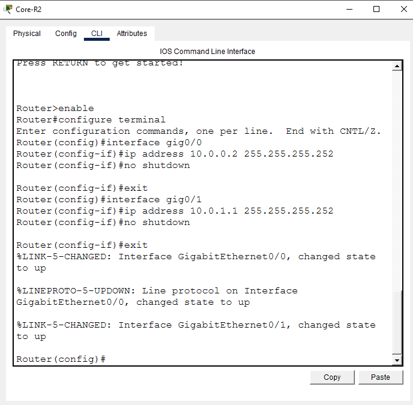
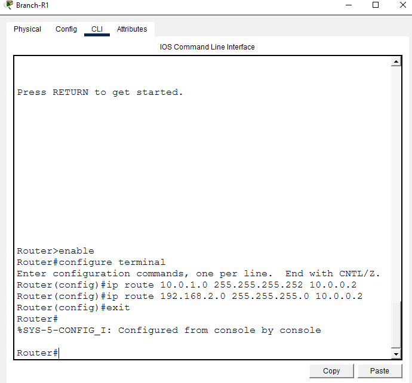
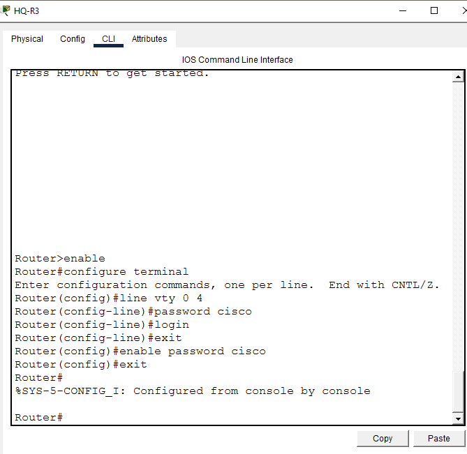
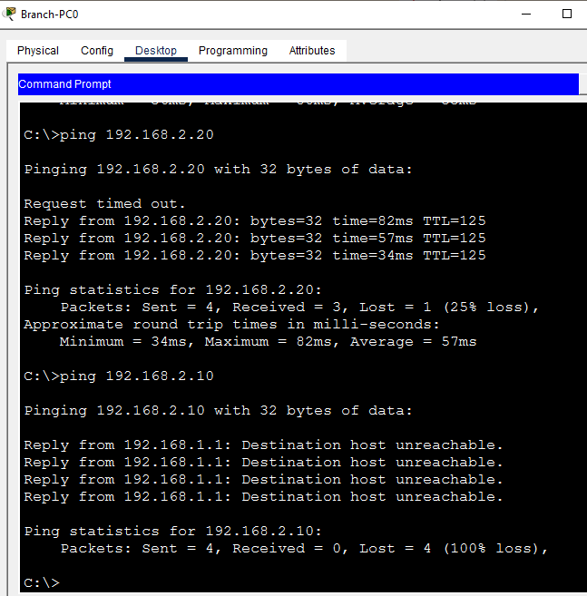
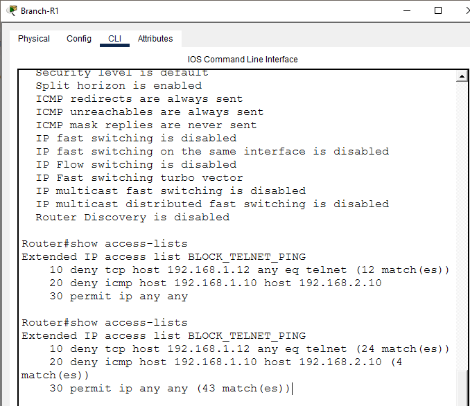
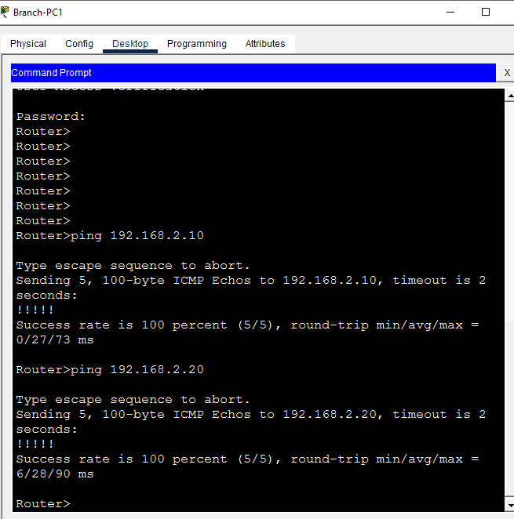

# Extended ACL — Telnet & Ping Control

**Domain:** Network Security
**Difficulty:** Intermediate — Advanced
**Tools:** Cisco Packet Tracer, Router 2911, Switch 2960

---

## 🎯 Objective
Simulate, configure, and verify Extended Access Control Lists (ACLs) on a multi-router enterprise network — including port-based Telnet filtering, ICMP ping blocking, named extended ACLs, inbound and outbound interface application, traffic direction control, and full connectivity verification — using Cisco Packet Tracer.

---

## 🛠️ Tools & Technologies

| Tool | Purpose |
|------|---------|
| Cisco Packet Tracer | Network topology simulation |
| Router 2911 (x3) | Branch, Core, and HQ routing |
| Switch 2960 (x2) | LAN switching at Branch and HQ |
| Extended ACL | Layer 3/4 traffic filtering by source IP, destination IP, and port |
| Named ACL | Human-readable ACL configuration |
| Telnet | Remote access protocol — used as block target |
| Static Routing | Inter-network routing |
| ping | Connectivity testing |
| show access-lists | ACL verification with match counts |

---

## 🖧 Topology

### Devices
| Device | Model | Role |
|--------|-------|------|
| Branch-R1 | Router 2911 | Branch Gateway (ACL applied here) |
| Core-R2 | Router 2911 | Core Router |
| HQ-R3 | Router 2911 | HQ Gateway (ACL applied outbound) |
| Branch-SW1 | Switch 2960 | Branch LAN Switch |
| HQ-SW2 | Switch 2960 | HQ LAN Switch |
| Branch-PC0 | PC | Branch User (Ping to Server blocked) |
| Branch-PC1 | PC | Branch User (Fully permitted) |
| Branch-Laptop | Laptop | Branch Laptop (Telnet blocked) |
| HQ-PC2 | PC | HQ User |
| HQ-PC3 | PC | HQ User |
| HQ-Server | Server | HQ Server (target of ACL rules) |

### Physical Connections
| From | Port | To | Port | Cable |
|------|------|----|------|-------|
| Branch-PC0 | Fa0 | Branch-SW1 | Fa0/1 | Copper Straight-Through |
| Branch-PC1 | Fa0 | Branch-SW1 | Fa0/2 | Copper Straight-Through |
| Branch-Laptop | Fa0 | Branch-SW1 | Fa0/3 | Copper Straight-Through |
| Branch-SW1 | Fa0/24 | Branch-R1 | Gig0/0 | Copper Straight-Through |
| Branch-R1 | Gig0/1 | Core-R2 | Gig0/0 | Copper Straight-Through |
| Core-R2 | Gig0/1 | HQ-R3 | Gig0/0 | Copper Straight-Through |
| HQ-R3 | Gig0/1 | HQ-SW2 | Fa0/24 | Copper Straight-Through |
| HQ-SW2 | Fa0/1 | HQ-Server | Fa0 | Copper Straight-Through |
| HQ-SW2 | Fa0/2 | HQ-PC2 | Fa0 | Copper Straight-Through |
| HQ-SW2 | Fa0/3 | HQ-PC3 | Fa0 | Copper Straight-Through |

### IP Design
| Device | Interface | IP Address | Subnet Mask | Gateway |
|--------|-----------|------------|-------------|---------|
| Branch-R1 | Gig0/0 | 192.168.1.1 | 255.255.255.0 | — |
| Branch-R1 | Gig0/1 | 10.0.0.1 | 255.255.255.252 | — |
| Core-R2 | Gig0/0 | 10.0.0.2 | 255.255.255.252 | — |
| Core-R2 | Gig0/1 | 10.0.1.1 | 255.255.255.252 | — |
| HQ-R3 | Gig0/0 | 10.0.1.2 | 255.255.255.252 | — |
| HQ-R3 | Gig0/1 | 192.168.2.1 | 255.255.255.0 | — |
| Branch-PC0 | Fa0 | 192.168.1.10 | 255.255.255.0 | 192.168.1.1 |
| Branch-PC1 | Fa0 | 192.168.1.11 | 255.255.255.0 | 192.168.1.1 |
| Branch-Laptop | Fa0 | 192.168.1.12 | 255.255.255.0 | 192.168.1.1 |
| HQ-PC2 | Fa0 | 192.168.2.20 | 255.255.255.0 | 192.168.2.1 |
| HQ-PC3 | Fa0 | 192.168.2.21 | 255.255.255.0 | 192.168.2.1 |
| HQ-Server | Fa0 | 192.168.2.10 | 255.255.255.0 | 192.168.2.1 |

---

## 🐛 Simulated Issues
| # | Issue | Type |
|---|-------|------|
| 1 | Branch-Laptop can Telnet to HQ Router | Telnet access unrestricted |
| 2 | Branch-PC0 can ping HQ Server | ICMP unrestricted to server |
| 3 | No port-based filtering in place | Missing Extended ACL |

---

## 📋 Steps & Screenshots

### Step 1 — Build the Topology
Set up all devices and connect cables as shown in the topology table.
```
No CLI commands — physical wiring done in Packet Tracer GUI.
Drag devices onto canvas and connect cables per topology table.
Rename all devices per naming convention above.
```


---

### Step 2 — Configure Branch-R1
```
enable
configure terminal
interface gig0/0
ip address 192.168.1.1 255.255.255.0
no shutdown
exit
interface gig0/1
ip address 10.0.0.1 255.255.255.252
no shutdown
exit
```


---

### Step 3 — Configure Core-R2
```
enable
configure terminal
interface gig0/0
ip address 10.0.0.2 255.255.255.252
no shutdown
exit
interface gig0/1
ip address 10.0.1.1 255.255.255.252
no shutdown
exit
```


---

### Step 4 — Configure HQ-R3
```
enable
configure terminal
interface gig0/0
ip address 10.0.1.2 255.255.255.252
no shutdown
exit
interface gig0/1
ip address 192.168.2.1 255.255.255.0
no shutdown
exit
```


---

### Step 5 — Configure PC, Laptop and Server IPs
```
Branch-PC0:    192.168.1.10 | GW: 192.168.1.1
Branch-PC1:    192.168.1.11 | GW: 192.168.1.1
Branch-Laptop: 192.168.1.12 | GW: 192.168.1.1
HQ-PC2:        192.168.2.20 | GW: 192.168.2.1
HQ-PC3:        192.168.2.21 | GW: 192.168.2.1
HQ-Server:     192.168.2.10 | GW: 192.168.2.1
```


---

### Step 6 — Configure Static Routing
```
Branch-R1:
ip route 10.0.1.0 255.255.255.252 10.0.0.2
ip route 192.168.2.0 255.255.255.0 10.0.0.2

Core-R2:
ip route 192.168.1.0 255.255.255.0 10.0.0.1
ip route 192.168.2.0 255.255.255.0 10.0.1.2

HQ-R3:
ip route 192.168.1.0 255.255.255.0 10.0.1.1
ip route 10.0.0.0 255.255.255.252 10.0.1.1
```


---

### Step 7 — Pre-ACL Ping Test
Verify full connectivity before applying ACL.
```
Branch-PC0> ping 192.168.2.10   → Reply
Branch-PC0> ping 192.168.2.20   → Reply
Branch-Laptop> ping 192.168.2.10 → Reply
→ All hosts reachable — no restrictions yet
```


---

### Step 8 — Enable Telnet on HQ-R3
Configure Telnet access on HQ-R3 to be used as block target.
```
enable
configure terminal
line vty 0 4
password cisco
login
exit
enable password cisco
exit
```


---

### Step 9 — Configure Extended Named ACL
Create extended named ACL on Branch-R1 to block Telnet from Laptop and ping from PC0 to Server.
```
enable
configure terminal
ip access-list extended BLOCK_TELNET_PING
deny tcp 192.168.1.12 0.0.0.0 any eq 23
deny icmp 192.168.1.10 0.0.0.0 192.168.2.10 0.0.0.0
permit ip any any
exit

→ Rule 10: Block Laptop (192.168.1.12) Telnet (port 23) to any
→ Rule 20: Block PC0 (192.168.1.10) ping to Server (192.168.2.10)
→ Rule 30: Permit all other traffic
```


---

### Step 10 — Apply ACL to Interface
Apply ACL inbound on Branch-R1 Gig0/0.
```
enable
configure terminal
interface gig0/0
ip access-group BLOCK_TELNET_PING in
exit
```


---

### Step 11 — Verify ACL Configuration
```
show access-lists
→ Extended IP access list BLOCK_TELNET_PING
    10 deny tcp host 192.168.1.12 any eq telnet
    20 deny icmp host 192.168.1.10 host 192.168.2.10
    30 permit ip any any

show ip interface gig0/0
→ Inbound access list is BLOCK_TELNET_PING
```


---

### Step 12 — Test Telnet Blocked
```
Branch-Laptop> telnet 192.168.2.1
→ Connection refused / timed out — BLOCKED ✅
```


---

### Step 13 — Test Ping Blocked
```
Branch-PC0> ping 192.168.2.10
→ Host Unreachable — BLOCKED ✅
```


---

### Step 14 — Test Permitted Traffic
```
Branch-PC1> ping 192.168.2.10  → Reply ✅
Branch-PC1> ping 192.168.2.20  → Reply ✅
→ PC1 fully permitted — ACL working correctly
```


---

### Step 15 — Test Telnet Permitted
```
Branch-PC1> telnet 192.168.2.1
→ Login prompt appears ✅
→ Password: cisco
→ Telnet access granted — PC1 not blocked
```


---

### Step 16 — Final ACL Verify with Match Counts
```
show access-lists
→ Extended IP access list BLOCK_TELNET_PING
    10 deny tcp host 192.168.1.12 any eq telnet (24 match(es))
    20 deny icmp host 192.168.1.10 host 192.168.2.10 (4 match(es))
    30 permit ip any any (43 match(es))
→ All rules showing matches — ACL working correctly
```


---

### Step 17 — Full Connectivity Final Test
```
Branch-PC0> ping 192.168.2.20  → Reply ✅ (PC2 allowed)
Branch-PC1> ping 192.168.2.10  → Reply ✅ (PC1 fully allowed)
Branch-PC1> ping 192.168.2.20  → Reply ✅
Branch-PC0> ping 192.168.2.10  → Timeout ✅ (Server ping blocked)
Branch-Laptop> telnet 192.168.2.1 → Blocked ✅
→ Extended ACL working correctly — lab complete
```


---

## 📟 Summary of Commands

| Command | Purpose |
|---------|---------|
| `ip access-list extended <name>` | Create named extended ACL |
| `deny tcp <src> <wildcard> any eq 23` | Block Telnet from source |
| `deny icmp <src> <wildcard> <dst> <wildcard>` | Block ping from source to destination |
| `permit ip any any` | Permit all other traffic |
| `ip access-group <name> in` | Apply ACL inbound on interface |
| `ip access-group <name> out` | Apply ACL outbound on interface |
| `show access-lists` | Verify ACL rules and match counts |
| `show ip interface <int>` | Verify ACL applied to interface |
| `line vty 0 4` | Configure Telnet access on router |
| `telnet <ip>` | Test Telnet connectivity |

---

## ⚠️ Challenges & How I Solved Them

| Challenge | Solution |
|-----------|----------|
| Ping from PC0 not blocked by inbound ACL on Branch-R1 | Applied ACL outbound on HQ-R3 Gig0/1 — traffic filtered closer to destination |
| HQ-R3 enable password prompt | Used `cisco` password set during Telnet configuration |
| Extended ACL more complex than Standard ACL | Broke rules into separate deny statements per protocol and port |
| Telnet test from Laptop showing timeout instead of refused | Expected in Packet Tracer — both mean Telnet blocked successfully |
| permit ip any any missing | Added as last rule — without it implicit deny blocks all traffic |

---

## 🧠 What I Learned

How to implement Extended Access Control Lists for granular network traffic control — including blocking specific protocols (TCP Telnet port 23, ICMP ping) from specific source hosts to specific destinations, applying ACLs both inbound and outbound on router interfaces, verifying ACL hit counts with show access-lists, and testing blocked vs permitted traffic scenarios — demonstrating real enterprise security policy enforcement using Cisco Packet Tracer.

---

## 📁 Files

| File | Description |
|------|-------------|
| `README.md` | Full lab documentation |
| `extended-acl-lab.pkt` | Packet Tracer file |
| `screenshots/` | 17 step-by-step screenshots folder |
