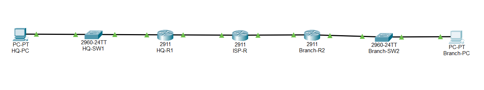
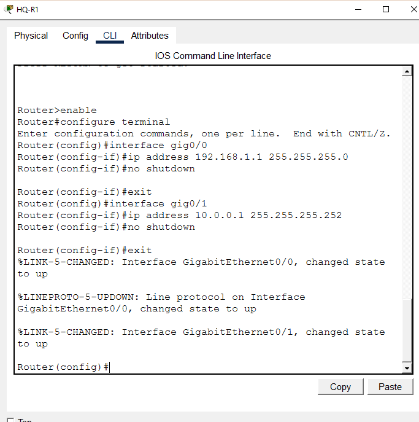
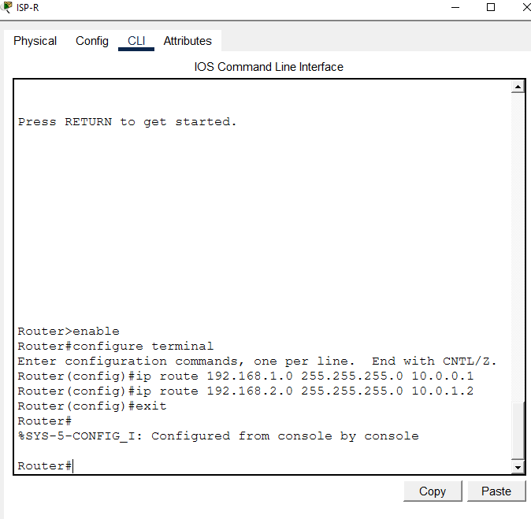
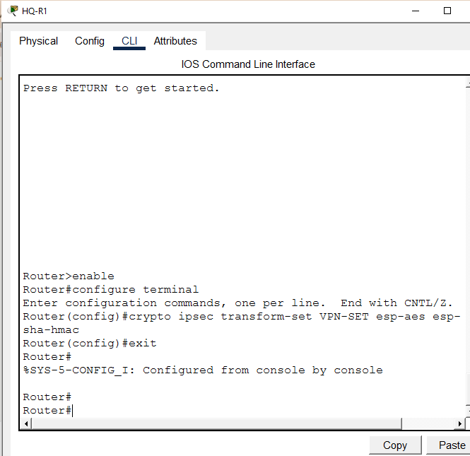
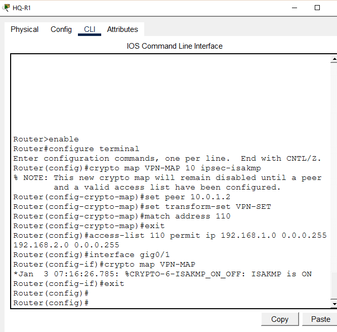
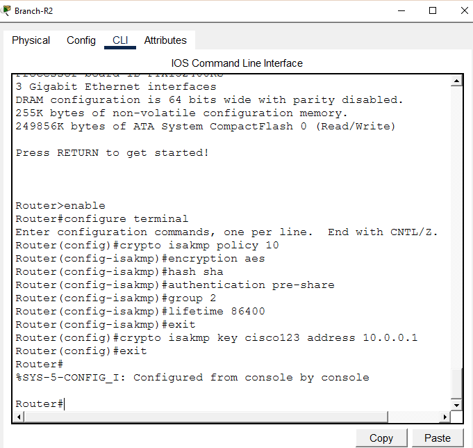
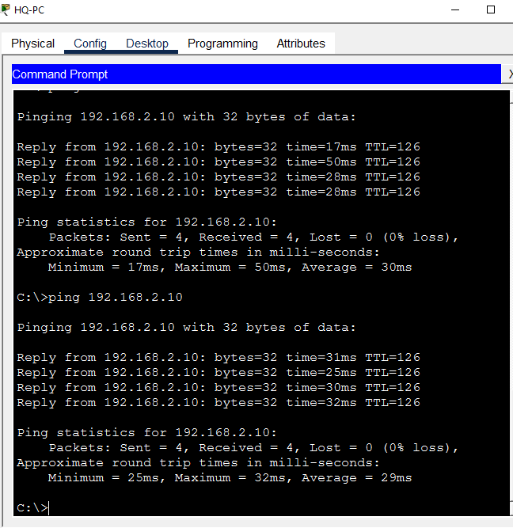
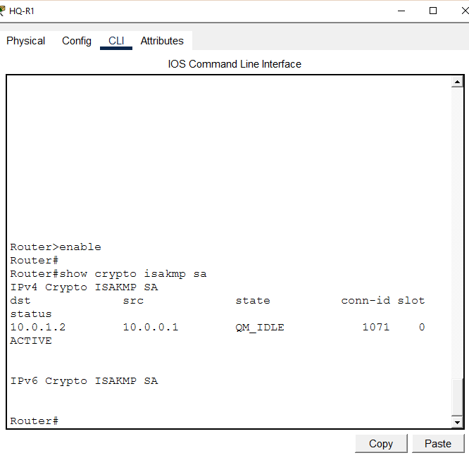
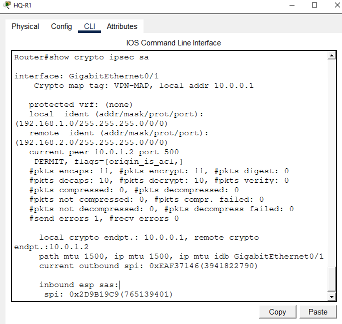

# IPsec VPN Site-to-Site Lab

**Domain:** Network Security
**Difficulty:** Intermediate — Advanced
**Tools:** Cisco Packet Tracer, Router 2911

---

## 🎯 Objective
Simulate, configure, and verify an IPsec VPN Site-to-Site tunnel between HQ and Branch routers — including IKE Phase 1 ISAKMP policy, IKE Phase 2 IPsec transform sets, crypto maps, ACL-based interesting traffic definition, tunnel establishment verification, and encrypted packet count validation — using Cisco Packet Tracer.

---

## 🛠️ Tools & Technologies

| Tool | Purpose |
|------|---------|
| Cisco Packet Tracer | Network topology simulation |
| Router 2911 (x3) | HQ, ISP, and Branch routers |
| IPsec | IP Security — VPN encryption protocol |
| IKE Phase 1 | ISAKMP SA — authentication and key exchange |
| IKE Phase 2 | IPsec SA — data encryption tunnel |
| crypto isakmp policy | Define IKE Phase 1 parameters |
| crypto ipsec transform-set | Define encryption and hashing algorithms |
| crypto map | Bind peer, transform set, and ACL together |
| AES | Advanced Encryption Standard — data encryption |
| SHA | Secure Hash Algorithm — data integrity |
| Pre-shared key | Authentication method between VPN peers |
| show crypto isakmp sa | Verify IKE Phase 1 tunnel status |
| show crypto ipsec sa | Verify IKE Phase 2 encrypted packet counts |

---

## 🖧 Topology

### Devices
| Device | Model | Role |
|--------|-------|------|
| HQ-R1 | Router 2911 | HQ VPN Endpoint |
| ISP-R | Router 2911 | Internet/ISP Router |
| Branch-R2 | Router 2911 | Branch VPN Endpoint |
| HQ-SW1 | Switch 2960 | HQ LAN Switch |
| Branch-SW2 | Switch 2960 | Branch LAN Switch |
| HQ-PC | PC | HQ End User |
| Branch-PC | PC | Branch End User |

### Physical Connections
| From | Port | To | Port | Cable |
|------|------|----|------|-------|
| HQ-PC | Fa0 | HQ-SW1 | Fa0/1 | Copper Straight-Through |
| HQ-SW1 | Fa0/24 | HQ-R1 | Gig0/0 | Copper Straight-Through |
| HQ-R1 | Gig0/1 | ISP-R | Gig0/0 | Copper Straight-Through |
| ISP-R | Gig0/1 | Branch-R2 | Gig0/1 | Copper Straight-Through |
| Branch-R2 | Gig0/0 | Branch-SW2 | Fa0/24 | Copper Straight-Through |
| Branch-SW2 | Fa0/1 | Branch-PC | Fa0 | Copper Straight-Through |

### IP Design
| Device | Interface | IP Address | Subnet Mask | Gateway |
|--------|-----------|------------|-------------|---------|
| HQ-R1 | Gig0/0 | 192.168.1.1 | 255.255.255.0 | — |
| HQ-R1 | Gig0/1 | 10.0.0.1 | 255.255.255.252 | — |
| ISP-R | Gig0/0 | 10.0.0.2 | 255.255.255.252 | — |
| ISP-R | Gig0/1 | 10.0.1.1 | 255.255.255.252 | — |
| Branch-R2 | Gig0/1 | 10.0.1.2 | 255.255.255.252 | — |
| Branch-R2 | Gig0/0 | 192.168.2.1 | 255.255.255.0 | — |
| HQ-PC | Fa0 | 192.168.1.10 | 255.255.255.0 | 192.168.1.1 |
| Branch-PC | Fa0 | 192.168.2.10 | 255.255.255.0 | 192.168.2.1 |

---

## 🐛 Simulated Issues
| # | Issue | Type |
|---|-------|------|
| 1 | No encryption between HQ and Branch | Missing IPsec VPN |
| 2 | Traffic travels unencrypted over ISP | Insecure data transmission |
| 3 | Security license not enabled | Missing securityk9 license |

---

## 📋 Steps & Screenshots

### Step 1 — Build the Topology
```
No CLI commands — physical wiring done in Packet Tracer GUI.
Drag devices onto canvas and connect cables per topology table.
Rename all devices per naming convention above.
```


---

### Step 2 — Configure HQ-R1
```
enable
configure terminal
interface gig0/0
ip address 192.168.1.1 255.255.255.0
no shutdown
exit
interface gig0/1
ip address 10.0.0.1 255.255.255.252
no shutdown
exit
```


---

### Step 3 — Configure ISP-R
```
enable
configure terminal
interface gig0/0
ip address 10.0.0.2 255.255.255.252
no shutdown
exit
interface gig0/1
ip address 10.0.1.1 255.255.255.252
no shutdown
exit
```


---

### Step 4 — Configure Branch-R2
```
enable
configure terminal
interface gig0/1
ip address 10.0.1.2 255.255.255.252
no shutdown
exit
interface gig0/0
ip address 192.168.2.1 255.255.255.0
no shutdown
exit
```


---

### Step 5 — Configure PC IPs
```
HQ-PC:     192.168.1.10 | Mask: 255.255.255.0 | GW: 192.168.1.1
Branch-PC: 192.168.2.10 | Mask: 255.255.255.0 | GW: 192.168.2.1
```


---

### Step 6 — Configure Static Routing
```
HQ-R1:
ip route 0.0.0.0 0.0.0.0 10.0.0.2

ISP-R:
ip route 192.168.1.0 255.255.255.0 10.0.0.1
ip route 192.168.2.0 255.255.255.0 10.0.1.2

Branch-R2:
ip route 0.0.0.0 0.0.0.0 10.0.1.1
```


---

### Step 7 — Pre-VPN Ping Test
Verify connectivity before VPN configuration.
```
HQ-PC> ping 192.168.2.10
→ Reply ✅ (unencrypted — no VPN yet)
```


---

### Step 8 — Configure IKE Phase 1 on HQ-R1
Enable security license and configure ISAKMP policy.
```
license boot module c2900 technology-package securityk9
→ yes → write memory → reload

enable
configure terminal
crypto isakmp policy 10
encryption aes
hash sha
authentication pre-share
group 2
lifetime 86400
exit
crypto isakmp key cisco123 address 10.0.1.2
exit
```


---

### Step 9 — Configure IPsec Transform Set on HQ-R1
```
enable
configure terminal
crypto ipsec transform-set VPN-SET esp-aes esp-sha-hmac
exit

→ Transform set VPN-SET created
→ Encryption: ESP-AES
→ Integrity: ESP-SHA-HMAC
```


---

### Step 10 — Configure Crypto Map on HQ-R1
```
enable
configure terminal
crypto map VPN-MAP 10 ipsec-isakmp
set peer 10.0.1.2
set transform-set VPN-SET
match address 110
exit
access-list 110 permit ip 192.168.1.0 0.0.0.255 192.168.2.0 0.0.0.255
interface gig0/1
crypto map VPN-MAP
exit

→ Crypto map applied to Gig0/1 (WAN interface)
→ ACL 110 defines interesting traffic
```


---

### Step 11 — Configure IKE Phase 1 on Branch-R2
```
license boot module c2900 technology-package securityk9
→ yes → write memory → reload

enable
configure terminal
crypto isakmp policy 10
encryption aes
hash sha
authentication pre-share
group 2
lifetime 86400
exit
crypto isakmp key cisco123 address 10.0.0.1
exit
```


---

### Step 12 — Configure Transform Set & Crypto Map on Branch-R2
```
enable
configure terminal
crypto ipsec transform-set VPN-SET esp-aes esp-sha-hmac
exit
crypto map VPN-MAP 10 ipsec-isakmp
set peer 10.0.0.1
set transform-set VPN-SET
match address 110
exit
access-list 110 permit ip 192.168.2.0 0.0.0.255 192.168.1.0 0.0.0.255
interface gig0/1
crypto map VPN-MAP
exit
```


---

### Step 13 — Test VPN Tunnel
```
HQ-PC> ping 192.168.2.10
→ First ping may timeout (tunnel establishing)
→ Subsequent pings: Reply ✅
→ IPsec tunnel established!
```


---

### Step 14 — Verify IKE Phase 1 SA
```
show crypto isakmp sa

→ dst: 10.0.1.2  src: 10.0.0.1
→ State: QM_IDLE
→ Status: ACTIVE ✅
→ IKE Phase 1 tunnel active
```


---

### Step 15 — Verify IPsec SA
```
show crypto ipsec sa

→ interface: GigabitEthernet0/1
→ Crypto map: VPN-MAP
→ local:  192.168.1.0/255.255.255.0
→ remote: 192.168.2.0/255.255.255.0
→ pkts encaps: 11, encrypt: 11 ✅
→ pkts decaps: 10, decrypt: 10 ✅
→ Traffic successfully encrypted/decrypted
```


---

### Step 16 — Verify Crypto Map
```
show crypto map

→ Crypto Map VPN-MAP 10 ipsec-isakmp
→ Peer: 10.0.1.2
→ ACL 110: 192.168.1.0 → 192.168.2.0
→ Transform Set: VPN-SET
→ Interface: GigabitEthernet0/1 ✅
```


---

### Step 17 — Final VPN Connectivity Test
```
HQ-PC> ping 192.168.2.10     → Reply ✅
Branch-PC> ping 192.168.1.10  → Reply ✅
→ Bidirectional encrypted VPN tunnel working ✅
→ IPsec VPN Site-to-Site complete!
```


---

## 📟 Summary of Commands

| Command | Purpose |
|---------|---------|
| `license boot module c2900 technology-package securityk9` | Enable security license |
| `crypto isakmp policy <num>` | Create IKE Phase 1 policy |
| `encryption aes` | Set AES encryption for IKE |
| `hash sha` | Set SHA hashing for integrity |
| `authentication pre-share` | Use pre-shared key authentication |
| `group 2` | Set Diffie-Hellman group 2 |
| `crypto isakmp key <key> address <peer-ip>` | Set pre-shared key for peer |
| `crypto ipsec transform-set <name> esp-aes esp-sha-hmac` | Define IPsec encryption |
| `crypto map <name> <num> ipsec-isakmp` | Create crypto map |
| `set peer <ip>` | Set VPN peer IP |
| `set transform-set <name>` | Bind transform set to crypto map |
| `match address <acl>` | Define interesting traffic ACL |
| `crypto map <name>` | Apply crypto map to interface |
| `show crypto isakmp sa` | Verify IKE Phase 1 tunnel |
| `show crypto ipsec sa` | Verify IKE Phase 2 encrypted packets |
| `show crypto map` | View crypto map configuration |

---

## ⚠️ Challenges & How I Solved Them

| Challenge | Solution |
|-----------|----------|
| crypto isakmp command not found | Security license not enabled — used `license boot module c2900 technology-package securityk9` then reload |
| License not taking effect after yes | Used `write memory` then `reload` to apply license |
| Commands typed outside configure terminal | Ensured all config commands entered after `configure terminal` |
| First ping timing out after VPN config | Normal — first ping triggers tunnel negotiation; subsequent pings succeed |
| Branch-R2 also needed security license | Applied same license procedure on Branch-R2 before configuring IPsec |

---

## 🧠 What I Learned

How to configure an IPsec VPN Site-to-Site tunnel between two Cisco routers — including enabling the security license, IKE Phase 1 ISAKMP policy with AES encryption and SHA hashing, pre-shared key authentication, IKE Phase 2 transform sets with ESP-AES and ESP-SHA-HMAC, crypto map configuration with interesting traffic ACLs, tunnel establishment verification using show crypto isakmp sa and show crypto ipsec sa, and encrypted packet count validation — demonstrating real enterprise WAN security using Cisco Packet Tracer.

---

## 📁 Files

| File | Description |
|------|-------------|
| `README.md` | Full lab documentation |
| `ipsec-vpn-lab.pkt` | Packet Tracer file |
| `screenshots/` | 17 step-by-step screenshots folder |
