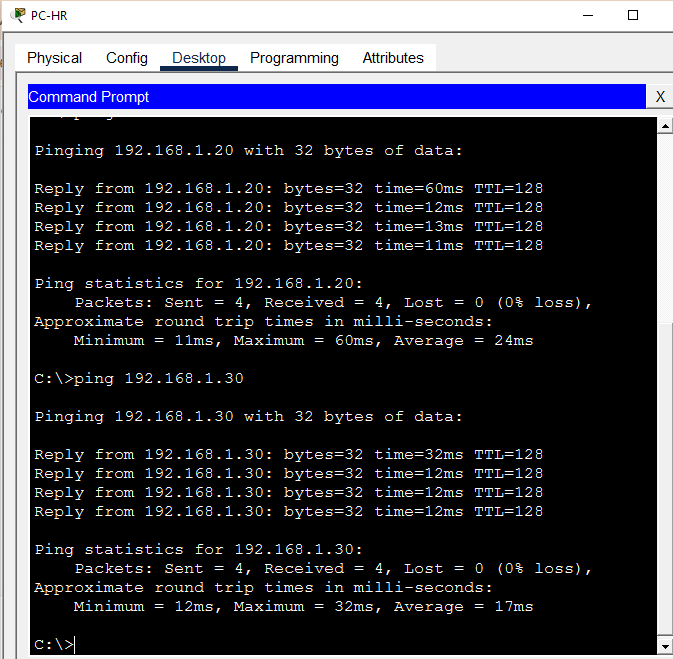
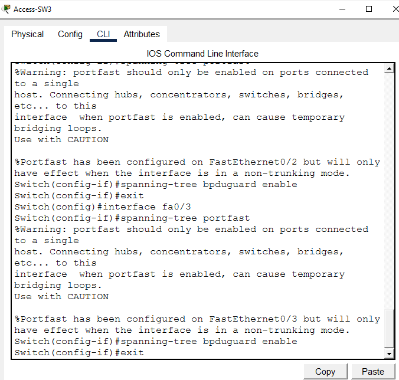
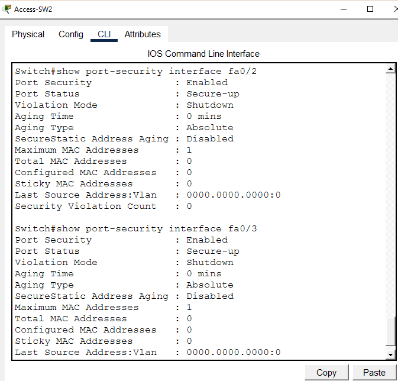
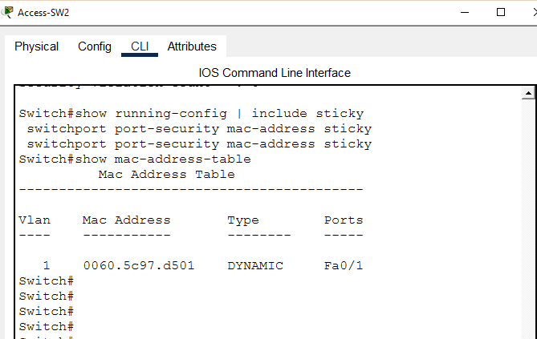
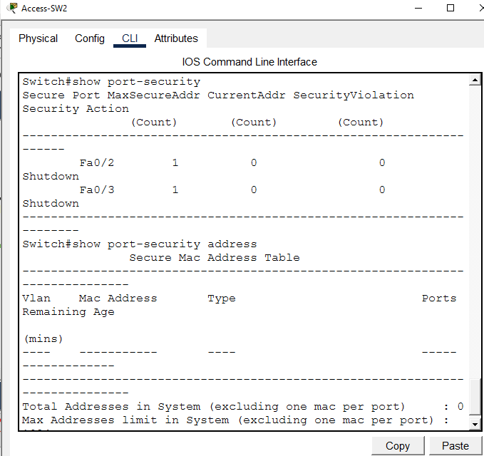
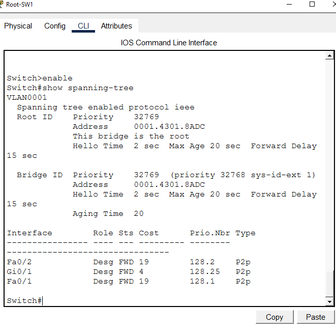

# Port Security & STP Loop Prevention

**Domain:** Network Security
**Difficulty:** Intermediate — Advanced
**Tools:** Cisco Packet Tracer, Router 2911, Switch 2960

---

## 🎯 Objective
Simulate, configure, and verify Port Security and Spanning Tree Protocol (STP) loop prevention on a multi-switch enterprise network — including sticky MAC address learning, port security violation simulation, PortFast, BPDU Guard, Root Bridge verification, err-disabled port recovery, and full connectivity testing — using Cisco Packet Tracer.

---

## 🛠️ Tools & Technologies

| Tool | Purpose |
|------|---------|
| Cisco Packet Tracer | Network topology simulation |
| Router 2911 | Default gateway |
| Switch 2960 (x3) | Root and Access layer switching |
| Port Security | MAC address-based port access control |
| Sticky MAC | Dynamically learn and save MAC addresses |
| Violation Shutdown | Disable port on security violation |
| PortFast | Skip STP listening/learning on access ports |
| BPDU Guard | Shutdown port if BPDU received on PortFast port |
| Spanning Tree Protocol | Loop prevention in switched networks |
| show port-security | Verify port security configuration |
| show spanning-tree | Verify STP root bridge and port states |

---

## 🖧 Topology

### Devices
| Device | Model | Role |
|--------|-------|------|
| Core-R1 | Router 2911 | Default Gateway |
| Root-SW1 | Switch 2960 | STP Root Bridge |
| Access-SW2 | Switch 2960 | Access Layer Switch |
| Access-SW3 | Switch 2960 | Access Layer Switch |
| PC-HR | PC | HR Department User |
| PC-Finance | PC | Finance Department User |
| PC-IT | PC | IT Department User |
| PC-Rogue | PC | Unauthorized/Rogue Device |

### Physical Connections
| From | Port | To | Port | Cable |
|------|------|----|------|-------|
| Core-R1 | Gig0/0 | Root-SW1 | Gig0/1 | Copper Straight-Through |
| Root-SW1 | Fa0/1 | Access-SW2 | Fa0/1 | Copper Straight-Through |
| Root-SW1 | Fa0/2 | Access-SW3 | Fa0/1 | Copper Straight-Through |
| Access-SW2 | Fa0/2 | PC-HR | Fa0 | Copper Straight-Through |
| Access-SW2 | Fa0/3 | PC-Finance | Fa0 | Copper Straight-Through |
| Access-SW3 | Fa0/2 | PC-IT | Fa0 | Copper Straight-Through |
| Access-SW3 | Fa0/3 | PC-Rogue | Fa0 | Copper Straight-Through |

### IP Design
| Device | Interface | IP Address | Subnet Mask | Gateway |
|--------|-----------|------------|-------------|---------|
| Core-R1 | Gig0/0 | 192.168.1.1 | 255.255.255.0 | — |
| PC-HR | Fa0 | 192.168.1.10 | 255.255.255.0 | 192.168.1.1 |
| PC-Finance | Fa0 | 192.168.1.11 | 255.255.255.0 | 192.168.1.1 |
| PC-IT | Fa0 | 192.168.1.20 | 255.255.255.0 | 192.168.1.1 |
| PC-Rogue | Fa0 | 192.168.1.30 | 255.255.255.0 | 192.168.1.1 |

---

## 🐛 Simulated Issues
| # | Issue | Type |
|---|-------|------|
| 1 | No port security — any device can connect | Missing MAC filtering |
| 2 | Rogue device connects to authorized port | Port security violation |
| 3 | Access ports not optimized for STP | Missing PortFast/BPDU Guard |
| 4 | STP loop possible if rogue switch connected | Missing BPDU Guard |

---

## 📋 Steps & Screenshots

### Step 1 — Build the Topology
```
No CLI commands — physical wiring done in Packet Tracer GUI.
Drag devices onto canvas and connect cables per topology table.
Rename all devices per naming convention above.
```


---

### Step 2 — Configure Core-R1
```
enable
configure terminal
interface gig0/0
ip address 192.168.1.1 255.255.255.0
no shutdown
exit
```


---

### Step 3 — Configure PC IPs
```
PC-HR:      192.168.1.10 | Mask: 255.255.255.0 | GW: 192.168.1.1
PC-Finance: 192.168.1.11 | Mask: 255.255.255.0 | GW: 192.168.1.1
PC-IT:      192.168.1.20 | Mask: 255.255.255.0 | GW: 192.168.1.1
PC-Rogue:   192.168.1.30 | Mask: 255.255.255.0 | GW: 192.168.1.1
```


---

### Step 4 — Pre-Security Ping Test
Verify full connectivity before applying security.
```
PC-HR> ping 192.168.1.1   → Reply ✅
PC-HR> ping 192.168.1.20  → Reply ✅
PC-HR> ping 192.168.1.30  → Reply ✅
→ All hosts reachable — no security yet
```


---

### Step 5 — Verify STP Root Bridge
Confirm Root-SW1 is the STP Root Bridge.
```
show spanning-tree

→ Root ID Priority: 32769
→ This bridge is the root
→ Fa0/1, Fa0/2, Gi0/1 — Designated Forwarding
→ Root Bridge confirmed ✅
```


---

### Step 6 — Configure PortFast & BPDU Guard on Access-SW2
```
enable
configure terminal
interface fa0/2
spanning-tree portfast
spanning-tree bpduguard enable
exit
interface fa0/3
spanning-tree portfast
spanning-tree bpduguard enable
exit

→ PortFast: skips STP listening/learning — faster port up
→ BPDU Guard: shuts port if BPDU received (rogue switch protection)
```


---

### Step 7 — Configure PortFast & BPDU Guard on Access-SW3
```
enable
configure terminal
interface fa0/2
spanning-tree portfast
spanning-tree bpduguard enable
exit
interface fa0/3
spanning-tree portfast
spanning-tree bpduguard enable
exit
```


---

### Step 8 — Configure Port Security on Access-SW2
```
enable
configure terminal
interface fa0/2
switchport mode access
switchport port-security
switchport port-security maximum 1
switchport port-security mac-address sticky
switchport port-security violation shutdown
exit
interface fa0/3
switchport mode access
switchport port-security
switchport port-security maximum 1
switchport port-security mac-address sticky
switchport port-security violation shutdown
exit

→ Maximum 1 MAC per port
→ Sticky MAC: dynamically learns and saves MAC
→ Violation: shutdown port on unauthorized device
```


---

### Step 9 — Configure Port Security on Access-SW3
```
enable
configure terminal
interface fa0/2
switchport mode access
switchport port-security
switchport port-security maximum 1
switchport port-security mac-address sticky
switchport port-security violation shutdown
exit
interface fa0/3
switchport mode access
switchport port-security
switchport port-security maximum 1
switchport port-security mac-address sticky
switchport port-security violation shutdown
exit
```


---

### Step 10 — Verify Port Security
```
show port-security interface fa0/2
show port-security interface fa0/3

→ Port Security: Enabled
→ Sticky MAC address learned
→ Violation Mode: Shutdown
→ Max MAC Addresses: 1
```


---

### Step 11 — Verify Sticky MAC Addresses
```
show running-config | include sticky
show mac-address-table

→ Sticky MAC addresses saved in running config
→ MAC table shows learned addresses per port
```


---

### Step 12 — Simulate Port Security Violation
Connect PC-Rogue to PC-IT's authorized port (Fa0/2) to trigger violation.
```
1. PC-IT pings to learn MAC on Fa0/2:
   ping 192.168.1.1 → Reply ✅

2. Disconnect PC-IT from Fa0/2
3. Connect PC-Rogue to Fa0/2 (unauthorized!)
4. PC-Rogue> ping 192.168.1.1 → Request timed out ❌

show port-security
→ Fa0/2  SecurityViolation: 1  Action: Shutdown ✅
→ Fa0/3  SecurityViolation: 1  Action: Shutdown ✅
→ Violation triggered — port security working!
```


---

### Step 13 — Err-Disabled Port Recovery
Recover the shutdown ports after violation.
```
enable
configure terminal
interface fa0/2
shutdown
no shutdown
exit
interface fa0/3
shutdown
no shutdown
exit

→ Ports recovered from err-disabled state
→ Ready for authorized devices again
```


---

### Step 14 — Port Security Final Verification
```
show port-security
show port-security address

→ All ports secure ✅
→ Sticky MAC addresses confirmed ✅
→ Security policy active on all access ports
```


---

### Step 15 — BPDU Guard Verify
```
show spanning-tree interface fa0/2 detail
show spanning-tree interface fa0/3 detail

→ PortFast: Enabled ✅
→ BPDU Guard: Enabled ✅
→ Loop prevention active on all access ports
```


---

### Step 16 — STP Root Bridge Final Verify
```
show spanning-tree

→ Root-SW1: This bridge is the root ✅
→ All ports Designated Forwarding ✅
→ STP topology stable and loop-free
```


---

### Step 17 — Full Connectivity Final Test
```
PC-HR> ping 192.168.1.1   → Reply ✅
PC-HR> ping 192.168.1.20  → Reply ✅
PC-HR> ping 192.168.1.30  → Reply ✅
→ Network secure and fully operational ✅
→ Port Security + STP hardening complete
```


---

## 📟 Summary of Commands

| Command | Purpose |
|---------|---------|
| `switchport mode access` | Set port to access mode |
| `switchport port-security` | Enable port security on interface |
| `switchport port-security maximum 1` | Allow only 1 MAC address per port |
| `switchport port-security mac-address sticky` | Dynamically learn and save MAC |
| `switchport port-security violation shutdown` | Shutdown port on violation |
| `spanning-tree portfast` | Enable PortFast on access port |
| `spanning-tree bpduguard enable` | Enable BPDU Guard on access port |
| `show port-security` | View port security status and violations |
| `show port-security interface <int>` | Detailed port security per interface |
| `show port-security address` | View learned MAC addresses |
| `show spanning-tree` | View STP root bridge and port states |
| `show mac-address-table` | View MAC address table |
| `shutdown` / `no shutdown` | Recover err-disabled port |

---

## ⚠️ Challenges & How I Solved Them

| Challenge | Solution |
|-----------|----------|
| MAC address change on PC-Rogue didn't trigger violation | Physically moved PC-Rogue to authorized port (Fa0/2) after PC-IT learned its MAC |
| Port security violation count showing 0 initially | Reset sticky MAC with `no switchport port-security mac-address sticky` then re-learned |
| Both Fa0/2 and Fa0/3 showed violations | Both ports had sticky MAC learned — connecting wrong device to either triggered violation |
| Packet Tracer text too small in CLI | Adjusted font size via Options → Preferences → Font |
| PortFast warning message on trunk ports | Applied PortFast only on access ports connected to end devices — not on uplink ports |

---

## 🧠 What I Learned

How to implement Port Security and STP loop prevention on Cisco switches — including sticky MAC address learning, maximum MAC limits, violation shutdown mode, err-disabled port recovery, PortFast for faster port initialization, BPDU Guard for rogue switch protection, STP Root Bridge verification, and simulating real security violations — demonstrating enterprise-level switch hardening using Cisco Packet Tracer.

---

## 📁 Files

| File | Description |
|------|-------------|
| `README.md` | Full lab documentation |
| `port-security-stp-lab.pkt` | Packet Tracer file |
| `screenshots/` | 17 step-by-step screenshots folder |
