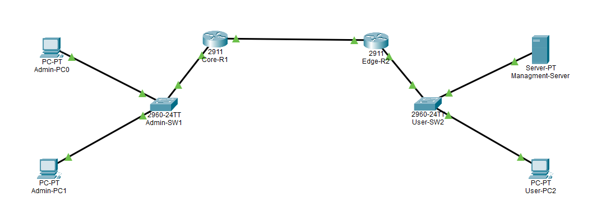
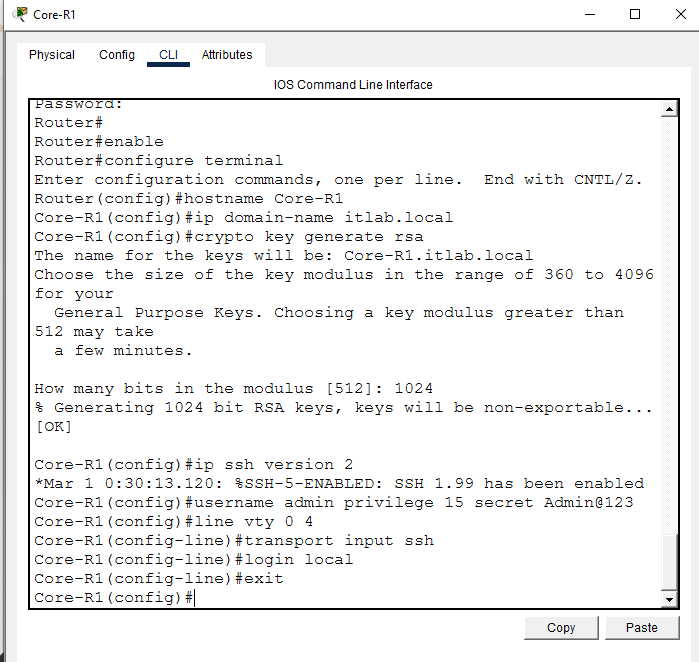
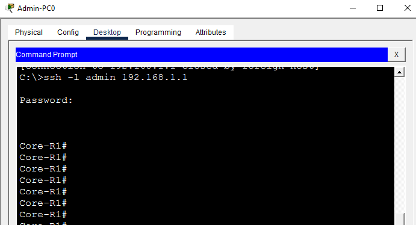
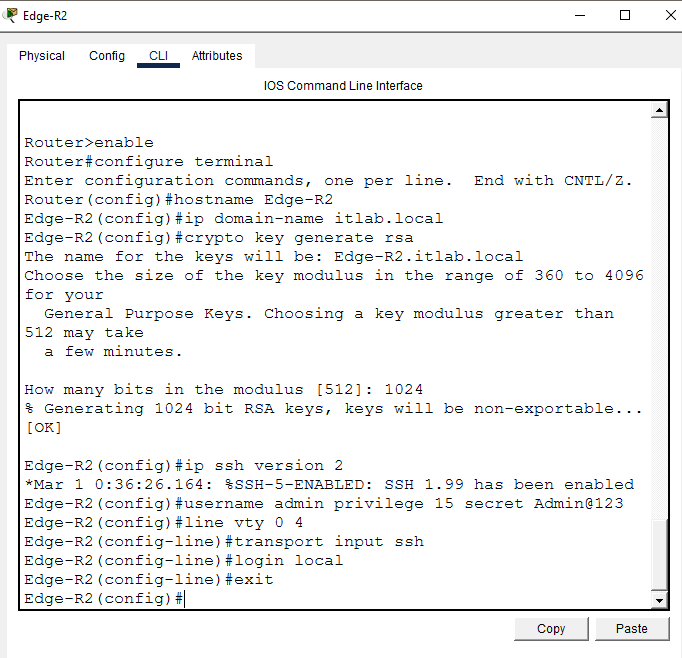
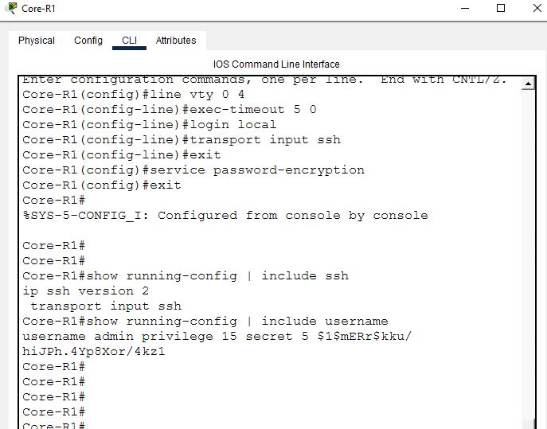
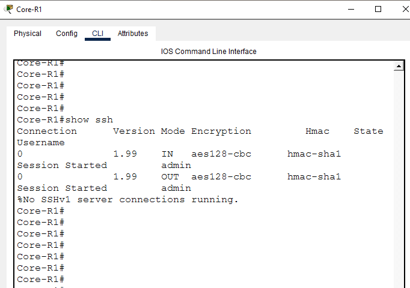

# SSH Hardening & Telnet Replacement

**Domain:** Network Security
**Difficulty:** Intermediate — Advanced
**Tools:** Cisco Packet Tracer, Router 2911, Switch 2960

---

## 🎯 Objective
Simulate, configure, and verify SSH v2 hardening on a multi-router enterprise network — including Telnet configuration and testing, Telnet replacement with SSH v2, RSA key generation, VTY line hardening, password encryption, active session verification, and full secure remote access testing — using Cisco Packet Tracer.

---

## 🛠️ Tools & Technologies

| Tool | Purpose |
|------|---------|
| Cisco Packet Tracer | Network topology simulation |
| Router 2911 (x2) | Core and Edge routing |
| Switch 2960 (x2) | Admin and User LAN switching |
| Telnet | Insecure remote access — replaced by SSH |
| SSH v2 | Secure encrypted remote access protocol |
| RSA Keys | Cryptographic key pair for SSH encryption |
| crypto key generate rsa | RSA key generation command |
| service password-encryption | Encrypt all plaintext passwords |
| VTY Lines | Virtual terminal lines for remote access |
| show ssh | Verify active SSH sessions |
| show ip ssh | Verify SSH version and configuration |

---

## 🖧 Topology

### Devices
| Device | Model | Role |
|--------|-------|------|
| Core-R1 | Router 2911 | Core Router — SSH Server |
| Edge-R2 | Router 2911 | Edge Router — SSH Server |
| Admin-SW1 | Switch 2960 | Admin LAN Switch |
| User-SW2 | Switch 2960 | User LAN Switch |
| Admin-PC0 | PC | Admin workstation — SSH Client |
| Admin-PC1 | PC | Admin workstation — SSH Client |
| User-PC2 | PC | User workstation |
| Management-Server | Server | Management Server |

### Physical Connections
| From | Port | To | Port | Cable |
|------|------|----|------|-------|
| Admin-PC0 | Fa0 | Admin-SW1 | Fa0/1 | Copper Straight-Through |
| Admin-PC1 | Fa0 | Admin-SW1 | Fa0/2 | Copper Straight-Through |
| Admin-SW1 | Fa0/24 | Core-R1 | Gig0/0 | Copper Straight-Through |
| Core-R1 | Gig0/1 | Edge-R2 | Gig0/0 | Copper Straight-Through |
| Edge-R2 | Gig0/1 | User-SW2 | Fa0/24 | Copper Straight-Through |
| User-SW2 | Fa0/1 | Management-Server | Fa0 | Copper Straight-Through |
| User-SW2 | Fa0/2 | User-PC2 | Fa0 | Copper Straight-Through |

### IP Design
| Device | Interface | IP Address | Subnet Mask | Gateway |
|--------|-----------|------------|-------------|---------|
| Core-R1 | Gig0/0 | 192.168.1.1 | 255.255.255.0 | — |
| Core-R1 | Gig0/1 | 10.0.0.1 | 255.255.255.252 | — |
| Edge-R2 | Gig0/0 | 10.0.0.2 | 255.255.255.252 | — |
| Edge-R2 | Gig0/1 | 192.168.2.1 | 255.255.255.0 | — |
| Admin-PC0 | Fa0 | 192.168.1.10 | 255.255.255.0 | 192.168.1.1 |
| Admin-PC1 | Fa0 | 192.168.1.11 | 255.255.255.0 | 192.168.1.1 |
| User-PC2 | Fa0 | 192.168.2.20 | 255.255.255.0 | 192.168.2.1 |
| Management-Server | Fa0 | 192.168.2.10 | 255.255.255.0 | 192.168.2.1 |

---

## 🐛 Simulated Issues
| # | Issue | Type |
|---|-------|------|
| 1 | Telnet enabled — unencrypted remote access | Insecure protocol in use |
| 2 | No SSH configured — routers vulnerable | Missing SSH hardening |
| 3 | Passwords stored in plaintext | Missing password encryption |
| 4 | VTY lines accept all protocols | Missing transport input restriction |

---

## 📋 Steps & Screenshots

### Step 1 — Build the Topology
```
No CLI commands — physical wiring done in Packet Tracer GUI.
Drag devices onto canvas and connect cables per topology table.
Rename all devices per naming convention above.
```


---

### Step 2 — Configure Core-R1
```
enable
configure terminal
interface gig0/0
ip address 192.168.1.1 255.255.255.0
no shutdown
exit
interface gig0/1
ip address 10.0.0.1 255.255.255.252
no shutdown
exit
```


---

### Step 3 — Configure Edge-R2
```
enable
configure terminal
interface gig0/0
ip address 10.0.0.2 255.255.255.252
no shutdown
exit
interface gig0/1
ip address 192.168.2.1 255.255.255.0
no shutdown
exit
```


---

### Step 4 — Configure PC and Server IPs
```
Admin-PC0:         192.168.1.10 | GW: 192.168.1.1
Admin-PC1:         192.168.1.11 | GW: 192.168.1.1
User-PC2:          192.168.2.20 | GW: 192.168.2.1
Management-Server: 192.168.2.10 | GW: 192.168.2.1
```


---

### Step 5 — Configure Static Routing
```
Core-R1:
ip route 192.168.2.0 255.255.255.0 10.0.0.2

Edge-R2:
ip route 192.168.1.0 255.255.255.0 10.0.0.1
```


---

### Step 6 — Configure Telnet (Insecure — Before Fix)
Configure Telnet on Core-R1 to demonstrate insecure remote access.
```
enable
configure terminal
line vty 0 4
password cisco
login
exit
enable password cisco
exit

→ Telnet enabled — plaintext password
→ No encryption — insecure
```


---

### Step 7 — Test Telnet Connection (Insecure)
Demonstrate insecure Telnet access before SSH hardening.
```
Admin-PC0> telnet 192.168.1.1
Password: cisco
→ Connected via Telnet — INSECURE ⚠️
→ All traffic sent in plaintext
→ Vulnerable to packet sniffing
```


---

### Step 8 — Configure SSH v2 on Core-R1
Replace Telnet with SSH v2 — secure encrypted remote access.
```
enable
configure terminal
hostname Core-R1
ip domain-name itlab.local
crypto key generate rsa
→ Key size: 1024

ip ssh version 2
username admin privilege 15 secret Admin@123
line vty 0 4
transport input ssh
login local
exit

→ RSA 1024-bit keys generated
→ SSH v2 enabled
→ Telnet disabled — SSH only
→ Local username/password authentication
```


---

### Step 9 — Verify Telnet Disabled
Confirm Telnet no longer works after SSH hardening.
```
Admin-PC0> telnet 192.168.1.1
→ Connection refused ❌
→ Telnet successfully disabled
→ Only SSH accepted on VTY lines
```


---

### Step 10 — Test SSH Connection
Verify SSH v2 works as secure replacement for Telnet.
```
Admin-PC0> ssh -l admin 192.168.1.1
Password: Admin@123
→ Connected via SSH v2 ✅
→ Encrypted session established
→ Secure remote access confirmed
```


---

### Step 11 — Verify SSH Version
Confirm SSH version and configuration on Core-R1.
```
show ip ssh

→ SSH Enabled — version 2.0
→ Authentication timeout and retry limits shown
→ RSA key pair confirmed
```


---

### Step 12 — Configure SSH on Edge-R2
Apply same SSH hardening to Edge-R2 for consistent security policy.
```
enable
configure terminal
hostname Edge-R2
ip domain-name itlab.local
crypto key generate rsa
→ Key size: 1024

ip ssh version 2
username admin privilege 15 secret Admin@123
line vty 0 4
transport input ssh
login local
exit
```


---

### Step 13 — Test SSH to Edge-R2
Verify SSH works on Edge-R2.
```
Admin-PC0> ssh -l admin 10.0.0.2
Password: Admin@123
→ Connected to Edge-R2 via SSH ✅
→ Secure access to both routers confirmed
```


---

### Step 14 — VTY Line Hardening
Apply additional VTY hardening — timeout and password encryption.
```
enable
configure terminal
line vty 0 4
exec-timeout 5 0
login local
transport input ssh
exit
service password-encryption
exit

→ Auto logout after 5 minutes idle
→ All passwords encrypted in running config
```


---

### Step 15 — Verify Running Config
Confirm SSH settings in running configuration.
```
show running-config | include ssh
→ ip ssh version 2
→ transport input ssh

show running-config | include username
→ username admin privilege 15 secret 5 $1$mERr$kku/hiJPh.4Yp8Xor/4kz1
→ Password encrypted (secret 5) ✅
```


---

### Step 16 — Show Active SSH Sessions
View active SSH connections on Core-R1.
```
show ssh

→ Connection Version Mode Encryption  Hmac       State           Username
→ 0          1.99    IN   aes128-cbc  hmac-sha1  Session Started admin
→ 0          1.99    OUT  aes128-cbc  hmac-sha1  Session Started admin
→ Encryption: aes128-cbc ✅
→ Active SSH session confirmed ✅
```


---

### Step 17 — Final Verification
Final check of SSH and user sessions.
```
show ip ssh
→ SSH version 2.0 confirmed

show users
→ Active admin session shown
→ SSH hardening complete ✅
```


---

## 📟 Summary of Commands

| Command | Purpose |
|---------|---------|
| `ip domain-name <name>` | Set domain name (required for RSA keys) |
| `crypto key generate rsa` | Generate RSA key pair for SSH |
| `ip ssh version 2` | Enable SSH version 2 only |
| `username <name> privilege 15 secret <pass>` | Create local admin user |
| `transport input ssh` | Allow only SSH on VTY lines |
| `login local` | Use local username/password for VTY |
| `exec-timeout 5 0` | Auto logout after 5 minutes idle |
| `service password-encryption` | Encrypt all plaintext passwords |
| `show ip ssh` | Verify SSH version and status |
| `show ssh` | View active SSH sessions |
| `show running-config | include ssh` | Filter SSH config from running config |
| `ssh -l <username> <ip>` | Connect via SSH from PC |
| `telnet <ip>` | Test Telnet (insecure — before fix) |

---

## ⚠️ Challenges & How I Solved Them

| Challenge | Solution |
|-----------|----------|
| crypto key generate rsa requires domain name | Set `ip domain-name itlab.local` before generating keys |
| Telnet still working after SSH config | Added `transport input ssh` on VTY lines to block Telnet |
| SSH session shows version 1.99 instead of 2.0 | Expected in Packet Tracer — 1.99 means SSHv2 compatible mode |
| Passwords visible in show running-config | Used `service password-encryption` to encrypt all passwords |
| RSA key size selection | Used 1024-bit — minimum recommended for SSH v2 in Packet Tracer |

---

## 🧠 What I Learned

How to harden Cisco router remote access by replacing insecure Telnet with SSH v2 — including RSA key pair generation, SSH v2 configuration, VTY line restriction to SSH-only transport, local username authentication with privilege levels, password encryption, exec timeout configuration, and active SSH session verification — demonstrating real enterprise security hardening practices using Cisco Packet Tracer.

---

## 📁 Files

| File | Description |
|------|-------------|
| `README.md` | Full lab documentation |
| `ssh-hardening-lab.pkt` | Packet Tracer file |
| `screenshots/` | 17 step-by-step screenshots folder |
