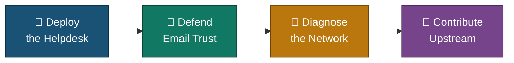
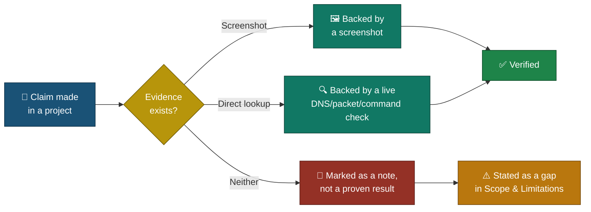

# 🧭 Executive Summary
### Real-World Tier-2 Support Projects

**A one-page read of what this portfolio proves — deploy, defend, diagnose, contribute.**

### [📖 Open the full README](README.md)

---

| 🧩 Projects | 🖼️ Screenshots | 🎫 Tickets Run | 🌐 Domains Audited | 📦 Packets Captured | 🐛 Pull Request |
|:---:|:---:|:---:|:---:|:---:|:---:|
| **4** | **103** | **5** | **10** | **860,523** | **#7882 (open)** |

---

## 🧩 The Four Projects, One Thread

---

## 📂 Project Summary

<table>
<tr>
<td width="50%" valign="top">

**🎫 01 — Real Ticketing System Deployment**
`Azure` `Ubuntu` `Apache` `MySQL` `PHP` `osTicket`

Built an IT helpdesk from an empty VM and ran 5 tickets end to end — 4 closed, 1 left open pending the customer.

**Status:** ✅ Complete
[README](./Project-1-Real-Ticketing-System-Deployment/README.md) · [Index](./Project-1-Real-Ticketing-System-Deployment/Osticket-INDEX.md)

</td>
<td width="50%" valign="top">

**📧 02 — Live Email Authentication Audit**
`SPF` `DKIM` `DMARC` `MxToolbox` `Gmail`

Audited SPF/DMARC on 10 real domains and checked SPF/DKIM/DMARC inside 4 real inbox emails.

**Status:** ✅ Complete
[README](./Project-2-Live-Email-Security-Audit/README.md) · [Index](./Project-2-Live-Email-Security-Audit/Email-Audit-INDEX.md)

</td>
</tr>
<tr>
<td width="50%" valign="top">

**🦈 03 — Wireshark Packet Capture Case Studies**
`Wireshark` `DNS` `TCP` `ARP`

Captured and diagnosed 3 real network faults live — read packet by packet, not assumed.

**Status:** ✅ Complete
[README](./Project-3-Wireshark-Packet-Capture-Case-Studies/README.md) · [Index](./Project-3-Wireshark-Packet-Capture-Case-Studies/Wireshark-INDEX.md)

</td>
<td width="50%" valign="top">

**🔧 04 — Open-Source Contribution (Uptime Kuma)**
`Vue.js` `Node.js` `Vite` `GitHub`

Traced GitHub issue #7062 to one method, fixed it, and opened PR #7882 under the project's own rules.

**Status:** 🟡 PR Open
[README](./Project-4-Uptime-Kuma-Open-Source-Contribution/README.md) · [Index](./Project-4-Uptime-Kuma-Open-Source-Contribution/INDEX.md) · [PR #7882](https://github.com/louislam/uptime-kuma/pull/7882)

</td>
</tr>
</table>

---

## 🔎 How a Claim Gets Verified

<em>This is the rule every project follows, applied to the checks below.</em>

---

## 🎯 Verification Snapshot

| Check | Status |
|---|:---:|
| Helpdesk actually reachable and used (staff + customer panel) | ✅ |
| Domain SPF/DMARC claims checked against live DNS, not a summary | ✅ |
| Network faults reproduced live, not assumed | ✅ |
| Bug fix run locally before the PR was opened | ✅ |
| SLA plans applied to every ticket | ⚠️ Created, not applied |
| Open-source PR merged upstream | ❌ Open, awaiting review |

> [!NOTE]
> This is a summary only — full methodology, screenshots and limitations for each finding live in that project's own README.

---

[⬆️ Back to top](#top) &nbsp;·&nbsp; [📖 Full README](README.md)

