

# 🎫 Project 01 — Index
### Real Ticketing System Deployment
**Project 01 of 4 — Tier-2 Support Portfolio**

**Quick guide to every step and screenshot in this project.**

### [📖 Open the full README](README.md)

---

| 🧩 Modules | 🖼️ Screenshots | 🎫 Tickets Created | ✅ Tickets Closed |
|:---:|:---:|:---:|:---:|
| **4** | **33** | **5** | **4** |

🧩 <b>Lab:</b> Azure VM (Ubuntu 24.04 · Apache · MySQL · PHP) ➜ osTicket v1.18.1 · customer portal <code>/open.php</code> and staff panel <code>/scp</code>

---

## 📑 Step Index

All 16 steps and 5 ticket simulations of the project, with the screenshots that show each one.

| # | Step | Module | Result | Evidence |
|:---:|---|:---:|---|:---:|
| 1 | Provision the Azure VM | 🔵 Module 1 | `osticket-vm` running, Ubuntu 24.04, India South Central | [Exhibit 1](#ex1) |
| 2 | Open ports 22 and 80 in the NSG | 🔵 Module 1 | SSH and HTTP allowed | 📝 No screenshot |
| 3 | Install the LAMP stack | 🔵 Module 1 | Apache, MySQL and PHP installed over SSH | [Exhibit 2](#ex2) |
| 4 | Confirm Apache is running | 🔵 Module 1 | `active (running)` since 21:20:44 UTC | [Exhibit 3](#ex3) |
| 5 | Create the MySQL database | 🔵 Module 1 | Database and user created, all `Query OK` | [Exhibit 4](#ex4) |
| 6 | Download and unzip osTicket | 🟢 Module 2 | v1.18.1 zip saved (51,759,267 bytes) and extracted | Exhibits [5](#ex5), [6](#ex6) |
| 7 | Copy files into the web root, prepare the config | 🟢 Module 2 | Works on the VM, fails in the local Windows prompt | Exhibits [7](#ex7), [8](#ex8) |
| 8 | Open the installer, check prerequisites | 🟢 Module 2 | PHP 8.3.6 and MySQLi pass, optional Intl extension missing | [Exhibit 9](#ex9) |
| 9 | Fill in the install form | 🟢 Module 2 | Helpdesk, admin account and database details entered | Exhibits [10](#ex10), [11](#ex11) |
| 10 | Installation complete | 🟢 Module 2 | "Congratulations!" page, `chmod 0644` step listed | [Exhibit 12](#ex12) |
| 11 | Log in to the staff panel | 🟢 Module 2 | First login, system ticket `#331925` | Exhibits [13](#ex13), [14](#ex14) |
| 12 | Create the Priority SLA plan | 🟣 Module 3 | 4-hour grace period | [Exhibit 15](#ex15) |
| 13 | Create the Standard SLA plan | 🟣 Module 3 | 24-hour grace period | [Exhibit 16](#ex16) |
| 14 | Check the SLA list | 🟣 Module 3 | 3 plans: Default 18 h, Standard 24 h, Priority 4 h | Exhibits [17](#ex17), [18](#ex18) |
| 15 | Add three custom departments | 🟣 Module 3 | IT, Network and Email/ VPN added, 6 departments total | Exhibits [19](#ex19), [20](#ex20) |
| 16 | Review the help topics | 🟣 Module 3 | 4 topics set department and priority | [Exhibit 21](#ex21) |
| 17 | Ticket 1 — WiFi not connecting | 🟠 Module 4 | `#693589` High, closed in 13 min 29 s | Exhibits [22](#ex22), [23](#ex23) |
| 18 | Ticket 2 — Email not receiving | 🟠 Module 4 | `#196889` High, closed in 14 min 52 s | Exhibits [24](#ex24), [25](#ex25) |
| 19 | Ticket 3 — VPN connection failing | 🟠 Module 4 | `#505400` Normal, Maintenance, closed in 14 min 43 s | Exhibits [26](#ex26), [27](#ex27) |
| 20 | Ticket 4 — Forgot password | 🟠 Module 4 | `#894015` Normal, replied to but still open | Exhibits [28](#ex28), [29](#ex29) |
| 21 | Ticket 5 — Printer not working | 🟠 Module 4 | `#738368` High, closed in 9 min 0 s | Exhibits [30](#ex30), [31](#ex31) |
| 22 | Review the open and closed queues | 🟠 Module 4 | 4 closed, 1 open | Exhibits [32](#ex32), [33](#ex33) |

---

## 🔵 Module 1 — Azure VM & LAMP Stack

Exhibits 1 to 4. Click a screenshot to open it full size.

<table>
<tr>
<td align="center" valign="top" width="50%">

<a href="Screenshots/01-azure-vm-overview.PNG">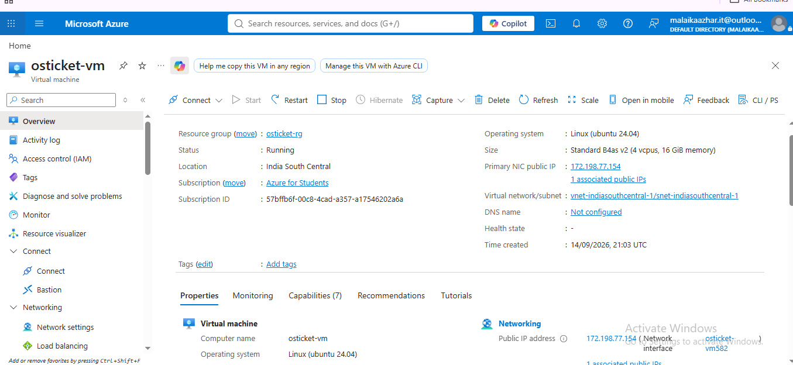</a>
 <b>Exhibit 1 — Azure VM overview</b>
 <code>osticket-vm</code> running: Ubuntu 24.04, Standard B4as v2, India South Central
</td>
<td align="center" valign="top" width="50%">

<a href="Screenshots/02-lamp-stack-install.PNG">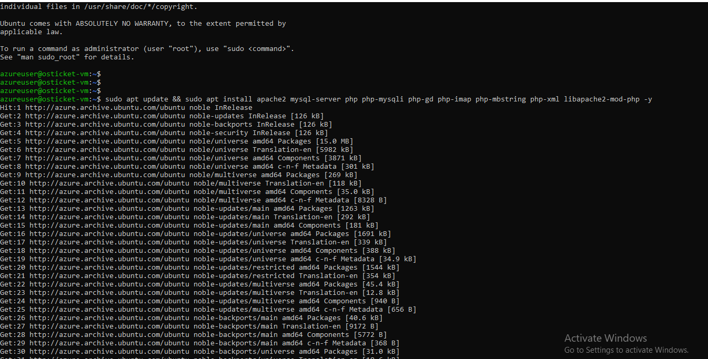</a>
 <b>Exhibit 2 — LAMP install</b>
 <code>apt install</code> for Apache, MySQL and PHP, run over SSH
</td>
</tr>
<tr>
<td align="center" valign="top" width="50%">

<a href="Screenshots/03-apache-status.PNG">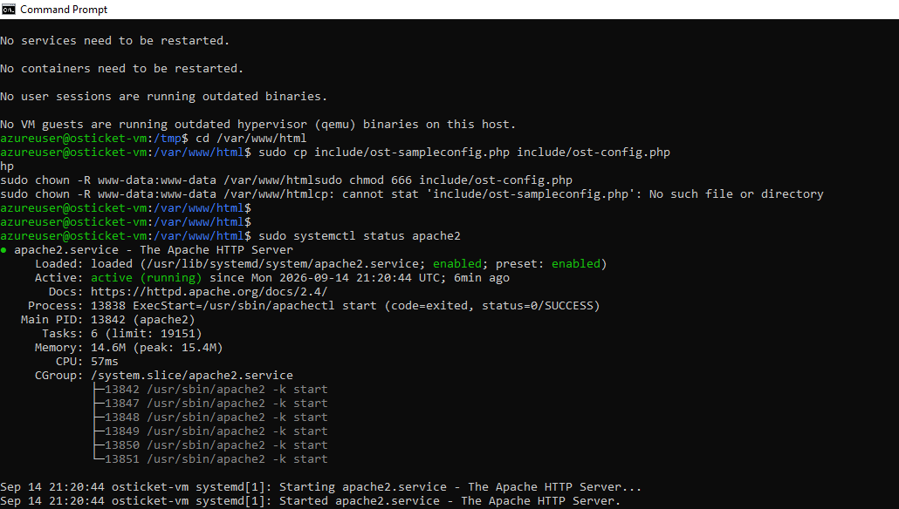</a>
 <b>Exhibit 3 — Apache running</b>
 <code>active (running)</code>. The lines above show an early config copy that failed
</td>
<td align="center" valign="top" width="50%">

 <b>Exhibit 4 — MySQL setup</b>
 MySQL 8.0.46: database, user, grant and flush all <code>Query OK</code>
</td>
</tr>
</table>

---

## 🟢 Module 2 — osTicket Installation

Exhibits 5 to 14.

<table>
<tr>
<td align="center" valign="top" width="50%">

<a href="Screenshots/05-osticket-download-unzip.PNG">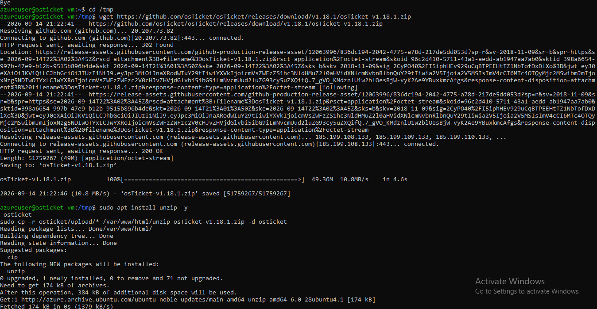</a>
 <b>Exhibit 5 — Download and <code>unzip</code> install</b>
 <code>osTicket-v1.18.1.zip</code> saved at 21:22:46 UTC
</td>
<td align="center" valign="top" width="50%">

<a href="Screenshots/05-osticket-unzip.PNG">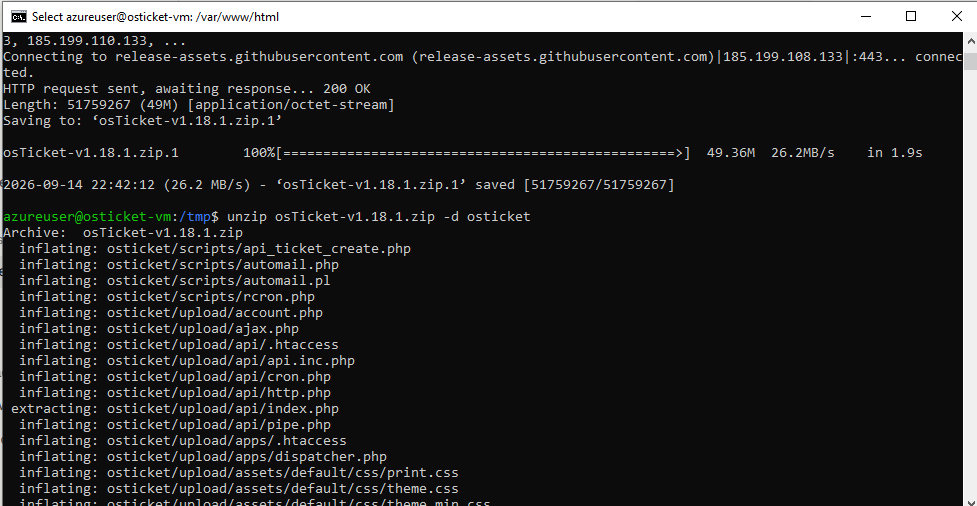</a>
 <b>Exhibit 6 — Second download and unzip</b>
 <code>.zip.1</code> saved (same size), archive extracted into <code>osticket</code>
</td>
</tr>
<tr>
<td align="center" valign="top" width="50%">

<a href="Screenshots/07-ssh-cmd-error.PNG">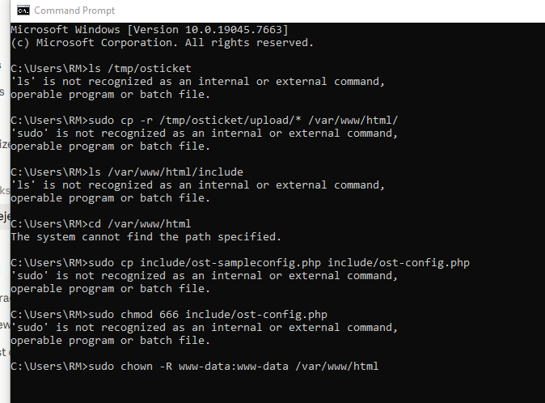</a>
 <b>Exhibit 7 — Wrong machine</b>
 <code>'ls'</code> and <code>'sudo'</code> not recognized in the local Windows prompt
</td>
<td align="center" valign="top" width="50%">

<a href="Screenshots/06-osticket-files-copied.PNG">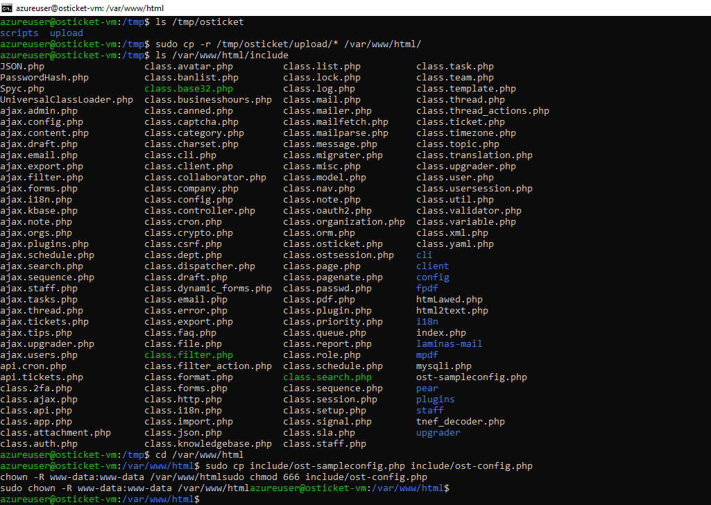</a>
 <b>Exhibit 8 — Files copied on the VM</b>
 Web root filled, <code>ost-config.php</code> created from the sample
</td>
</tr>
<tr>
<td align="center" valign="top" width="50%">

<a href="Screenshots/08-installer-prerequisites.PNG">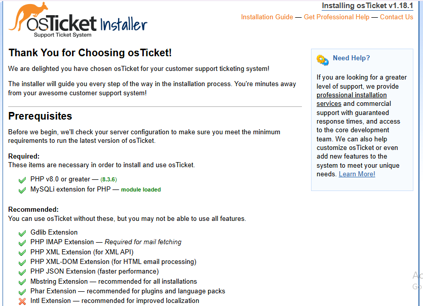</a>
 <b>Exhibit 9 — Installer prerequisites</b>
 PHP 8.3.6 ✅, MySQLi ✅. Only the optional Intl extension shows ❌
</td>
<td align="center" valign="top" width="50%">

<a href="Screenshots/09-installer-form-blank.PNG">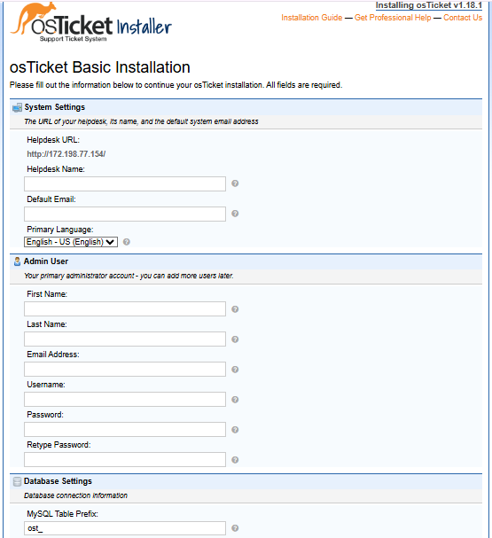</a>
 <b>Exhibit 10 — Blank installer form</b>
 Helpdesk URL <code>http://172.198.77.154/</code>, table prefix <code>ost_</code>
</td>
</tr>
<tr>
<td align="center" valign="top" width="50%">

<a href="Screenshots/10-installer-form-filled.PNG">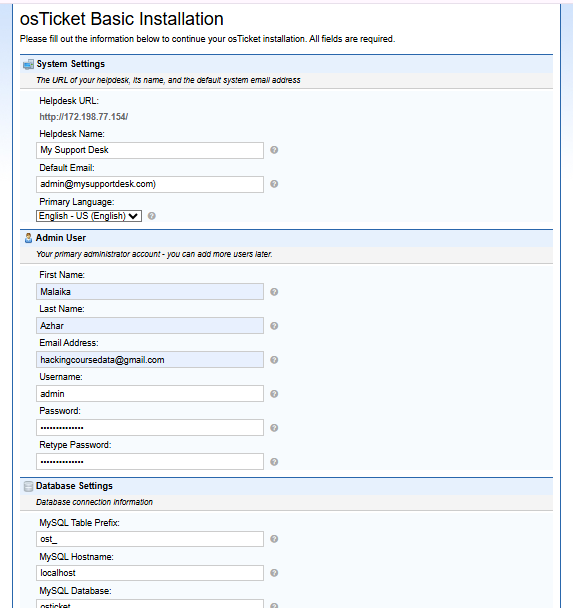</a>
 <b>Exhibit 11 — Filled installer form</b>
 Helpdesk name, admin account and database <code>osticket</code> on <code>localhost</code>
</td>
<td align="center" valign="top" width="50%">

 <b>Exhibit 12 — Installation complete</b>
 "Congratulations!" and the <code>chmod 0644</code> instruction
</td>
</tr>
<tr>
<td align="center" valign="top" width="50%">

<a href="Screenshots/13-scp-login.PNG">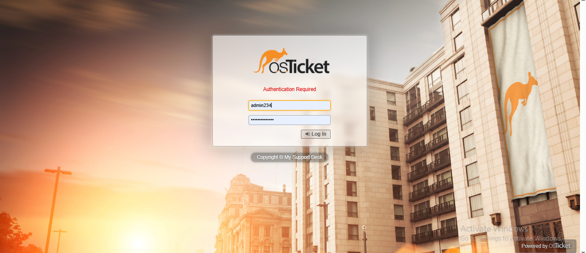</a>
 <b>Exhibit 13 — Staff panel login</b>
 "Authentication Required" at <code>/scp</code>
</td>
<td align="center" valign="top" width="50%">

<a href="Screenshots/12-agent-first-login.PNG">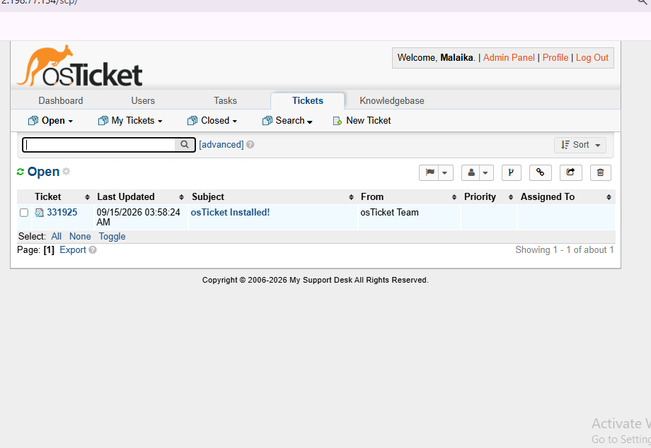</a>
 <b>Exhibit 14 — First login</b>
 Only the system ticket <code>#331925</code> "osTicket Installed!"
</td>
</tr>
</table>

---

## 🟣 Module 3 — Helpdesk Configuration

Exhibits 15 to 21.

<table>
<tr>
<td align="center" valign="top" width="50%">

<a href="Screenshots/15-sla-priority-add.PNG">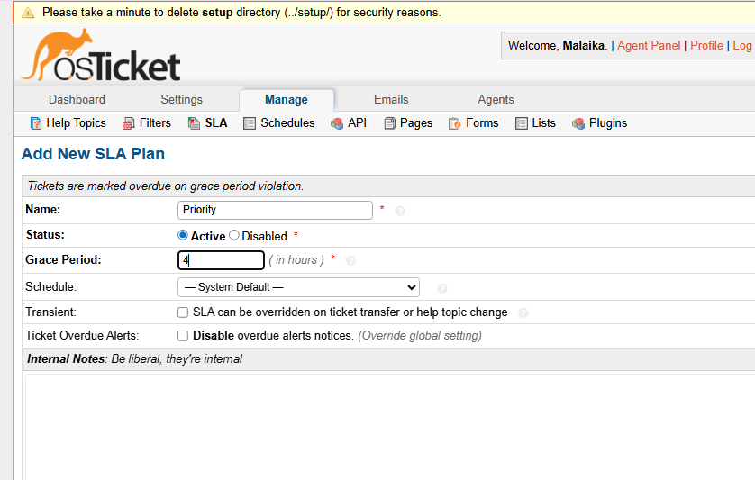</a>
 <b>Exhibit 15 — Priority SLA</b>
 Active, grace period 4 hours, schedule "System Default"
</td>
<td align="center" valign="top" width="50%">

<a href="Screenshots/14-sla-standard-add.PNG">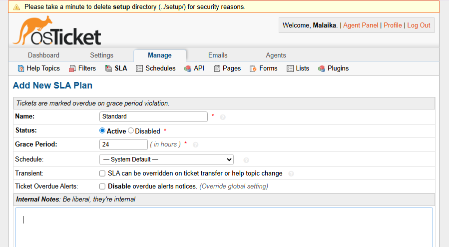</a>
 <b>Exhibit 16 — Standard SLA</b>
 Active, grace period 24 hours, schedule "System Default"
</td>
</tr>
<tr>
<td align="center" valign="top" width="50%">

 <b>Exhibit 17 — SLA list</b>
 3 plans. The "delete the setup directory" warning is still visible
</td>
<td align="center" valign="top" width="50%">

<a href="Screenshots/16b-sla-final-list-alt.PNG">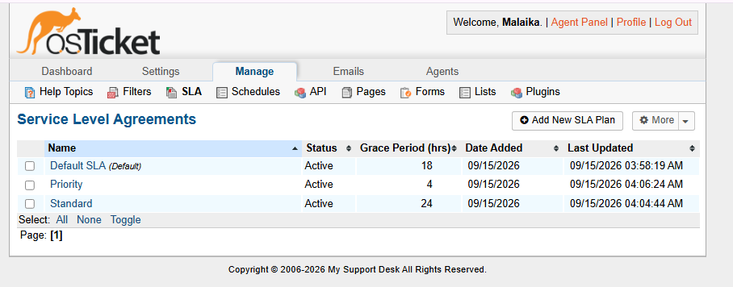</a>
 <b>Exhibit 18 — SLA list, later screenshot</b>
 Same 3 plans, no warning banner
</td>
</tr>
<tr>
<td align="center" valign="top" width="50%">

<a href="Screenshots/17-departments-before.PNG">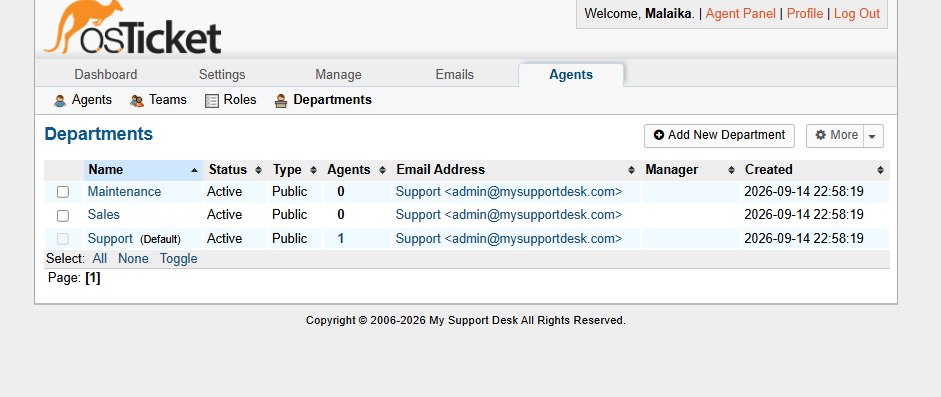</a>
 <b>Exhibit 19 — Departments before</b>
 Maintenance, Sales and Support (default), all from the install
</td>
<td align="center" valign="top" width="50%">

<a href="Screenshots/18-departments-final.PNG">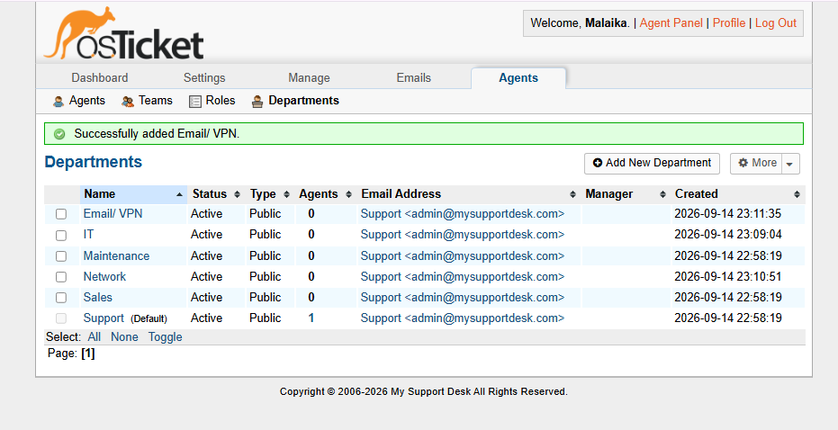</a>
 <b>Exhibit 20 — Departments after</b>
 <code>Email/ VPN</code>, <code>IT</code> and <code>Network</code> added
</td>
</tr>
<tr>
<td align="center" valign="top" width="50%">

<a href="Screenshots/19-help-topics.PNG">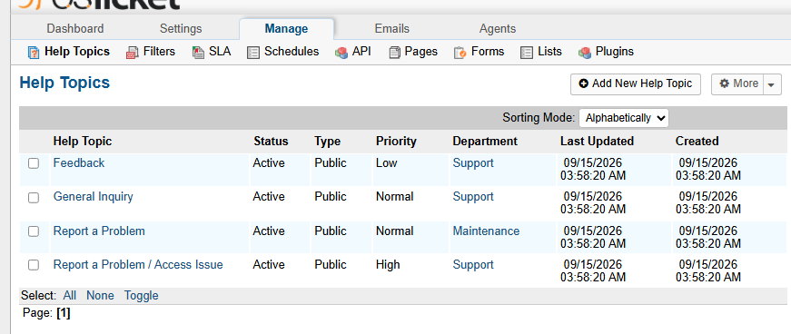</a>
 <b>Exhibit 21 — Help topics</b>
 4 topics set the department and priority of a new ticket
</td>
<td></td>
</tr>
</table>

---

## 🟠 Module 4 — Ticket Simulations

Exhibits 22 to 33. Each row is one ticket: the customer form on the left, the agent reply on the right.

<table>
<tr>
<td align="center" valign="top" width="50%">

<a href="Screenshots/20-ticket1-wifi.PNG">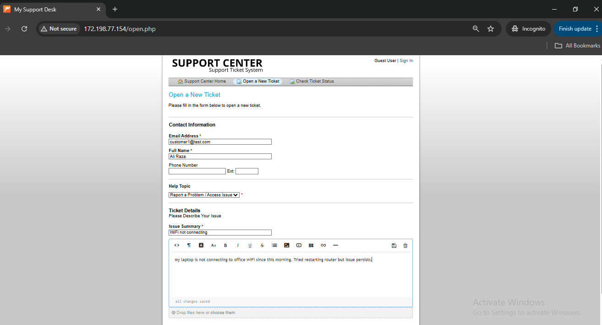</a>
 <b>Exhibit 22 — WiFi ticket, form</b>
 Ali Raza, "Report a Problem / Access Issue"
</td>
<td align="center" valign="top" width="50%">

<a href="Screenshots/26-wifi-reply.PNG">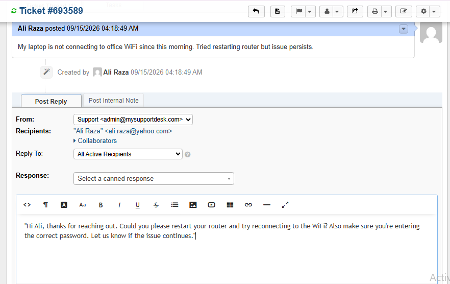</a>
 <b>Exhibit 23 — WiFi ticket, reply</b>
 <code>#693589</code> closed ✅ after 13 min 29 s
</td>
</tr>
<tr>
<td align="center" valign="top" width="50%">

 <b>Exhibit 24 — Email ticket, form</b>
 Sara Khan, "Report a Problem / Access Issue"
</td>
<td align="center" valign="top" width="50%">

<a href="Screenshots/28-email-resolve.PNG">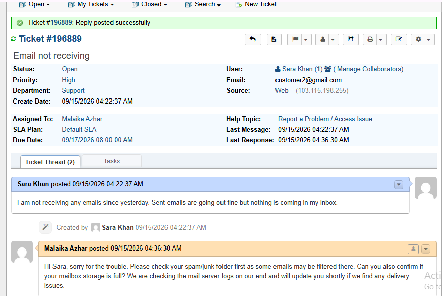</a>
 <b>Exhibit 25 — Email ticket, reply</b>
 <code>#196889</code> closed ✅ after 14 min 52 s
</td>
</tr>
<tr>
<td align="center" valign="top" width="50%">

<a href="Screenshots/22-ticket3-vpn.PNG">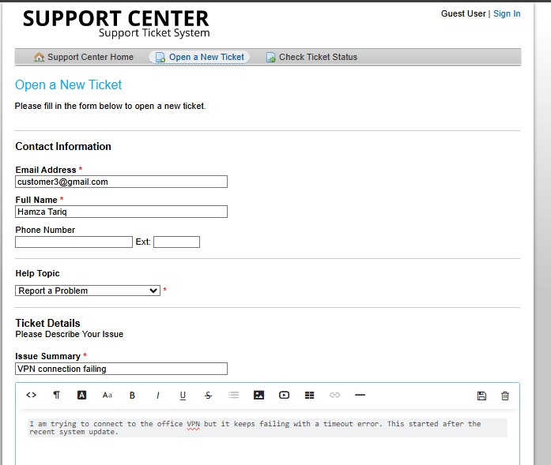</a>
 <b>Exhibit 26 — VPN ticket, form</b>
 Hamza Tariq, "Report a Problem"
</td>
<td align="center" valign="top" width="50%">

<a href="Screenshots/29-vpn-resolve.PNG">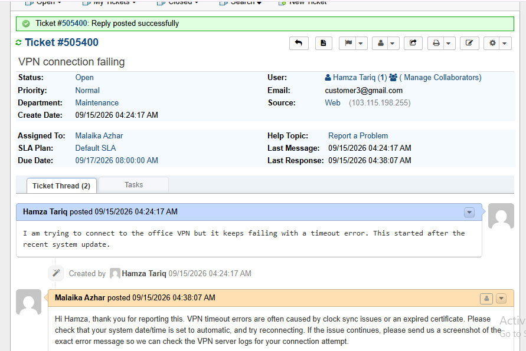</a>
 <b>Exhibit 27 — VPN ticket, reply</b>
 <code>#505400</code> Maintenance, closed ✅ after 14 min 43 s
</td>
</tr>
<tr>
<td align="center" valign="top" width="50%">

 <b>Exhibit 28 — Password ticket, form</b>
 Ayesha Malik, "General Inquiry"
</td>
<td align="center" valign="top" width="50%">

 <b>Exhibit 29 — Password ticket, reply</b>
 <code>#894015</code> still 🟠 Open, never closed
</td>
</tr>
<tr>
<td align="center" valign="top" width="50%">

<a href="Screenshots/24-ticket5-printer.PNG">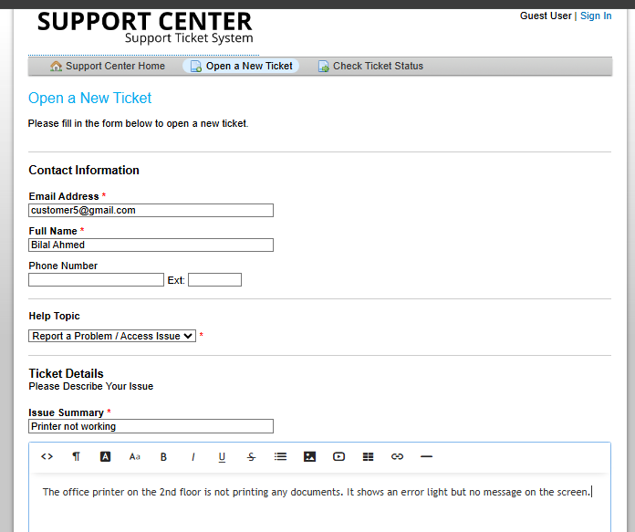</a>
 <b>Exhibit 30 — Printer ticket, form</b>
 Bilal Ahmed, "Report a Problem / Access Issue"
</td>
<td align="center" valign="top" width="50%">

 <b>Exhibit 31 — Printer ticket, reply</b>
 <code>#738368</code> closed ✅ after 9 min 0 s
</td>
</tr>
<tr>
<td align="center" valign="top" width="50%">

<a href="Screenshots/25-all-open-tickets.PNG">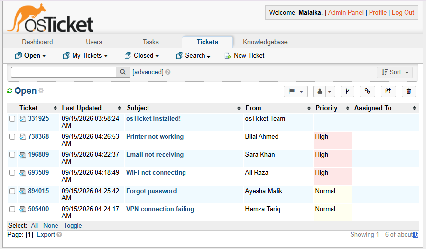</a>
 <b>Exhibit 32 — Open queue</b>
 All five tickets plus the system ticket: "Showing 1 - 6 of about 6"
</td>
<td align="center" valign="top" width="50%">

 <b>Exhibit 33 — Closed list</b>
 4 tickets closed. <code>#894015</code> is not in it
</td>
</tr>
</table>

### 🎫 Tickets at a Glance

| Ticket | Customer | Priority | Department | Status | Time to Close |
|---|---|:---:|:---:|:---:|:---:|
| #693589 WiFi not connecting | Ali Raza | 🔴 High | not shown | ✅ Closed | 13 min 29 s |
| #196889 Email not receiving | Sara Khan | 🔴 High | Support | ✅ Closed | 14 min 52 s |
| #505400 VPN connection failing | Hamza Tariq | 🟡 Normal | Maintenance | ✅ Closed | 14 min 43 s |
| #894015 Forgot password | Ayesha Malik | 🟡 Normal | Support | 🟠 Open | — |
| #738368 Printer not working | Bilal Ahmed | 🔴 High | Support | ✅ Closed | 9 min 0 s |

---

## 🎯 Verification Checklist

| Check | Method | Layer | Status |
|:---:|---|---|:---:|
| Web stack running | `systemctl status apache2`, MySQL `Query OK` | Server | ✅ Confirmed |
| osTicket installed | "Congratulations!" page, staff panel login | Application | ✅ Confirmed |
| SLA plans created | Staff panel SLA list | Configuration | ✅ Confirmed |
| SLA plans applied to tickets | Ticket pages show Default SLA | Configuration | ⚠️ Not applied |
| Custom departments used | Help topics still route to Support and Maintenance | Configuration | ⚠️ Created, not routed to |
| Tickets closed | Closed list | Workflow | ✅ 4 of 5 |
| Customer confirmed the fixes | No customer replies in any ticket | Workflow | ❌ Not covered |
| Email delivery through the helpdesk | No screenshot shows mail sent or received | Mail | ❌ Not tested |
| NSG rules and the `chmod 0644` step | Described in the README | Server | 📝 Notes only |

> [!NOTE]
> This is a simulation: the customer and the agent are both me, so "closed" means I closed the ticket. Times in the ticket sections are agent-panel time, 5 hours ahead of the UTC times Azure shows.

---

[⬆️ Back to top](#top) &nbsp;·&nbsp; [📖 Full README](README.md)

🎫 **[osTicket](https://osticket.com)** · ☁️ **[Microsoft Azure](https://azure.microsoft.com)** · 🐧 **[Ubuntu](https://ubuntu.com)** · 🧭 **[Ticket Lifecycle](README.md#ticket-lifecycle)**

