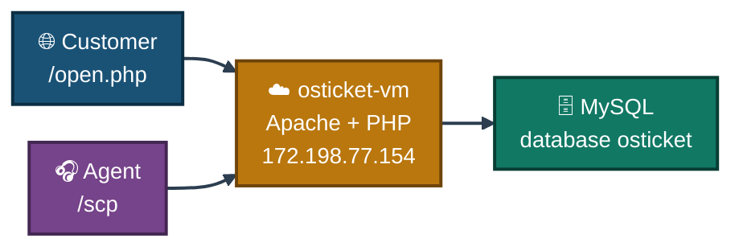
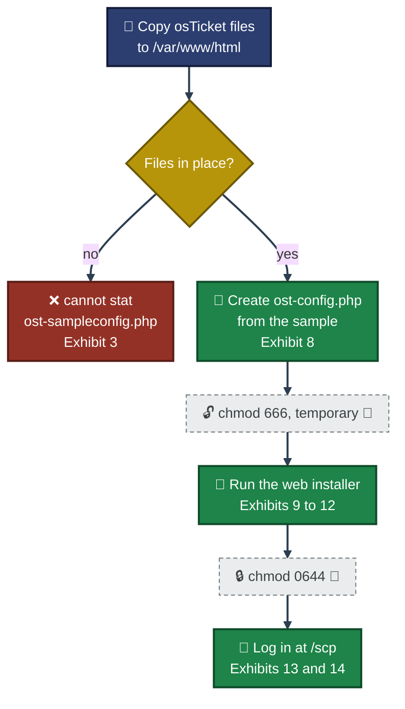
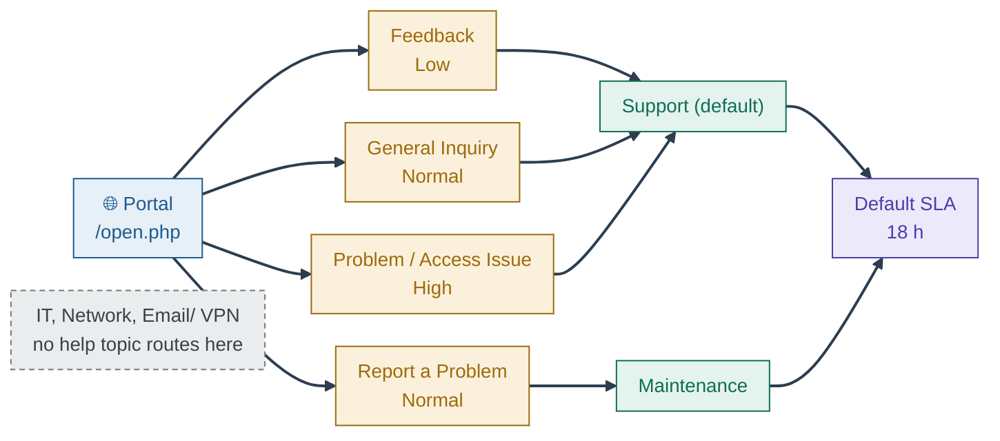
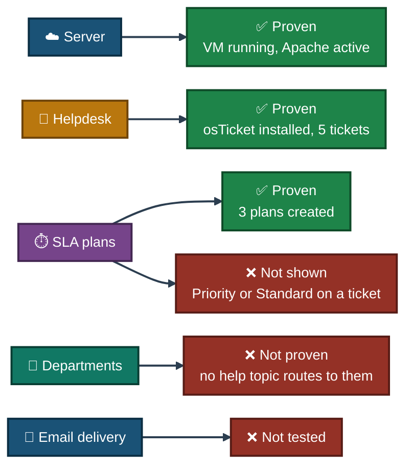
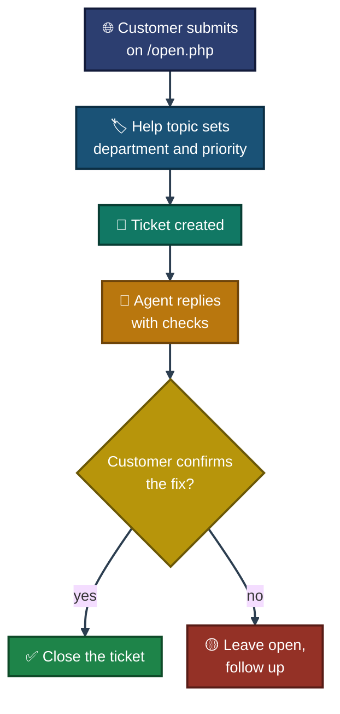
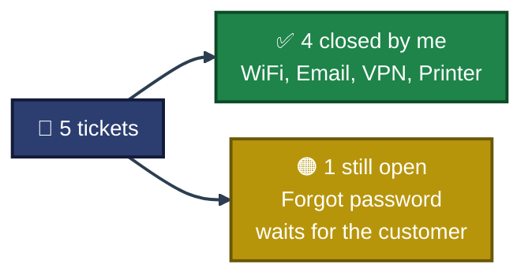

<div align="center">

# 🎫 Real Ticketing System Deployment

**Project 01 of 4 — Tier-2 Support Portfolio**

IT Helpdesk Deployment (osTicket on Azure)


A real IT helpdesk built on a live Azure VM: Ubuntu, Apache, MySQL and PHP installed by hand, osTicket v1.18.1 set up through its web installer, SLA plans and departments configured, and five support tickets run from the customer portal to the agent panel. Every result has a screenshot. Four tickets were closed and one was replied to but left open, and this README says so.

### [📑 Open the visual index](Osticket-INDEX.md)

</div>

---

## 📑 Table of Contents

1. [At a Glance](#at-a-glance)
2. [Project Background](#project-background)
3. [Environment](#environment)
4. [Project Flow](#project-flow)
5. [Module 1 — Azure VM & LAMP Stack](#module-1)
6. [Module 2 — osTicket Installation](#module-2)
7. [Module 3 — Helpdesk Configuration](#module-3)
8. [Coverage Snapshot](#coverage-snapshot)
9. [Ticket Lifecycle](#ticket-lifecycle)
10. [Module 4 — Ticket Simulations](#module-4)
11. [Ticket Summary](#ticket-summary)
12. [Project Summary](#project-summary)
13. [Challenges & Fixes](#challenges-fixes)
14. [Scope & Limitations](#scope-limitations)
15. [What I Learned](#what-i-learned)
16. [Skills Demonstrated](#skills-demonstrated)
17. [Screenshot Index](#screenshot-index)
18. [Repo Structure](#repo-structure)

---

<a id="at-a-glance"></a>
## 📊 At a Glance

| 🎫 Tickets Created | ✅ Tickets Closed | ⏱️ SLA Plans | 🏢 Departments | 🖼️ Screenshots | 💰 Cost |
|:---:|:---:|:---:|:---:|:---:|:---:|
| **5** | **4** | **3** | **6** | **33** | **Student credit** |

---

<a id="project-background"></a>
## 📖 Project Background

Tier-2 support works inside a ticketing system: customers report problems, agents reply, and SLA rules say how fast. This project builds that system from an empty server, then uses it the way a support team would.

- **Module 1 — Azure VM & LAMP Stack:** Create the server and install Apache, MySQL and PHP.
- **Module 2 — osTicket Installation:** Download osTicket, prepare the files and run the web installer.
- **Module 3 — Helpdesk Configuration:** Add SLA plans and departments, and check how help topics route tickets.
- **Module 4 — Ticket Simulations:** Submit five tickets as a customer, then reply to and close them as an agent.

> [!NOTE]
> This is a simulation. The customer and the agent are both me, so no customer ever replied, and "closed" means I closed the ticket. Items taken from my own notes, with no screenshot behind them, are marked 📝.

<div align="center">

### 🧩 Lab Setup at a Glance

<table>
<tr>
<td align="center" valign="top" width="42%">


**Customer Side**<br>
<sub>Public form at <code>/open.php</code><br>Help topic picks department and priority</sub>

</td>
<td align="center" valign="middle" width="16%">

**➜**<br>
<sub>tickets</sub>

</td>
<td align="center" valign="top" width="42%">


**Agent Side**<br>
<sub>Staff panel at <code>/scp</code><br>Reply, assign, close</sub>

</td>
</tr>
<tr>
<td colspan="3" align="center">

<br>
<sub>Apache · MySQL · PHP on one VM in India South Central</sub>

</td>
</tr>
</table>

</div>

---

<a id="environment"></a>
## 🖧 Environment

| Item | Value |
|---|---|
| **VM Name** | `osticket-vm` (resource group `osticket-rg`) |
| **Subscription** | Azure for Students |
| **Size** | Standard B4as v2 (4 vCPUs, 16 GiB memory) |
| **Region** | India South Central |
| **Operating System** | Ubuntu 24.04 |
| **Public IP** | `172.198.77.154` |
| **VM Created** | 14/09/2026 at 21:03 UTC |
| **Web Server** | Apache 2 |
| **Database** | MySQL 8.0.46 (Ubuntu 24.04 package) |
| **PHP** | 8.3.6 |
| **Helpdesk** | osTicket v1.18.1 |
| **Customer Portal** | `http://172.198.77.154/` |
| **Staff Panel** | `http://172.198.77.154/scp` |

> [!IMPORTANT]
> Azure and the server show UTC. The osTicket agent panel shows times 5 hours ahead of UTC (the default SLA is stamped 22:58:19 on the server and 03:58:19 AM in the panel). All times in the ticket sections use the agent-panel time.

### 🗺️ Lab Architecture


<p align="center"><em>Addresses and paths come from the Environment table. The diagram shows the layout, it is not a screenshot.</em></p>

---

<a id="project-flow"></a>
## ⏱️ Project Flow

```mermaid
%%{init: { 'theme': 'base', 'themeVariables': {
  'doneTaskBkgColor':'#117864', 'doneTaskBorderColor':'#083D33',
  'sectionBkgColor':'#D6DBDF', 'altSectionBkgColor':'#EAECEE',
  'taskTextColor':'#FFFFFF', 'taskTextOutsideColor':'#1B2631',
  'taskTextLightColor':'#FFFFFF',
  'titleColor':'#1B2A4A', 'fontSize':'16px'
}}}%%
gantt
    title Project Flow — Sep 15, 2026 (agent-panel time, UTC+5)
    dateFormat HH:mm
    axisFormat %H:%M
    section Azure and LAMP
    VM created to Apache running               :done, 02:03, 17m
    section osTicket Install
    Apache running to install complete         :done, 02:21, 97m
    section Configuration
    SLA plans                                  :done, 03:58, 9m
    Departments                                :done, 04:09, 3m
    section Tickets
    Five simulated tickets                     :done, 04:18, 21m
```


<p align="center"><em>Each bar runs between two timestamps visible in the screenshots. The long install bar includes a gap of about an hour between two downloads of the osTicket zip (Exhibits 5 and 6).</em></p>

---

<a id="module-1"></a>
## 🔵 Module 1 — Azure VM & LAMP Stack

**Objective:** Create a real server in the cloud and install the web stack osTicket needs: Apache, MySQL and PHP.

### Step 1 — Provision the Azure VM ✅

Ubuntu Server 24.04 on an Azure for Students subscription, size Standard B4as v2, region India South Central.

<p align="center">
  <br>
  <em>Exhibit 1 — <code>osticket-vm</code> Running: Ubuntu 24.04, Standard B4as v2 (4 vCPUs, 16 GiB), India South Central, public IP <code>172.198.77.154</code></em>
</p>

### Step 2 — Open the required ports 📝

Inbound SSH (22) and HTTP (80) were allowed in the network security group, so the server could be managed and the web installer could be reached. There is no screenshot of the rules.

### Step 3 — Install the LAMP stack ✅

```bash
sudo apt update && sudo apt install apache2 mysql-server php php-mysqli php-gd php-imap php-mbstring php-xml libapache2-mod-php -y
```

<p align="center">
  <br>
  <em>Exhibit 2 — The install command running in the SSH session on <code>osticket-vm</code></em>
</p>

### Step 4 — Confirm Apache is running ✅

```bash
sudo systemctl status apache2
```

<p align="center">
  <br>
  <em>Exhibit 3 — <code>apache2.service</code> is <code>active (running)</code> since 2026-09-14 21:20:44 UTC. The lines above it show an early config-copy attempt that failed because the osTicket files were not copied yet</em>
</p>

### Step 5 — Create the MySQL database ✅

```sql
CREATE DATABASE osticket;
CREATE USER 'osticketuser'@'localhost' IDENTIFIED BY '<your-password>';
GRANT ALL PRIVILEGES ON osticket.* TO 'osticketuser'@'localhost';
FLUSH PRIVILEGES;
```

<p align="center">
  <br>
  <em>Exhibit 4 — MySQL 8.0.46 monitor: all four statements answered <code>Query OK</code></em>
</p>

---

<a id="module-2"></a>
## 🟢 Module 2 — osTicket Installation

**Objective:** Get osTicket v1.18.1 onto the server, prepare its config file, and finish the web installer.

### Step 6 — Download and unzip osTicket ✅

```bash
cd /tmp
wget https://github.com/osTicket/osTicket/releases/download/v1.18.1/osTicket-v1.18.1.zip
sudo apt install unzip -y
unzip osTicket-v1.18.1.zip -d osticket
```

<p align="center">
  <br>
  <em>Exhibit 5 — <code>wget</code> saves <code>osTicket-v1.18.1.zip</code> (51,759,267 bytes) at 21:22:46 UTC, then <code>unzip</code> is installed</em>
</p>

<p align="center">
  <br>
  <em>Exhibit 6 — A second download saved as <code>osTicket-v1.18.1.zip.1</code> (same size, 22:42:12 UTC), then <code>unzip</code> extracts the archive into <code>osticket</code></em>
</p>

### Step 7 — Copy the files into the web root and prepare the config ✅

```bash
sudo cp -r /tmp/osticket/upload/* /var/www/html/
cd /var/www/html
sudo cp include/ost-sampleconfig.php include/ost-config.php
sudo chmod 666 include/ost-config.php
sudo chown -R www-data:www-data /var/www/html
```

The `chmod 666` is temporary. The installer needs to write the config file, and it is locked down again afterwards (Step 10).

These commands first appear in the local Windows Command Prompt, where they fail:

<p align="center">
  <br>
  <em>Exhibit 7 — Windows Command Prompt: <code>'ls' is not recognized</code>, <code>'sudo' is not recognized</code>, <code>The system cannot find the path specified</code>. Linux commands do not run on the local PC</em>
</p>

They work inside the SSH session on the VM:

<p align="center">
  <br>
  <em>Exhibit 8 — SSH session on <code>osticket-vm</code>: <code>/tmp/osticket</code> holds <code>scripts</code> and <code>upload</code>, the files are copied to <code>/var/www/html</code>, and <code>ost-sampleconfig.php</code> is copied to <code>ost-config.php</code></em>
</p>

### Step 8 — Open the web installer and check prerequisites ✅

<p align="center">
  <br>
  <em>Exhibit 9 — Prerequisites: PHP 8.3.6 ✅, MySQLi ✅, Gdlib, IMAP, XML, XML-DOM, JSON, Mbstring and Phar ✅. Only the optional Intl extension shows a red ❌</em>
</p>

### Step 9 — Fill in the install form ✅

<p align="center">
  <br>
  <em>Exhibit 10 — The blank form. The helpdesk URL is <code>http://172.198.77.154/</code> and the table prefix is prefilled as <code>ost_</code></em>
</p>

<p align="center">
  <br>
  <em>Exhibit 11 — The filled form</em>
</p>

| Section | Value |
|---|---|
| Helpdesk name | My Support Desk |
| Default email | a placeholder `admin@` address |
| Language | English - US |
| Admin user | Created (first admin account) |
| Database | prefix `ost_`, host `localhost`, database `osticket` |

### Step 10 — Installation complete ✅

```bash
sudo chmod 0644 /var/www/html/include/ost-config.php
```

<p align="center">
  <br>
  <em>Exhibit 12 — "Congratulations!" page. It tells you to remove write access from <code>ost-config.php</code> with <code>chmod 0644</code>. There is no screenshot of running it 📝</em>
</p>

### Step 11 — Log in to the Staff Control Panel ✅

<p align="center">
  <br>
  <em>Exhibit 13 — Staff Control Panel login ("Authentication Required")</em>
</p>

<p align="center">
  <br>
  <em>Exhibit 14 — First login at <code>/scp</code>: the only ticket is the system ticket <code>#331925 "osTicket Installed!"</code>, created 09/15/2026 03:58:24 AM</em>
</p>

### 🗺️ Why the Install Order Matters


<p align="center"><em>Green is shown in a screenshot. Dashed steps come from my notes 📝. The red box is the early error from Exhibit 3, before the files were copied.</em></p>

---

<a id="module-3"></a>
## 🟣 Module 3 — Helpdesk Configuration

**Objective:** Add SLA plans and departments, and check how help topics decide a ticket's department and priority.

### Step 12 — Create the Priority SLA plan ✅

<p align="center">
  <br>
  <em>Exhibit 15 — New SLA plan "Priority": Active, grace period 4 hours, schedule "System Default"</em>
</p>

### Step 13 — Create the Standard SLA plan ✅

<p align="center">
  <br>
  <em>Exhibit 16 — New SLA plan "Standard": Active, grace period 24 hours, schedule "System Default"</em>
</p>

### Step 14 — Check the SLA list ✅

<p align="center">
  <br>
  <em>Exhibit 17 — Three plans after adding them. The yellow banner still says to delete the <code>setup</code> directory</em>
</p>

<p align="center">
  <br>
  <em>Exhibit 18 — The same list in a later screenshot. Neither banner is shown</em>
</p>

| Plan | Grace Period | Added | Last Updated |
|---|:---:|:---:|:---:|
| ⚪ Default SLA (default) | 18 h | 09/15/2026 | 03:58:19 AM |
| 🟡 Standard | 24 h | 09/15/2026 | 04:04:44 AM |
| 🔴 Priority | 4 h | 09/15/2026 | 04:06:24 AM |

The "delete the setup directory" warning is visible in Exhibits 15 to 17 and gone from Exhibit 18 onward, so the directory was removed in between. The command itself is not screenshotted 📝.

### Step 15 — Add three custom departments ✅

<p align="center">
  <br>
  <em>Exhibit 19 — Before: three departments from the install (Maintenance, Sales, and Support as the default)</em>
</p>

<p align="center">
  <br>
  <em>Exhibit 20 — After: <code>Email/ VPN</code>, <code>IT</code> and <code>Network</code> added ("Successfully added Email/ VPN")</em>
</p>

| Department | Type | Created (server time) | Origin |
|---|:---:|:---:|:---:|
| Support (default) | Public | 2026-09-14 22:58:19 | Install |
| Maintenance | Public | 2026-09-14 22:58:19 | Install |
| Sales | Public | 2026-09-14 22:58:19 | Install |
| IT | Public | 2026-09-14 23:09:04 | Added |
| Network | Public | 2026-09-14 23:10:51 | Added |
| Email/ VPN | Public | 2026-09-14 23:11:35 | Added |

### Step 16 — Review the help topics ✅

<p align="center">
  <br>
  <em>Exhibit 21 — Help topics decide the department and priority of a new ticket</em>
</p>

| Help Topic | Department | Priority |
|---|:---:|:---:|
| Feedback | Support | Low |
| General Inquiry | Support | Normal |
| Report a Problem | Maintenance | Normal |
| Report a Problem / Access Issue | Support | High |

The four topics were created at install time (03:58:20 AM). None of them points to the new IT, Network or Email/ VPN departments.

### 🗺️ Routing Map

How a customer's choice becomes a department:



---

<a id="coverage-snapshot"></a>
## 🌟 Coverage Snapshot

| 🛡️ Layer | ✅ Status | 📌 Detail |
|---|---|---|
| Infrastructure | Live | `osticket-vm` running on Azure (Exhibit 1) |
| Web stack | Tested | Apache active (Exhibit 3), MySQL database created (Exhibit 4), PHP 8.3.6 (Exhibit 9) |
| Helpdesk | Live | osTicket v1.18.1 installed and logged in (Exhibits 12 and 14) |
| SLA plans | Partly used | 3 plans created. Every ticket page shown uses Default SLA |
| Departments | Partly used | 3 custom departments created, but no help topic routes to them |
| Tickets | 4 of 5 closed | One ticket replied to and left open |
| Email delivery | Not tested | No screenshot shows mail leaving or arriving |

### 🧾 What the Evidence Proves



---

<a id="ticket-lifecycle"></a>
## 🧭 Ticket Lifecycle

How a customer problem becomes a closed ticket



In this lab there was no real customer, so no ticket reached the "customer confirms" step. Four were closed by me and one was left open.

---

<a id="module-4"></a>
## 🟠 Module 4 — Ticket Simulations

**Objective:** Run five realistic support tickets from the customer form to the agent's reply, and record what the screenshots really show.

### ⏱️ Ticket Timeline

```mermaid
%%{init: { 'theme': 'base', 'themeVariables': {
  'activeTaskBkgColor':'#B7950B', 'activeTaskBorderColor':'#6B5807',
  'doneTaskBkgColor':'#117864', 'doneTaskBorderColor':'#083D33',
  'sectionBkgColor':'#D6DBDF', 'altSectionBkgColor':'#EAECEE',
  'taskTextColor':'#FFFFFF', 'taskTextOutsideColor':'#1B2631',
  'taskTextLightColor':'#FFFFFF',
  'titleColor':'#1B2A4A', 'fontSize':'16px'
}}}%%
gantt
    title Tickets — Sep 15, 2026 (agent-panel time)
    dateFormat HH:mm
    axisFormat %H:%M
    section High Priority
    WiFi not connecting (Ali Raza)        :done, 04:18, 14m
    Email not receiving (Sara Khan)       :done, 04:22, 15m
    Printer not working (Bilal Ahmed)     :done, 04:26, 9m
    section Normal Priority
    VPN connection failing (Hamza Tariq)  :done, 04:24, 15m
    Forgot password (Ayesha Malik)        :active, 04:25, 14m
```


<p align="center"><em>Green bars run from the ticket's created time to its closed time. The yellow bar runs to the last reply, because that ticket was never closed.</em></p>

Priority and department come from the help topic the customer picks (Exhibit 21), not from a setting I changed by hand.

---

### Ticket Simulation 1: WiFi Connectivity Issue

<p align="center">
  <br>
  <em>Exhibit 22 — Customer form: Ali Raza, help topic "Report a Problem / Access Issue", summary "WiFi not connecting"</em>
</p>

<p align="center">
  <br>
  <em>Exhibit 23 — Agent reply being written on ticket #693589, sent from <code>Support</code> to the customer</em>
</p>

📋 **Ticket #:** 693589

| Field | Value |
|---|---|
| Created | 09/15/2026 04:18:49 AM |
| Priority | High |
| Help topic | Report a Problem / Access Issue |
| Department | Not shown on the ticket (the help topic routes to Support) |
| Status | Closed ✅ at 04:32:18 AM by Malaika Azhar |
| Time to close | 13 min 29 s |

📝 **Issue Description**
> "My laptop is not connecting to office WiFi since this morning. Tried restarting router but issue persists."

💬 **What the agent reply asked for:** restart the router, try reconnecting to the WiFi, and make sure the correct password is entered.

🧭 **Support Path**

```
Customer reports issue → Restart router → Re-check WiFi password → Ticket closed ✅
```

🎯 **Likely Cause (scenario, not measured) 📝:** a stale WiFi connection with a wrongly saved password on the laptop.

📚 **Lessons Learned**
- Check the password before deeper network diagnostics.

---

### Ticket Simulation 2: Email Not Receiving

<p align="center">
  <br>
  <em>Exhibit 24 — Customer form: Sara Khan, help topic "Report a Problem / Access Issue", summary "Email not receiving"</em>
</p>

<p align="center">
  <br>
  <em>Exhibit 25 — Ticket #196889 after the reply: Priority High, Department Support, SLA plan Default SLA, due 09/17/2026 08:00 AM</em>
</p>

📋 **Ticket #:** 196889

| Field | Value |
|---|---|
| Created | 09/15/2026 04:22:37 AM |
| Priority | High |
| Help topic | Report a Problem / Access Issue |
| Department | Support |
| SLA plan | Default SLA |
| First reply | 04:36:30 AM (13 min 53 s after creation) |
| Status | Closed ✅ at 04:37:29 AM by Malaika Azhar |
| Time to close | 14 min 52 s |

📝 **Issue Description**
> "I am not receiving any emails since yesterday. Sent emails are going out fine but nothing is coming in my inbox."

💬 **What the agent reply said:** check the spam/junk folder first, confirm whether the mailbox is full, and that the mail server logs are being checked and an update will follow. No log check appears in any screenshot, and this lab has no mail server.

🎯 **Likely Cause (scenario, not measured) 📝:** inbound mail filtered to spam/junk.

📚 **Lessons Learned**
- Spam filtering is a common cause of "not receiving" tickets, so check it first.

---

### Ticket Simulation 3: VPN Connection Failing

<p align="center">
  <br>
  <em>Exhibit 26 — Customer form: Hamza Tariq, help topic "Report a Problem", summary "VPN connection failing"</em>
</p>

<p align="center">
  <br>
  <em>Exhibit 27 — Ticket #505400 after the reply: Priority Normal, Department <b>Maintenance</b>, SLA plan Default SLA</em>
</p>

📋 **Ticket #:** 505400

| Field | Value |
|---|---|
| Created | 09/15/2026 04:24:17 AM |
| Priority | Normal |
| Help topic | Report a Problem |
| Department | Maintenance |
| SLA plan | Default SLA |
| First reply | 04:38:07 AM (13 min 50 s after creation) |
| Status | Closed ✅ at 04:39:00 AM by Malaika Azhar |
| Time to close | 14 min 43 s |

📝 **Issue Description**
> "I am trying to connect to the office VPN but it keeps failing with a timeout error. This started after the recent system update."

💬 **What the agent reply said:** VPN timeouts are often caused by clock sync or an expired certificate, so set the date and time to automatic and try again. If it continues, send a screenshot of the exact error so the VPN server logs can be checked.

🧭 **Support Path**

```
Customer reports timeout → Suspect clock or certificate → Advise automatic clock sync → Ask for error screenshot → Ticket closed ✅
```

🎯 **Likely Cause (scenario, not measured) 📝:** clock drift after a system update breaking certificate checks.

📚 **Lessons Learned**
- After an update, check the system clock first for VPN timeouts.

---

### Ticket Simulation 4: Forgot Password

<p align="center">
  <br>
  <em>Exhibit 28 — Customer form: Ayesha Malik, help topic "General Inquiry", summary "Forgot password"</em>
</p>

<p align="center">
  <br>
  <em>Exhibit 29 — Ticket #894015 after the reply: <b>Status Open</b>, Priority Normal, Department Support, SLA plan Default SLA</em>
</p>

📋 **Ticket #:** 894015

| Field | Value |
|---|---|
| Created | 09/15/2026 04:25:42 AM |
| Priority | Normal |
| Help topic | General Inquiry |
| Department | Support |
| SLA plan | Default SLA |
| First reply | 04:39:25 AM (13 min 43 s after creation) |
| Status | **Open** (replied to, never closed) |
| Time to close | — |

📝 **Issue Description**
> "I forgot my account password and the reset link is not working. Please help me regain access to my account."

💬 **What the agent reply said:** a new password reset link was sent manually because the automated one was not working. Check the email, and check spam if nothing arrives within 10 minutes. If it still does not arrive, the agent will reset the password by hand.

🧭 **Support Path**

```
Customer reports failed reset link → Send new reset link manually → Wait for customer → (ticket still open)
```

🎯 **Likely Cause (scenario, not measured) 📝:** the automated reset link failed to send.

📚 **Lessons Learned**
- Keep a manual reset ready for when the automated flow fails.
- Do not close the ticket until the customer confirms access.

---

### Ticket Simulation 5: Printer Not Working

<p align="center">
  <br>
  <em>Exhibit 30 — Customer form: Bilal Ahmed, help topic "Report a Problem / Access Issue", summary "Printer not working"</em>
</p>

<p align="center">
  <br>
  <em>Exhibit 31 — Ticket #738368 after the reply: Priority High, Department Support, SLA plan Default SLA</em>
</p>

📋 **Ticket #:** 738368

| Field | Value |
|---|---|
| Created | 09/15/2026 04:26:52 AM |
| Priority | High |
| Help topic | Report a Problem / Access Issue |
| Department | Support |
| SLA plan | Default SLA |
| First reply | 04:33:39 AM (6 min 47 s after creation) |
| Status | Closed ✅ at 04:35:52 AM by Malaika Azhar |
| Time to close | 9 min 0 s |

📝 **Issue Description**
> "The office printer on the 2nd floor is not printing any documents. It shows an error light but no message on the screen."

💬 **What the agent reply asked for:** check paper and toner, check the power and USB/network cables, restart the printer, and if the error light stays on, send the error code so the ticket can go to hardware support.

🧭 **Support Path**

```
Customer reports error light → Check paper, toner and cables → Restart printer → Escalate to hardware support if it persists
```

🎯 **Likely Cause (scenario, not measured) 📝:** a paper, toner or connection fault. It cannot be told from an error light alone.

📚 **Lessons Learned**
- An error light with no message needs a checklist before escalating to hardware support.

### 🔍 Analyst Note — How This Would Be Handled in Production

- **Step 1:** Close a ticket only after the customer confirms the fix. Here I closed four tickets myself, because the "customer" was me.
- **Step 2:** Link SLA plans to help topics or departments, so a High-priority ticket really gets the 4-hour Priority plan and not the 18-hour default.
- **Step 3:** Point help topics at the department that owns the problem (Network, Email/ VPN), so tickets reach the right team.

---

<a id="ticket-summary"></a>
## 📈 Ticket Summary

<p align="center">
  <br>
  <em>Exhibit 32 — Open queue with all five tickets, plus the system ticket <code>#331925</code>: "Showing 1 - 6 of about 6"</em>
</p>

<p align="center">
  <br>
  <em>Exhibit 33 — Closed list: four tickets closed by Malaika Azhar. The password ticket <code>#894015</code> is not in it</em>
</p>

| Ticket | Customer | Priority | Department | First Reply | Status | Time to Close |
|---|---|:---:|:---:|:---:|:---:|:---:|
| #693589 WiFi not connecting | Ali Raza | 🔴 High | not shown | not shown | ✅ Closed | 13 min 29 s |
| #196889 Email not receiving | Sara Khan | 🔴 High | Support | 13 min 53 s | ✅ Closed | 14 min 52 s |
| #505400 VPN connection failing | Hamza Tariq | 🟡 Normal | Maintenance | 13 min 50 s | ✅ Closed | 14 min 43 s |
| #894015 Forgot password | Ayesha Malik | 🟡 Normal | Support | 13 min 43 s | 🟠 Open | — |
| #738368 Printer not working | Bilal Ahmed | 🔴 High | Support | 6 min 47 s | ✅ Closed | 9 min 0 s |

The times include the minutes I spent writing each reply, so they show how the lab ran, not real-world response speed.

### 🗺️ How the Five Tickets Ended


<p align="center"><em>From Exhibits 32 and 33. The "customer" was me, so no ticket was confirmed by a real customer.</em></p>

---

<a id="project-summary"></a>
## 📝 Project Summary

| Module | Tooling | Key Finding |
|---|---|---|
| Azure VM & LAMP Stack | Azure portal, SSH, `apt`, `systemctl`, MySQL | Ubuntu 24.04 VM running Apache, with an osTicket database created |
| osTicket Installation | `wget`, `unzip`, osTicket web installer | osTicket v1.18.1 installed. Prerequisites passed, except the optional Intl extension |
| Helpdesk Configuration | osTicket staff panel | 3 SLA plans, 6 departments and 4 help topics in place |
| Ticket Simulations | Customer portal, staff panel | 5 tickets created, 4 closed in 9 to 15 minutes, 1 replied to and still open |

---

<a id="challenges-fixes"></a>
## ⚠️ Challenges & Fixes

| ❌ Challenge | ✅ Fix |
|---|---|
| Linux commands were typed into the local Windows Command Prompt (`'ls'` and `'sudo'` not recognized, Exhibit 7) | Ran the same commands inside the SSH session on the VM (Exhibit 8) |
| The config file could not be copied because the osTicket files were not in place yet (`cannot stat 'include/ost-sampleconfig.php'`, Exhibit 3) | Copied the osTicket files first, then created the config file (Exhibit 8) |
| The installer flagged the Intl extension with a red ❌ (Exhibit 9) | It is only "recommended", so the install went on. `php-intl` can be added later |
| The config file must be writable during install | `chmod 666` before install, `chmod 0644` after (Exhibit 12) 📝 |
| The "delete the setup directory" warning showed in the admin panel (Exhibits 15 to 17) | The warning is gone in later screenshots (Exhibit 18 onward) 📝 |
| 📝 The Marketplace image was blocked on the student subscription | Switched to the official Canonical Ubuntu image |
| 📝 The VM size was greyed out in East US | Changed the region to India South Central |
| 📝 The browser showed the default Apache page | Deleted `/var/www/html/index.html` |
| 📝 The site was unreachable (connection timed out) | Opened port 80 in the NSG inbound rules |

<sub>📝 = taken from my notes, no screenshot shows it.</sub>

---

<a id="scope-limitations"></a>
## 🚧 Scope & Limitations

- **Simulation only:** The customer and the agent are both me. No customer replied, and "closed" means I closed it.
- **Causes are scenario assumptions:** This lab has no real WiFi network, mail server, VPN server or printer. The replies are support answers, and the likely causes were not measured.
- **One ticket left open:** #894015 (Forgot password) was replied to but is not in the Closed list.
- **SLA plans not applied:** Priority (4 h) and Standard (24 h) were created, but the four ticket pages that show an SLA plan all show Default SLA. The WiFi ticket's page is not shown.
- **Custom departments unused:** IT, Network and Email/ VPN were created, but no help topic routes to them. The VPN ticket went to Maintenance and three tickets went to Support.
- **Customer address mismatch:** For the WiFi ticket, the customer form (Exhibit 22) and the reply screen (Exhibit 23) show two different email addresses for Ali Raza.
- **Not tested:** Sending and receiving email through the helpdesk.
- **HTTP only:** The portal runs on plain HTTP with no certificate (Chrome shows "Not secure").
- **No screenshot:** NSG rules, the `chmod 0644` command, removing the `setup` directory, and the four early setup problems in Challenges & Fixes.
- **Time zones:** Azure and the server show UTC. The agent panel shows times 5 hours ahead.

These gaps are marked in the project instead of being hidden, so the results show what was actually done.

---

<a id="what-i-learned"></a>
## 🧠 What I Learned

- **Where commands run matters.** The same command works over SSH and fails on the local PC. Check the prompt (`azureuser@osticket-vm`) before you type.
- **Order matters in an install.** Files first, then the config file, then permissions. Skipping ahead gives "No such file or directory".
- **Help topics do the routing.** The topic a customer picks sets the department and the priority, so a High ticket comes from a High help topic.
- **An SLA plan does nothing until it is linked.** Three plans existed, but every ticket page shown used the default one.
- **Do not close a ticket without the customer.** A reply is not a fix. The password ticket stays open until the customer says it works.
- **Write down what was not proven.** Screenshots prove a reply was sent. They do not prove the problem was fixed.

---

<a id="skills-demonstrated"></a>
## 🛠️ Skills Demonstrated

- Provisioning an Ubuntu VM on Azure and connecting over SSH
- Installing and checking a LAMP stack (Apache, MySQL, PHP)
- Creating a MySQL database and a limited database user
- Deploying osTicket v1.18.1 and running its web installer
- Setting file permissions for a web app during and after install
- Configuring SLA plans, departments and help topics
- Running tickets from customer submission to agent reply and closure
- Separating proven results from notes and assumptions in project documentation

---

<a id="screenshot-index"></a>
## 🖼️ Screenshot Index

| # | File | Shows |
|:---:|---|---|
| 1 | `01-azure-vm-overview.PNG` | Azure VM overview |
| 2 | `02-lamp-stack-install.PNG` | LAMP install command |
| 3 | `03-apache-status.PNG` | Apache running |
| 4 | `04-mysql-database-setup.PNG` | MySQL database and user setup |
| 5 | `05-osticket-download-unzip.PNG` | osTicket download and `unzip` install |
| 6 | `05-osticket-unzip.PNG` | Second download and unzip |
| 7 | `07-ssh-cmd-error.PNG` | Commands failing in the local Windows prompt |
| 8 | `06-osticket-files-copied.PNG` | Files copied and config created on the VM |
| 9 | `08-installer-prerequisites.PNG` | Installer prerequisites check |
| 10 | `09-installer-form-blank.PNG` | Blank installer form |
| 11 | `10-installer-form-filled.PNG` | Filled installer form |
| 12 | `11-installation-complete.PNG` | Installation complete page |
| 13 | `13-scp-login.PNG` | Staff panel login |
| 14 | `12-agent-first-login.PNG` | First login, system ticket |
| 15 | `15-sla-priority-add.PNG` | New Priority SLA plan |
| 16 | `14-sla-standard-add.PNG` | New Standard SLA plan |
| 17 | `16-sla-final-list.PNG` | SLA list after adding plans |
| 18 | `16b-sla-final-list-alt.PNG` | SLA list, later screenshot |
| 19 | `17-departments-before.PNG` | Departments before |
| 20 | `18-departments-final.PNG` | Departments after |
| 21 | `19-help-topics.PNG` | Help topics |
| 22 | `20-ticket1-wifi.PNG` | WiFi ticket form |
| 23 | `26-wifi-reply.PNG` | WiFi ticket reply |
| 24 | `21-ticket2-email.PNG` | Email ticket form |
| 25 | `28-email-resolve.PNG` | Email ticket reply |
| 26 | `22-ticket3-vpn.PNG` | VPN ticket form |
| 27 | `29-vpn-resolve.PNG` | VPN ticket reply |
| 28 | `23-ticket4-password.PNG` | Password ticket form |
| 29 | `30-password-resolve.PNG` | Password ticket reply (still open) |
| 30 | `24-ticket5-printer.PNG` | Printer ticket form |
| 31 | `27-printer-resolve.PNG` | Printer ticket reply |
| 32 | `25-all-open-tickets.PNG` | Open ticket queue |
| 33 | `31-closed-tickets.PNG` | Closed ticket list |

---

<a id="repo-structure"></a>
## 📁 Repo Structure

```text
osticket-tier2-project/
|-- README.md
|-- Osticket-INDEX.md
`-- Screenshots/
    |-- 01-azure-vm-overview.PNG
    |-- 02-lamp-stack-install.PNG
    |-- 03-apache-status.PNG
    |-- 04-mysql-database-setup.PNG
    |-- 05-osticket-download-unzip.PNG
    |-- 05-osticket-unzip.PNG
    |-- 06-osticket-files-copied.PNG
    |-- 07-ssh-cmd-error.PNG
    |-- 08-installer-prerequisites.PNG
    |-- 09-installer-form-blank.PNG
    |-- 10-installer-form-filled.PNG
    |-- 11-installation-complete.PNG
    |-- 12-agent-first-login.PNG
    |-- 13-scp-login.PNG
    |-- 14-sla-standard-add.PNG
    |-- 15-sla-priority-add.PNG
    |-- 16-sla-final-list.PNG
    |-- 16b-sla-final-list-alt.PNG
    |-- 17-departments-before.PNG
    |-- 18-departments-final.PNG
    |-- 19-help-topics.PNG
    |-- 20-ticket1-wifi.PNG
    |-- 21-ticket2-email.PNG
    |-- 22-ticket3-vpn.PNG
    |-- 23-ticket4-password.PNG
    |-- 24-ticket5-printer.PNG
    |-- 25-all-open-tickets.PNG
    |-- 26-wifi-reply.PNG
    |-- 27-printer-resolve.PNG
    |-- 28-email-resolve.PNG
    |-- 29-vpn-resolve.PNG
    |-- 30-password-resolve.PNG
    `-- 31-closed-tickets.PNG
```

<div align="center">

🎫 **[osTicket](https://osticket.com)** · ☁️ **[Microsoft Azure](https://azure.microsoft.com)** · 🐧 **[Ubuntu](https://ubuntu.com)** · 📚 **[osTicket Docs](https://docs.osticket.com)** · 🧭 **[Ticket Lifecycle](#ticket-lifecycle)**

</div>
