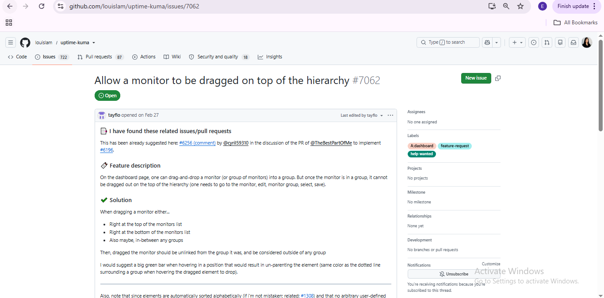
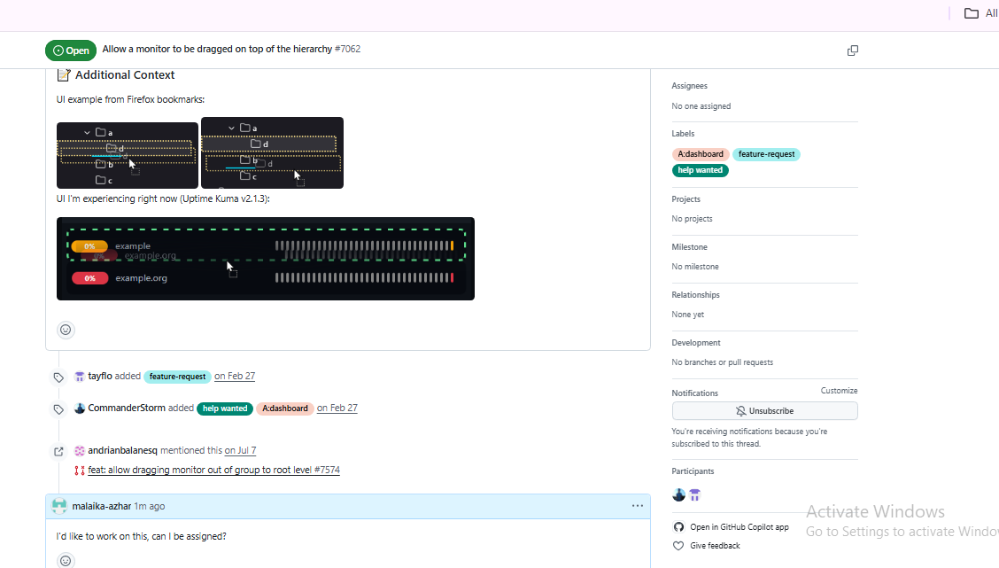
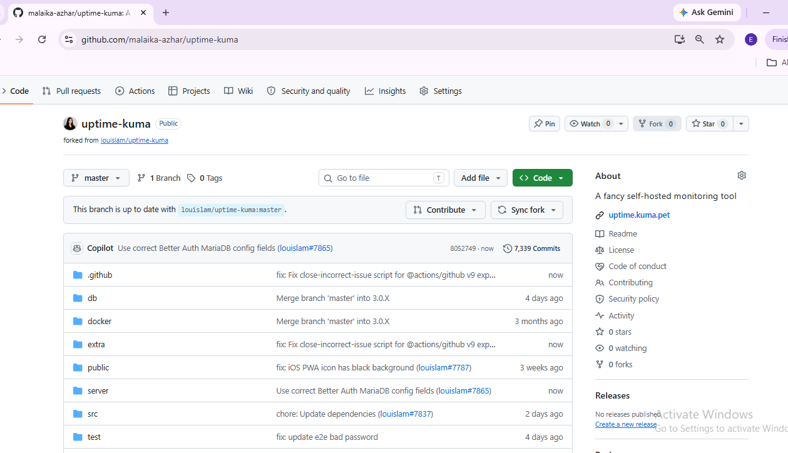
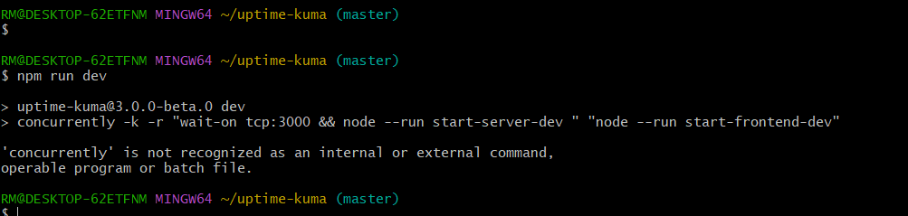
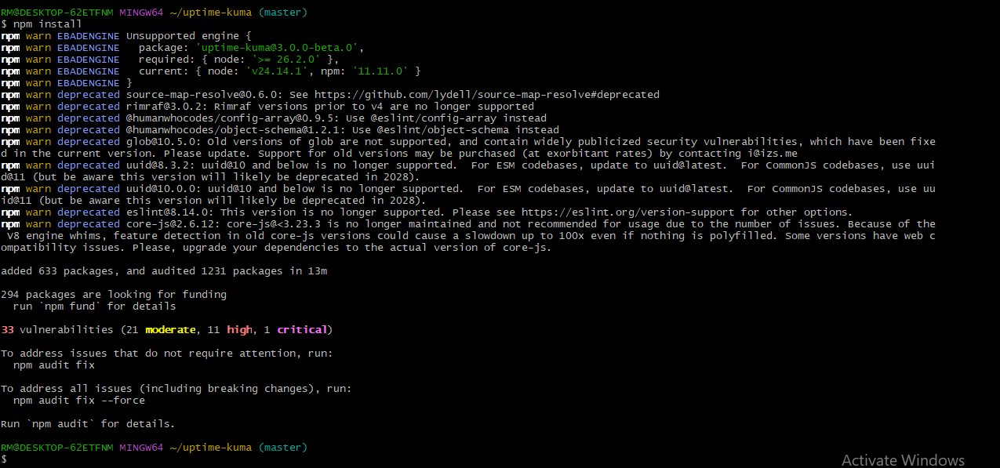
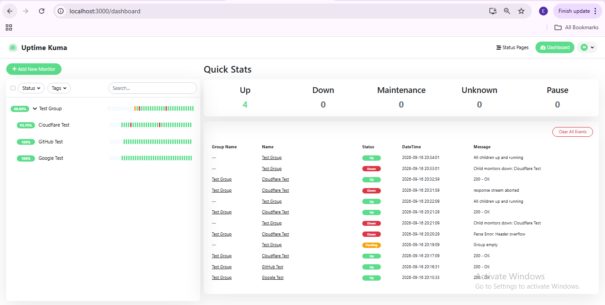
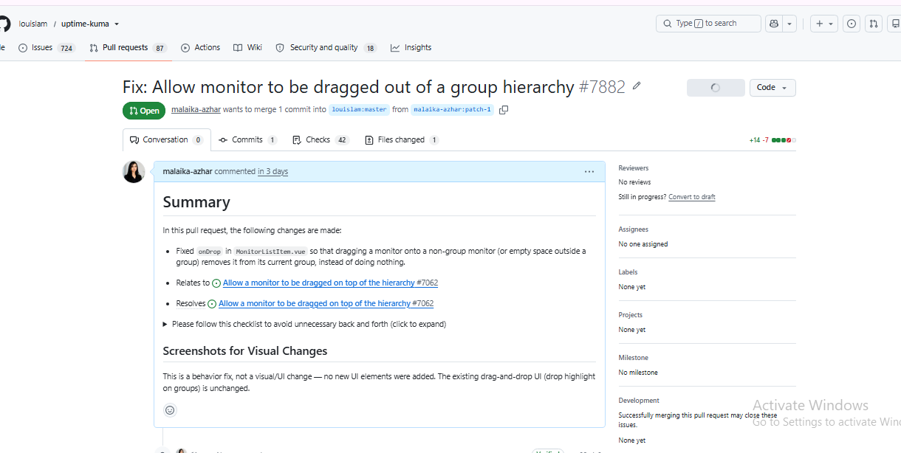

# 🔧 Project 04 — Index
### Open-Source Contribution — Uptime Kuma
**Project 04 of 4 — Tier-2 Support Portfolio**

**Quick guide to every step and screenshot in this project.**

### [📖 Open the full README](README.md) &nbsp;·&nbsp; [🔗 View PR #7882](https://github.com/louislam/uptime-kuma/pull/7882)

---

| 🐛 Issue | 🖼️ Screenshots | 📄 Files Changed | ➕/➖ Lines | 🔀 PR Status |
|:---:|:---:|:---:|:---:|:---:|
| **#7062** | **20** | **1** | **+14 / −7** | **Open, checks passed** |

🧩 <b>Lab:</b> Windows PC, Git Bash ➜ forked repo run locally with Vite + Node ➜ fix submitted as a pull request

---

## 📑 Step Index

All 16 working steps of the project, with the screenshot that shows each one.

| # | Step | Module | Result | Evidence |
|:---:|---|:---:|---|:---:|
| 1 | Open the issue | 🔵 Setup | Issue #7062 read and understood | [Exhibit 1](#ex1) |
| 2 | Ask to be assigned | 🔵 Setup | Comment posted on the issue | [Exhibit 2](#ex2) |
| 3 | Fork the repository | 🔵 Setup | Forked to `malaika-azhar/uptime-kuma` | [Exhibit 3](#ex3) |
| 4 | Clone locally | 🔵 Setup | `git clone` completed in Git Bash | [Exhibit 4](#ex4) |
| 5 | Read the contribution guide | 🔵 Setup | `CONTRIBUTING.md` reviewed | [Exhibit 5](#ex5) |
| 6 | First setup attempt | 🟢 Local Run | `npm run setup` failed; Node version checked | [Exhibit 6](#ex6) |
| 7 | Install without dev deps | 🟢 Local Run | `npm ci --omit dev`, 597 packages | [Exhibit 7](#ex7) |
| 8 | Dev server first attempt | 🟢 Local Run | Failed — `concurrently` missing | [Exhibit 8](#ex8) |
| 9 | Full reinstall | 🟢 Local Run | `npm install`, 633 packages | [Exhibit 9](#ex9) |
| 10 | Dev server succeeds | 🟢 Local Run | Vite on `:3000`, backend on `:3001` | [Exhibit 10](#ex10) |
| 11 | First-time setup done | 🟢 Local Run | Live dashboard reached | [Exhibit 11](#ex11) |
| 12 | Build test data | 🟠 Reproduce | 3 test monitors created | [Exhibit 12](#ex12) |
| 13 | Build a test group | 🟠 Reproduce | "Test Group" monitor created | [Exhibit 13](#ex13) |
| 14 | Confirm nesting | 🟠 Reproduce | Monitors nested inside the group | [Exhibit 14](#ex14) |
| 15 | Read `MonitorList.vue` | 🟣 Investigate | Top-level list rendering, no drag logic here | [Exhibit 16](#ex16) |
| 16 | Diff the fix | 🔴 Fix & Submit | `onDrop` change: 14 added, 7 removed | [Exhibit 17](#ex17) |

---

## 🔵 Setup — Issue, Fork, Clone

Exhibits 1 to 5.

<table>
<tr>
<td align="center" valign="top" width="50%">

 <b>Exhibit 1 — Issue #7062 opened</b>
 "Allow a monitor to be dragged on top of the hierarchy," labeled <code>help wanted</code>
</td>
<td align="center" valign="top" width="50%">

 <b>Exhibit 2 — Assignment requested</b>
 "I'd like to work on this, can I be assigned?"
</td>
</tr>
<tr>
<td align="center" valign="top" width="50%">

 <b>Exhibit 3 — Repository forked</b>
 <code>malaika-azhar/uptime-kuma</code>, up to date with upstream
</td>
<td align="center" valign="top" width="50%">

 <b>Exhibit 4 — <code>git clone</code></b>
 Cloned locally in Git Bash, 43,739 objects received
</td>
</tr>
<tr>
<td align="center" valign="top" width="50%">

 <b>Exhibit 5 — <code>CONTRIBUTING.md</code> read</b>
 Project info and directory structure reviewed first
</td>
<td></td>
</tr>
</table>

---

## 🟢 Local Run — Getting the App Working

Exhibits 6 to 11.

<table>
<tr>
<td align="center" valign="top" width="50%">

 <b>Exhibit 6 — Setup attempt fails</b>
 <code>npm run setup</code> hit a bad version pathspec; Node confirmed as <code>v24.14.1</code>
</td>
<td align="center" valign="top" width="50%">

 <b>Exhibit 7 — <code>npm ci --omit dev</code></b>
 597 packages added, EBADENGINE warnings noted
</td>
</tr>
<tr>
<td align="center" valign="top" width="50%">

 <b>Exhibit 8 — Dev server fails</b>
 <code>'concurrently' is not recognized</code> — dev deps were skipped
</td>
<td align="center" valign="top" width="50%">

 <b>Exhibit 9 — Full reinstall</b>
 <code>npm install</code> without <code>--omit dev</code>, 633 packages
</td>
</tr>
<tr>
<td align="center" valign="top" width="50%">

 <b>Exhibit 10 — Dev server succeeds</b>
 Vite on <code>localhost:3000</code>, backend listening on <code>:3001</code>
</td>
<td align="center" valign="top" width="50%">

 <b>Exhibit 11 — Dashboard live</b>
 First-time setup finished, empty dashboard reached
</td>
</tr>
</table>

---

## 🟠 Reproduce — Building the Bug Scenario

Exhibits 12 to 15.

<table>
<tr>
<td align="center" valign="top" width="50%">

 <b>Exhibit 12 — Test monitors created</b>
 Cloudflare, GitHub, and Google test monitors, all Up
</td>
<td align="center" valign="top" width="50%">

 <b>Exhibit 13 — Group monitor created</b>
 "Test Group" added as a Group-type monitor
</td>
</tr>
<tr>
<td align="center" valign="top" width="50%">

 <b>Exhibit 14 — Monitors nested</b>
 Confirmed via the "Monitor Group" field on the edit page
</td>
<td align="center" valign="top" width="50%">

 <b>Exhibit 15 — Event history</b>
 Live dashboard events while the group was being tested
</td>
</tr>
</table>

---

## 🟣 Investigate & 🔴 Fix — Code, Diff, Submission

Exhibits 16 to 20.

<table>
<tr>
<td align="center" valign="top" width="50%">

 <b>Exhibit 16 — <code>MonitorList.vue</code> read</b>
 Renders the top-level list; the drag handler lives elsewhere
</td>
<td align="center" valign="top" width="50%">

 <b>Exhibit 17 — The fix, as a diff</b>
 14 lines added, 7 removed, confined to <code>onDrop</code>
</td>
</tr>
<tr>
<td align="center" valign="top" width="50%">

 <b>Exhibit 18 — PR #7882 opened</b>
 Correct template followed; status Open
</td>
<td align="center" valign="top" width="50%">

 <b>Exhibit 19 — Checks passed</b>
 18 successful checks; maintainer edited the PR title
</td>
</tr>
<tr>
<td align="center" valign="top" width="50%">

 <b>Exhibit 20 — Current status</b>
 Open, mergeable, no conflicts, awaiting formal review
</td>
<td></td>
</tr>
</table>

---

## 🎯 Verification Checklist

| Check | Method | Status |
|:---:|---|:---:|
| Bug understood from the issue report | Read issue #7062 directly | ✅ Confirmed |
| Local environment fully working | `npm install` + `npm run dev`, dashboard reached | ✅ Confirmed |
| Faulty code located | Read `MonitorListItem.vue`, found `onDrop` | ✅ Confirmed |
| Fix scoped to one method, one file | Diff shows +14/−7 in a single file | ✅ Confirmed |
| Fix explainable line by line | Documented in README's "The Fix, Plainly" | ✅ Confirmed |
| PR follows repository's own template | Rewritten after two auto-closes, now matches | ✅ Confirmed |
| AI assistance disclosed | Explicit "AI Disclosure" section in the PR | ✅ Confirmed |
| Automated checks pass | 18 successful, 1 neutral, 0 failed | ✅ Confirmed |
| No merge conflicts | GitHub reports "can be cleanly merged" | ✅ Confirmed |
| Maintainer review / merge | Not yet completed | ⏳ Pending |

> [!NOTE]
> This project tracks a real, currently open pull request. Everything through submission and CI checks is complete and verified. The final outcome — review comments, requested changes, or merge — was still pending at the time this project was documented.

---

[⬆️ Back to top](#top) &nbsp;·&nbsp; [📖 Full README](README.md) &nbsp;·&nbsp; [🔗 View PR #7882](https://github.com/louislam/uptime-kuma/pull/7882)

🔧 **[Uptime Kuma](https://github.com/louislam/uptime-kuma)** · 🐛 **[Issue #7062](https://github.com/louislam/uptime-kuma/issues/7062)** · 🧭 **[Contribution Pipeline](README.md#contribution-pipeline)**

