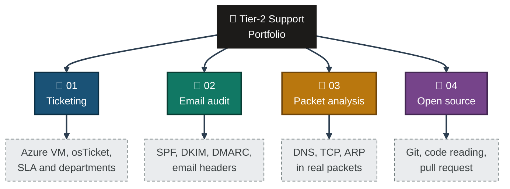
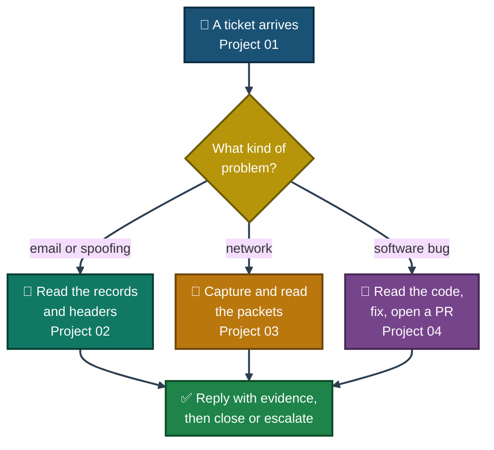

<div align="center">

# 🧰 Real-World Tier-2 Support Projects

**Tier-2 IT Support and Networking Portfolio — 4 Projects**

A helpdesk built on Azure, a live email-security audit, packet-capture case studies, and an open-source bug fix.


Four end-to-end projects built with free tools and Azure for Students credit. Every result has a screenshot, and every limit of every project is written down.

</div>

---

## 📑 Table of Contents

1. [At a Glance](#at-a-glance)
2. [About This Portfolio](#about)
3. [The Four Projects](#the-four-projects)
4. [Portfolio Map](#portfolio-map)
5. [Project 01 — Ticketing System on Azure](#project-01)
6. [Project 02 — Email Authentication Audit](#project-02)
7. [Project 03 — Wireshark Case Studies](#project-03)
8. [Project 04 — Uptime Kuma Contribution](#project-04)
9. [A Tier-2 Ticket's Path](#ticket-path)
10. [Skills Across the Projects](#skills)
11. [How to Read the Projects](#how-to-read)
12. [Limits Across the Portfolio](#limits)
13. [Repo Structure](#repo-structure)
14. [License](#license)

---

<a id="at-a-glance"></a>
## 📊 At a Glance

| 📁 Projects | 🖼️ Screenshots | 🌐 Domains Audited | 📦 Packets Captured | 🐛 Pull Request | 💰 Cost |
|:---:|:---:|:---:|:---:|:---:|:---:|
| **4** | **103** | **10** | **860,523** | **#7882 (open)** | **Free tools + Azure student credit** |

---

<a id="about"></a>
## 📖 About This Portfolio

Tier-2 support starts where the first answer stops working. It means reading logs, packets, DNS records and code, and explaining what was found. These four projects practise that from four sides:

- **Project 01:** Run the system that tickets live in, from an empty server.
- **Project 02:** Check how real organizations protect their email, and read the results inside real mail.
- **Project 03:** Prove network problems with real packets instead of guesses.
- **Project 04:** Follow a bug from a public issue to a pull request in someone else's code.

> [!NOTE]
> Each project keeps the same rules. A result is only written as done if a screenshot shows it. Anything taken from my own notes, with no screenshot behind it, is marked 📝, and the limits of each project are listed at the end of its README.

---

<a id="the-four-projects"></a>
## 🗂️ The Four Projects

| # | Project | Main Tools | Result | Cost | Open |
|:---:|---|---|---|:---:|:---:|
| 01 | 🎫 **Ticketing System on Azure** | Azure VM, Ubuntu, Apache, MySQL, PHP, osTicket | 5 tickets run end to end, 4 closed and 1 left open | Azure student credit | [README](Project-1-Osticket-Helpdesk-Deployment/README.md) · [Index](Project-1-Osticket-Helpdesk-Deployment/Osticket-INDEX.md) |
| 02 | 📧 **Email Authentication Audit** | MxToolbox, Gmail Show Original | SPF and DMARC of 10 domains scored, plus 4 real email headers | $0 | [README](Project-2-Live-Email-Security-Audit/README.md) · [Index](Project-2-Live-Email-Security-Audit/Email-Audit-INDEX.md) |
| 03 | 🦈 **Wireshark Case Studies** | Wireshark 4.6.8 on Windows | DNS NXDOMAIN, TCP retransmission and ARP checks proven in packets | $0 | [README](Project-3-Wireshark-Packet-Capture-Case-Studies/README.md) · [Index](Project-3-Wireshark-Packet-Capture-Case-Studies/Wireshark-INDEX.md) |
| 04 | 🔧 **Uptime Kuma Contribution** | Git, GitHub, Node.js, Vue 3 | Bug fixed in 1 file, pull request open with all checks passed | $0 | [README](Project-4-Uptime-Kuma-Open-Source-Contribution/README.md) · [Index](Project-4-Uptime-Kuma-Open-Source-Contribution/INDEX.md) |

---

<a id="portfolio-map"></a>
## 🗺️ Portfolio Map



---

<a id="project-01"></a>
## 🎫 Project 01 — Ticketing System on Azure

**[Open the README](Project-1-Osticket-Helpdesk-Deployment/README.md)**

A real IT helpdesk on a live Azure VM: Ubuntu, Apache, MySQL and PHP installed by hand, osTicket v1.18.1 set up through its web installer, SLA plans and departments configured, and five support tickets run from the customer portal to the agent panel.

| | |
|---|---|
| **Built with** | Azure VM (Ubuntu 24.04), Apache, MySQL, PHP, osTicket v1.18.1 |
| **Result** | 5 tickets created, 4 closed in 9 to 15 minutes, 1 replied to and left open |
| **Setup** | 3 SLA plans and 6 departments, 4 help topics |
| **Evidence** | 33 screenshots |
| **Honest note** | The SLA plans and the new departments were created but no ticket used them, because nothing was linked to them |

---

<a id="project-02"></a>
## 📧 Project 02 — Email Authentication Audit

**[Open the README](Project-2-Live-Email-Security-Audit/README.md)**

A passive, read-only audit of the SPF and DMARC records of 10 real domains (global companies, Pakistani banks, telecoms, government, education and small businesses), plus a look at SPF, DKIM and DMARC results inside 4 real emails from my own inbox.

| | |
|---|---|
| **Built with** | MxToolbox SuperTool, Gmail Show Original |
| **Result** | 20 records read (10 SPF and 10 DMARC), 4 headers analyzed, every domain scored on the same rules |
| **Main finding** | Banks and global companies use `p=reject`. Telecom and education stop at `p=quarantine`. Both small businesses publish a bare `p=none` with no reports |
| **Evidence** | 24 screenshots |
| **Honest note** | The 4 email senders were not among the 10 domains, so the headers do not test the DNS results. DKIM was not checked per domain |

---

<a id="project-03"></a>
## 🦈 Project 03 — Wireshark Case Studies

**[Open the README](Project-3-Wireshark-Packet-Capture-Case-Studies/README.md)**

Three common network failures reproduced on one Windows PC and proven with real packets: a DNS lookup that fails, TCP data that is sent again, and Windows checking that an IP address is free.

| | |
|---|---|
| **Built with** | Wireshark 4.6.8 on Windows |
| **Result** | DNS reply code NXDOMAIN (`0x8183`), a Fast Retransmission on a 1 GB download, and an ARP Probe and Announcement |
| **Scale** | 860,523 packets captured, 6 display filters used |
| **Evidence** | 26 screenshots |
| **Honest note** | Case 3 did not produce a real IP conflict, because only one device was used |

---

<a id="project-04"></a>
## 🔧 Project 04 — Uptime Kuma Contribution

**[Open the README](Project-4-Uptime-Kuma-Open-Source-Contribution/README.md)** · **[View the Pull Request](https://github.com/louislam/uptime-kuma/pull/7882)**

A real bug on `louislam/uptime-kuma` taken from issue [#7062](https://github.com/louislam/uptime-kuma/issues/7062) to a pull request: forked, run locally, traced to one method, fixed, and submitted under the project's own rules.

| | |
|---|---|
| **Built with** | Git, GitHub, Node.js, Vue 3, Vite |
| **Result** | 1 file changed (+14, −7). PR #7882 is open with 18 checks passed and 1 neutral |
| **Evidence** | 20 screenshots |
| **Honest note** | Not merged and not formally reviewed. The failing drag was never captured on screen, so the cause comes from reading the code |

---

<a id="ticket-path"></a>
## 🧭 A Tier-2 Ticket's Path

How the four projects map to the work of a Tier-2 support engineer:


<p align="center"><em>An illustration of how the projects fit together. It is not a screenshot, and the projects were not run as one connected case.</em></p>

---

<a id="skills"></a>
## 🛠️ Skills Across the Projects

| Skill | 01 | 02 | 03 | 04 |
|---|:---:|:---:|:---:|:---:|
| Azure VM and Linux server setup | ✅ | | | |
| Ticketing, SLA plans and departments | ✅ | | | |
| SPF, DKIM and DMARC records | | ✅ | | |
| Reading email headers | | ✅ | | |
| Packet capture and display filters | | | ✅ | |
| DNS, TCP and ARP behavior | | ✅ | ✅ | |
| Git, GitHub and code reading | | | | ✅ |
| Local dev setup and error fixing | ✅ | | | ✅ |
| Proving each result with a screenshot | ✅ | ✅ | ✅ | ✅ |
| Marking what was not proven | ✅ | ✅ | ✅ | ✅ |

---

<a id="how-to-read"></a>
## 🔎 How to Read the Projects

| Mark | Meaning |
|:---:|---|
| ✅ | The step or result is shown in a screenshot |
| 📝 | Taken from my own notes, with no screenshot behind it |
| 🎯 | A finding or result drawn from the evidence |
| 🔍 | An Analyst Note: how it would be handled in production |
| **Exhibit N** | The Nth numbered screenshot, kept in the project's `Screenshots` folder |

- **Two files per project.** The `README.md` has the full write-up. The `INDEX` file is a visual index of the same evidence.
- **Diagrams are illustrative.** They show the logic or the path. The screenshots and the projects themselves are the evidence.
- **Green and dashed boxes.** In the diagrams, green shows what the evidence showed. Dashed boxes are other outcomes that did not happen in that project.

---

<a id="limits"></a>
## 🚧 Limits Across the Portfolio

- **Lab and public data only.** No project touched a real customer, a live company network or a private system. Project 02 is passive and read-only.
- **Simulated roles.** In Project 01 the customer and the agent are both me, so nothing was confirmed by a real customer.
- **One case is not a rule.** Small samples (2 small businesses, 4 emails, 5 tickets, 1 pull request) show a pattern, not a proof.
- **Some things are still open.** The Uptime Kuma pull request is not merged, Case 3 in Project 03 saw no real conflict, and DKIM was not checked per domain in Project 02.
- **Cost.** Project 01 ran on an Azure for Students credit. The other three used free tools only.

Each project lists its own limits in detail, so the results show what was actually proven.

---

<a id="repo-structure"></a>
## 📁 Repo Structure

```text
Real-World-Tier2-Support-Projects/
|-- README.md
|-- LICENSE
|-- Project-1-Osticket-Helpdesk-Deployment/
|   |-- README.md
|   |-- Osticket-INDEX.md
|   `-- Screenshots/
|-- Project-2-Live-Email-Security-Audit/
|   |-- README.md
|   |-- Email-Audit-INDEX.md
|   `-- Screenshots/
|-- Project-3-Wireshark-Packet-Capture-Case-Studies/
|   |-- README.md
|   |-- Wireshark-INDEX.md
|   `-- Screenshots/
`-- Project-4-Uptime-Kuma-Open-Source-Contribution/
    |-- README.md
    |-- INDEX.md
    `-- Screenshots/
```

---

<a id="license"></a>
## 📄 License

Released under the [MIT License](LICENSE).

<div align="center">

🎫 **[Project 01](Project-1-Osticket-Helpdesk-Deployment/README.md)** · 📧 **[Project 02](Project-2-Live-Email-Security-Audit/README.md)** · 🦈 **[Project 03](Project-3-Wireshark-Packet-Capture-Case-Studies/README.md)** · 🔧 **[Project 04](Project-4-Uptime-Kuma-Open-Source-Contribution/README.md)** · 🧭 **[Ticket Path](#ticket-path)**

</div>
