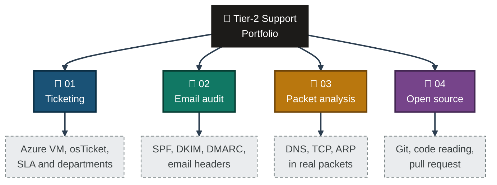
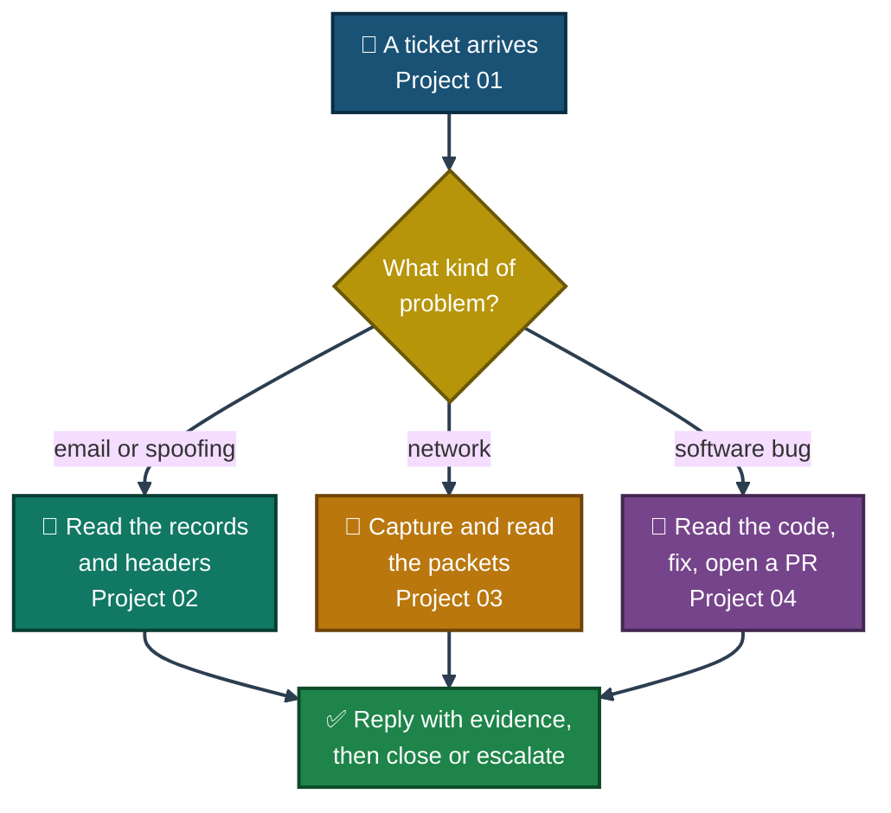

<div align="center">

# 🛠️ Real-World Tier-2 Support Projects

**Tier-2 IT Support and Networking Portfolio — 4 Projects**

A helpdesk built on Azure, a live email-security audit, packet-capture case studies, and an open-source bug fix.


Four end-to-end projects, one thread: stand up a support system, then use it, defend it, diagnose it and contribute to one in the wild — from a helpdesk built on an empty Azure VM to an open pull request on a real open-source tool. Every result is backed by a screenshot, and every limit of the work is written down.

### [📂 Jump to the projects](#projects-index)

</div>

---

## 📑 Table of Contents

1. [At a Glance](#at-a-glance)
2. [About This Repo](#about)
3. [Portfolio Map](#portfolio-map)
4. [Environment & Tools](#environment)
5. [Project 01 — Real Ticketing System Deployment](#project-01)
6. [Project 02 — Live Email Authentication Audit](#project-02)
7. [Project 03 — Wireshark Packet Capture Case Studies](#project-03)
8. [Project 04 — Open-Source Contribution (Uptime Kuma)](#project-04)
9. [A Tier-2 Ticket's Path](#ticket-path)
10. [Coverage Snapshot](#coverage-snapshot)
11. [Skills Across the Projects](#skills)
12. [Verification, Not Assumption](#verification)
13. [Scope & Limitations](#scope-limitations)
14. [What I Learned](#what-i-learned)
15. [Projects Index](#projects-index)
16. [Repo Structure](#repo-structure)

---

<a id="at-a-glance"></a>
## 📊 At a Glance

| 🧩 Projects | 🖼️ Screenshots | 🎫 Tickets Run | 🌐 Domains Audited | 📦 Packets Captured | 🐛 Pull Request | 💰 Cost |
|:---:|:---:|:---:|:---:|:---:|:---:|:---:|
| **4** | **103** | **5** | **10** | **860,523** | **#7882 (open)** | **Free tools + Azure student credit** |

---

<a id="about"></a>
## 📖 About This Repo

Tier-2 support starts where the first answer stops working. It means reading logs, packets, DNS records and code, and explaining what was found. These four projects practise that from four sides:

- **Project 01 — Real Ticketing System Deployment:** Build an IT helpdesk from an empty Azure VM, then run it — five tickets from customer submission to agent reply and closure.
- **Project 02 — Live Email Authentication Audit:** Passively audit SPF and DMARC on 10 real domains, then check SPF/DKIM/DMARC results inside real inbox mail.
- **Project 03 — Wireshark Packet Capture Case Studies:** Capture three real network problems live and read them packet by packet — a DNS failure, TCP retransmissions, and an ARP duplicate-IP check.
- **Project 04 — Open-Source Contribution (Uptime Kuma):** Take a real GitHub issue on a popular self-hosted tool from report to traced bug to submitted pull request.

> [!NOTE]
> Each project keeps the same rule: a result is only written as done if a screenshot shows it. Anything taken from notes, with no screenshot behind it, is marked 📝, and every project's limits are listed at the end of its own README.

---

<a id="portfolio-map"></a>
## 🗺️ Portfolio Map



---

<a id="environment"></a>
## 🖧 Environment & Tools

| Area | Tools Used |
|---|---|
| **Cloud & Helpdesk** | Azure (Ubuntu 24.04 VM), Apache, MySQL, PHP, osTicket v1.18.1 |
| **Email Authentication** | MxToolbox SuperTool (SPF/TXT lookup), Gmail "Show Original" |
| **Network Analysis** | Wireshark 4.6.8, Windows |
| **Open-Source Workflow** | Git, Git Bash (MINGW64), Vue 3, Vite, Node.js v24.14.1, Socket.IO, GitHub |

---

<a id="project-01"></a>
## 🎫 Project 01 — Real Ticketing System Deployment

**Goal:** Stand up a real helpdesk on a live Azure VM, then run it the way a support team would.

| Item | Value |
|---|---|
| Environment | Azure VM, Ubuntu 24.04, Apache, MySQL, PHP, osTicket v1.18.1 |
| Work performed | LAMP stack install → osTicket web installer → SLA plans & departments → 5 ticket simulations |
| Result | 5 tickets created, 4 closed in 9 to 15 minutes, 1 replied to and left open pending the customer |
| Honest note | SLA plans and the new departments were created but not applied — every shown ticket used the Default SLA |
| Report | [📄 README](./Project-1-Real-Ticketing-System-Deployment/README.md) · [🗂️ Visual Index](./Project-1-Real-Ticketing-System-Deployment/Osticket-INDEX.md) |

---

<a id="project-02"></a>
## 📧 Project 02 — Live Email Authentication Audit

**Goal:** Passively audit how real organizations protect their domains from email spoofing, then check the same protections inside a real inbox.

| Item | Value |
|---|---|
| Environment | MxToolbox SuperTool, Gmail "Show Original" |
| Work performed | SPF + DMARC lookups on 10 domains across fintech, banking, government, telecom, education and small business, plus SPF/DKIM/DMARC results from 4 real inbox emails |
| Result | 20 DNS records checked, 4 headers analyzed, every domain scored on the same rules (`-all`/`~all`, `p=none`/`p=quarantine`/`p=reject`) |
| Honest note | The 4 email senders were not among the 10 audited domains, so the headers don't test the DNS findings; DKIM wasn't checked per domain |
| Report | [📄 README](./Project-2-Live-Email-Security-Audit/README.md) · [🗂️ Visual Index](./Project-2-Live-Email-Security-Audit/Email-Audit-INDEX.md) |

---

<a id="project-03"></a>
## 🦈 Project 03 — Wireshark Packet Capture Case Studies

**Goal:** Capture real network problems live and diagnose them by reading the packets themselves, not a symptom description.

| Item | Value |
|---|---|
| Environment | Wireshark 4.6.8, Windows, Wi-Fi interface |
| Work performed | Live capture and packet-level read of a DNS lookup failure, TCP retransmissions during a large download, and Windows' ARP duplicate-IP check |
| Result | 3 case studies, 860,523 packets captured, 6 display filters used |
| Honest note | Case 3 (ARP) did not produce a real IP conflict, because only one device was used |
| Report | [📄 README](./Project-3-Wireshark-Packet-Capture-Case-Studies/README.md) · [🗂️ Visual Index](./Project-3-Wireshark-Packet-Capture-Case-Studies/Wireshark-INDEX.md) |

---

<a id="project-04"></a>
## 🔧 Project 04 — Open-Source Contribution (Uptime Kuma)

**Goal:** Take a real bug on a popular self-hosted monitoring tool from GitHub issue to a submitted, rule-following pull request.

| Item | Value |
|---|---|
| Environment | `louislam/uptime-kuma` fork, Vue 3, Vite, Node.js v24.14.1, Git Bash |
| Work performed | Forked and ran the project locally, traced Issue #7062 to one method, fixed it, opened PR #7882 under the project's `CONTRIBUTING.md` rules |
| Result | 1 file changed, 14 lines added, 7 removed; PR open with checks passed, awaiting review |
| Honest note | Not merged and not formally reviewed. The failing behavior was never captured live on screen, so the cause comes from reading the code |
| Report | [📄 README](./Project-4-Uptime-Kuma-Open-Source-Contribution/README.md) · [🗂️ Visual Index](./Project-4-Uptime-Kuma-Open-Source-Contribution/INDEX.md) · [🔗 PR #7882](https://github.com/louislam/uptime-kuma/pull/7882) |

---

<a id="ticket-path"></a>
## 🧭 A Tier-2 Ticket's Path

How the four projects map to the work of a Tier-2 support engineer:


<p align="center"><em>An illustration of how the projects fit together. It is not a screenshot, and the projects were not run as one connected case.</em></p>

---

<a id="coverage-snapshot"></a>
## 🌟 Coverage Snapshot

| 🛡️ Domain | 📌 Where It Appears | ✅ What Was Demonstrated |
|---|---|---|
| Cloud Deployment & Helpdesk Admin | Project 01 | Azure VM provisioning, LAMP stack, osTicket install and configuration |
| Ticket Lifecycle Management | Project 01 | SLA plans, departments, help-topic routing, customer-to-agent workflow |
| Email Authentication (SPF/DKIM/DMARC) | Project 02 | DNS record auditing, policy-strength comparison, real inbox header inspection |
| Packet-Level Network Troubleshooting | Project 03 | DNS failure, TCP retransmission, ARP conflict — read directly from captures |
| Open-Source Contribution Workflow | Project 04 | Forking, local dev environment setup, bug tracing, PR submission under project rules |

---

<a id="skills"></a>
## 🛠️ Skills Across the Projects

| Skill | 01 | 02 | 03 | 04 |
|---|:---:|:---:|:---:|:---:|
| Azure VM and Linux server setup | ✅ | | | |
| Ticketing, SLA plans and departments | ✅ | | | |
| SPF, DKIM and DMARC records | | ✅ | | |
| Reading email headers | | ✅ | | |
| Packet capture and display filters | | | ✅ | |
| DNS, TCP and ARP behavior | | ✅ | ✅ | |
| Git, GitHub and code reading | | | | ✅ |
| Local dev setup and error fixing | ✅ | | | ✅ |
| Proving each result with a screenshot | ✅ | ✅ | ✅ | ✅ |
| Marking what was not proven | ✅ | ✅ | ✅ | ✅ |

---

<a id="verification"></a>
## ✅ Verification, Not Assumption

A rule that holds across all four projects: a claim is not made until it is backed by direct evidence.

| Check | Method | Outcome |
|---|---|---|
| Ticket actually reached the agent panel | Screenshot of the ticket in the staff panel, not just the submission form | ✅ Confirmed (Project 01) |
| A domain's SPF/DMARC claim is real | Direct MxToolbox lookup against the domain's own DNS, not a third-party summary | ✅ Confirmed (Project 02) |
| A network fault was reproduced, not assumed | Captured live in Wireshark and read frame by frame | ✅ Confirmed (Project 03) |
| The bug fix actually works | Run locally against the reproduced issue before opening the PR | ✅ Confirmed (Project 04) |

---

<a id="scope-limitations"></a>
## 🚧 Scope & Limitations

- **Lab and public data only.** No project touched a real customer, a live company network or a private system. Project 02 is passive and read-only.
- **Project 01:** Simulation only — the customer and the agent are both me. One ticket (#894015, forgot password) was replied to but left open, matching real practice: a reply is not a fix until the customer confirms it.
- **Project 02:** Small sample (2 small businesses, 4 emails) shows a pattern, not a proof; DKIM wasn't checked per domain.
- **Project 03:** Root causes are diagnosed from traffic captured on one Windows PC; no external network infrastructure was tested end to end, and Case 3 saw no real ARP conflict.
- **Project 04:** PR #7882 was open and awaiting maintainer review at the time of writing — the fix is verified locally but not yet confirmed merged upstream.

These gaps are marked here instead of hidden, so the projects reflect exactly what was done and what remains open.

---

<a id="what-i-learned"></a>
## 🧠 What I Learned

- **Where a command runs matters.** The same command can succeed over SSH and fail on a local machine — check the prompt before typing.
- **A control that exists is not the same as a control that's enforced.** SLA plans and departments existed but weren't wired into the ticket flow — configuration isn't delivery.
- **DNS policy has degrees, not a pass/fail.** `-all` and `~all`, or `p=reject` and `p=none`, protect very differently even though both "have SPF" or "have DMARC".
- **A packet capture answers questions a symptom description can't.** "The internet is slow" and "1,400 retransmissions on this stream" are very different starting points.
- **Open-source rules are the actual spec.** Reading `CONTRIBUTING.md` before writing code avoided wasted work on a PR that wouldn't have been accepted as-is.
- **Do not close what you cannot confirm.** A reply is not a resolution, and a submitted PR is not a merged fix — both are recorded as still open.

---

<a id="projects-index"></a>
## 📂 Projects Index

| # | Project | Stack | Status |
|:---:|---|---|:---:|
| 1 | [🎫 Real Ticketing System Deployment](./Project-1-Real-Ticketing-System-Deployment/README.md) | Azure · Ubuntu · Apache · MySQL · PHP · osTicket | ✅ Complete |
| 2 | [📧 Live Email Authentication Audit](./Project-2-Live-Email-Security-Audit/README.md) | SPF · DKIM · DMARC · DNS · MxToolbox · Gmail | ✅ Complete |
| 3 | [🦈 Wireshark Packet Capture Case Studies](./Project-3-Wireshark-Packet-Capture-Case-Studies/README.md) | Wireshark · DNS · TCP · ARP | ✅ Complete |
| 4 | [🔧 Open-Source Contribution — Uptime Kuma](./Project-4-Uptime-Kuma-Open-Source-Contribution/README.md) | Vue.js · Node.js · Vite · GitHub | 🟡 PR Open |

> [!NOTE]
> Folder names above follow the Project-4 naming pattern confirmed in the repo (`Project-4-Uptime-Kuma-Open-Source-Contribution`). Confirm Projects 1–3's exact folder names match before committing.

---

<a id="repo-structure"></a>
## 📁 Repo Structure

```text
Real-World-Tier2-Support-Projects/
|-- README.md                                        <- you are here
|-- Project-1-Real-Ticketing-System-Deployment/
|   |-- README.md
|   |-- Osticket-INDEX.md
|   `-- Screenshots/
|-- Project-2-Live-Email-Security-Audit/
|   |-- README.md
|   |-- Email-Audit-INDEX.md
|   `-- Screenshots/
|-- Project-3-Wireshark-Packet-Capture-Case-Studies/
|   |-- README.md
|   |-- Wireshark-INDEX.md
|   `-- Screenshots/
`-- Project-4-Uptime-Kuma-Open-Source-Contribution/
    |-- README.md
    |-- INDEX.md
    `-- Screenshots/
```

<div align="center">

🎫 **[osTicket](https://osticket.com)** · 🌐 **[MxToolbox](https://mxtoolbox.com)** · 🦈 **[Wireshark](https://www.wireshark.org)** · 🔧 **[Uptime Kuma](https://github.com/louislam/uptime-kuma)** · 🧭 **[Ticket Path](#ticket-path)**

</div>
