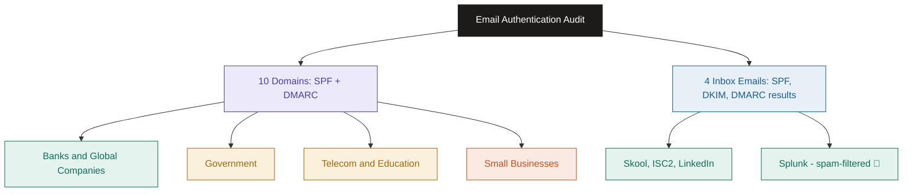
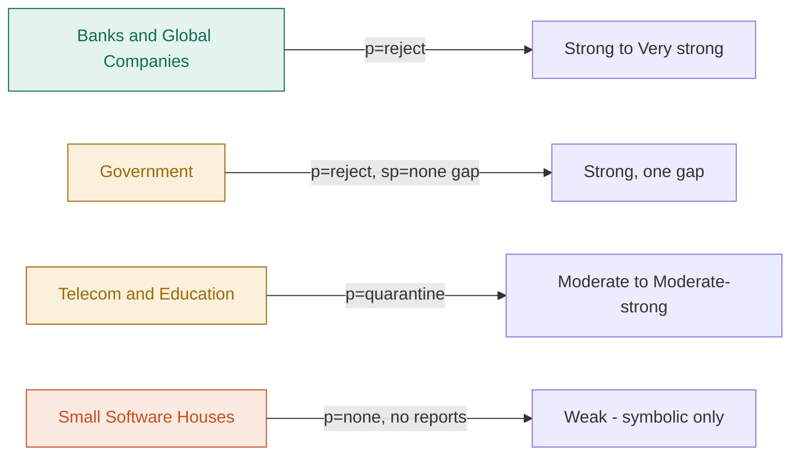
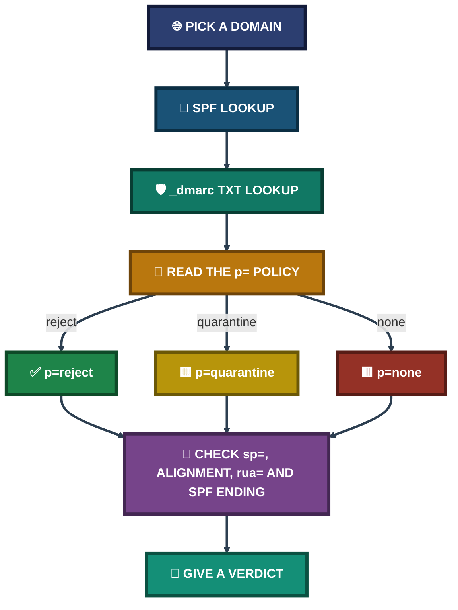

<div align="center">

# 📧 Live Email Authentication Audit

**Project 02 of 4 — Tier-2 Support Portfolio**

Email Security Audit (SPF · DKIM · DMARC)


A passive, read-only audit of the SPF and DMARC records of 10 real domains — global companies, Pakistani banks, telecoms, government, education and small businesses — plus a look at the SPF, DKIM and DMARC results inside 4 real emails from my own Gmail inbox. Every finding comes with a screenshot, and every limit of the audit is written down.

</div>

---

## 📑 Table of Contents

1. [At a Glance](#at-a-glance)
2. [Project Background](#project-background)
3. [Environment](#environment)
4. [Project Flow](#project-flow)
5. [Module 1 — DNS Record Audit](#module-1)
6. [Coverage Snapshot](#coverage-snapshot)
7. [Audit Pipeline](#audit-pipeline)
8. [Module 2 — Header Analysis](#module-2)
9. [Project Summary](#project-summary)
10. [Challenges & Fixes](#challenges-fixes)
11. [Scope & Limitations](#scope-limitations)
12. [What I Learned](#what-i-learned)
13. [Skills Demonstrated](#skills-demonstrated)
14. [Screenshot Index](#screenshot-index)
15. [Repo Structure](#repo-structure)

---

<a id="at-a-glance"></a>
## 📊 At a Glance

| 🌐 Domains Audited | 📩 Headers Analyzed | 🎯 Records Checked | 🖼️ Screenshots | 💰 Cost |
|:---:|:---:|:---:|:---:|:---:|
| **10** | **4** | **20** (10 SPF + 10 DMARC) | **24** | **$0** |

---

<a id="project-background"></a>
## 📖 Project Background

Email spoofing works when a domain does not tell the world which servers may send mail for it, or does not say what to do with mail that fails. Three DNS records control this: **SPF** (which servers may send), **DKIM** (a signature on each message) and **DMARC** (what to do when SPF and DKIM fail). This project checks how real organizations set them up, and what the results look like inside real mail.

- **Module 1 — DNS Record Audit:** Read the SPF and DMARC records of 10 domains, score them and compare them.
- **Module 2 — Header Analysis:** Open 4 real emails with Gmail's **Show Original** and read the SPF, DKIM and DMARC results.

> [!NOTE]
> The 4 emails in Module 2 come from senders that are **not** among the 10 audited domains, so Module 2 is a separate look at real mail. It does not check the DNS results from Module 1. Items taken from my own notes, with no screenshot behind them, are marked 📝.

### 🌳 Audit Structure



<div align="center">

### 🧩 Audit Setup at a Glance

<table>
<tr>
<td align="center" valign="top" width="42%">


**10 Domains**<br>
<sub>SPF at <code>domain</code><br>DMARC at <code>_dmarc.domain</code></sub>

</td>
<td align="center" valign="middle" width="16%">

**➜**<br>
<sub>MxToolbox</sub>

</td>
<td align="center" valign="top" width="42%">


**4 Real Emails**<br>
<sub>Show Original<br>SPF · DKIM · DMARC results</sub>

</td>
</tr>
<tr>
<td colspan="3" align="center">

<sub>Read-only. No email was sent, and no system was probed.</sub>

</td>
</tr>
</table>

</div>

---

<a id="environment"></a>
## 🖧 Environment

| Item | Value |
|---|---|
| **DNS Tool** | MxToolbox SuperTool (SPF Record Lookup and TXT Lookup) |
| **Mailbox** | Gmail — Show Original |
| **Method** | Passive DNS lookups and inbox header inspection |
| **SPF Lookup** | `<domain>` with SPF Record Lookup |
| **DMARC Lookup** | `_dmarc.<domain>` with TXT Lookup |
| **Audit Date** | Sep 17, 2026 |
| **Lookup Window** | 13:17 to 13:54 (UTC-5, the time MxToolbox reports) |
| **Scope** | Public DNS records and my own mailbox only |

---

<a id="project-flow"></a>
## ⏱️ Project Flow

```mermaid
%%{init: { 'theme': 'base', 'themeVariables': {
  'doneTaskBkgColor':'#117864', 'doneTaskBorderColor':'#083D33',
  'sectionBkgColor':'#D6DBDF', 'altSectionBkgColor':'#EAECEE',
  'taskTextColor':'#FFFFFF', 'taskTextOutsideColor':'#1B2631',
  'taskTextLightColor':'#FFFFFF',
  'titleColor':'#1B2A4A', 'fontSize':'16px'
}}}%%
gantt
    title Project Flow — DNS Lookups on Sep 17, 2026 (UTC-5)
    dateFormat HH:mm
    axisFormat %H:%M
    section DNS Lookups
    10 domains - SPF and DMARC lookups   :done, 13:17, 37m
```


<p align="center"><em>The bar runs from the first to the last DMARC lookup stamp shown by MxToolbox. The screenshots do not show when the header analysis was done, so it is not on the chart.</em></p>

---

<a id="module-1"></a>
## 🔵 Module 1 — DNS Record Audit

**Objective:** Read the SPF and DMARC records of 10 different organizations, score each one on the same rules, and see which kinds of organizations protect their domain well.

### Step 1 — Pick a mixed domain sample ✅

Ten domains across seven categories, so the results can be compared:

| Category | Domains |
|---|---|
| Global fintech | `paypal.com` |
| Global tech | `microsoft.com` |
| Pakistani banks | `hbl.com`, `meezanbank.com` |
| Pakistani government | `nadra.gov.pk` |
| Pakistani telecom | `jazz.com.pk`, `telenor.com.pk` |
| Pakistani education | `vu.edu.pk` |
| Small Lahore software houses | `rextech.pk`, `petsaaltech.com` |

### Step 2 — Pull the SPF record ✅

```
<domain>               → SPF Record Lookup
```

### Step 3 — Pull the DMARC record ✅

```
_dmarc.<domain>        → TXT Lookup
```

### Step 4 — Score and compare ✅

Each record was read for the same things: the SPF ending, the DMARC policy, the subdomain policy, the alignment mode and whether reports are turned on.

| Tag | What it means | Stronger or weaker |
|---|---|---|
| `-all` (SPF) | Hard fail: mail from any server not on the list should fail | Stronger |
| `~all` (SPF) | Soft fail: mail from other servers is marked suspicious but usually still delivered | Weaker |
| `p=none` | Monitor only. Nothing is blocked | Weakest |
| `p=quarantine` | Failing mail goes to spam | Middle |
| `p=reject` | Failing mail is blocked | Strongest |
| `sp=` | Policy for subdomains. If it is missing, subdomains follow `p=` | — |
| `aspf=s`, `adkim=s` | Strict alignment. If missing, alignment is relaxed | Stronger when strict |
| `rua=`, `ruf=` | Where summary reports and failure reports are sent | Reports give visibility |
| `pct=` | Share of mail the policy applies to. If missing, it is 100 | — |

### 🕒 DNS Lookup Log

The time and the answering server come from the "Reported by" line on each DMARC lookup:

| # | Domain | Lookup time (UTC-5) | Answered by | DNS host shown | DMARC TTL |
|:---:|---|:---:|---|---|:---:|
| 1 | paypal.com | 13:17:34 | `ns2-pchnet.paypal.com` | not shown | 60 min |
| 2 | hbl.com | 13:21:36 | `ns.rackspace.com` | Rackspace US | 15 min |
| 3 | jazz.com.pk | 13:25:06 | `ariadne.ns.cloudflare.com` | Cloudflare | 5 min |
| 4 | vu.edu.pk | 13:31:23 | `ns3.vu.edu.pk` | not shown | 15 min |
| 5 | rextech.pk | 13:35:42 | `webs19.futuresouls.com` | not shown | 4 hrs |
| 6 | petsaaltech.com | 13:38:29 | `dns1.namecheaphosting.com` | not shown | 4 hrs |
| 7 | microsoft.com | 13:41:22 | `ns2-39.azure-dns.net` | Azure | 60 min |
| 8 | nadra.gov.pk | 13:47:08 | `ian.ns.cloudflare.com` | Cloudflare | 5 min |
| 9 | telenor.com.pk | 13:51:27 | `treasure.ns.cloudflare.com` | Cloudflare | 5 min |
| 10 | meezanbank.com | 13:53:46 | `cosmin.ns.cloudflare.com` | Cloudflare | 60 sec |

---

### 1. paypal.com — Global Fintech

<p align="center">
  <br>
  <em>Exhibit 1 — SPF for <code>paypal.com</code>: seven <code>include:</code> entries, ending in <code>~all</code> (SoftFail)</em>
</p>

<p align="center">
  <br>
  <em>Exhibit 2 — DMARC for <code>paypal.com</code>: <code>p=reject</code>, with reports to agari.com and vali.email</em>
</p>

| Check | Result |
|---|---|
| SPF ending | `~all` (soft fail) |
| SPF contents | 7 `include:` entries: `pp._spf.paypal.com`, `3ph1` to `3ph4._spf.paypal.com`, `sendgrid.net`, `aspmx.pardot.com` |
| DMARC policy | `p=reject` |
| Subdomains | No `sp=`, so they follow `p=reject` |
| Alignment | Not set (relaxed) |
| Reports | `rua=` and `ruf=` both go to agari.com and vali.email |
| Verdict | **Strong** |

🎯 **Finding:** SPF ends softly, but DMARC is `p=reject`. Receivers act on the DMARC result, so the DMARC policy is what protects this domain, not the soft SPF ending.

### 2. hbl.com — Pakistani Bank

<p align="center">
  <br>
  <em>Exhibit 3 — SPF for <code>hbl.com</code>: 13 IPv4 addresses and the Outlook include, ending in <code>-all</code></em>
</p>

<p align="center">
  <br>
  <em>Exhibit 4 — DMARC for <code>hbl.com</code>: <code>p=reject</code>, <code>sp=reject</code>, strict alignment, both report types on</em>
</p>

| Check | Result |
|---|---|
| SPF ending | `-all` (hard fail) |
| SPF contents | 13 IPv4 addresses and `include:spf.protection.outlook.com` |
| DMARC policy | `p=reject`, `pct=100` |
| Subdomains | `sp=reject` |
| Alignment | Strict (`aspf=s`, `adkim=s`) |
| Reports | `rua=` and `ruf=` to `dmarc@hbl.com`, `fo=1` |
| Verdict | **Very strong** |

🎯 **Finding:** The most fully hardened record in the sample. The main domain and its subdomains are both covered, and strict alignment leaves no loose match.

### 3. jazz.com.pk — Pakistani Telecom

<p align="center">
  <br>
  <em>Exhibit 5 — SPF for <code>jazz.com.pk</code>: 10 IPv4 addresses and the Outlook include, ending in <code>~all</code></em>
</p>

<p align="center">
  <br>
  <em>Exhibit 6 — DMARC for <code>jazz.com.pk</code>: <code>p=quarantine</code> with a <code>rua=</code> address</em>
</p>

| Check | Result |
|---|---|
| SPF ending | `~all` (soft fail) |
| SPF contents | 10 IPv4 addresses and `include:spf.protection.outlook.com` |
| DMARC policy | `p=quarantine` |
| Subdomains | No `sp=`, so they follow `p=quarantine` |
| Alignment | Not set (relaxed) |
| Reports | `rua=` to `dmarc@jazz.com.pk`, no `ruf=` |
| Verdict | **Moderate** |

🎯 **Finding:** One step below full enforcement. Spoofed mail is sent to spam, not blocked. The SPF record also lists `ip4:10.50.26.162`, a private address that cannot send mail over the internet. It looks like a leftover entry.

### 4. vu.edu.pk — Pakistani University

<p align="center">
  <br>
  <em>Exhibit 7 — SPF for <code>vu.edu.pk</code>: Google and Outlook includes, ending in <code>~all</code></em>
</p>

<p align="center">
  <br>
  <em>Exhibit 8 — DMARC for <code>vu.edu.pk</code>: <code>p=quarantine</code>, reports to <code>noreply@vu.edu.pk</code></em>
</p>

| Check | Result |
|---|---|
| SPF ending | `~all` (soft fail) |
| SPF contents | `mx`, `a`, 4 IPv4 addresses, `include:_spf.google.com`, `include:spf.protection.outlook.com` |
| DMARC policy | `p=quarantine` |
| Subdomains | No `sp=`, so they follow `p=quarantine` |
| Alignment | Not set (relaxed) |
| Reports | `rua=` to `noreply@vu.edu.pk`, no `ruf=` |
| Verdict | **Moderate** |

🎯 **Finding:** Same tier as Jazz. Two mail platforms (Google and Outlook) are both allowed to send. The reports go to an address named `noreply`, so it is doubtful that anyone reads them. The "From p=none to p=reject, Safely" banner in the MxToolbox screenshots is an MxToolbox advertisement and is **not** a finding about this domain.

### 5. rextech.pk — Small Lahore Software House

<p align="center">
  <br>
  <em>Exhibit 9 — SPF for <code>rextech.pk</code>: 13 IPv4 addresses plus <code>a</code> and <code>mx</code>, ending in <code>~all</code></em>
</p>

<p align="center">
  <br>
  <em>Exhibit 10 — DMARC for <code>rextech.pk</code>: <code>v=DMARC1; p=none;</code> and nothing else. MxToolbox still shows a green "DNS Record Published"</em>
</p>

| Check | Result |
|---|---|
| SPF ending | `~all` (soft fail) |
| SPF contents | 13 IPv4 addresses, `a`, `mx` |
| DMARC policy | `p=none` |
| Subdomains | Not set |
| Alignment | Not set (relaxed) |
| Reports | None (no `rua=`, no `ruf=`) |
| Verdict | **Weak** |

🎯 **Finding:** The record exists and passes a simple "record found" check, but it blocks nothing and sends no reports, so the owner gets no view of abuse.

### 6. petsaaltech.com — Small Lahore Software House

<p align="center">
  <br>
  <em>Exhibit 11 — SPF for <code>petsaaltech.com</code>: a shared-hosting include, ending in <code>~all</code>. MxToolbox's syntax checks all pass</em>
</p>

<p align="center">
  <br>
  <em>Exhibit 12 — DMARC for <code>petsaaltech.com</code>: <code>v=DMARC1; p=none;</code></em>
</p>

| Check | Result |
|---|---|
| SPF ending | `~all` (soft fail) |
| SPF contents | `a`, `mx`, `ip4:209.74.74.20`, `include:spf.web-hosting.com` |
| DMARC policy | `p=none` |
| Subdomains | Not set |
| Alignment | Not set (relaxed) |
| Reports | None |
| Verdict | **Weak** |

🎯 **Finding:** The DMARC record is word for word the same as `rextech.pk` (`v=DMARC1; p=none;`), even though the two are answered by different DNS servers (`futuresouls.com` and `namecheaphosting.com`). It looks like a default or copied record. The screenshots cannot show which. Two domains are too few to call this a rule (see Limitations).

### 7. microsoft.com — Global Tech

<p align="center">
  <br>
  <em>Exhibit 13 — SPF for <code>microsoft.com</code>: five separate <code>include:</code> records, ending in <code>-all</code></em>
</p>

<p align="center">
  <br>
  <em>Exhibit 14 — DMARC for <code>microsoft.com</code>: <code>p=reject</code>, <code>pct=100</code>, <code>fo=1</code>, DNS hosted on Azure</em>
</p>

| Check | Result |
|---|---|
| SPF ending | `-all` (hard fail) |
| SPF contents | 5 includes: `_spf-a`, `_spf-b`, `_spf-c` (microsoft.com), `_spf-ssg-a` (msft.net), `_spf1-meo` (microsoft.com) |
| DMARC policy | `p=reject`, `pct=100` |
| Subdomains | No `sp=`, so they follow `p=reject` |
| Alignment | Not set (relaxed) |
| Reports | `rua=` and `ruf=` to `itex-rua@` and `itex-ruf@microsoft.com`, `fo=1` |
| Verdict | **Very strong** |

🎯 **Finding:** Full enforcement. Splitting SPF into separate include records keeps a large record manageable. It does **not** lower SPF's 10-lookup limit, because every include still counts toward it.

### 8. nadra.gov.pk — Pakistani Government

<p align="center">
  <br>
  <em>Exhibit 15 — SPF for <code>nadra.gov.pk</code>: 25 IPv4 addresses and five <code>a:</code> hosts, no <code>include:</code>, ending in <code>-all</code></em>
</p>

<p align="center">
  <br>
  <em>Exhibit 16 — DMARC for <code>nadra.gov.pk</code>: <code>p=reject</code> but <code>sp=none</code>, strict alignment</em>
</p>

| Check | Result |
|---|---|
| SPF ending | `-all` (hard fail) |
| SPF contents | 25 IPv4 addresses and 5 `a:` hosts (`ksmg1out`, `ksmg2out`, `mail1`, `mail2`, `ksmg4out`). No `include:` |
| DMARC policy | `p=reject`, `pct=100` |
| Subdomains | **`sp=none`** |
| Alignment | Strict (`aspf=s`, `adkim=s`) |
| Reports | `rua=` to `dmarc@`, `ruf=` to `dmarc_forensic@nadra.gov.pk`, `fo=1:d:s`, `ri=7200` |
| Verdict | **Strong, with one gap** |

🎯 **Finding:** The main domain is fully enforced, and no third-party sending service is listed. But `sp=none` means DMARC does not act on mail claiming to come from a subdomain such as `random.nadra.gov.pk`, unless that subdomain has its own DMARC record. This audit did not check subdomain records.

### 9. telenor.com.pk — Pakistani Telecom

<p align="center">
  <br>
  <em>Exhibit 17 — SPF for <code>telenor.com.pk</code>: <code>mx</code>, 8 IPv4 addresses and the Outlook include, ending in <code>-all</code></em>
</p>

<p align="center">
  <br>
  <em>Exhibit 18 — DMARC for <code>telenor.com.pk</code>: <code>p=quarantine</code>, <code>sp=quarantine</code>, reports through Cloudflare</em>
</p>

| Check | Result |
|---|---|
| SPF ending | `-all` (hard fail) |
| SPF contents | `mx`, 8 IPv4 addresses, `include:spf.protection.outlook.com` |
| DMARC policy | `p=quarantine` |
| Subdomains | `sp=quarantine` (same as leaving `sp=` out) |
| Alignment | Not set (relaxed) |
| Reports | `rua=` to a Cloudflare DMARC address and `postmaster@telenor.com.pk`; `ruf=` to `postmaster@telenor.com.pk` |
| Verdict | **Moderate-strong** |

🎯 **Finding:** Same DMARC tier as Jazz (`p=quarantine`). It is a step better because SPF is a hard fail (`-all`) and both report types are on, with reports processed through Cloudflare. Setting `sp=quarantine` does not add coverage, because a missing `sp=` already follows `p=`.

### 10. meezanbank.com — Pakistani Bank

<p align="center">
  <br>
  <em>Exhibit 19 — SPF for <code>meezanbank.com</code>: <code>mx</code> and 8 IPv4 addresses, ending in <code>-all</code></em>
</p>

<p align="center">
  <br>
  <em>Exhibit 20 — DMARC for <code>meezanbank.com</code>: <code>p=reject</code>, <code>sp=reject</code>, <code>pct=100</code></em>
</p>

| Check | Result |
|---|---|
| SPF ending | `-all` (hard fail) |
| SPF contents | `mx` and 8 IPv4 addresses |
| DMARC policy | `p=reject`, `pct=100` |
| Subdomains | `sp=reject` |
| Alignment | Not set (relaxed) |
| Reports | `rua=` to `dmarc@meezanbank.com`, no `ruf=` |
| Verdict | **Very strong** |

🎯 **Finding:** Full enforcement on the main domain and subdomains. It does not use strict alignment or failure reports, which is where HBL goes further.

---

### 📈 Comparison Table

| # | Domain | Category | SPF | `p=` | `sp=` | Alignment | `rua=` | `ruf=` | Verdict |
|:---:|---|---|:---:|:---:|:---:|:---:|:---:|:---:|---|
| 1 | paypal.com | Global fintech | `~all` | `reject` | — | — | ✅ | ✅ | Strong |
| 2 | hbl.com | PK bank | `-all` | `reject` | `reject` | strict | ✅ | ✅ | Very strong |
| 3 | jazz.com.pk | PK telecom | `~all` | `quarantine` | — | — | ✅ | ❌ | Moderate |
| 4 | vu.edu.pk | PK education | `~all` | `quarantine` | — | — | ✅ | ❌ | Moderate |
| 5 | rextech.pk | Small business | `~all` | **`none`** | — | — | ❌ | ❌ | Weak |
| 6 | petsaaltech.com | Small business | `~all` | **`none`** | — | — | ❌ | ❌ | Weak |
| 7 | microsoft.com | Global tech | `-all` | `reject` | — | — | ✅ | ✅ | Very strong |
| 8 | nadra.gov.pk | PK government | `-all` | `reject` | **`none`** | strict | ✅ | ✅ | Strong, 1 gap |
| 9 | telenor.com.pk | PK telecom | `-all` | `quarantine` | `quarantine` | — | ✅ | ✅ | Moderate-strong |
| 10 | meezanbank.com | PK bank | `-all` | `reject` | `reject` | — | ✅ | ❌ | Very strong |

<sub>— means the tag is not in the record. No <code>sp=</code> means subdomains follow <code>p=</code>. No alignment tag means relaxed alignment.</sub>

**How verdicts were given:**

| Verdict | Rule |
|---|---|
| Very strong | `p=reject`, `-all`, subdomains covered |
| Strong | `p=reject` with one softer part: a `~all` ending or a subdomain gap |
| Moderate-strong | `p=quarantine` with `-all` |
| Moderate | `p=quarantine` with `~all` |
| Weak | `p=none` |

### 🎯 Sector-Level Pattern



**Finding:** In this sample, the organizations with the most to lose from spoofing publish the strongest policy. All four banks and global companies (PayPal, Microsoft, HBL, Meezan) use `p=reject`. Government also uses `p=reject`, with one gap (`sp=none`). The three telecom and education domains stop at `p=quarantine`. Both small businesses publish the same bare `p=none` with no reports. Inside one sector the spread can still be wide: Jazz and Telenor share a DMARC policy but differ on SPF and reporting. Only HBL and NADRA use strict alignment.

### 🔍 Analyst Note — How This Would Be Handled in Production

- **Step 1:** When a customer says someone is spoofing their domain, look up `_dmarc.<domain>` first. With `p=none`, spoofed mail is not blocked at all.
- **Step 2:** Read the `rua=` address. If reports go to a mailbox nobody reads (like `noreply@`), the domain cannot see who is spoofing it.
- **Step 3:** Raise the policy in steps (`none`, then `quarantine`, then `reject`), but only after the reports show that every real sender passes.

---

<a id="coverage-snapshot"></a>
## 🌟 Coverage Snapshot

| 🛡️ Layer | ✅ Status | 📌 Detail |
|---|---|---|
| SPF records | 10 of 10 read | Endings and contents recorded for every domain |
| DMARC records | 10 of 10 read | Policy, subdomain policy, alignment and reporting recorded |
| DKIM | Headers only | Seen as PASS in 4 emails. Not looked up per domain, because the selector is unknown |
| Header results | 4 emails | All four show SPF, DKIM and DMARC PASS |
| Failing mail | Not covered | No failing email in the sample |

---

<a id="audit-pipeline"></a>
## 🧭 Audit Pipeline

How a domain name becomes a scored, comparable result



---

<a id="module-2"></a>
## 🟣 Module 2 — Header Analysis

**Objective:** See how SPF, DKIM and DMARC results look inside real emails, using Gmail's **Show Original** page. These four senders were not part of the 10-domain audit, so this module shows real mail and does not test the Module 1 records.

### Step 5 — Open Show Original on each email ✅

For each email: open the message in Gmail, then **⋮ → Show original**. The page lists SPF, DKIM and DMARC results near the top.

### Header 1 — skool.com

<p align="center">
  <br>
  <em>Exhibit 21 — Skool notification email: SPF PASS with IP <code>167.89.88.28</code>, DKIM PASS with <code>skool.com</code>, DMARC PASS</em>
</p>

| Field | Value |
|---|---|
| From | `noreply@skool.com` |
| Created | Thu, Sep 17, 2026 at 4:01 PM (delivered after 3 seconds) |
| SPF / DKIM / DMARC | PASS / PASS (`skool.com`) / PASS |

### Header 2 — splunk.com

<p align="center">
  <br>
  <em>Exhibit 22 — Splunk marketing email: SPF PASS with IP <code>199.15.215.227</code>, DKIM PASS with <code>splunk.com</code>, DMARC PASS</em>
</p>

| Field | Value |
|---|---|
| From | `Teamsplunk@splunk.com` |
| Created | Wed, Sep 2, 2026 at 7:05 AM (delivered after 1 second) |
| SPF / DKIM / DMARC | PASS / PASS (`splunk.com`) / PASS |
| Folder | Spam 📝 (the screenshot does not show the folder) |

The most important finding in the header set, using my note that Gmail filed this email as spam:

> **Authentication and spam filtering are two separate systems.** SPF, DKIM and DMARC only confirm the sender is who it claims to be. They say nothing about whether the content is wanted. A bulk marketing email can pass all three and still land in spam. The header does not show why Gmail chose spam.

### Header 3 — connect.isc2.org

<p align="center">
  <br>
  <em>Exhibit 23 — ISC2 email: SPF PASS with IP <code>13.110.211.64</code>, DKIM PASS with <code>connect.isc2.org</code>, DMARC PASS</em>
</p>

| Field | Value |
|---|---|
| From | `info@connect.isc2.org` |
| Created | Thu, Sep 17, 2026 at 7:03 PM (delivered after **926 seconds**) |
| SPF / DKIM / DMARC | PASS / PASS (`connect.isc2.org`) / PASS |

The email took about 15 minutes to arrive. The header does not say why. Slow delivery and failed authentication are different things.

### Header 4 — linkedin.com

<p align="center">
  <br>
  <em>Exhibit 24 — LinkedIn newsletter email: SPF PASS with IP <code>108.174.3.195</code>, DKIM PASS with <code>linkedin.com</code>, DMARC PASS</em>
</p>

| Field | Value |
|---|---|
| From | "HR Posting Partner via LinkedIn" `<newsletters-noreply@linkedin.com>` |
| Created | Wed, Sep 16, 2026 at 2:29 PM (delivered after 0 seconds) |
| SPF / DKIM / DMARC | PASS / PASS (`linkedin.com`) / PASS |

The subject advertises `HRPostingPartner.com`, so this looks like a promotion from a third party, sent through LinkedIn's newsletter address. All three checks pass for `linkedin.com`. That proves the mail really went through LinkedIn. It does not prove the advertiser is trustworthy.

### 📋 Header Summary

| # | Sender domain | Folder | Delivered after | SPF | DKIM | DMARC | Verdict |
|:---:|---|:---:|:---:|:---:|:---:|:---:|---|
| 1 | skool.com | Inbox 📝 | 3 s | PASS | PASS | PASS | Clean |
| 2 | splunk.com | **Spam** 📝 | 1 s | PASS | PASS | PASS | Authenticated. Spam call was not an authentication failure |
| 3 | connect.isc2.org | Inbox 📝 | 926 s | PASS | PASS | PASS | Clean, slow delivery |
| 4 | linkedin.com | Inbox 📝 | 0 s | PASS | PASS | PASS | Authenticated third-party promotion |

In all four, the DKIM signing domain matches the domain in the From address.

**Why no FAIL example appears:** All 4 emails passed, including the one in spam. This sample is only four legitimate senders, so it cannot show how Gmail treats mail that fails. It is a limit of the sample, not proof that failing mail never arrives.

### 🔍 Analyst Note — How This Would Be Handled in Production

- **Step 1:** Open **Show original** and read the SPF, DKIM and DMARC lines first.
- **Step 2:** If all three pass, still check the From name and the content. A pass only proves the mail came through the named domain.
- **Step 3:** If one fails, compare the sending IP with the domain's SPF record (Module 1) to see why.

---

<a id="project-summary"></a>
## 📝 Project Summary

| Module | Tooling | Key Finding |
|---|---|---|
| DNS Record Audit | MxToolbox SPF Record Lookup and TXT Lookup | Banks and global companies use `p=reject`. Telecom and education stop at `quarantine`. Both small businesses use bare `p=none` |
| Header Analysis | Gmail Show Original | Four legitimate senders all pass SPF, DKIM and DMARC. Passing is not the same as safe or wanted |

---

<a id="challenges-fixes"></a>
## ⚠️ Challenges & Fixes

| ❌ Challenge | ✅ Fix |
|---|---|
| MxToolbox shows a green "DNS Record Published" even for a weak `p=none` record (Exhibits 10 and 12) | Judged every record by its policy, subdomain policy, alignment and reports, not by "record found" |
| MxToolbox syntax checks pass on a weak record (Exhibit 11) | Treated "valid syntax" and "strong policy" as two different questions |
| An MxToolbox advertisement ("From p=none to p=reject, Safely") appears on the `vu.edu.pk` results (Exhibits 7 and 8) | Used only the record text and the parsed table as evidence |
| DKIM cannot be looked up without knowing the selector | Read DKIM results from real email headers instead (Exhibits 21 to 24) |

---

<a id="scope-limitations"></a>
## 🚧 Scope & Limitations

- **Headers do not test the audit:** The four email senders were not among the 10 audited domains.
- **DKIM not checked per domain:** DKIM selectors are arbitrary names and cannot be found with a plain DNS lookup. Guessing them is out of scope for a passive audit.
- **No FAIL example:** The header sample has only legitimate senders, so it cannot show how failing mail is handled.
- **Folder placement not shown:** Whether each email was in Inbox or Spam comes from my notes 📝. The Show Original page does not show the folder.
- **Small samples:** There are 2 small businesses and 4 emails. That is enough to show a pattern, not to prove a rule.
- **One moment in time:** All records were read on Sep 17, 2026 between 13:17 and 13:54 (UTC-5), through MxToolbox only.
- **Not checked:** subdomain DMARC records, SPF lookup counts, and what each listed IP address really belongs to.
- **Read-only:** No email was sent to any audited domain and no system was probed.

These gaps are marked in the project instead of being hidden, so the results show what was actually proven.

---

<a id="what-i-learned"></a>
## 🧠 What I Learned

- **Soft fail vs hard fail.** `~all` marks mail from other servers as suspicious. `-all` says it should fail. DMARC decides what actually happens to the mail.
- **DMARC has three levels.** `none` only watches, `quarantine` sends to spam and `reject` blocks. Only the last two protect the domain.
- **"Record found" means nothing on its own.** A bare `p=none` record shows a green tick in MxToolbox and enforces nothing.
- **A missing `sp=` is not a gap.** Subdomains follow `p=`. A real gap is `sp=none` next to `p=reject` (NADRA).
- **Where reports go matters.** `rua=` sent to a `noreply` mailbox gives a domain no view of spoofing.
- **Pass is not the same as safe.** Splunk passed all three checks and was still spam-filtered 📝. The LinkedIn email passed as a third-party promotion. A SOC analyst has to make this call when triaging real mail.

---

<a id="skills-demonstrated"></a>
## 🛠️ Skills Demonstrated

- Reading and comparing SPF and DMARC records across real organizations
- Explaining soft fail, hard fail and the three DMARC policy levels
- Spotting weak or odd settings: `p=none`, `sp=none`, a private IP in SPF, reports to `noreply@`
- Reading Authentication-Results in Gmail's Show Original
- Separating authentication from spam filtering when triaging email
- Passive, read-only research with clear scope and limits
- Separating proven results from notes and limits in project documentation

---

<a id="screenshot-index"></a>
## 🖼️ Screenshot Index

| # | File | Shows |
|:---:|---|---|
| 1 | `01-paypal-spf.PNG` | PayPal SPF record |
| 2 | `02-paypal-dmarc.PNG` | PayPal DMARC record |
| 3 | `03-hbl-spf.PNG` | HBL SPF record |
| 4 | `04-hbl-dmarc.PNG` | HBL DMARC record |
| 5 | `05-jazz-spf.PNG` | Jazz SPF record |
| 6 | `06-jazz-dmarc.PNG` | Jazz DMARC record |
| 7 | `07-vu-spf.PNG` | Virtual University SPF record |
| 8 | `08-vu-dmarc.PNG` | Virtual University DMARC record |
| 9 | `09-rextech-spf.PNG` | Rextech SPF record |
| 10 | `10-rextech-dmarc.PNG` | Rextech DMARC record |
| 11 | `11-petsaal-spf.PNG` | Petsaal Tech SPF record |
| 12 | `12-petsaal-dmarc.PNG` | Petsaal Tech DMARC record |
| 13 | `13-microsoft-spf.PNG` | Microsoft SPF record |
| 14 | `14-microsoft-dmarc.PNG` | Microsoft DMARC record |
| 15 | `15-nadra-spf.PNG` | NADRA SPF record |
| 16 | `16-nadra-dmarc.PNG` | NADRA DMARC record |
| 17 | `17-telenor-spf.PNG` | Telenor SPF record |
| 18 | `18-telenor-dmarc.PNG` | Telenor DMARC record |
| 19 | `19-meezan-spf.PNG` | Meezan Bank SPF record |
| 20 | `20-meezan-dmarc.PNG` | Meezan Bank DMARC record |
| 21 | `header-01-legit.PNG` | Skool email, Show Original |
| 22 | `header-02-spam.PNG` | Splunk email, Show Original |
| 23 | `header-03.PNG` | ISC2 email, Show Original |
| 24 | `header-04.PNG` | LinkedIn email, Show Original |

---

<a id="repo-structure"></a>
## 📁 Repo Structure

```text
email-authentication-audit/
|-- README.md
`-- screenshots/
    |-- 01-paypal-spf.PNG
    |-- 02-paypal-dmarc.PNG
    |-- 03-hbl-spf.PNG
    |-- 04-hbl-dmarc.PNG
    |-- 05-jazz-spf.PNG
    |-- 06-jazz-dmarc.PNG
    |-- 07-vu-spf.PNG
    |-- 08-vu-dmarc.PNG
    |-- 09-rextech-spf.PNG
    |-- 10-rextech-dmarc.PNG
    |-- 11-petsaal-spf.PNG
    |-- 12-petsaal-dmarc.PNG
    |-- 13-microsoft-spf.PNG
    |-- 14-microsoft-dmarc.PNG
    |-- 15-nadra-spf.PNG
    |-- 16-nadra-dmarc.PNG
    |-- 17-telenor-spf.PNG
    |-- 18-telenor-dmarc.PNG
    |-- 19-meezan-spf.PNG
    |-- 20-meezan-dmarc.PNG
    |-- header-01-legit.PNG
    |-- header-02-spam.PNG
    |-- header-03.PNG
    `-- header-04.PNG
```

<div align="center">

📧 **[MxToolbox](https://mxtoolbox.com)** · 📘 **[SPF — RFC 7208](https://datatracker.ietf.org/doc/html/rfc7208)** · 🛡️ **[DMARC — RFC 7489](https://datatracker.ietf.org/doc/html/rfc7489)** · 🧭 **[Audit Pipeline](#audit-pipeline)**

</div>
