

# 📧 Project 02 — Index
### Live Email Authentication Audit
**Project 02 of 4 — Tier-2 Support Portfolio**

**Quick guide to every step and screenshot in this project.**

### [📖 Open the full README](README.md)

---

| 🌐 Domains Audited | 📩 Headers Analyzed | 🎯 Records Checked | 🖼️ Screenshots |
|:---:|:---:|:---:|:---:|
| **10** | **4** | **20** (10 SPF + 10 DMARC) | **24** |

🧩 <b>Lab:</b> Public DNS (10 domains) ➜ MxToolbox SuperTool · Gmail inbox (4 emails) ➜ Show Original. Read-only, nothing sent

---

## 📑 Step Index

All 5 steps of the project, with the screenshots that show each one.

| # | Step | Module | Result | Evidence |
|:---:|---|:---:|---|:---:|
| 1 | Pick a mixed sample of 10 domains | 🔵 Module 1 | 7 categories: fintech, tech, banks, government, telecom, education, small business | Table in the [README](README.md#module-1) |
| 2 | Pull the SPF record of each domain | 🔵 Module 1 | 10 of 10 SPF records read | Odd exhibits, [1](#ex1) to [19](#ex19) |
| 3 | Pull the DMARC record (`_dmarc.<domain>`) of each domain | 🔵 Module 1 | 10 of 10 DMARC records read | Even exhibits, [2](#ex2) to [20](#ex20) |
| 4 | Score and compare | 🔵 Module 1 | 3 Very strong, 2 Strong, 1 Moderate-strong, 2 Moderate, 2 Weak | [Verdicts below](#verdicts) |
| 5 | Open Show Original on 4 real emails | 🟣 Module 2 | SPF, DKIM and DMARC all PASS in all 4 | Exhibits [21](#ex21) to [24](#ex24) |

---

## 🔵 Module 1 — DNS Record Audit

Exhibits 1 to 20. Each row is one domain: SPF on the left, DMARC on the right. Click a screenshot to open it full size.

<table>
<tr>
<td align="center" valign="top" width="50%">

 <b>Exhibit 1 — paypal.com SPF</b>
 7 <code>include:</code> entries, ends in <code>~all</code> (soft fail)
</td>
<td align="center" valign="top" width="50%">

 <b>Exhibit 2 — paypal.com DMARC</b>
 <code>p=reject</code>, reports to agari.com and vali.email
</td>
</tr>
<tr>
<td align="center" valign="top" width="50%">

<a href="screenshots/03-hbl-spf.PNG">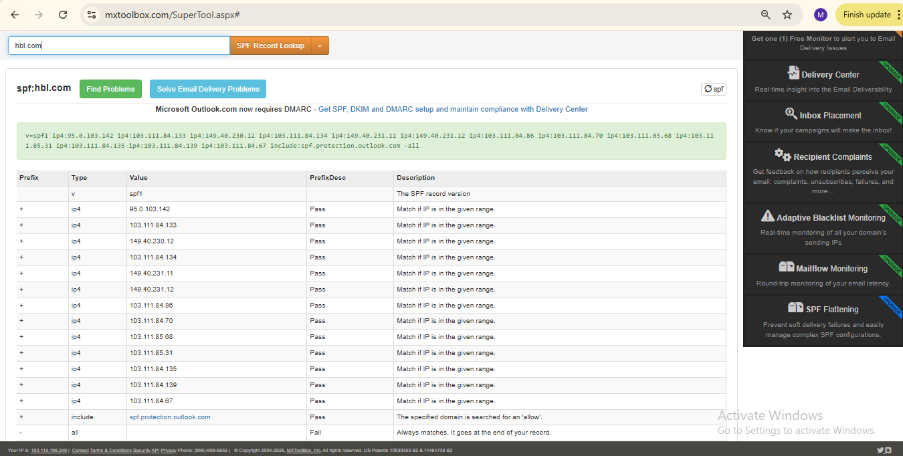</a>
 <b>Exhibit 3 — hbl.com SPF</b>
 13 IPv4 addresses and the Outlook include, ends in <code>-all</code>
</td>
<td align="center" valign="top" width="50%">

 <b>Exhibit 4 — hbl.com DMARC</b>
 <code>p=reject</code>, <code>sp=reject</code>, strict alignment, both report types
</td>
</tr>
<tr>
<td align="center" valign="top" width="50%">

 <b>Exhibit 5 — jazz.com.pk SPF</b>
 10 IPv4 addresses and the Outlook include, ends in <code>~all</code>
</td>
<td align="center" valign="top" width="50%">

<a href="screenshots/06-jazz-dmarc.PNG">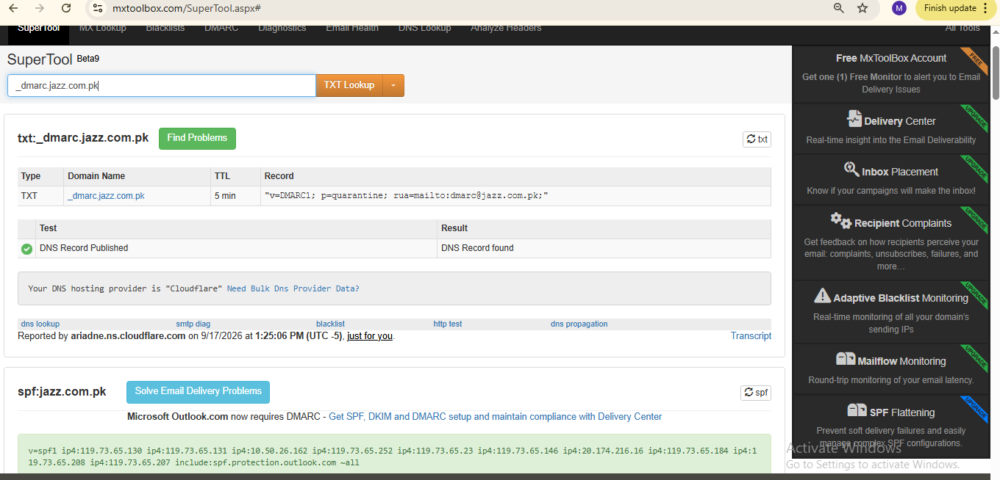</a>
 <b>Exhibit 6 — jazz.com.pk DMARC</b>
 <code>p=quarantine</code> with a <code>rua=</code> address
</td>
</tr>
<tr>
<td align="center" valign="top" width="50%">

<a href="screenshots/07-vu-spf.PNG">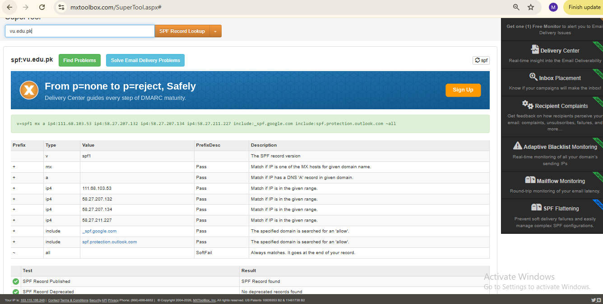</a>
 <b>Exhibit 7 — vu.edu.pk SPF</b>
 Google and Outlook includes, ends in <code>~all</code>
</td>
<td align="center" valign="top" width="50%">

<a href="screenshots/08-vu-dmarc.PNG">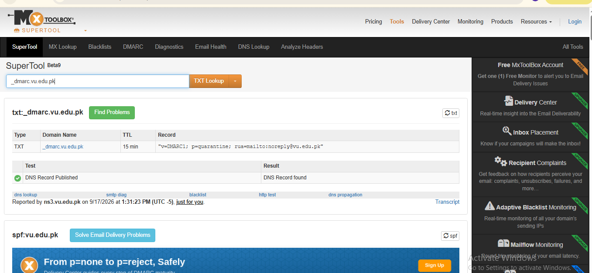</a>
 <b>Exhibit 8 — vu.edu.pk DMARC</b>
 <code>p=quarantine</code>, reports go to <code>noreply@vu.edu.pk</code>
</td>
</tr>
<tr>
<td align="center" valign="top" width="50%">

 <b>Exhibit 9 — rextech.pk SPF</b>
 13 IPv4 addresses plus <code>a</code> and <code>mx</code>, ends in <code>~all</code>
</td>
<td align="center" valign="top" width="50%">

<a href="screenshots/10-rextech-dmarc.PNG">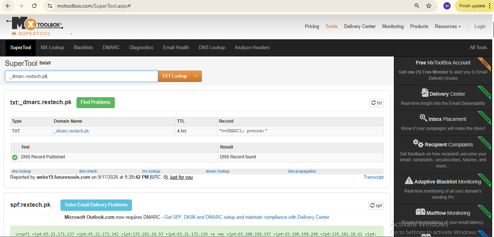</a>
 <b>Exhibit 10 — rextech.pk DMARC</b>
 <code>p=none</code> and nothing else, no reports
</td>
</tr>
<tr>
<td align="center" valign="top" width="50%">

<a href="screenshots/11-petsaal-spf.PNG">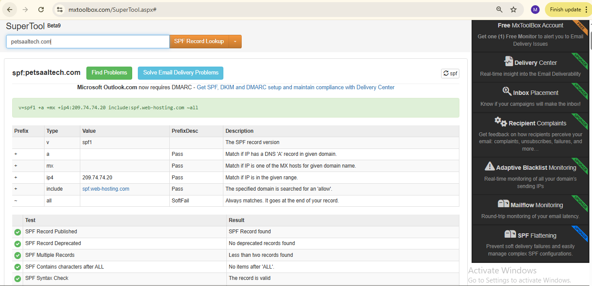</a>
 <b>Exhibit 11 — petsaaltech.com SPF</b>
 Shared-hosting include, ends in <code>~all</code>
</td>
<td align="center" valign="top" width="50%">

<a href="screenshots/12-petsaal-dmarc.PNG">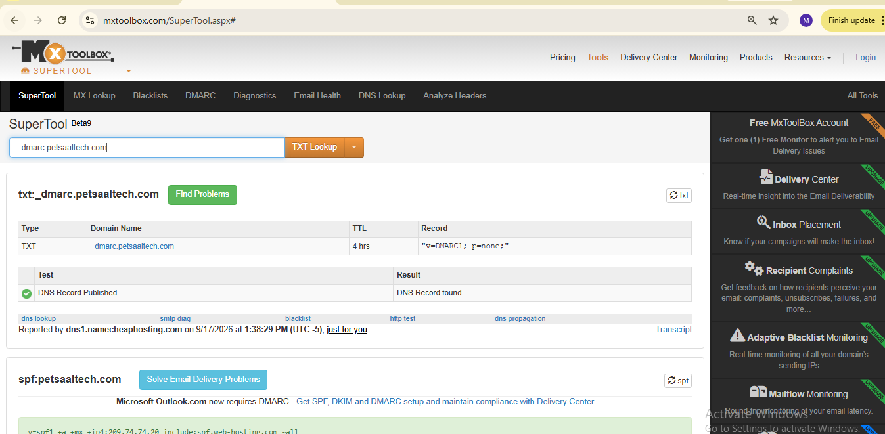</a>
 <b>Exhibit 12 — petsaaltech.com DMARC</b>
 <code>p=none</code>, no reports, same text as rextech.pk
</td>
</tr>
<tr>
<td align="center" valign="top" width="50%">

<a href="screenshots/13-microsoft-spf.PNG">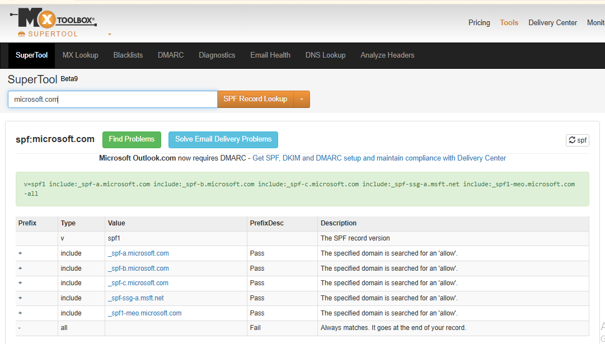</a>
 <b>Exhibit 13 — microsoft.com SPF</b>
 5 separate <code>include:</code> records, ends in <code>-all</code>
</td>
<td align="center" valign="top" width="50%">

 <b>Exhibit 14 — microsoft.com DMARC</b>
 <code>p=reject</code>, <code>pct=100</code>, <code>fo=1</code>, DNS on Azure
</td>
</tr>
<tr>
<td align="center" valign="top" width="50%">

 <b>Exhibit 15 — nadra.gov.pk SPF</b>
 25 IPv4 addresses and 5 <code>a:</code> hosts, no <code>include:</code>, ends in <code>-all</code>
</td>
<td align="center" valign="top" width="50%">

 <b>Exhibit 16 — nadra.gov.pk DMARC</b>
 <code>p=reject</code> but <code>sp=none</code>, strict alignment
</td>
</tr>
<tr>
<td align="center" valign="top" width="50%">

<a href="screenshots/17-telenor-spf.PNG">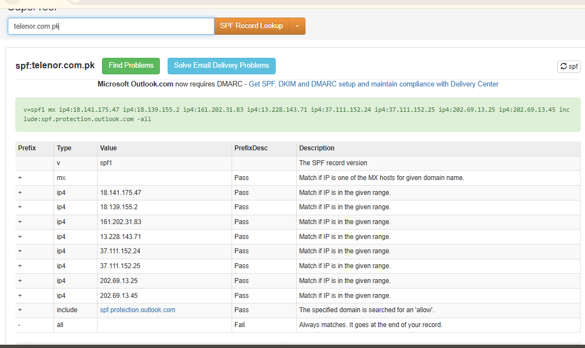</a>
 <b>Exhibit 17 — telenor.com.pk SPF</b>
 <code>mx</code>, 8 IPv4 addresses and the Outlook include, ends in <code>-all</code>
</td>
<td align="center" valign="top" width="50%">

<a href="screenshots/18-telenor-dmarc.PNG">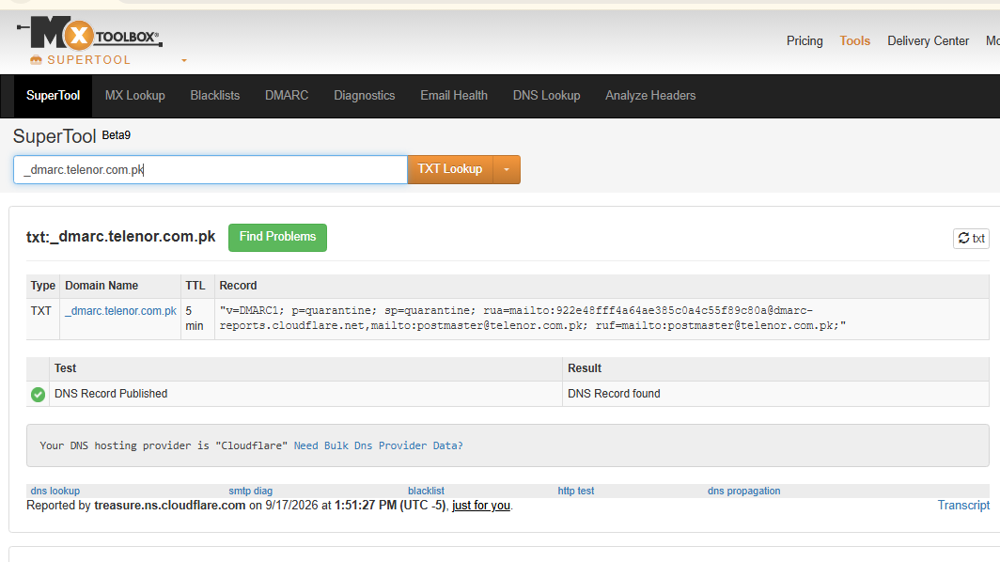</a>
 <b>Exhibit 18 — telenor.com.pk DMARC</b>
 <code>p=quarantine</code>, <code>sp=quarantine</code>, reports through Cloudflare
</td>
</tr>
<tr>
<td align="center" valign="top" width="50%">

<a href="screenshots/19-meezan-spf.PNG">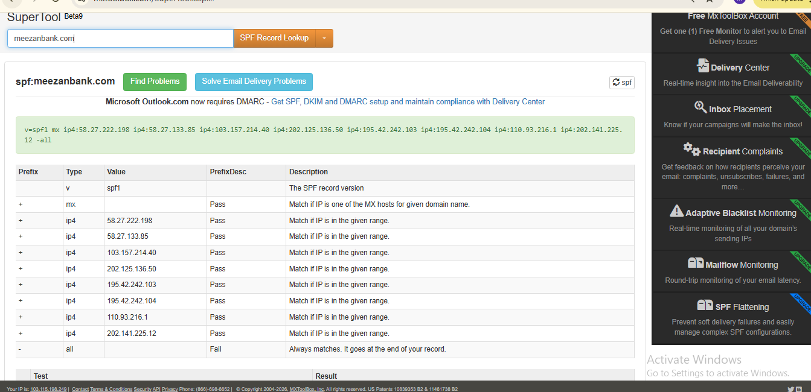</a>
 <b>Exhibit 19 — meezanbank.com SPF</b>
 <code>mx</code> and 8 IPv4 addresses, ends in <code>-all</code>
</td>
<td align="center" valign="top" width="50%">

<a href="screenshots/20-meezan-dmarc.PNG">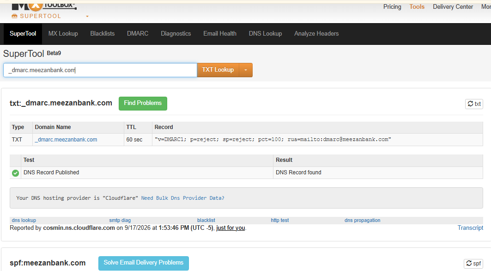</a>
 <b>Exhibit 20 — meezanbank.com DMARC</b>
 <code>p=reject</code>, <code>sp=reject</code>, <code>pct=100</code>
</td>
</tr>
</table>

### 📈 Verdicts at a Glance

| # | Domain | SPF | `p=` | Verdict | Evidence |
|:---:|---|:---:|:---:|:---:|:---:|
| 1 | paypal.com | `~all` | `reject` | Strong | Exhibits [1](#ex1), [2](#ex2) |
| 2 | hbl.com | `-all` | `reject` | Very strong | Exhibits [3](#ex3), [4](#ex4) |
| 3 | jazz.com.pk | `~all` | `quarantine` | Moderate | Exhibits [5](#ex5), [6](#ex6) |
| 4 | vu.edu.pk | `~all` | `quarantine` | Moderate | Exhibits [7](#ex7), [8](#ex8) |
| 5 | rextech.pk | `~all` | `none` | Weak | Exhibits [9](#ex9), [10](#ex10) |
| 6 | petsaaltech.com | `~all` | `none` | Weak | Exhibits [11](#ex11), [12](#ex12) |
| 7 | microsoft.com | `-all` | `reject` | Very strong | Exhibits [13](#ex13), [14](#ex14) |
| 8 | nadra.gov.pk | `-all` | `reject` (`sp=none`) | Strong, 1 gap | Exhibits [15](#ex15), [16](#ex16) |
| 9 | telenor.com.pk | `-all` | `quarantine` | Moderate-strong | Exhibits [17](#ex17), [18](#ex18) |
| 10 | meezanbank.com | `-all` | `reject` | Very strong | Exhibits [19](#ex19), [20](#ex20) |

---

## 🟣 Module 2 — Header Analysis

Exhibits 21 to 24. These four senders are not among the 10 audited domains.

<table>
<tr>
<td align="center" valign="top" width="50%">

 <b>Exhibit 21 — skool.com</b>
 SPF, DKIM and DMARC all PASS. Delivered after 3 seconds
</td>
<td align="center" valign="top" width="50%">

 <b>Exhibit 22 — splunk.com</b>
 All PASS. Filed as spam 📝 (the folder is not shown in the screenshot)
</td>
</tr>
<tr>
<td align="center" valign="top" width="50%">

 <b>Exhibit 23 — connect.isc2.org</b>
 All PASS. Delivered after 926 seconds
</td>
<td align="center" valign="top" width="50%">

<a href="screenshots/header-04.PNG">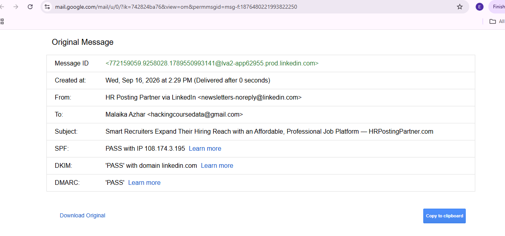</a>
 <b>Exhibit 24 — linkedin.com</b>
 All PASS. A third-party promotion sent through LinkedIn
</td>
</tr>
</table>

---

## 🎯 Verification Checklist

| Check | Method | Layer | Status |
|:---:|---|---|:---:|
| SPF read for every domain | MxToolbox SPF Record Lookup | DNS | ✅ 10 of 10 |
| DMARC read for every domain | MxToolbox TXT Lookup on `_dmarc.<domain>` | DNS | ✅ 10 of 10 |
| Policy strength scored | `p=`, `sp=`, alignment, `rua=`, SPF ending | Analysis | ✅ Confirmed |
| Header results read | Gmail Show Original | Mail | ✅ 4 of 4 PASS |
| Spam folder placement | My notes only | Mail | 📝 Notes only |
| DKIM per domain | Needs the selector, not found by plain DNS lookup | DNS | ❌ Not covered |
| A failing email | Sample has legitimate senders only | Mail | ❌ Not covered |
| Header senders tested against the audit | The 4 senders are not among the 10 domains | Mail | ❌ Not connected |

> [!NOTE]
> Module 2 shows how real mail looks, and does not test the Module 1 records. Records were read on Sep 17, 2026 between 13:17 and 13:54 (UTC-5), through MxToolbox only.

---

[⬆️ Back to top](#top) &nbsp;·&nbsp; [📖 Full README](README.md)

📧 **[MxToolbox](https://mxtoolbox.com)** · 📘 **[SPF — RFC 7208](https://datatracker.ietf.org/doc/html/rfc7208)** · 🛡️ **[DMARC — RFC 7489](https://datatracker.ietf.org/doc/html/rfc7489)** · 🧭 **[Audit Pipeline](README.md#audit-pipeline)**

