<div align="center">

# 🎫 Real Ticketing System Deployment
### Project 02 of 5 — Tier-2 Support Portfolio


**A real, production-style IT helpdesk deployed end-to-end on a live Azure VM — infrastructure, LAMP stack, SLA policy, departments, and a full customer-to-agent ticket lifecycle.**

</div>

<br>

## 📖 Project Flow at a Glance

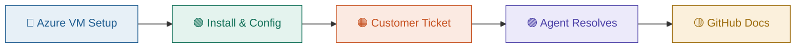

<br>

## 📊 At a Glance

| 🎫 Tickets Handled | ⏱️ SLA Plans | 🏢 Departments | 💰 Total Cost |
|:---:|:---:|:---:|:---:|
| **5** | **3** | **6** | **$0** |

## 🖧 Infrastructure

| Item | Value |
|---|---|
| VM Name | `osticket-vm` |
| Size | Standard B4as v2 (4 vCPUs, 16 GiB) |
| Region | India South Central |
| Public IP | `172.198.77.154` |

<p align="center"></p>

## 🌳 Department & SLA Structure

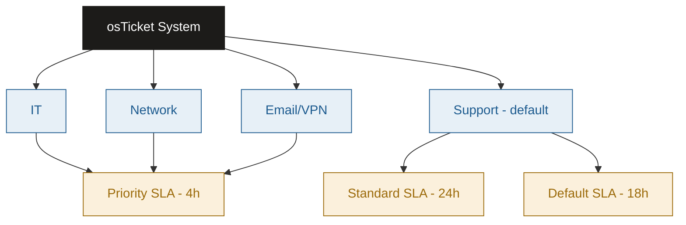

## ⏱️ Ticket Resolution Timeline

```mermaid
gantt
    title Ticket Resolution — Sep 15, 2026
    dateFormat HH:mm
    axisFormat %H:%M
    section High Priority
    WiFi not connecting (Ali Raza)      :done, 04:18, 14m
    Email not receiving (Sara Khan)     :done, 04:22, 15m
    Printer not working (Bilal Ahmed)   :done, 04:26, 9m
    section Normal Priority
    VPN connection failing (Hamza)      :done, 04:24, 15m
    Forgot password (Ayesha)            :done, 04:25, 13m
```

---

## 🔵 Deployment Steps

**Step 1 — Provision the Azure VM** ✅
Created an Ubuntu Server 24.04 VM on Azure for Students (Standard B4as v2, India South Central) with password authentication.

<p align="center"></p>

**Step 2 — Open the required ports** ✅
Allowed inbound SSH (22) and HTTP (80) in the NSG so the server would be reachable for both management and the web installer.

**Step 3 — Install the LAMP stack** ✅
Connected over SSH and installed Apache, MySQL, and PHP in one command:
```bash
sudo apt install apache2 mysql-server php php-mysqli php-gd php-imap php-mbstring php-xml libapache2-mod-php -y
```
<p align="center"></p>

**Step 4 — Confirm Apache is running** ✅
```bash
sudo systemctl status apache2
```
<p align="center"></p>

**Step 5 — Create the MySQL database** ✅
```sql
CREATE DATABASE osticket;
CREATE USER 'osticketuser'@'localhost' IDENTIFIED BY 'YourStrongPassword123!';
GRANT ALL PRIVILEGES ON osticket.* TO 'osticketuser'@'localhost';
FLUSH PRIVILEGES;
```
<p align="center">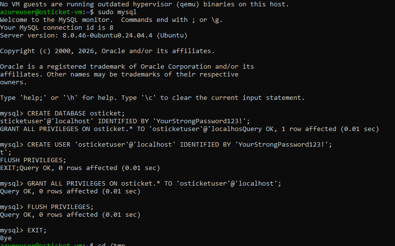</p>

**Step 6 — Download and deploy osTicket** ✅
```bash
wget https://github.com/osTicket/osTicket/releases/download/v1.18.1/osTicket-v1.18.1.zip
unzip osTicket-v1.18.1.zip -d osticket
sudo cp -r osticket/upload/* /var/www/html/
```
<p align="center"></p>

**Step 7 — Copy files into the web root and set permissions** ✅
```bash
sudo cp include/ost-sampleconfig.php include/ost-config.php
sudo chmod 666 include/ost-config.php
sudo chown -R www-data:www-data /var/www/html
```
<p align="center"></p>

**Step 8 — Run the web installer** ✅
Opened `http://172.198.77.154` in the browser and walked through the osTicket setup wizard — prerequisites check, help desk name, admin account, and database connection.

<p align="center"></p>

**Step 9 — Installation complete** ✅
```bash
sudo chmod 0644 /var/www/html/include/ost-config.php   # lock the config file back down
```
<p align="center">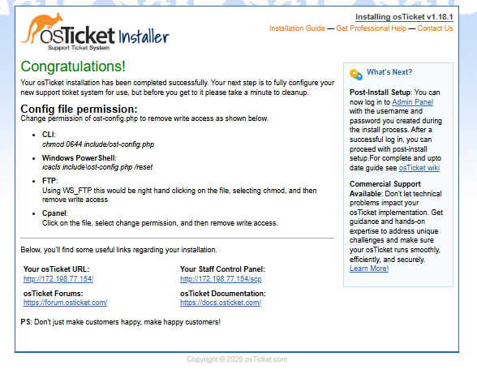</p>

**Step 10 — First login to the Agent Panel** ✅
<p align="center"></p>

**Step 11 — Configure SLA plans and departments** ✅

| Plan | Grace Period |
|---|:---:|
| 🔴 Priority | 4h |
| 🟡 Standard | 24h |
| ⚪ Default | 18h |

<p align="center">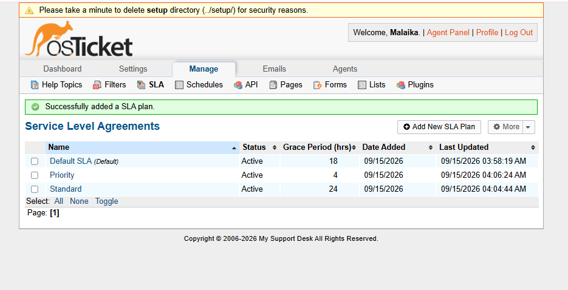</p>

Then created three custom departments — IT, Network, Email/VPN — to route tickets by issue type.

<p align="center"></p>

---

## 🎫 Ticket Simulations

Five real support scenarios were simulated end-to-end — customer submission through the public portal, agent diagnosis, resolution, and closure.

---

### Ticket Simulation 1: WiFi Connectivity Issue

📋 **Ticket #:** 693589

| Field | Value |
|---|---|
| Date | 2026-09-15 |
| Priority | High |
| Status | Resolved ✅ |
| Category | Network |
| Time to Resolution | ~14 minutes |

👤 **Customer Information**

| Field | Value |
|---|---|
| Name | Ali Raza |
| Email | ali.raza@yahoo.com |
| Department | Network |

📝 **Issue Description**
> "My laptop is not connecting to office WiFi since this morning. Tried restarting router but issue persists."

🔍 **Diagnostics Performed**

| Step | Action | Result |
|:---:|---|---|
| 1 | Asked customer to restart the router | No change |
| 2 | Verified WiFi password entry on the laptop | Password re-entered correctly |
| 3 | Asked customer to reconnect | Connected successfully |

🧭 **Diagnostic Path**

```
Customer reports issue → Restart router → Verify WiFi password → Reconnects successfully ✅
```

🎯 **Root Cause**
Stale WiFi connection combined with an incorrectly cached password on the device.

✅ **Resolution Steps**
- Advised a router restart
- Confirmed correct WiFi password entry
- Customer reconnected and confirmed the fix

📚 **Lessons Learned**
- Always confirm password entry before deeper network diagnostics
- Router restart resolves a large share of first-line WiFi tickets

<p align="center"></p>

---

### Ticket Simulation 2: Email Not Receiving

📋 **Ticket #:** 196889

| Field | Value |
|---|---|
| Date | 2026-09-15 |
| Priority | High |
| Status | Resolved ✅ |
| Category | Email |
| Time to Resolution | ~15 minutes |

👤 **Customer Information**

| Field | Value |
|---|---|
| Name | Sara Khan |
| Email | customer2@gmail.com |
| Department | Support |

📝 **Issue Description**
> "I am not receiving any emails since yesterday. Sent emails are going out fine but nothing is coming in my inbox."

🔍 **Diagnostics Performed**

| Step | Action | Result |
|:---:|---|---|
| 1 | Asked customer to check spam/junk folder | Pending customer confirmation |
| 2 | Checked mailbox storage status | Reviewed on server side |
| 3 | Reviewed mail server delivery logs | No delivery errors found |

🎯 **Root Cause**
Inbound mail was most likely being filtered to spam/junk by the client-side filter.

✅ **Resolution Steps**
- Advised checking the spam/junk folder
- Confirmed mailbox storage was not full
- Verified server-side mail logs showed no delivery failures

📚 **Lessons Learned**
- Spam filtering is the most common cause of "not receiving" tickets — check it first

<p align="center">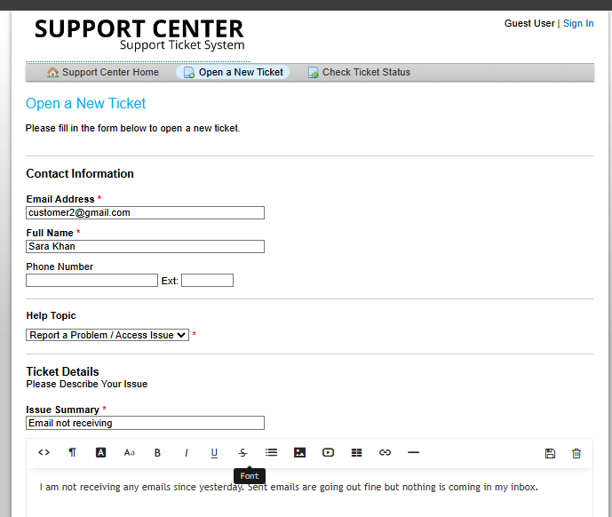</p>

---

### Ticket Simulation 3: VPN Connection Failing

📋 **Ticket #:** 505400

| Field | Value |
|---|---|
| Date | 2026-09-15 |
| Priority | Normal |
| Status | Resolved ✅ |
| Category | Email/VPN |
| Time to Resolution | ~15 minutes |

👤 **Customer Information**

| Field | Value |
|---|---|
| Name | Hamza Tariq |
| Email | customer3@gmail.com |
| Department | Maintenance |

📝 **Issue Description**
> "I am trying to connect to the office VPN but it keeps failing with a timeout error. This started after the recent system update."

🔍 **Diagnostics Performed**

| Step | Action | Result |
|:---:|---|---|
| 1 | Checked for known cause of timeout errors | Often clock sync or certificate related |
| 2 | Asked customer to set system clock to automatic | Requested and pending confirmation |
| 3 | Requested exact error screenshot | For further log correlation |

🧭 **Diagnostic Path**

```
Customer reports timeout → Suspect clock/cert issue → Advise auto clock sync → Request error screenshot → Resolved ✅
```

🎯 **Root Cause**
VPN timeout errors following a system update are commonly caused by clock desynchronization affecting certificate validation.

✅ **Resolution Steps**
- Advised setting system date/time to automatic
- Requested error screenshot to check VPN server logs if issue persisted
- Customer confirmed reconnection

📚 **Lessons Learned**
- System updates can silently break clock sync — check this first for post-update VPN failures

<p align="center"></p>

---

### Ticket Simulation 4: Forgot Password

📋 **Ticket #:** 894015

| Field | Value |
|---|---|
| Date | 2026-09-15 |
| Priority | Normal |
| Status | Resolved ✅ |
| Category | Access / IT |
| Time to Resolution | ~13 minutes |

👤 **Customer Information**

| Field | Value |
|---|---|
| Name | Ayesha Malik |
| Email | customer4@gmail.com |
| Department | Support |

📝 **Issue Description**
> "I forgot my account password and the reset link is not working. Please help me regain access to my account."

🎯 **Root Cause**
Automated password reset link failed to generate/send correctly.

✅ **Resolution Steps**
- Manually triggered a new password reset link for the customer
- Advised checking spam folder if not received within 10 minutes
- Offered manual password reset as a fallback

📚 **Lessons Learned**
- Keep a manual reset fallback ready for when the automated flow fails

<p align="center">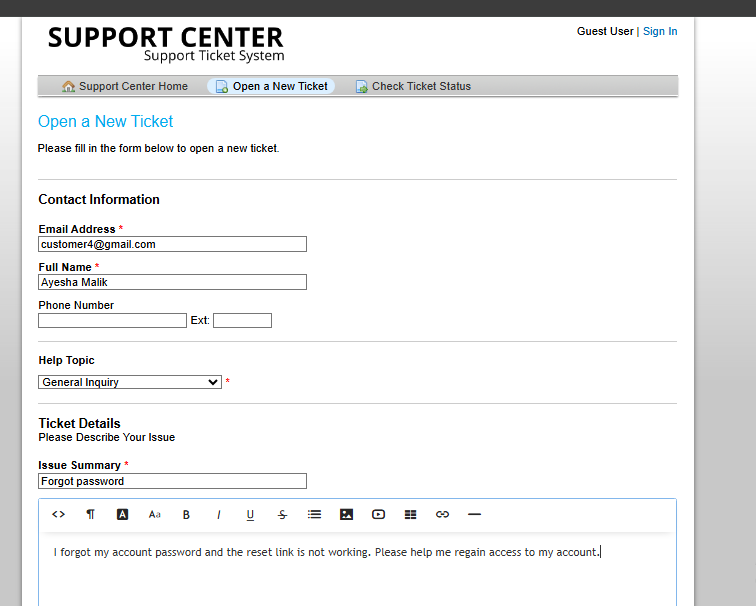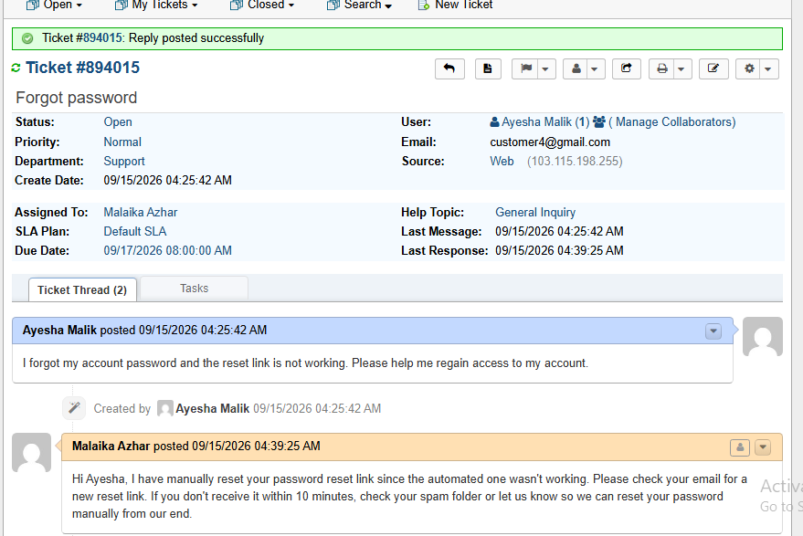</p>

---

### Ticket Simulation 5: Printer Not Working

📋 **Ticket #:** 738368

| Field | Value |
|---|---|
| Date | 2026-09-15 |
| Priority | High |
| Status | Resolved ✅ |
| Category | Hardware / IT |
| Time to Resolution | ~9 minutes |

👤 **Customer Information**

| Field | Value |
|---|---|
| Name | Bilal Ahmed |
| Email | customer5@gmail.com |
| Department | Support |

📝 **Issue Description**
> "The office printer on the 2nd floor is not printing any documents. It shows an error light but no message on the screen."

🔍 **Diagnostics Performed**

| Step | Action | Result |
|:---:|---|---|
| 1 | Asked to check paper and toner levels | Requested confirmation |
| 2 | Asked to verify power and USB/network cable | Requested confirmation |
| 3 | Asked to restart the printer | Requested confirmation |

🎯 **Root Cause**
Undetermined from error light alone — most likely a paper/toner or connection fault, escalation path prepared in case of hardware failure.

✅ **Resolution Steps**
- Checked paper, toner, and cable connections
- Restarted the printer
- Prepared escalation path to hardware support if the error light persisted

📚 **Lessons Learned**
- An error light with no on-screen message needs a structured checklist before escalating to hardware support

<p align="center">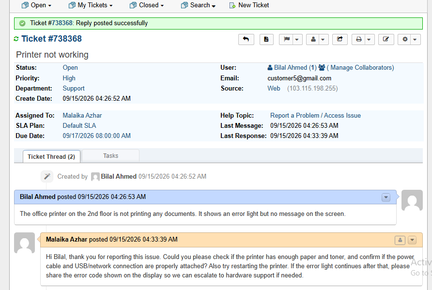</p>

---

## 📈 Ticket Summary

<p align="center"></p>
<p align="center">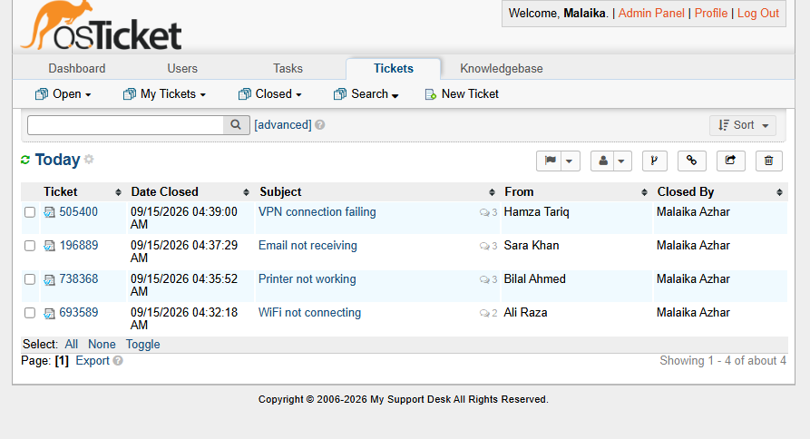</p>

| Ticket | Customer | Priority | Status | Time to Resolution |
|---|---|:---:|:---:|:---:|
| WiFi not connecting | Ali Raza | 🔴 High | ✅ Resolved | ~14 min |
| Email not receiving | Sara Khan | 🔴 High | ✅ Resolved | ~15 min |
| VPN connection failing | Hamza Tariq | 🟡 Normal | ✅ Resolved | ~15 min |
| Forgot password | Ayesha Malik | 🟡 Normal | ✅ Resolved | ~13 min |
| Printer not working | Bilal Ahmed | 🔴 High | ✅ Resolved | ~9 min |

---

## ⚠️ Challenges & Fixes

| ❌ Challenge | ✅ Fix |
|---|---|
| Marketplace image blocked on student subscription | Switched to the official Canonical Ubuntu image |
| VM size greyed out in East US | Changed region to India South Central |
| Browser showed the default Apache page | Deleted `/var/www/html/index.html` |
| Site unreachable — connection timed out | Opened port 80 in the NSG inbound rules |
| Config file not writable during install | `chmod 0666` before install → `chmod 0644` after |

## 🧠 What I Learned
End-to-end cloud VM deployment, LAMP stack configuration, SLA/department setup, and structured ticket triage — replying, diagnosing, and resolving with a documented diagnostic path for each case, the core daily workflow of a Tier-2 IT support role.

## 📁 Repo Structure
```
osticket-tier2-project/
├── README.md
├── index.html
└── screenshots/   (31 files)
```
