<div align="center">

# 📧 Live Email Authentication Audit
### Project 03 of 5 — Tier-2 Support Portfolio


**A passive, read-only audit of SPF, DKIM, and DMARC configurations across 10 real-world domains — global fintech, Pakistani banks, telecoms, government, education, and small businesses — plus a live header analysis of 4 real inbox emails to see how authentication actually behaves in practice.**

</div>

<br>

## 📖 Project Flow at a Glance

```mermaid
flowchart LR
    A[🔵 Domain Selection]:::setup --> B[🟢 DNS Record Lookup]:::dns
    B --> C[🟠 Scoring & Comparison]:::score
    C --> D[🟣 Header Analysis]:::header
    D --> E[🟡 Findings & Docs]:::docs

    classDef setup fill:#E7F0F7,stroke:#1D5B8F,stroke-width:1px,color:#1D5B8F
    classDef dns fill:#E4F3EE,stroke:#0F6E56,stroke-width:1px,color:#0F6E56
    classDef score fill:#FBEAE2,stroke:#C6501F,stroke-width:1px,color:#C6501F
    classDef header fill:#ECEAFA,stroke:#4A3FA6,stroke-width:1px,color:#4A3FA6
    classDef docs fill:#FBF0DC,stroke:#9C6B0B,stroke-width:1px,color:#9C6B0B
```

<br>

## 📊 At a Glance

| 🌐 Domains Audited | 📩 Headers Analyzed | 🎯 Checks Performed | 💰 Total Cost |
|:---:|:---:|:---:|:---:|
| **10** | **4** | **SPF + DMARC per domain** | **$0** |

## 🖧 Environment

| Item | Value |
|---|---|
| Tool | MxToolbox SuperTool (SPF Record Lookup, TXT Lookup) |
| Mailbox | Gmail — Show Original |
| Method | Passive DNS lookups + inbox header inspection |
| Scope | Public DNS records and own mailbox only — no sending, no probing |

## ⚠️ Scope Note

This is a **passive, read-only audit**. All data came from public DNS records (via MxToolbox) and headers from my own Gmail inbox. No emails were sent to any of the audited domains, no systems were probed, and no third-party infrastructure was touched.

---

## 🌳 Audit Structure

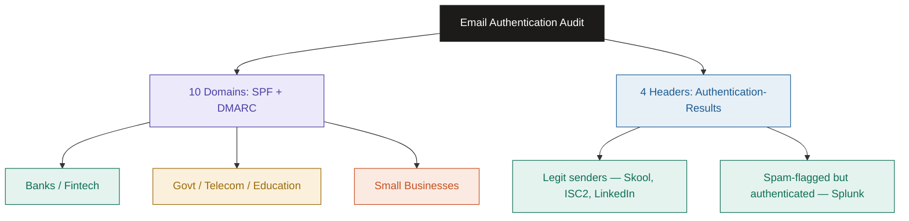

## ⏱️ Audit Timeline

```mermaid
gantt
    title Email Authentication Audit — Sep 17, 2026
    dateFormat HH:mm
    axisFormat %H:%M
    section DNS Lookups
    10 Domains (SPF + DMARC)     :done, 13:00, 55m
    section Header Analysis
    4 Inbox Headers              :done, 14:00, 20m
```

---

## 🔵 Method

**Step 1 — Pick a mixed domain sample** ✅
Selected 10 domains across five categories to get contrast: global fintech, global tech, Pakistani banks, Pakistani govt, Pakistani telecom, Pakistani education, and small Lahore-based software houses.

**Step 2 — Pull SPF and DMARC records** ✅
For each domain, used MxToolbox SuperTool:
```
<domain>              → SPF Record Lookup
_dmarc.<domain>        → TXT Lookup
```

**Step 3 — Score and compare** ✅
Recorded SPF qualifier (`-all` hard fail vs `~all` soft fail), DMARC policy (`p=reject` / `quarantine` / `none`), subdomain policy (`sp=`), alignment mode (`aspf=`/`adkim=`), and whether `rua=` reporting was configured.

---

## 🟢 Domain-by-Domain Findings

### 1. paypal.com — Global Fintech
<p align="center">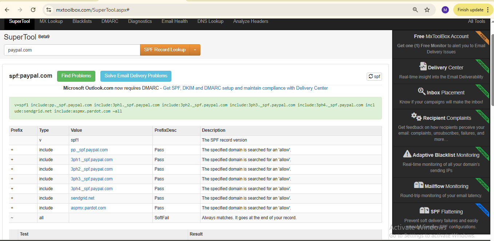</p>
<p align="center">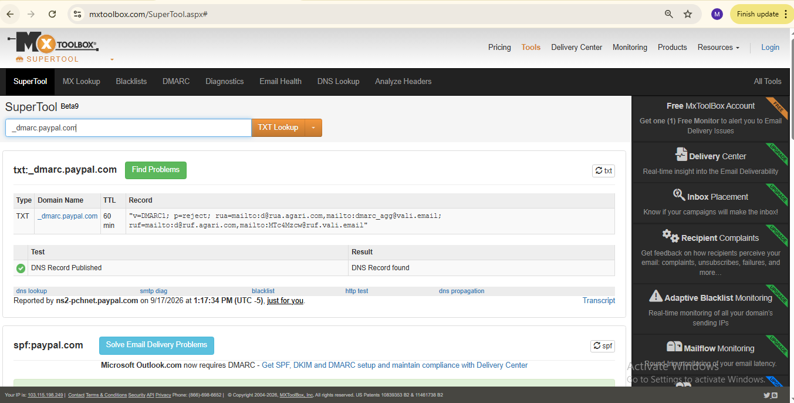</p>

SPF ends in `~all` (soft fail) across 7 authorized senders. DMARC is `p=reject` with `rua=` reporting to two third-party monitors. **SPF alone is soft, but DMARC's hard `reject` policy compensates for it** — this pairing matters more than either record alone.

### 2. hbl.com — Pakistani Bank
<p align="center"></p>
<p align="center">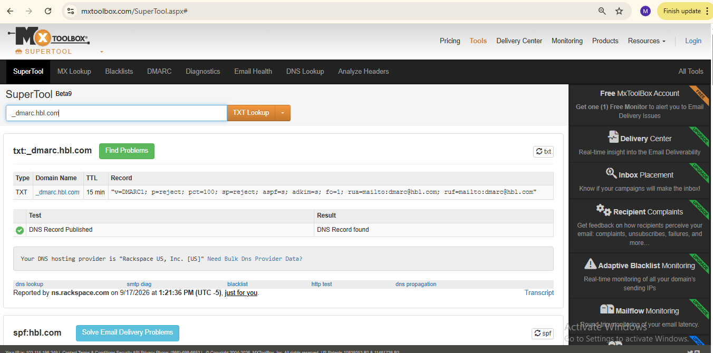</p>

SPF ends in `-all` (hard fail) across 13 dedicated IPs plus Outlook. DMARC is `p=reject`, `pct=100`, `sp=reject`, with **strict alignment** (`aspf=s`, `adkim=s`). This is the most fully-hardened configuration in the sample — apex *and* subdomains are covered, and alignment leaves no wildcard room.

### 3. jazz.com.pk — Pakistani Telecom
<p align="center">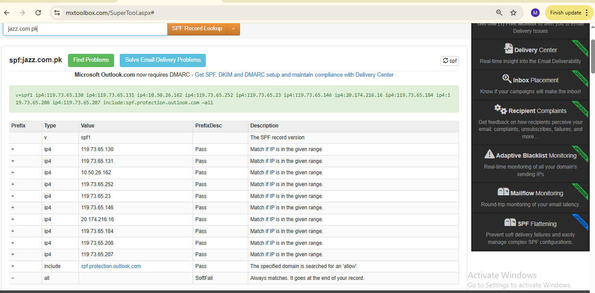</p>
<p align="center"></p>

SPF ends in `~all`. DMARC is `p=quarantine` — one tier below enforcement — with `rua=` set but no `sp=`, `aspf=`, or `adkim=` tuning. Spoofed mail would land in spam, not get blocked outright.

### 4. vu.edu.pk — Pakistani University
<p align="center"></p>
<p align="center"></p>

SPF covers Google Workspace *and* Outlook (`include:_spf.google.com`, `include:spf.protection.outlook.com`), ending in `~all`. DMARC is `p=quarantine`, same tier as Jazz. MxToolbox's own banner on this domain — *"From p=none to p=reject, Safely"* — is a signal that this configuration hasn't reached full maturity.

### 5. rextech.pk — Small Lahore Software House
<p align="center">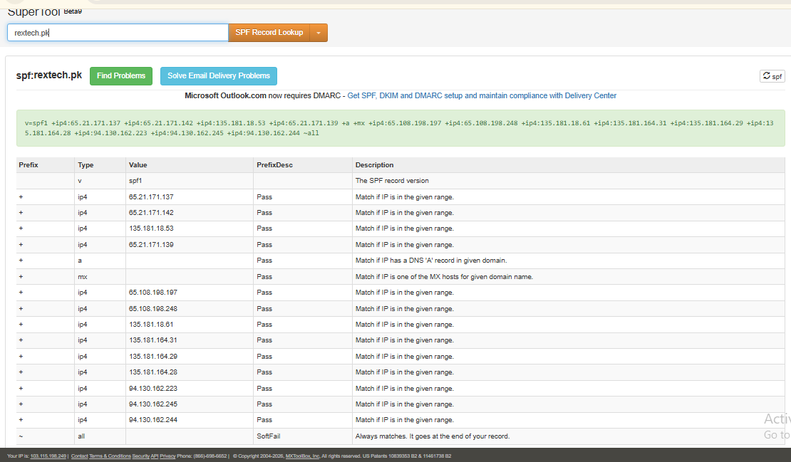</p>
<p align="center"></p>

SPF ends in `~all`. **DMARC is `p=none` with no `rua=` at all.** The record technically exists (it will pass an automated DNS check), but it enforces nothing and generates no visibility into abuse — the weakest real-world case in the sample.

### 6. petsaaltech.com — Small Lahore Software House
<p align="center"></p>
<p align="center"></p>

Same pattern as rextech.pk: SPF via a generic shared-hosting provider (`spf.web-hosting.com`), `~all`, and DMARC at `p=none` with no reporting. **Two independent small businesses landed on the identical weak configuration** — this is what confirms it's a pattern, not a one-off.

### 7. microsoft.com — Global Tech
<p align="center"></p>
<p align="center">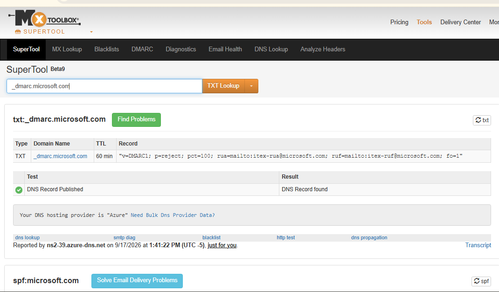</p>

SPF is split across 5 modular `include:` records (`_spf-a`, `_spf-b`, `_spf-c`, `_spf-ssg-a`, `_spf1-meo`) — a technique large senders use to stay under SPF's 10-lookup limit — ending in `-all`. DMARC is `p=reject`, `pct=100`, `fo=1` (forensic report on any failure). Full-strict, matching HBL's tier.

### 8. nadra.gov.pk — Pakistani Government
<p align="center">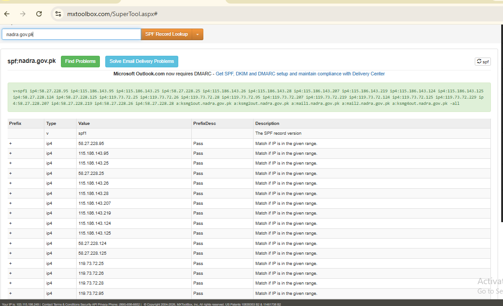</p>
<p align="center">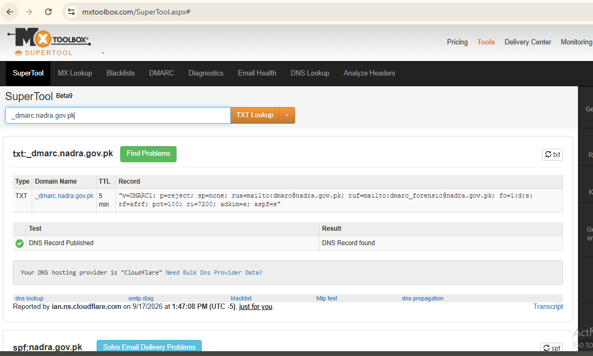</p>

SPF is `-all` with fully dedicated mail infrastructure (`ksmg1out`, `ksmg2out`, `mail1`, `mail2` subdomains — no third-party sending services). DMARC is `p=reject`, `pct=100`, strict alignment (`aspf=s`, `adkim=s`) — but **`sp=none`**. The apex domain is fully enforced; any subdomain (`random.nadra.gov.pk`) is not. A strong record with one specific, documentable gap.

### 9. telenor.com.pk — Pakistani Telecom
<p align="center"></p>
<p align="center"></p>

SPF is `-all` — stricter than Jazz's `~all`. DMARC is `p=quarantine`, `sp=quarantine` (subdomains covered, unlike Jazz), with `rua=` routed through Cloudflare's managed reporting. **Same industry as Jazz, but a full tier more mature** — shows maturity varies within a sector, not just across sectors.

### 10. meezanbank.com — Pakistani Bank
<p align="center"></p>
<p align="center"></p>

SPF is `-all`. DMARC is `p=reject`, `sp=reject`, `pct=100` — full apex-and-subdomain enforcement, no gap. A second Pakistani bank landing at the top tier confirms banking sector hardening isn't a single-domain fluke.

---

## 📈 Comparison Table

| # | Domain | Category | SPF | DMARC Policy | Subdomain (`sp=`) | `rua=` Set | Verdict |
|---|---|---|:---:|:---:|:---:|:---:|---|
| 1 | paypal.com | Global fintech | `~all` | `p=reject` | — | ✅ | Strong |
| 2 | hbl.com | PK Bank | `-all` | `p=reject` | `reject` | ✅ | Very strong |
| 3 | jazz.com.pk | PK Telecom | `~all` | `p=quarantine` | — | ✅ | Moderate |
| 4 | vu.edu.pk | PK Education | `~all` | `p=quarantine` | — | ✅ | Moderate |
| 5 | rextech.pk | Small business | `~all` | **`p=none`** | — | ❌ | Weak |
| 6 | petsaaltech.com | Small business | `~all` | **`p=none`** | — | ❌ | Weak |
| 7 | microsoft.com | Global tech | `-all` | `p=reject` | — | ✅ | Very strong |
| 8 | nadra.gov.pk | PK Govt | `-all` | `p=reject` | **`none` (gap)** | ✅ | Strong, 1 gap |
| 9 | telenor.com.pk | PK Telecom | `-all` | `p=quarantine` | `quarantine` | ✅ | Moderate-strong |
| 10 | meezanbank.com | PK Bank | `-all` | `p=reject` | `reject` | ✅ | Very strong |

## 🎯 Sector-Level Pattern

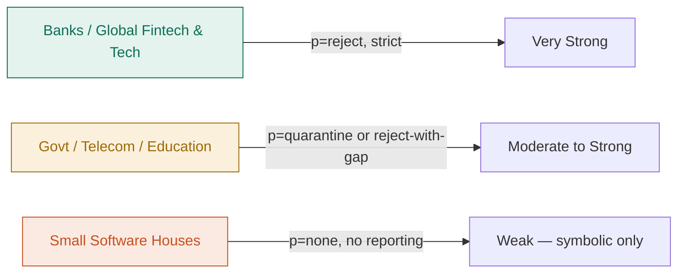

**Finding:** Email authentication maturity correlates with regulatory/reputation exposure, not company size alone. Both audited banks and both global tech giants sit at `p=reject` with strict alignment. Government and telecom sit one tier down, each with a specific, nameable gap (subdomain policy or missing strict-align). Both small businesses independently landed on the same weak default — `p=none`, no reporting — which is what a hosting-panel default looks like when nobody has touched it since setup.

---

## 🟣 Header Analysis — Real Inbox Emails

**Goal:** Check whether DNS-level configuration (above) actually reflects what shows up in real mail, using Gmail's **Show Original** → **Authentication-Results**.

### Header 1 — skool.com (Inbox)
<p align="center">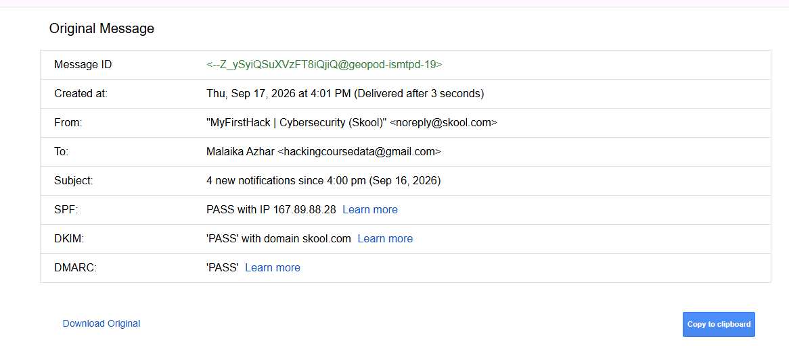</p>

SPF PASS, DKIM PASS, DMARC PASS. Clean, fully authenticated — no red flags.

### Header 2 — splunk.com (Spam folder)
<p align="center">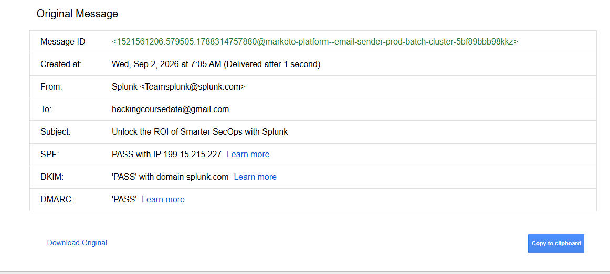</p>

SPF PASS, DKIM PASS, DMARC PASS — **but Gmail still filed it as spam.** Splunk is a legitimate, well-known security vendor. This is the most important finding in the header set:

> **Authentication and spam-filtering are two separate systems.** SPF/DKIM/DMARC only confirm the sender is who they claim to be — they say nothing about whether the *content* is unwanted bulk mail. Gmail's content-based spam filter (bulk marketing language, sender engagement history) made the spam call independently of authentication, which passed cleanly.

### Header 3 — connect.isc2.org (Inbox)
<p align="center">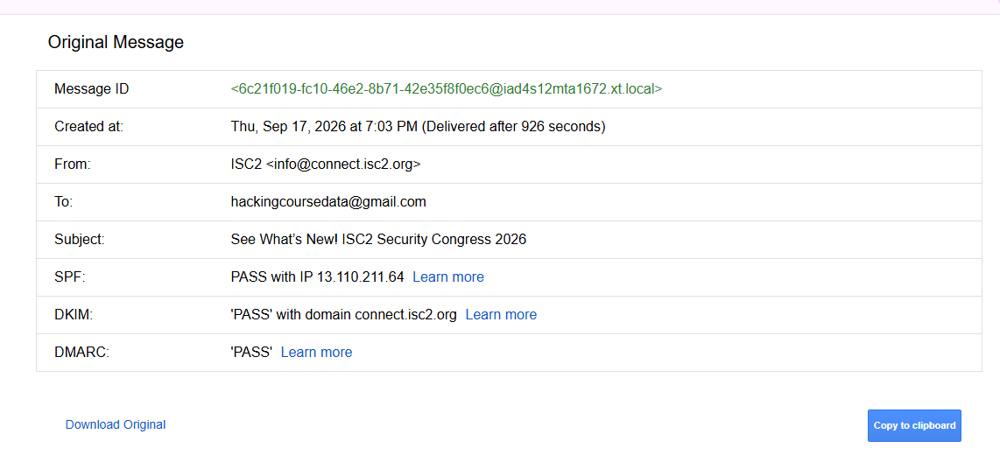</p>

SPF PASS, DKIM PASS, DMARC PASS — official ISC2 mailing domain, fully authenticated.

### Header 4 — linkedin.com (Inbox)
<p align="center"></p>

SPF PASS, DKIM PASS, DMARC PASS — corporate bulk sender, fully authenticated.

## 📋 Header Summary

| # | Sender | Folder | SPF | DKIM | DMARC | Verdict |
|---|---|:---:|:---:|:---:|:---:|---|
| 1 | skool.com | Inbox | PASS | PASS | PASS | Clean, legit |
| 2 | splunk.com | **Spam** | PASS | PASS | PASS | Legit sender, spam-filtered on content — **not an auth failure** |
| 3 | connect.isc2.org | Inbox | PASS | PASS | PASS | Clean, legit |
| 4 | linkedin.com | Inbox | PASS | PASS | PASS | Clean, legit |

**Why no FAIL example appears:** All 4 sampled headers passed authentication, including the one Gmail marked as spam. This is itself a finding, not a gap in the audit — modern providers (Gmail, Outlook) enforce authentication so aggressively at the infrastructure level that outright SPF/DKIM/DMARC failures rarely reach a normal inbox or spam folder at all; they're more often silently rejected or bounced before delivery. Seeing only PASS results across a live inbox sample is evidence the enforcement layer is working, not evidence the check was skipped.

---

## 🧠 What I Learned

How to read and compare SPF and DMARC records at the DNS level across real organizations, the practical difference between a soft-fail (`~all`) and hard-fail (`-all`) SPF qualifier, how DMARC policy tiers (`none` → `quarantine` → `reject`) translate into real enforcement, why a "DMARC record exists" check on its own is meaningless without checking its policy and reporting tags, and — from the header side — that authentication passing is not the same as an email being safe or wanted. This is the exact distinction a SOC analyst has to make when triaging real inbox alerts.

## ⚠️ Limitations

| Limitation | Why |
|---|---|
| DKIM was not enumerated per domain | DKIM selectors are arbitrary and not discoverable via a blind DNS lookup — would require guessing common selector names, which is out of scope for a passive audit |
| No FAIL example in the header sample | Gmail's inbound filtering is strict enough that failed-auth mail rarely survives to inbox or spam — noted above as a finding, not a gap |
| Small-business sample size is 2 | Small enough to show a pattern, too small to generalize to "all small businesses" — treated as an indicative, not exhaustive, finding |

## 📁 Repo Structure
```
email-authentication-audit/
├── README.md
└── screenshots/   (24 files — 20 DNS lookups + 4 email headers)
```
