<div align="center">

# 🦈 Wireshark Packet Capture Case Studies

**Project 03 of 4 — Tier-2 Support Portfolio**

Network Troubleshooting (Wireshark)


Three network problems captured live on a Windows PC and read packet by packet in Wireshark — a DNS lookup failure, TCP retransmissions during a large download, and Windows' ARP duplicate-IP check. Each result is backed by a screenshot, and every limit of the lab is written down.

### [📑 Open the visual index](wireshark-INDEX.md)

</div>

---

## 📑 Table of Contents

1. [At a Glance](#at-a-glance)
2. [Project Background](#project-background)
3. [Environment](#environment)
4. [Project Flow](#project-flow)
5. [Setup — Capture Environment](#setup)
6. [Case 1 — DNS Query Failure](#case-1)
7. [Case 2 — TCP Retransmission](#case-2)
8. [Case 3 — ARP Conflict Detection](#case-3)
9. [Coverage Snapshot](#coverage-snapshot)
10. [Troubleshooting Pipeline](#troubleshooting-pipeline)
11. [Capture-Wide Analysis](#capture-wide-analysis)
12. [Saved Capture](#saved-capture)
13. [Filter Reference](#filter-reference)
14. [Project Summary](#project-summary)
15. [Challenges & Fixes](#challenges-fixes)
16. [Scope & Limitations](#scope-limitations)
17. [What I Learned](#what-i-learned)
18. [Skills Demonstrated](#skills-demonstrated)
19. [Screenshot Index](#screenshot-index)
20. [Repo Structure](#repo-structure)

---

<a id="at-a-glance"></a>
## 📊 At a Glance

| 🧩 Case Studies | 🖼️ Screenshots | 🎯 Filters Used | 📦 Packets Captured | 💰 Cost |
|:---:|:---:|:---:|:---:|:---:|
| **3** | **26** | **6** | **860,523** | **$0** |

---

<a id="project-background"></a>
## 📖 Project Background

Tier-2 support gets tickets that say "the internet is slow" or "the site won't open". A packet capture shows what really happened on the wire. This project reproduces three common failures on one PC and proves each one with **real packets**.

- **Case 1 — DNS Query Failure:** Look up a domain that does not exist and prove the reply code is NXDOMAIN.
- **Case 2 — TCP Retransmission:** Download a 1 GB file and capture the same TCP segments being sent again.
- **Case 3 — ARP Conflict Detection:** Re-apply the PC's own IP address and watch Windows check that nobody else uses it.

> [!NOTE]
> Case 3 did **not** produce a real IP conflict, because only one device was used. It shows the Windows duplicate-address check (ARP Probe and Announcement) instead. Items taken from my own notes, with no screenshot behind them, are marked 📝.

<div align="center">

### 🧩 Lab Setup at a Glance

<table>
<tr>
<td align="center" valign="top" width="42%">


**Capture Machine**<br>
<sub>Wi-Fi adapter<br>IPv4 <code>192.168.100.38</code></sub>

</td>
<td align="center" valign="middle" width="16%">

**➜**<br>
<sub>packets</sub>

</td>
<td align="center" valign="top" width="42%">


**Packet Analyzer**<br>
<sub>Live capture on Wi-Fi<br>Display filters and statistics</sub>

</td>
</tr>
<tr>
<td colspan="3" align="center">

**Home router (gateway)** <code>192.168.100.1</code><br>
<sub>MAC <code>04:8c:16:67:f4:9a</code>, shown by Wireshark as HuaweiTechno</sub>

</td>
</tr>
</table>

</div>

---

<a id="environment"></a>
## 🖧 Environment

| Item | Value |
|---|---|
| **Tool** | Wireshark 4.6.8 (v4.6.8-0-ge677bf052328) |
| **Capture Interface** | Wi-Fi |
| **Local IPv4 / Mask** | `192.168.100.38` / `255.255.255.0` |
| **Local MAC** | `00:24:d7:28:69:f8` (shown as Intel_28:69:f8) |
| **Default Gateway** | `192.168.100.1` (MAC `04:8c:16:67:f4:9a`) |
| **DNS Servers** | `192.0.2.1` (preferred) and `192.0.2.2` (alternate), **set manually** |
| **OS** | Windows |
| **Work Date** | Sep 15, 2026 |

> [!IMPORTANT]
> The DNS servers were typed in by hand (Exhibit 16). `192.0.2.0/24` is an address block reserved for documentation examples (RFC 5737). The DNS replies in Exhibit 7 came from the router's MAC address, so the router answered on those addresses. Case 1 depends on this resolver.

### 🗺️ Network Path

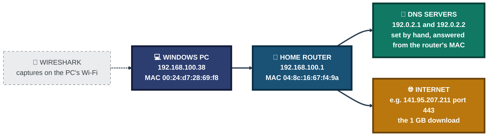
<p align="center"><em>Addresses come from Exhibits 3, 7, 11 and 16. The diagram shows the path, it is not a screenshot.</em></p>

---

<a id="project-flow"></a>
## ⏱️ Project Flow

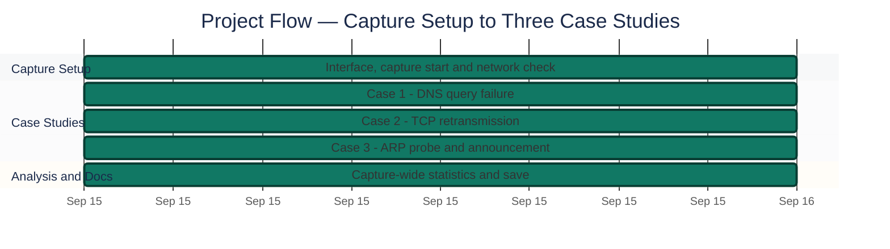
<p align="center"><em>Colors distinguish each project stage — all stages complete. Clock times are left out because the screenshots do not show them.</em></p>

---

<a id="setup"></a>
## 🔵 Setup — Capture Environment

**Objective:** Pick the right interface, start a live capture, and write down the local network details before any test, so every later packet can be matched to a known address.

### Step 1 — Select the Wi-Fi interface ✅

<p align="center">
  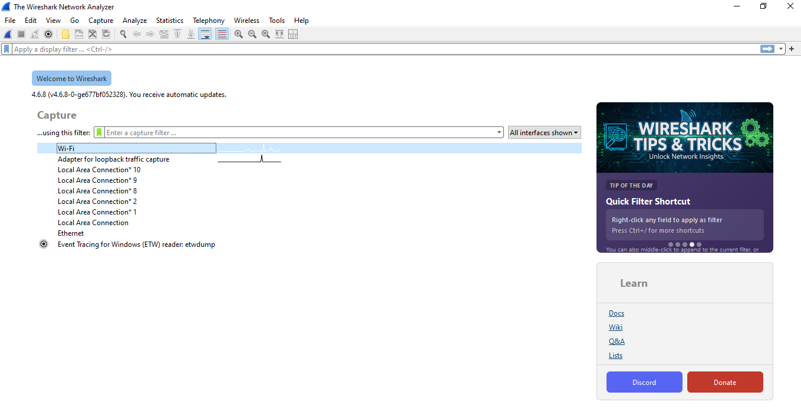<br>
  <em>Exhibit 1 — Wireshark 4.6.8 start screen with the <code>Wi-Fi</code> interface highlighted</em>
</p>

### Step 2 — Start a live capture ✅

<p align="center">
  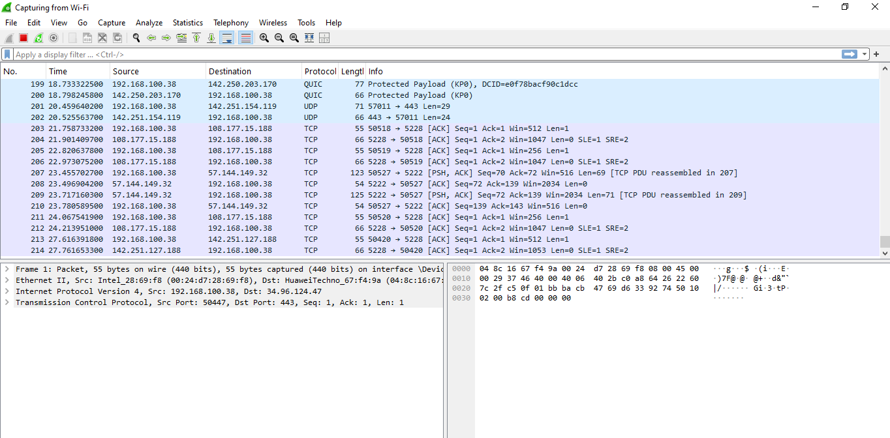<br>
  <em>Exhibit 2 — Capture running on Wi-Fi with no display filter, showing TCP, QUIC and UDP traffic</em>
</p>

### Step 3 — Record the local network details ✅

```
ipconfig
```

<p align="center">
  <br>
  <em>Exhibit 3 — <code>ipconfig</code>: the Wi-Fi adapter has IPv4 <code>192.168.100.38</code>, mask <code>255.255.255.0</code>, gateway <code>192.168.100.1</code></em>
</p>

---

<a id="case-1"></a>
## 🟢 Case 1 — DNS Query Failure

**Objective:** Look up a domain that does not exist, then use Wireshark to prove the DNS reply code is NXDOMAIN and not a network or server fault.

### Step 4 — Trigger the failing lookup ✅

```
nslookup nonexistentdomain12345.com
```

<p align="center">
  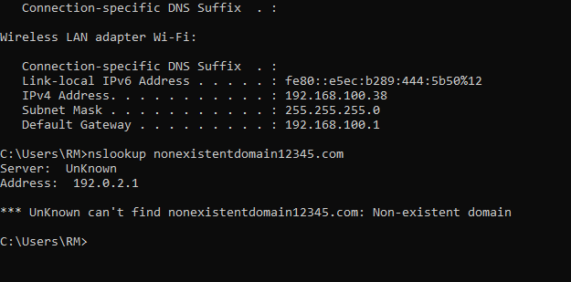<br>
  <em>Exhibit 4 — <code>nslookup</code> answers "Non-existent domain" from server <code>192.0.2.1</code></em>
</p>

### Step 5 — Look at all DNS traffic first ✅

```
dns
```

<p align="center">
  <br>
  <em>Exhibit 5 — The <code>dns</code> filter: queries go to <code>192.0.2.1</code>, and later rows go to <code>192.0.2.2</code></em>
</p>

### Step 6 — Isolate the failing query ✅

```
dns.qry.name contains "nonexistentdomain"
```

<p align="center">
  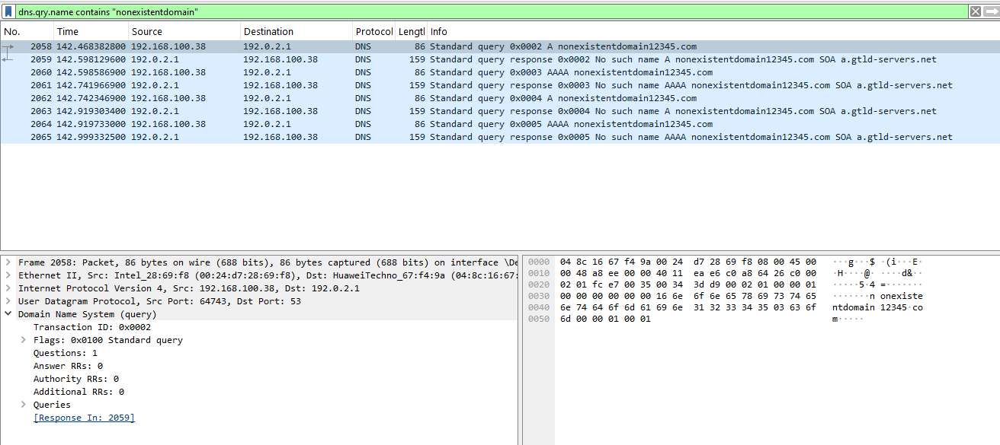<br>
  <em>Exhibit 6 — 8 packets left: four queries (A, AAAA, A, AAAA) and four "No such name" responses. Frame 2058 is the first query, flags <code>0x0100</code></em>
</p>

### 🕒 Case 1 Packet Timeline

Capture-relative times from Exhibit 6, all between the PC `192.168.100.38` and the resolver `192.0.2.1`:

| Frame | Time (s) | Direction | Info |
|:---:|:---:|:---:|---|
| 2058 | 142.468 | PC → resolver | Standard query `0x0002` A |
| 2059 | 142.598 | resolver → PC | Response `0x0002` **No such name**, SOA `a.gtld-servers.net` |
| 2060 | 142.599 | PC → resolver | Standard query `0x0003` AAAA |
| 2061 | 142.742 | resolver → PC | Response `0x0003` **No such name** |
| 2062 | 142.742 | PC → resolver | Standard query `0x0004` A |
| 2063 | 142.919 | resolver → PC | Response `0x0004` **No such name** |
| 2064 | 142.920 | PC → resolver | Standard query `0x0005` AAAA |
| 2065 | 142.999 | resolver → PC | Response `0x0005` **No such name** |

### Step 7 — Read the NXDOMAIN response ✅

<p align="center">
  <br>
  <em>Exhibit 7 — Frame 2059: flags <code>0x8183</code> Standard query response, "No such name", with an SOA record for <code>com</code> from <code>a.gtld-servers.net</code></em>
</p>

**Analysis notes (English version of Exhibit 8):**

<p align="center">
  <br>
  <em>Exhibit 8 — My own Case 1 notes, written in Hinglish</em>
</p>

- The client tried to resolve `nonexistentdomain12345.com` (A and AAAA records).
- The resolver `192.0.2.1` replied "No such name" (NXDOMAIN).
- The response flags read `0x8183 Standard query response, No such name`.
- The authority section holds an SOA record from `a.gtld-servers.net`.
- Conclusion: a normal NXDOMAIN failure, not a server-side problem.

🎯 **Result:** The name does not exist. The resolver answered with NXDOMAIN, so this is a "name not found" result and not a DNS outage.

| Field | Value |
|---|---|
| Query | `A` and `AAAA` for `nonexistentdomain12345.com` (each sent twice) |
| Resolver | `192.0.2.1`, port 53 (set manually, Exhibit 16) |
| Response flags | `0x8183` — response, recursion desired, recursion available, reply code **3 (No such name)** |
| Authority section | SOA for `com`, primary server `a.gtld-servers.net` |
| Answer records | 0 |
| Response time | 129.7 ms (frame 2059 answers frame 2058) |
| Source MAC of the reply | `04:8c:16:67:f4:9a`, the same MAC as the gateway in Exhibit 19 |

### 🗺️ What the Reply Decides

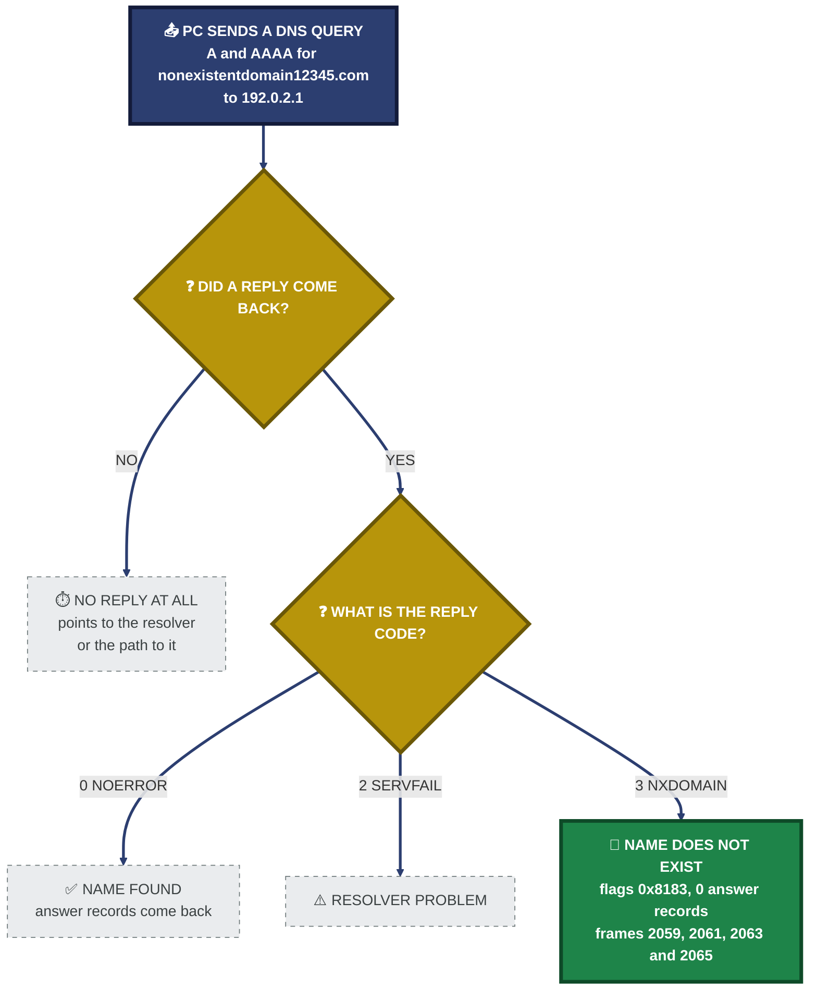
<p align="center"><em>Green is what the capture showed (Exhibits 6 and 7). Dashed boxes are other possible outcomes that did not happen here.</em></p>

### 🔍 Analyst Note — How This Would Be Handled in Production

- **Step 1:** Check the spelling of the name. A typo is the most common reason for NXDOMAIN.
- **Step 2:** If the name should exist, ask another resolver and compare the answers. If they differ, the first resolver has a problem.
- **Step 3:** Read the reply code. NXDOMAIN (3) means the name is missing. No reply at all, or SERVFAIL (2), points to the resolver or the path to it.

---

<a id="case-2"></a>
## 🟠 Case 2 — TCP Retransmission

**Objective:** Download a large file and capture TCP segments being sent again, then read Wireshark's analysis flags as evidence.

### Step 8 — Reset the capture ✅

The capture was restarted without saving, so Case 2 traffic would not be mixed with Case 1's DNS packets.

<p align="center">
  <br>
  <em>Exhibit 9 — The "Unsaved packets" dialog when restarting the capture, with the Case 1 DNS packets still on screen</em>
</p>

<p align="center">
  <br>
  <em>Exhibit 10 — Fresh capture with an empty list. The old Case 1 filter is still applied, which is why nothing shows</em>
</p>

### Step 9 — Generate slow-link traffic 📝

Downloaded a 1 GB test file (`1Gb.dat`) at about 130 KB/s, slow enough for TCP to resend lost segments. There is **no screenshot of the download or its speed**. This step comes from my notes in Exhibit 15.

### Step 10 — Filter for retransmissions ✅

```
tcp.analysis.retransmission
```

<p align="center">
  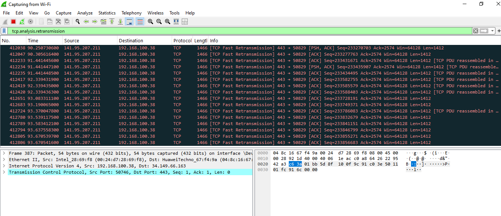<br>
  <em>Exhibit 11 — Rows flagged <code>[TCP Fast Retransmission]</code> from <code>141.95.207.211</code> port 443 to <code>192.168.100.38</code> port 50829, all with <code>Len=1412</code>. The detail pane below shows an unrelated packet; see Exhibit 12 for a flagged one</em>
</p>

### Step 11 — Open one retransmitted packet ✅

<p align="center">
  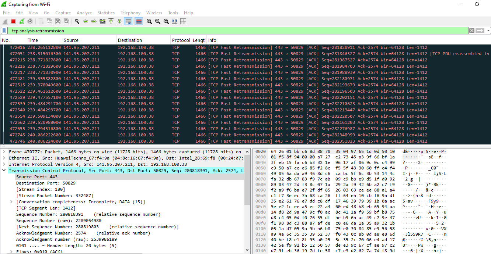<br>
  <em>Exhibit 12 — Frame 470777 (1466 bytes): source port 443, destination port 50829, stream index 180, TCP segment length 1412, next sequence number = sequence number + 1412</em>
</p>

### Step 12 — Confirm the retransmitted data field ✅

<p align="center">
  <br>
  <em>Exhibit 13 — <code>Retransmitted TCP segment data (1412 bytes)</code> selected, with the 1412 payload bytes highlighted</em>
</p>

<p align="center">
  <br>
  <em>Exhibit 14 — <code>SEQ/ACK analysis</code> selected: window 501 (calculated 64128), client contiguous streams 1, server contiguous streams 7</em>
</p>

**Analysis notes (English version of Exhibit 15):**

<p align="center">
  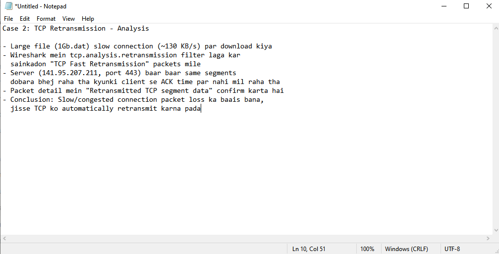<br>
  <em>Exhibit 15 — My own Case 2 notes, written in Hinglish</em>
</p>

- A large file (`1Gb.dat`) was downloaded over a slow connection (about 130 KB/s).
- The `tcp.analysis.retransmission` filter showed "hundreds" of `TCP Fast Retransmission` packets.
- The server (`141.95.207.211`, port 443) kept re-sending the same segments.
- The packet detail field `Retransmitted TCP segment data` confirms it.
- Conclusion: the slow or congested connection caused packet loss, so TCP had to retransmit.

🎯 **Result:** Wireshark flagged repeated `[TCP Fast Retransmission]` packets on one download stream. The capture proves that segments were re-sent. It does not by itself prove where the loss happened; that part is my reading of the notes.

| Field | Value |
|---|---|
| Filter | `tcp.analysis.retransmission` |
| Stream | `141.95.207.211:443` → `192.168.100.38:50829` (stream index 180) |
| Wireshark flag | `[TCP Fast Retransmission]` |
| Segment size | 1412 bytes of data per packet (1466 bytes on the wire) |
| Frames seen in the screenshots | 412,038 up to 549,604 |
| Marker | `Retransmitted TCP segment data (1412 bytes)` |

### 🗺️ What the Sender Does When Data Is Lost

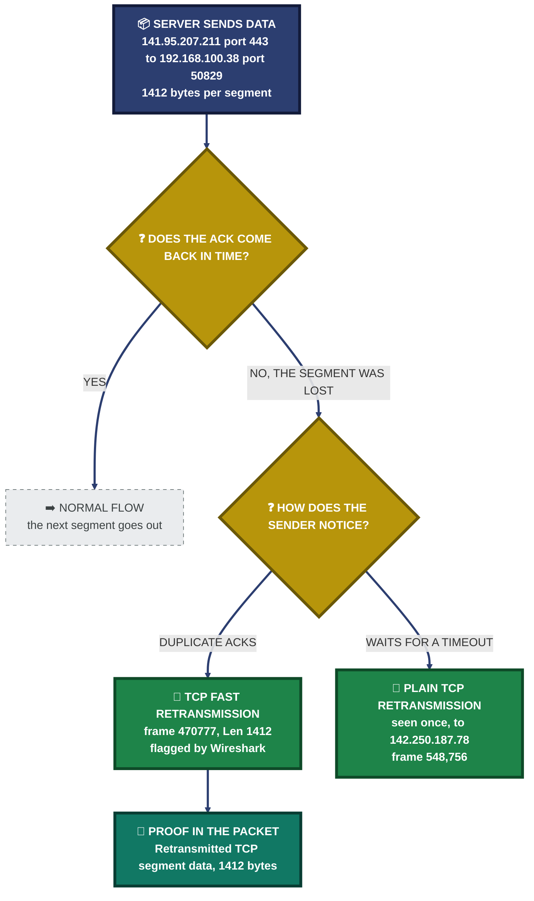
<p align="center"><em>Green is what Wireshark flagged (Exhibits 11 to 14). The diagram shows TCP's decision path. It cannot show where the loss happened, because the capture does not prove that.</em></p>

### 🔍 Analyst Note — How This Would Be Handled in Production

- **Step 1:** Find the stream (server address, port, stream index) and check whether the retransmissions sit on one stream or on many.
- **Step 2:** Check other servers too. Exhibit 14 also shows a plain `[TCP Retransmission]` to a different server (`142.250.187.78`, frame 548,756). That hints the problem is not limited to one server, so look at the local link (Wi-Fi signal, congestion) before blaming the server.
- **Step 3:** Know the two labels. Wireshark says **Fast Retransmission** when the re-sent segment follows duplicate ACKs, meaning the receiver kept asking for a missing segment. A plain **Retransmission** usually means the sender waited for a timeout.

---

<a id="case-3"></a>
## 🟣 Case 3 — ARP Conflict Detection

**Objective:** Re-apply the PC's own IPv4 address and use Wireshark to watch Windows' built-in duplicate-IP check over ARP.

### Step 13 — Re-apply the same static IP ✅

<p align="center">
  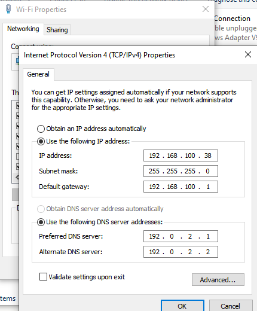<br>
  <em>Exhibit 16 — IPv4 properties set by hand: <code>192.168.100.38</code>, mask <code>255.255.255.0</code>, gateway <code>192.168.100.1</code>, DNS <code>192.0.2.1</code> and <code>192.0.2.2</code></em>
</p>

### Step 14 — Filter for ARP activity ✅

```
arp
```

<p align="center">
  <br>
  <em>Exhibit 17 — Three broadcast <code>ARP Probe</code> packets, then one <code>ARP Announcement for 192.168.100.38</code>, all from the PC's MAC</em>
</p>

### 🕒 Case 3 ARP Timeline

Capture-relative times from Exhibit 17:

| Frame | Time (s) | Sender | Info |
|:---:|:---:|---|---|
| 845472 | 2681.52 | PC (Intel_28:69:f8) → Broadcast | `Who has 192.168.100.38?` (ARP Probe) |
| 845481 | 2682.52 | PC → Broadcast | `Who has 192.168.100.38?` (ARP Probe) |
| 845489 | 2683.53 | PC → Broadcast | `Who has 192.168.100.38?` (ARP Probe) |
| 845495 | 2684.53 | PC → Broadcast | `ARP Announcement for 192.168.100.38` |
| 845580 | 2686.73 | Router → PC | `Who has 192.168.100.38? Tell 192.168.100.1` |
| 845581 | 2686.73 | PC → Router | `192.168.100.38 is at 00:24:d7:28:69:f8` |

### Step 15 — Check for a second MAC answering ✅

```
arp.opcode == 2 && arp.src.proto_ipv4 == 192.168.100.38
```

<p align="center">
  <br>
  <em>Exhibit 18 — 14 ARP replies across the whole capture, every one saying <code>192.168.100.38 is at 00:24:d7:28:69:f8</code></em>
</p>

### Step 16 — Cross-check with the ARP table ✅

```
arp -a
```

<p align="center">
  <br>
  <em>Exhibit 19 — The PC's ARP table has one dynamic entry: gateway <code>192.168.100.1</code> at <code>04-8c-16-67-f4-9a</code>. The rest are static broadcast and multicast entries</em>
</p>

**Analysis notes (English version of Exhibit 20):**

<p align="center">
  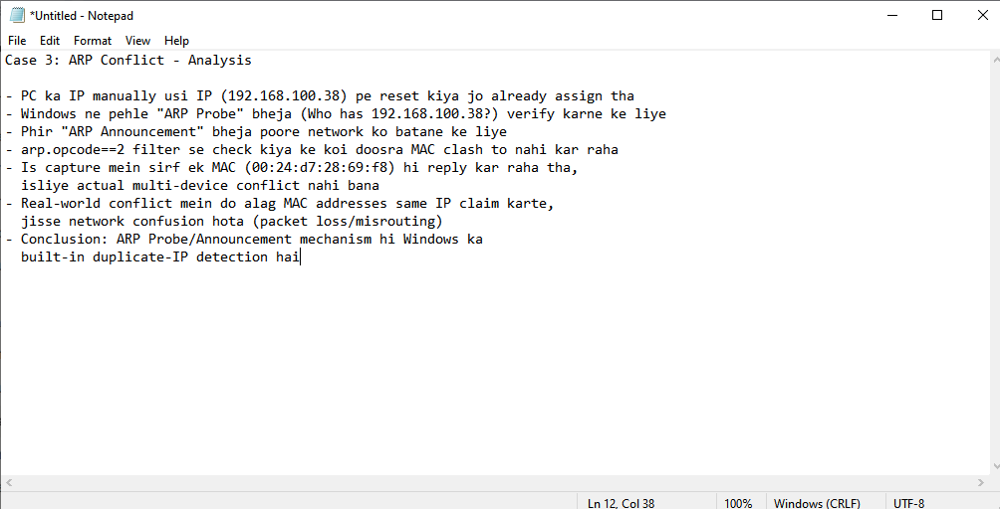<br>
  <em>Exhibit 20 — My own Case 3 notes, written in Hinglish</em>
</p>

- The PC's IP was reset by hand to the same IP it already had (`192.168.100.38`).
- Windows first sent an ARP Probe ("Who has 192.168.100.38?") to check the address.
- Then it sent an ARP Announcement to tell the network.
- The `arp.opcode==2` filter showed no other MAC clashing.
- Only one MAC (`00:24:d7:28:69:f8`) replied, so no real multi-device conflict happened.
- In a real conflict, two different MACs claim the same IP, which causes confusion (packet loss or misrouting).
- Conclusion: the ARP Probe and Announcement is Windows' built-in duplicate-IP detection.

🎯 **Result:** Windows sent three ARP Probes and one Announcement for `192.168.100.38`, and only one MAC address ever answered for that IP. No conflict happened. What was proven is the detection step, not a conflict.

| Field | Value |
|---|---|
| Probes | 3 (frames 845472, 845481, 845489), about 1 second apart |
| Announcement | 1 (frame 845495) |
| Replies for `192.168.100.38` | 14, all from `00:24:d7:28:69:f8` |
| Second MAC seen | None |
| What a real conflict would show | Two different MAC addresses replying for the same IP |

### 🗺️ What Windows Does Before It Uses an Address

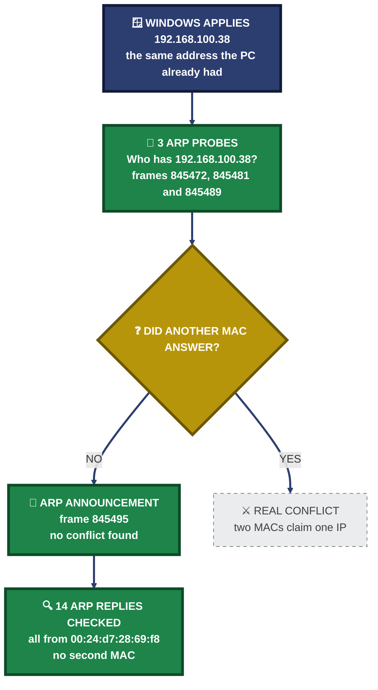
<p align="center"><em>Green is what the capture showed (Exhibits 17 to 19). The dashed box is the real conflict, which did not happen because only one device was used.</em></p>

### 🔍 Analyst Note — How This Would Be Handled in Production

- **Step 1:** Run the reply filter and look for two different MAC addresses answering for one IP.
- **Step 2:** Compare those MACs with `arp -a` on the affected PC and on the router.
- **Step 3:** Use the MAC vendor prefix and the router's DHCP lease list to find the second device, then move it to a different address.

---

<a id="coverage-snapshot"></a>
## 🌟 Coverage Snapshot

| 🛡️ Layer | ✅ Status | 📌 Detail |
|---|---|---|
| DNS | Tested | NXDOMAIN captured and decoded (`0x8183`) |
| TCP | Tested | Fast Retransmission flagged on one 1 GB download stream |
| ARP | Partly tested | Probe and Announcement seen; no second device, so no real conflict |
| Capture-wide statistics | Overview only | Protocol Hierarchy is complete; Conversations and I/O Graph were captured while still loading |


### 🧾 What the Evidence Proves

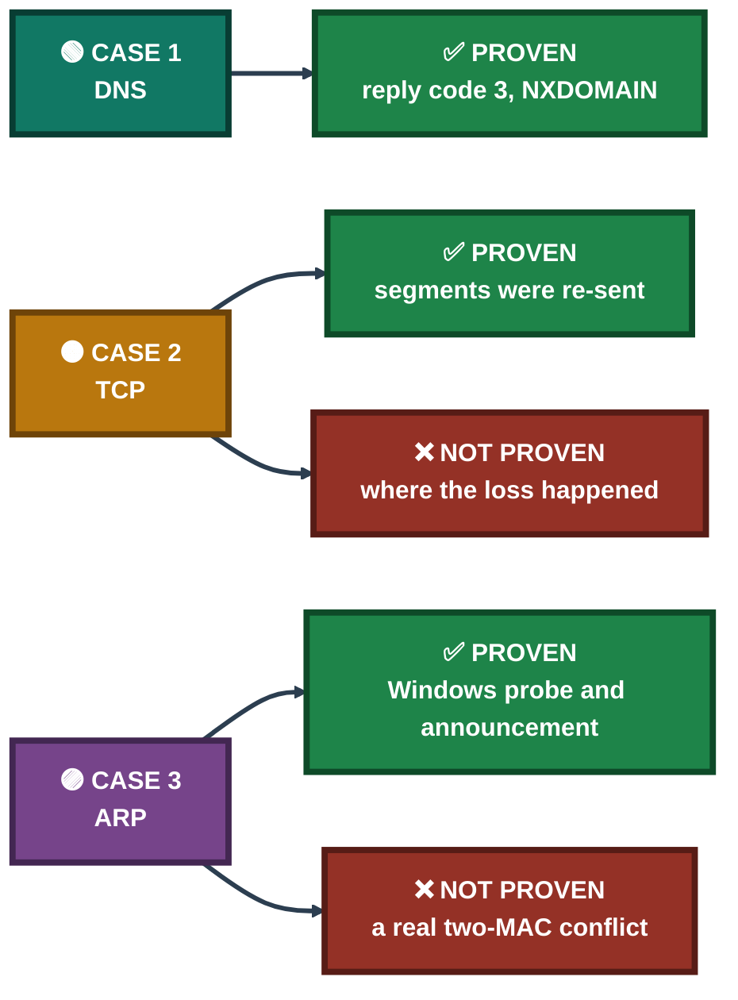

---

<a id="troubleshooting-pipeline"></a>
## 🧭 Troubleshooting Pipeline

How a vague complaint becomes a proven, documented finding

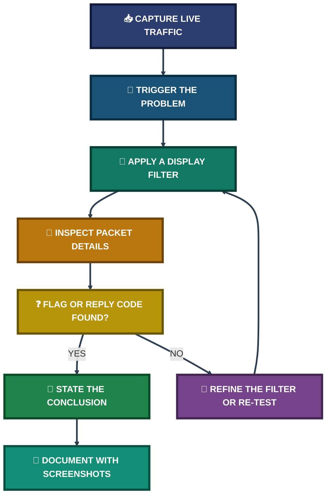

---

<a id="capture-wide-analysis"></a>
## 📈 Capture-Wide Analysis

Beyond the three cases, the whole capture was reviewed with Wireshark's statistics tools.

### Protocol Hierarchy ✅

<p align="center">
  <br>
  <em>Exhibit 21 — Statistics → Protocol Hierarchy, no display filter: 860,523 frames and about 728 MB in total</em>
</p>

| Protocol | Share of packets | Packets | Share of bytes |
|---|:---:|:---:|:---:|
| TCP | 87.2% | 750,406 | 2.3% (own header data) |
| TLS (inside TCP) | 29.7% | 255,912 | 73.0% |
| UDP | 12.7% | 109,172 | 0.1% |
| QUIC (inside UDP) | 12.2% | 105,089 | 9.8% |
| DNS | 0.4% | 3,417 | 0.0% |
| IPv6 | 0.1% | 719 | 0.0% |

### Conversations ⚠️

<p align="center">
  <br>
  <em>Exhibit 22 — Statistics → Conversations: 752 TCP and 1,557 UDP conversations (also 237 IPv4, 12 IPv6, 9 Ethernet). The window still says "Loading", and rows are sorted by address, so the heaviest stream is not visible</em>
</p>

### I/O Graph ⚠️

<p align="center">
  <br>
  <em>Exhibit 23 — Statistics → I/O Graph, 1-second intervals: "All Packets" and "TCP Errors" (<code>tcp.analysis.flags</code>). One spike near 1,150 to 1,200 s; the TCP Errors series is too small to see at this scale</em>
</p>

The ⚠️ items are an overview only. They do not back up any finding above.

---

<a id="saved-capture"></a>
## 💾 Saved Capture

<p align="center">
  <br>
  <em>Exhibit 24 — Save dialog in <code>C:\Users\RM\Documents</code>: an earlier <code>case3-arp-conflict-full-capture.pcapng</code> is listed, and the new file name is <code>sample-capture</code> (pcapng, uncompressed)</em>
</p>

<p align="center">
  <br>
  <em>Exhibit 25 — Documents folder: <code>sample-capture</code> (type "Wireshark capture", modified 9/15/2026 5:43 PM). The full-capture file from Exhibit 24 is not in the folder</em>
</p>

The full capture (860,523 packets) was not kept. A separate `sample-capture` file was saved to confirm the save and export workflow.

---

<a id="filter-reference"></a>
## 🧰 Filter Reference

| # | Display Filter | Used In | Purpose |
|:---:|---|---|---|
| 1 | `dns` | Case 1 | Show all DNS traffic |
| 2 | `dns.qry.name contains "nonexistentdomain"` | Case 1 | Isolate the failing query and its replies |
| 3 | `tcp.analysis.retransmission` | Case 2 | Show segments Wireshark flags as re-sent |
| 4 | `arp` | Case 3 | Show all ARP probes, announcements, requests and replies |
| 5 | `arp.opcode == 2 && arp.src.proto_ipv4 == 192.168.100.38` | Case 3 | Show only ARP replies that claim `192.168.100.38` |
| 6 | `tcp.analysis.flags` | I/O Graph | Plot TCP problems over time ("TCP Errors" series) |

---

<a id="project-summary"></a>
## 📝 Project Summary

**Summary notes (English version of Exhibit 26):**

<p align="center">
  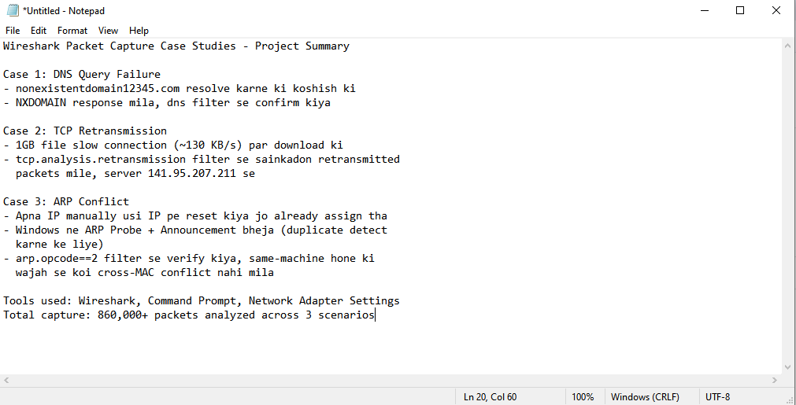<br>
  <em>Exhibit 26 — My own project summary notes, written in Hinglish. Tools used: Wireshark, Command Prompt, Network Adapter Settings</em>
</p>

| Case | Tooling | Key Finding |
|---|---|---|
| DNS Query Failure | Wireshark `dns` filters, `nslookup` | NXDOMAIN (`No such name`, reply code 3) confirmed in the response flags |
| TCP Retransmission | Wireshark `tcp.analysis.retransmission` | Repeated `[TCP Fast Retransmission]` packets on one download stream |
| ARP Conflict Detection | Wireshark `arp` filters, `arp -a`, adapter settings | Three ARP Probes and one Announcement; only one MAC replied, so no conflict |

---

<a id="challenges-fixes"></a>
## ⚠️ Challenges & Fixes

| ❌ Challenge | ✅ Fix |
|---|---|
| The Case 1 filter stayed applied after restarting the capture, so the list showed 0 packets (Exhibit 10) | Cleared the display filter before starting each new case |
| 📝 The 1 GB test-file link would not open in the browser | Downloaded the same link with Free Download Manager |
| Saving the full 860,523-packet capture did not end with a usable file (Exhibits 24 and 25) 📝 | Saved a separate `sample-capture` file to confirm the export workflow |
| No second device was available to reproduce a real ARP conflict | Documented the limit, and what a real two-MAC conflict would look like (Case 3) |

<sub>📝 = taken from my notes, no screenshot shows it.</sub>

---

<a id="scope-limitations"></a>
## 🚧 Scope & Limitations

- **No real ARP conflict:** Only one device was used. A PC cannot conflict with itself, so Case 3 shows the detection step only.
- **Cause of the loss is inferred:** Case 2 proves retransmissions happened. It does not prove whether the Wi-Fi link, the router or the server caused them.
- **Download not screenshotted:** The 1 GB download, its speed (about 130 KB/s) and the "hundreds" of retransmissions come from my notes. No screenshot shows the packet count or the speed.
- **Case 2 times not used:** The Time column in the Case 2 screenshots does not match the frame numbers of the same capture (frame 438,036 sits at 1,578 s in Exhibit 18's session, but Case 2 rows show times under 450 s). Frame numbers are used instead.
- **Statistics screenshots incomplete:** Conversations and I/O Graph were taken while Wireshark was still processing 860,523 packets.
- **Client-side view only:** The capture was taken on the PC, so it shows what arrived and left there, not what happened on the server.
- **Custom DNS:** Case 1 used manually set DNS servers in a reserved address block, answered by the router (see Environment).
- **Lab size:** One Windows PC and one home router.

These gaps are marked in the project instead of being hidden, so the results show what was actually proven.

---

<a id="what-i-learned"></a>
## 🧠 What I Learned

- **Filter in layers.** Start with `dns`, then narrow to one name with `dns.qry.name contains`. Reading a few packets is easier than reading 860,000.
- **Read the reply code, not just the text.** In `0x8183`, the last digit `3` is the NXDOMAIN code. A missing name and a broken DNS server look very different in the flags.
- **A Wireshark flag is evidence, not a root cause.** `[TCP Fast Retransmission]` proves segments were re-sent after duplicate ACKs. Where the loss happened still has to be argued from more data.
- **Capture position matters.** A capture on the client cannot show what the server saw.
- **ARP Probe and Announcement come from Windows itself.** Windows checks an address before it starts using it. A real conflict needs a second MAC replying for the same IP.
- **A screenshot must show the claim.** If a screenshot does not show a number or a result, it does not go into the results.

---

<a id="skills-demonstrated"></a>
## 🛠️ Skills Demonstrated

- Running live packet captures in Wireshark and choosing the right interface
- Writing display filters for DNS, TCP analysis flags and ARP
- Reading DNS flags, TCP sequence and acknowledgment fields and ARP request and reply types
- Using Statistics tools (Protocol Hierarchy, Conversations, I/O Graph) for a capture-wide view
- Cross-checking packet data with `ipconfig`, `nslookup` and `arp -a`
- Saving and exporting captures as `.pcapng`
- Separating proven results from notes and limits in project documentation

---

<a id="screenshot-index"></a>
## 🖼️ Screenshot Index

| # | File | Shows |
|:---:|---|---|
| 1 | `ss-01-wireshark-interface-select.PNG` | Wi-Fi interface selected on the Wireshark start screen |
| 2 | `ss-02-capture-start.PNG` | Live capture running with no filter |
| 3 | `ss-03-network-info.PNG` | `ipconfig` output for the Wi-Fi adapter |
| 4 | `ss-04-nxdomain-terminal-output.PNG` | `nslookup` "Non-existent domain" result |
| 5 | `s-05-dns-filter-applied.PNG` | `dns` filter with queries to both DNS servers |
| 6 | `ss-06-dns-query-packet-detail.PNG` | Query packet and the 8 filtered DNS packets |
| 7 | `ss-07-dns-nxdomain-response-detail.PNG` | NXDOMAIN response, flags `0x8183` |
| 8 | `ss-08-case1-annotated-analysis.PNG` | Case 1 analysis notes |
| 9 | `ss-09-capture-restart-dialog.PNG` | "Unsaved packets" dialog on restart |
| 10 | `ss-10-capture-restarted-fresh.PNG` | Restarted capture with the old filter still applied |
| 11 | `ss-11-tcp-retransmission-filter.PNG` | `tcp.analysis.retransmission` results |
| 12 | `ss-12-retransmitted-packet-detail.PNG` | Frame 470777 TCP fields |
| 13 | `ss-12a-retransmitted-packet-detai.PNG` | `Retransmitted TCP segment data` field |
| 14 | `ss-12b-retransmitted-packet-detail-seqack.PNG` | SEQ/ACK analysis fields |
| 15 | `ss-13-case2-annotated-analysis.PNG` | Case 2 analysis notes |
| 16 | `ss-17-ip-settings-manual.PNG` | Manual IPv4 and DNS settings |
| 17 | `ss-14-arp-conflict-probe-announcement.PNG` | ARP Probes and Announcement |
| 18 | `ss-15-arp-conflict-check.PNG` | ARP replies for `192.168.100.38` |
| 19 | `ss-18-arp-table-crosscheck.PNG` | `arp -a` table |
| 20 | `ss-16-case3-annotated-analysis.PNG` | Case 3 analysis notes |
| 21 | `ss-19-protocol-hierarchy.PNG` | Protocol Hierarchy statistics |
| 22 | `ss-20-conversations-tcp.PNG` | Conversations window (still loading) |
| 23 | `ss-21-io-graph.PNG` | I/O Graph |
| 24 | `ss-22-save-pcap-dialog.PNG` | Save Capture File As dialog |
| 25 | `ss-23-pcap-files-folder.PNG` | Documents folder with `sample-capture` |
| 26 | `ss-24-project-summary-doc.PNG` | Project summary notes |

---

<a id="repo-structure"></a>
## 📁 Repo Structure

```text
wireshark-case-studies-project/
|-- README.md
|-- wireshark-INDEX.md
`-- screenshots/
    |-- ss-01-wireshark-interface-select.PNG
    |-- ss-02-capture-start.PNG
    |-- ss-03-network-info.PNG
    |-- ss-04-nxdomain-terminal-output.PNG
    |-- s-05-dns-filter-applied.PNG
    |-- ss-06-dns-query-packet-detail.PNG
    |-- ss-07-dns-nxdomain-response-detail.PNG
    |-- ss-08-case1-annotated-analysis.PNG
    |-- ss-09-capture-restart-dialog.PNG
    |-- ss-10-capture-restarted-fresh.PNG
    |-- ss-11-tcp-retransmission-filter.PNG
    |-- ss-12-retransmitted-packet-detail.PNG
    |-- ss-12a-retransmitted-packet-detai.PNG
    |-- ss-12b-retransmitted-packet-detail-seqack.PNG
    |-- ss-13-case2-annotated-analysis.PNG
    |-- ss-14-arp-conflict-probe-announcement.PNG
    |-- ss-15-arp-conflict-check.PNG
    |-- ss-16-case3-annotated-analysis.PNG
    |-- ss-17-ip-settings-manual.PNG
    |-- ss-18-arp-table-crosscheck.PNG
    |-- ss-19-protocol-hierarchy.PNG
    |-- ss-20-conversations-tcp.PNG
    |-- ss-21-io-graph.PNG
    |-- ss-22-save-pcap-dialog.PNG
    |-- ss-23-pcap-files-folder.PNG
    `-- ss-24-project-summary-doc.PNG
```

<div align="center">

🦈 **[Wireshark](https://www.wireshark.org)** · 🪟 **[Windows](https://www.microsoft.com/windows)** · 📚 **[RFC 5227 — IPv4 Address Conflict Detection](https://datatracker.ietf.org/doc/html/rfc5227)** · 🧭 **[Troubleshooting Pipeline](#troubleshooting-pipeline)**

</div>
