<div align="center">

# 🔧 Open-Source Contribution — Uptime Kuma

**Project 04 of 4 — Tier-2 Support Portfolio**

Open-Source Bug Fix (Vue.js / Node.js)


A real bug on `louislam/uptime-kuma`, a popular self-hosted uptime monitoring tool, taken from a GitHub issue to a pull request: forked, run locally, traced to one method, fixed, and submitted under the project's own rules. Each result is backed by a screenshot, and every limit of the work is written down.

### [📑 Open the visual index](INDEX.md) · [🔗 View Pull Request #7882](https://github.com/louislam/uptime-kuma/pull/7882)

</div>

---

## 📑 Table of Contents

1. [At a Glance](#at-a-glance)
2. [Project Background](#project-background)
3. [Environment](#environment)
4. [Project Flow](#project-flow)
5. [Setup — Issue, Fork, Clone](#setup)
6. [Local Run — Getting the App Working](#local-run)
7. [Reproduce — Building the Bug Scenario](#reproduce)
8. [Investigate — Finding the Faulty Code](#investigate)
9. [Fix — Writing the Change](#fix)
10. [Submit — Pull Request and Checks](#submit)
11. [Coverage Snapshot](#coverage-snapshot)
12. [Contribution Pipeline](#contribution-pipeline)
13. [Command Reference](#command-reference)
14. [Project Summary](#project-summary)
15. [Challenges & Fixes](#challenges-fixes)
16. [Scope & Limitations](#scope-limitations)
17. [What I Learned](#what-i-learned)
18. [Skills Demonstrated](#skills-demonstrated)
19. [Screenshot Index](#screenshot-index)
20. [Repo Structure](#repo-structure)

---

<a id="at-a-glance"></a>
## 📊 At a Glance

| 🐛 Issue Fixed | 🖼️ Screenshots | 📄 Files Changed | ➕ Lines Added | ➖ Lines Removed | 💰 Cost |
|:---:|:---:|:---:|:---:|:---:|:---:|
| **#7062** | **20** | **1** | **14** | **7** | **$0** |

---

<a id="project-background"></a>
## 📖 Project Background

Tier-2 support is not only about fixing things for one user. It also means reading someone else's codebase, changing an existing system without breaking it, and explaining the change to a team that has never met you. Open-source contribution practises exactly that.

**Issue chosen:** [`louislam/uptime-kuma` #7062](https://github.com/louislam/uptime-kuma/issues/7062), "Allow a monitor to be dragged on top of the hierarchy". On the dashboard a monitor can be dragged into a group, but once it is inside there is no way to drag it back out. The only workaround is to open the monitor, edit it and clear its group field by hand.

- **Setup — Issue, Fork, Clone:** Claim the issue, fork the repository, clone it and read the contribution guide.
- **Local Run:** Get the app running on a Windows PC so the bug can be studied first-hand.
- **Reproduce:** Build a small group of test monitors to match the report.
- **Investigate and Fix:** Find the drop handler, and make the smallest change that fixes it.
- **Submit:** Open a pull request that follows the project's template and AI-disclosure rule.

> [!NOTE]
> The pull request is **still open**. As of this write-up it has passed its automated checks and has had a maintainer edit its title, but it has no formal review and is not merged. Items taken from my own notes, with no screenshot behind them, are marked 📝.

<div align="center">

### 🧩 Lab Setup at a Glance

<table>
<tr>
<td align="center" valign="top" width="42%">


**Development Machine**<br>
<sub>Git Bash (MINGW64)<br>Node.js <code>v24.14.1</code></sub>

</td>
<td align="center" valign="middle" width="16%">

**➜**<br>
<sub>fork and pull request</sub>

</td>
<td align="center" valign="top" width="42%">


**Application Under Test**<br>
<sub>Vite on <code>localhost:3000</code><br>Backend on <code>localhost:3001</code></sub>

</td>
</tr>
<tr>
<td colspan="3" align="center">

**Upstream repository** <code>louislam/uptime-kuma</code> (base branch <code>master</code>)<br>
<sub>Fork <code>malaika-azhar/uptime-kuma</code>, branch <code>patch-1</code>, pull request <code>#7882</code></sub>

</td>
</tr>
</table>

</div>

---

<a id="environment"></a>
## 🖧 Environment

| Item | Value |
|---|---|
| **Upstream Repository** | `louislam/uptime-kuma` (base branch `master`) |
| **Fork** | `malaika-azhar/uptime-kuma` |
| **Issue** | #7062 |
| **Pull Request** | #7882 (`malaika-azhar:patch-1` into `louislam:master`) |
| **Commit** | `28edc9c`, titled `fix-monitor-unparent`, marked Verified, dated Sep 19, 2026 (Exhibit 17) |
| **Stack** | Vue 3, Vite, Node.js, Socket.IO |
| **OS / Shell** | Windows, Git Bash (MINGW64) |
| **Node.js Version** | v24.14.1 |
| **Dev Servers** | Frontend (Vite) on `localhost:3000`, backend on `localhost:3001` |
| **File Changed** | `src/components/MonitorListItem.vue` |
| **Work Date** | Sep 16–19, 2026 |

> [!IMPORTANT]
> Node.js v24.14.1 is older than the version the project asks for (>= 26.2.0). `npm` printed `EBADENGINE` warnings (Exhibit 7), and the dev server still ran (Exhibit 10).

---

<a id="project-flow"></a>
## ⏱️ Project Flow

```mermaid
%%{init: {'flowchart': {'nodeSpacing': 30, 'rankSpacing': 40, 'htmlLabels': true}, 'themeVariables': {'fontSize': '14px'}}}%%
flowchart LR
    S1["🔵 SETUP<br/>issue, fork, clone"]:::setup --> S2["🟢 LOCAL RUN<br/>app on :3000 / :3001"]:::run
    S2 --> S3["🟠 REPRODUCE<br/>test group, 3 monitors"]:::repro
    S3 --> S4["🟣 INVESTIGATE<br/>find onDrop"]:::inv
    S4 --> S5["🔴 FIX<br/>1 file, +14 / -7"]:::fix
    S5 --> S6["📬 SUBMIT<br/>PR 7882 open"]:::sub
    S6 --> S7["⏳ REVIEW<br/>pending"]:::wait

    classDef setup fill:#1A5276,stroke:#0B2E43,stroke-width:2px,color:#FFFFFF,font-weight:bold
    classDef run fill:#117864,stroke:#083D33,stroke-width:2px,color:#FFFFFF,font-weight:bold
    classDef repro fill:#B9770E,stroke:#6E4409,stroke-width:2px,color:#FFFFFF,font-weight:bold
    classDef inv fill:#76448A,stroke:#432752,stroke-width:2px,color:#FFFFFF,font-weight:bold
    classDef fix fill:#943126,stroke:#571C16,stroke-width:2px,color:#FFFFFF,font-weight:bold
    classDef sub fill:#1E8449,stroke:#0E4A28,stroke-width:2px,color:#FFFFFF,font-weight:bold
    classDef wait fill:#B7950B,stroke:#6B5807,stroke-width:2px,color:#FFFFFF,font-weight:bold
    linkStyle default stroke:#2C3E50,stroke-width:2px
```
<p align="center"><em>Colors distinguish each project stage. The screenshots show only one date, the fix commit on Sep 19, 2026 (Exhibit 17), so no clock times are drawn. Review is still pending.</em></p>

---

<a id="setup"></a>
## 🔵 Setup — Issue, Fork, Clone

**Objective:** Pick a real, well-scoped issue, say so publicly, and read the project's own rules before touching any code.

### Step 1 — Open the issue ✅

<p align="center">
  <br>
  <em>Exhibit 1 — Issue #7062, "Allow a monitor to be dragged on top of the hierarchy", labeled <code>help wanted</code> and <code>feature-request</code></em>
</p>

### Step 2 — Ask to be assigned ✅

<p align="center">
  <br>
  <em>Exhibit 2 — Comment posted: "I'd like to work on this, can I be assigned?" The Assignees box still reads "No one assigned"</em>
</p>

### Step 3 — Fork the repository ✅

<p align="center">
  <br>
  <em>Exhibit 3 — Repository forked to <code>malaika-azhar/uptime-kuma</code>, up to date with upstream</em>
</p>

### Step 4 — Clone it locally ✅

```
git clone <fork URL>
cd uptime-kuma
```

<p align="center">
  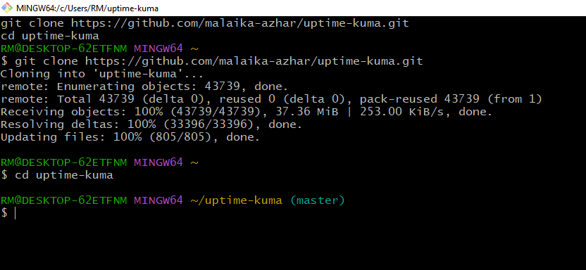<br>
  <em>Exhibit 4 — <code>git clone</code> and <code>cd uptime-kuma</code> completed in Git Bash, 43,739 objects received</em>
</p>

### Step 5 — Read the contribution guide ✅

<p align="center">
  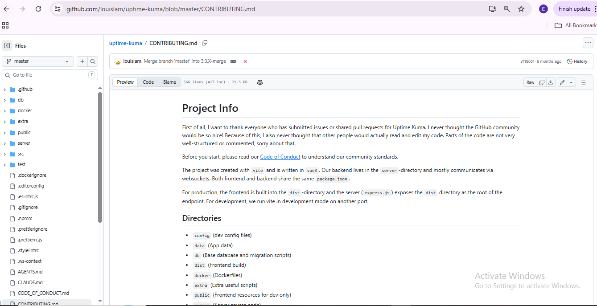<br>
  <em>Exhibit 5 — <code>CONTRIBUTING.md</code> reviewed before making any change, starting with the project info and directory structure</em>
</p>

🎯 **Result:** The issue was claimed in public, the fork and clone worked, and the project's rules were read first.

| Field | Value |
|---|---|
| Issue | #7062, labels `help wanted` and `feature-request` |
| Assignment | Requested in a comment. "No one assigned" is still shown in Exhibits 2 and 18 |
| Fork | `malaika-azhar/uptime-kuma` |
| Clone | 43,739 objects received in Git Bash |
| Rules read | `CONTRIBUTING.md` |

### 🔍 Analyst Note — How This Would Be Handled in Production

- **Step 1:** Read the project's contribution rules before writing code. They decide how a change must be sent in.
- **Step 2:** Comment on the issue first, so nobody else starts the same work without knowing.
- **Step 3:** Check for other open pull requests on the same issue before investing time.

---

<a id="local-run"></a>
## 🟢 Local Run — Getting the App Working

**Objective:** Run the actual application locally, so the reported behavior can be seen first-hand and not only read about.

### 🕒 Setup Attempt Timeline

| # | Command | Outcome | Evidence |
|:---:|---|---|:---:|
| 1 | `npm run setup` | Failed on a version pathspec. Node version checked instead | Exhibit 6 |
| 2 | `npm ci --omit dev` | 597 packages added. No pre-built `dist` bundle for a dev checkout | Exhibit 7 |
| 3 | `npm run dev` | Failed: `'concurrently' is not recognized` | Exhibit 8 |
| 4 | `npm install` | 633 packages added, dev dependencies included | Exhibit 9 |
| 5 | `npm run dev` | Vite on `:3000`, backend on `:3001` | Exhibit 10 |
| 6 | Browser | First-time setup finished, empty dashboard | Exhibit 11 |

### Step 6 — First setup attempt ✅

```
npm run setup
```

<p align="center">
  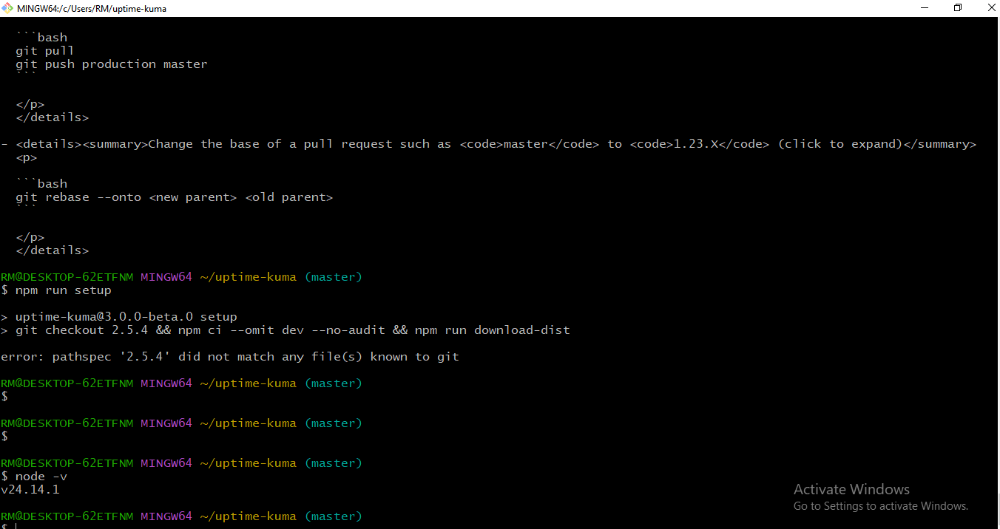<br>
  <em>Exhibit 6 — First <code>npm run setup</code> attempt failed on a version pathspec; local Node version (v24.14.1) confirmed instead</em>
</p>

### Step 7 — Install without dev dependencies ✅

```
npm ci --omit dev
```

<p align="center">
  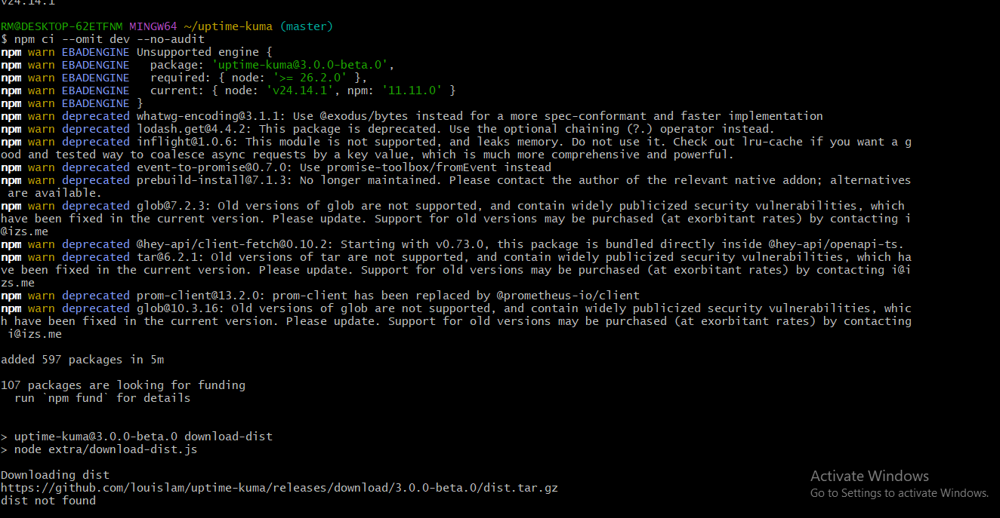<br>
  <em>Exhibit 7 — 597 packages installed with <code>EBADENGINE</code> warnings, but the pre-built <code>dist</code> bundle was not available for a dev checkout</em>
</p>

### Step 8 — Dev server fails ✅

<p align="center">
  <br>
  <em>Exhibit 8 — <code>npm run dev</code> failed: <code>'concurrently' is not recognized</code>, because dev dependencies had been skipped</em>
</p>

### Step 9 — Full reinstall ✅

```
npm install
```

<p align="center">
  <br>
  <em>Exhibit 9 — Full <code>npm install</code> without <code>--omit dev</code>, 633 packages added</em>
</p>

### Step 10 — Dev server starts ✅

```
npm run dev
```

<p align="center">
  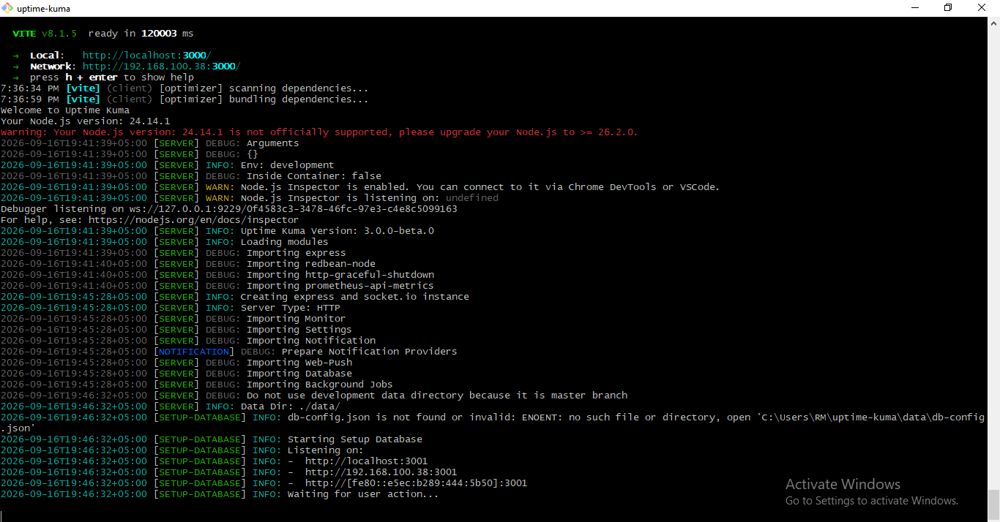<br>
  <em>Exhibit 10 — <code>npm run dev</code> succeeded: Vite frontend on <code>localhost:3000</code>, backend listening on <code>localhost:3001</code></em>
</p>

### Step 11 — Reach the dashboard ✅

<p align="center">
  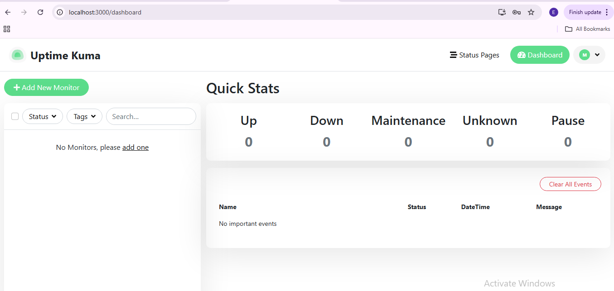<br>
  <em>Exhibit 11 — First-time setup completed. The live Uptime Kuma dashboard, empty and ready</em>
</p>

🎯 **Result:** The app runs locally. The first attempts failed for two clear reasons, a missing version pathspec and skipped dev dependencies, and a full `npm install` fixed the second one.

| Field | Value |
|---|---|
| Packages, first install | 597 (`npm ci --omit dev`) |
| Packages, full install | 633 added (`npm install`) |
| Frontend | Vite, `localhost:3000` |
| Backend | `localhost:3001` |
| Node.js | v24.14.1, below the requested >= 26.2.0, and it still ran |

### 🔍 Analyst Note — How This Would Be Handled in Production

- **Step 1:** Read the first error line, not the last. `'concurrently' is not recognized` names the missing tool.
- **Step 2:** Ask what an install flag skipped. `--omit dev` leaves out the tools that `npm run dev` needs.
- **Step 3:** Treat a version warning as a risk, not a stop sign. Note it, test, and record that it still worked.

---

<a id="reproduce"></a>
## 🟠 Reproduce — Building the Bug Scenario

**Objective:** Build the smallest set of test data that matches the report, before writing any fix.

### Step 12 — Create test monitors ✅

<p align="center">
  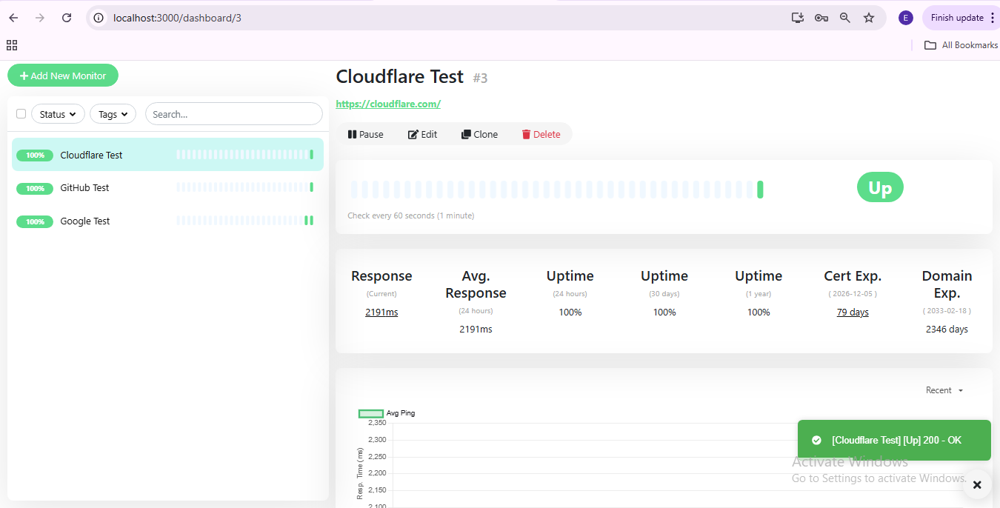<br>
  <em>Exhibit 12 — Three test monitors created (Cloudflare, GitHub, Google), all Up, to have something to group and drag</em>
</p>

### Step 13 — Create a group ✅

<p align="center">
  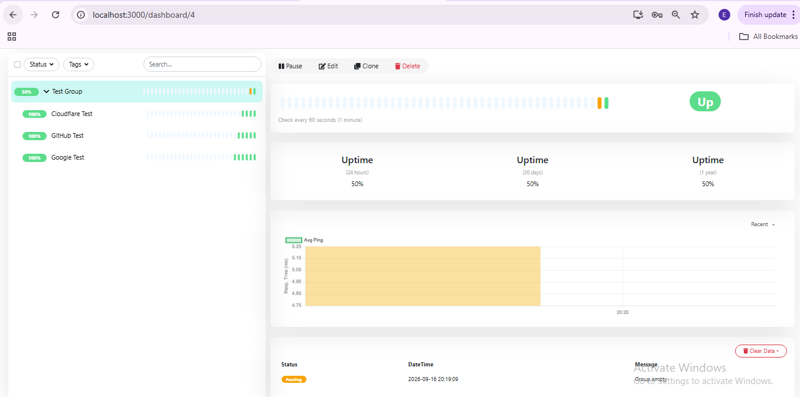<br>
  <em>Exhibit 13 — A Group-type monitor, <code>Test Group</code>, created to hold the other monitors</em>
</p>

### Step 14 — Confirm the nesting ✅

<p align="center">
  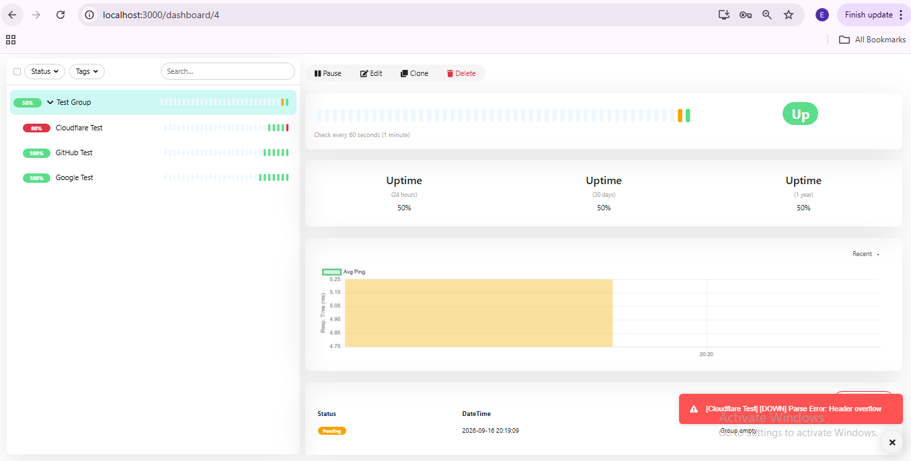<br>
  <em>Exhibit 14 — All three monitors nested under <code>Test Group</code>, confirmed by the "Monitor Group" field on the edit page</em>
</p>

### Step 15 — Watch the event history ✅

<p align="center">
  <br>
  <em>Exhibit 15 — Dashboard overview showing the group's live event history while testing continued</em>
</p>

### Step 16 — Try the drag-and-drop in the browser 📝

Manual drag-and-drop testing in the browser proved unreliable to show cleanly. There is **no screenshot of a drag attempt or of the failure**. This step comes from my notes, and the investigation moved to the code instead.

🎯 **Result:** The scenario from the issue was built (a group holding three monitors). The failing drag itself was **not** captured on screen. The bug was confirmed by reading the code (see Investigate).

| Field | Value |
|---|---|
| Test monitors | Cloudflare, GitHub, Google |
| Group | `Test Group`, Group type |
| Nesting | All three inside the group, confirmed on the edit page |
| Drag failure on screen | Not captured 📝 |

### 🔍 Analyst Note — How This Would Be Handled in Production

- **Step 1:** Write the reproduction as short steps: create a group, put a monitor inside, try to drag it out.
- **Step 2:** When a UI test is flaky, switch to a source that does not flicker, such as the code or the logs.
- **Step 3:** Say plainly what was and was not reproduced, so nobody trusts a claim the evidence does not show.

---

<a id="investigate"></a>
## 🟣 Investigate — Finding the Faulty Code

**Objective:** Find the exact function that handles the drop, and understand it before changing anything.

### Step 17 — Read `MonitorList.vue` ✅

<p align="center">
  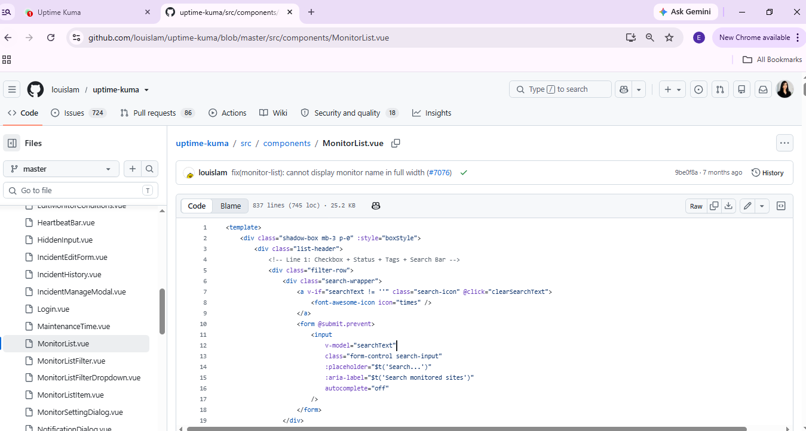<br>
  <em>Exhibit 16 — <code>src/components/MonitorList.vue</code> reviewed first. It renders the top-level list but does not contain the drag logic</em>
</p>

### Step 18 — Find the drop handler 📝

The handler sits in a sibling file, `src/components/MonitorListItem.vue`, in a method called `onDrop`. There is **no screenshot of this file before the fix**. The code below is quoted from the file, and Exhibit 17 is the only screenshot that touches it.

```js
async onDrop(event) {
    this.dragOverCount = 0;

    // Only groups accept drops
    if (this.monitor.type !== "group") {
        return;
    }
    // ...rest of the parenting logic
}
```

### 🐛 The Bug, Plainly

Every monitor stores a `parent` field: the ID of the group it belongs to, or `null` if it is top-level. Dropping a monitor on a group set that field correctly. But `onDrop` returned at once whenever the target was not a group, so a drop on a normal monitor, or outside a group, did nothing. No code path ever set `parent` back to `null`.

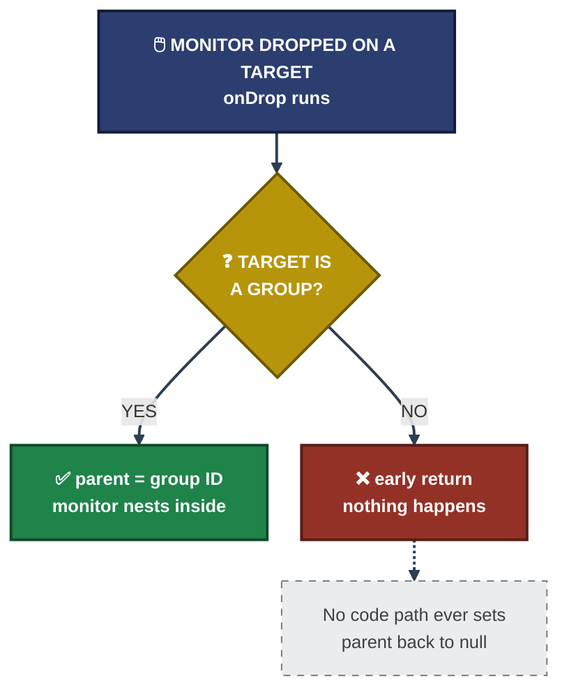
<p align="center"><em>Before the fix. Only the "group" branch ever changed the parent. This diagram shows the logic, it is not a screenshot.</em></p>

🎯 **Result:** The cause was found in the code: one guard clause that returns early for every non-group target.

| Field | Value |
|---|---|
| File read first | `src/components/MonitorList.vue`, no drag logic |
| File with the cause | `src/components/MonitorListItem.vue` |
| Method | `onDrop` |
| Cause | Early `return` when `this.monitor.type !== "group"` |
| Effect | A drop on a non-group target changes nothing |

### 🔍 Analyst Note — How This Would Be Handled in Production

- **Step 1:** Start at the file that renders the thing, then follow it to the file that handles the event.
- **Step 2:** Look for early exits. A guard clause that silently returns is a common place for a missing case.
- **Step 3:** State the cause in one line before writing any fix.

---

<a id="fix"></a>
## 🔴 Fix — Writing the Change

**Objective:** Make the smallest change that fixes the reported behavior, and be able to explain every line of it.

### Step 19 — Write the fix ✅

The early return was removed. The type of the drop target now decides the new parent:

```js
// If dropped on a group, nest inside it. Otherwise, un-parent it
// so it moves to the top level (fixes #7062).
const newParent = this.monitor.type === "group" ? this.monitor.id : null;
```

- **Drop on a group:** behaves as before, the monitor nests inside it.
- **Drop on anything else:** `parent` is set to `null`, so the monitor moves to the top level.
- **Everything else** in the method, meaning the optimistic UI update, the socket call that saves the change and the rollback on error, was left untouched.

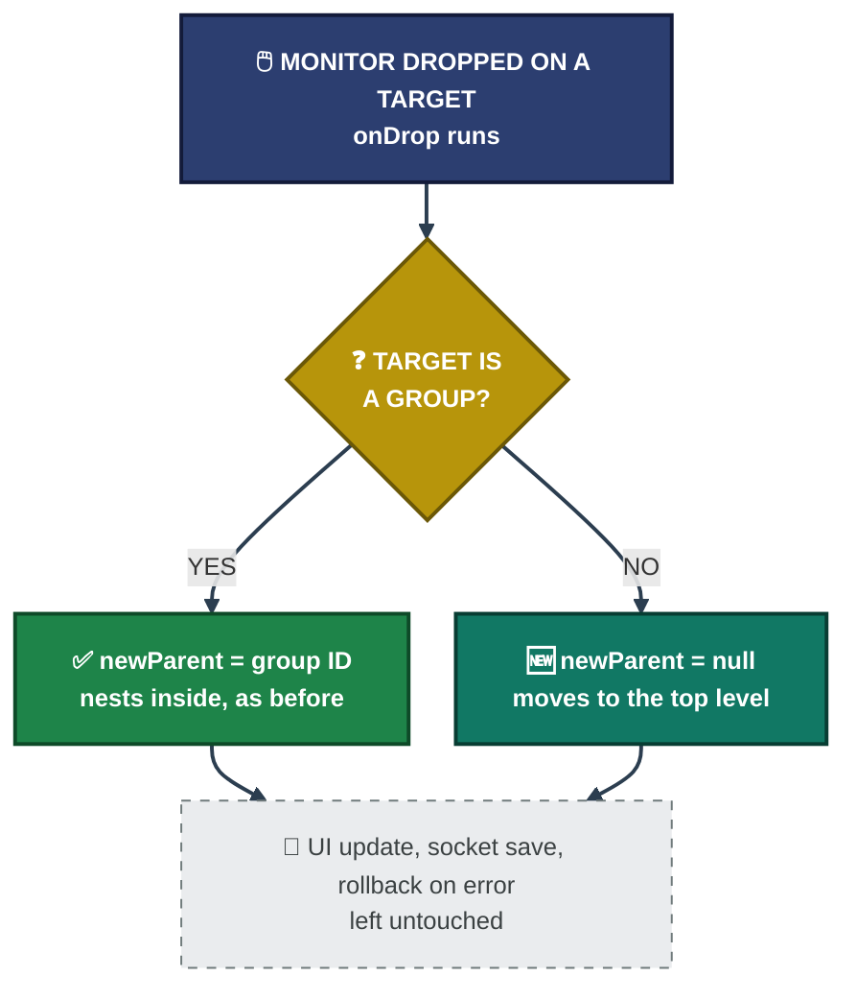
<p align="center"><em>After the fix. Both branches end in a valid parent value and the rest of the method is unchanged. This diagram shows the logic, it is not a screenshot.</em></p>

<p align="center">
  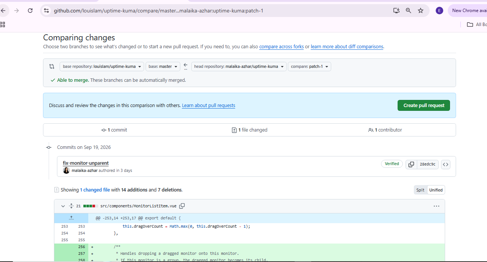<br>
  <em>Exhibit 17 — The compare view: 1 commit, 1 file, 14 additions and 7 deletions in <code>src/components/MonitorListItem.vue</code>. The commit <code>fix-monitor-unparent</code> (<code>28edc9c</code>) is dated Sep 19, 2026. The added lines include a new doc comment above the method</em>
</p>

🎯 **Result:** A one-file change that adds the missing "un-parent" case. It was checked by reading the code. It was **not** proven with a new automated test.

| Field | Value |
|---|---|
| File | `src/components/MonitorListItem.vue` |
| Diff | 14 additions, 7 deletions |
| Commit | `28edc9c`, `fix-monitor-unparent`, Verified |
| Commit date | Sep 19, 2026 |
| Behavior kept | Drop on a group nests the monitor, as before |
| Behavior added | Drop on a non-group target sets `parent` to `null` |

### 🔍 Analyst Note — How This Would Be Handled in Production

- **Step 1:** Keep the change as small as the cause. One file and one method is easy to review.
- **Step 2:** Check that the old path still works. Here that is a drop on a group.
- **Step 3:** Add a test if the area already has test coverage. Here the component had none, so none was added.

---

<a id="submit"></a>
## 📬 Submit — Pull Request and Checks

**Objective:** Send the change in the way the project asks, including its AI-disclosure rule, and record what happens next.

### 🕒 Pull Request Timeline

| Attempt | Result | Evidence |
|:---:|---|:---:|
| PR #7880 | Closed automatically by a bot, description did not match `PULL_REQUEST_TEMPLATE.md` | 📝 notes |
| PR #7881 | Closed automatically for the same reason | 📝 notes |
| PR #7882 | Open, 1 commit, 18 successful checks, 1 neutral | Exhibits 18 to 20 |

### Step 20 — Open the pull request ✅ / 📝

The first two attempts (#7880 and #7881) were closed by a repository bot because their descriptions did not match the required template. The closed pull requests had no "Reopen" option, so a fresh one (#7882) was opened from the same branch. The description was rewritten to follow the template, with an **AI Disclosure** section saying where AI assistance was used (investigating the code and drafting the fix) and that the change was reviewed and understood before it was sent. No screenshot shows the two closed pull requests, and the AI Disclosure section is not visible in the screenshots 📝.

<p align="center">
  <br>
  <em>Exhibit 18 — PR #7882, "Fix: Allow monitor to be dragged out of a group hierarchy", status Open, 1 commit into <code>louislam:master</code> from <code>malaika-azhar:patch-1</code>. The summary says "Fixed <code>onDrop</code> in <code>MonitorListItem.vue</code>" and it resolves #7062</em>
</p>

### Step 21 — Check the automated checks ✅

<p align="center">
  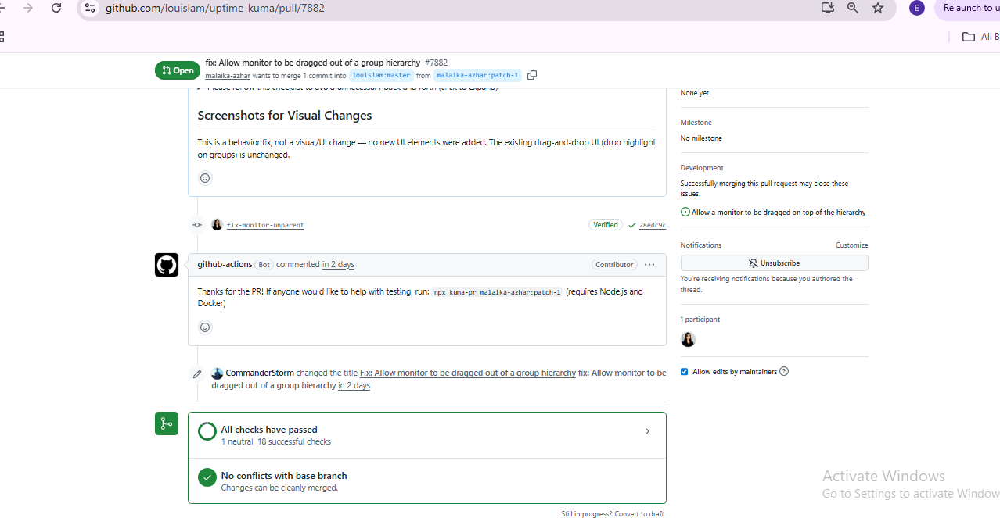<br>
  <em>Exhibit 19 — "All checks have passed": 1 neutral, 18 successful. A bot comment offers a test command, and the maintainer <code>CommanderStorm</code> changed the title to the lowercase form <code>fix: Allow monitor to be dragged out of a group hierarchy</code></em>
</p>

### Step 22 — Record the current status ✅

<p align="center">
  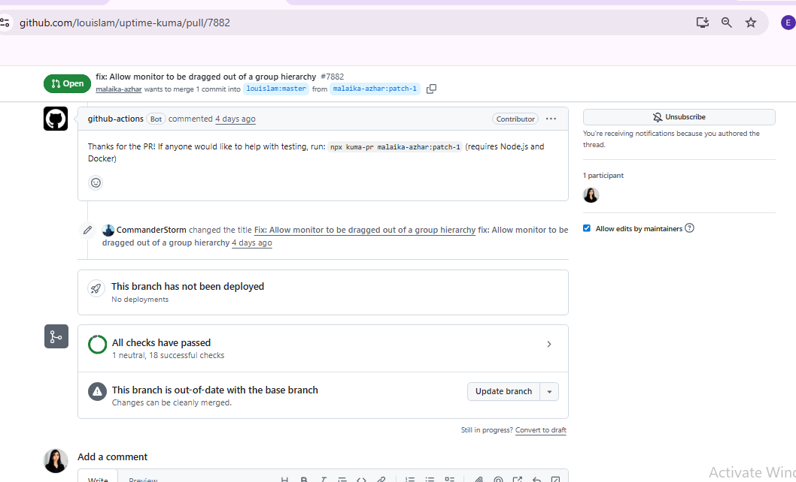<br>
  <em>Exhibit 20 — Status at the time of writing: Open, all checks passed, "Changes can be cleanly merged". The same box also says "This branch is out-of-date with the base branch" and offers an "Update branch" button</em>
</p>

🎯 **Result:** The pull request is open, its checks pass and it can be merged cleanly. There is no formal review and no merge yet, and the branch is behind the base branch.

| Field | Value |
|---|---|
| Pull request | #7882, Open |
| Title | `fix: Allow monitor to be dragged out of a group hierarchy` (edited by a maintainer) |
| Base and head | `louislam:master` ← `malaika-azhar:patch-1` |
| Checks | 18 successful, 1 neutral, 0 failed |
| Merge state | "Changes can be cleanly merged" |
| Branch state | Out-of-date with the base branch, "Update branch" offered |
| Reviews | None shown (Exhibit 18) |
| Assignee | "No one assigned" (Exhibits 2 and 18) |

### 🔍 Analyst Note — How This Would Be Handled in Production

- **Step 1:** Read the pull request template before opening, and fill in every section, including the AI-disclosure item.
- **Step 2:** "All checks passed" is not "approved". Watch for review comments and answer them quickly.
- **Step 3:** When the branch falls behind the base branch, update it, so the maintainer reviews a current version.

---

<a id="coverage-snapshot"></a>
## 🌟 Coverage Snapshot

| 🛡️ Layer | ✅ Status | 📌 Detail |
|---|---|---|
| Issue | Claimed | Assignment requested, "No one assigned" still shown |
| Local run | Tested | Vite on `:3000` and backend on `:3001` (Exhibit 10) |
| Bug reproduction | Partly tested | Test group built (Exhibit 14). The failing drag was not captured |
| Root cause | Found in code | Early return in `onDrop`, no screenshot of the original file |
| Fix | Submitted | 1 file, +14 −7 (Exhibit 17) |
| Automated tests | None added | The component had no existing test coverage |
| PR checks | Passed | 18 successful, 1 neutral (Exhibit 19) |
| Branch | Out of date | "Update branch" offered (Exhibit 20) |
| Maintainer review | Pending | No formal review yet |
| Merge | Not yet | Open at the time of writing |

---

<a id="contribution-pipeline"></a>
## 🧭 Contribution Pipeline

How a reported bug becomes a submitted, checked, reviewed pull request

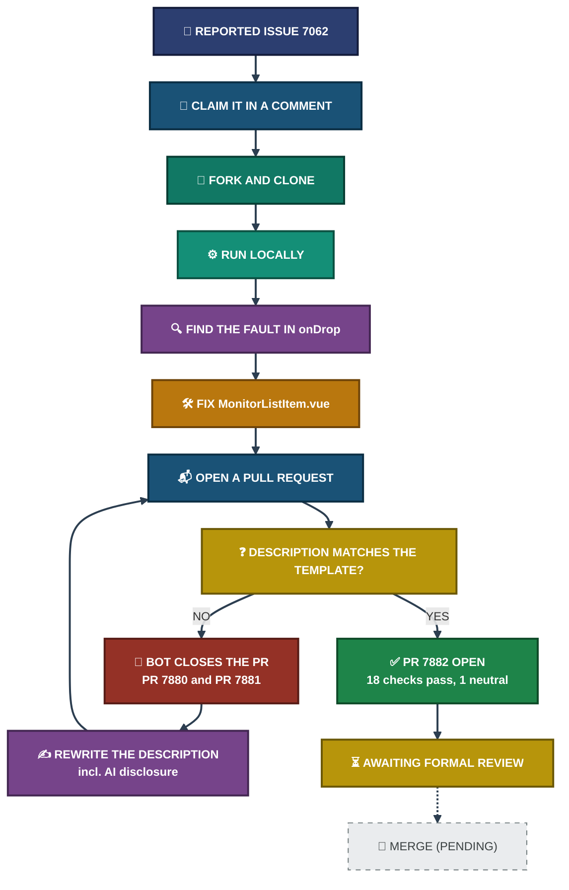
<p align="center"><em>The template loop ran twice in real life, from my notes 📝. The last box is dashed because the merge has not happened.</em></p>

---

<a id="command-reference"></a>
## 🧰 Command Reference

| # | Command | Used In | Purpose |
|:---:|---|---|---|
| 1 | `git clone` | Step 4 | Copy the fork to the PC |
| 2 | `cd uptime-kuma` | Step 4 | Enter the cloned project folder |
| 3 | `npm run setup` | Step 6 | Project setup script, failed on a version pathspec |
| 4 | `npm ci --omit dev` | Step 7 | Install locked packages without dev tools (597) |
| 5 | `npm install` | Step 9 | Full install with dev dependencies (633 added) |
| 6 | `npm run dev` | Steps 8 and 10 | Start the Vite frontend and the backend together |

---

<a id="project-summary"></a>
## 📝 Project Summary

| Stage | Tooling | Key Finding |
|---|---|---|
| Setup | GitHub, Git Bash | Issue #7062 claimed, repository forked and cloned, `CONTRIBUTING.md` read |
| Local Run | `npm`, Vite, Node v24.14.1 | App running on `:3000` and `:3001` after a full `npm install` |
| Reproduce | Uptime Kuma dashboard | Test group with three nested monitors. The failing drag was not captured |
| Investigate | GitHub source view | `onDrop` returns early for every non-group target |
| Fix and Submit | Git, GitHub | 1 file, +14 −7. PR #7882 open, 18 checks passed, review pending |

---

<a id="challenges-fixes"></a>
## ⚠️ Challenges & Fixes

| ❌ Challenge | ✅ Fix |
|---|---|
| `npm run setup` failed on a version pathspec that did not exist on `master` (Exhibit 6) | Ran `npm ci --omit dev` and later a full `npm install` directly instead |
| `npm run dev` failed with `'concurrently' is not recognized` because dev dependencies were skipped (Exhibit 8) | Ran `npm install` again without `--omit dev` (Exhibit 9) |
| Node.js v24.14.1 is below the requested >= 26.2.0 (Exhibit 7) | Went on anyway, and confirmed the dev server ran (Exhibit 10) |
| 📝 Manual drag-and-drop testing in the browser was unreliable to show | Confirmed the bug in the source code (`onDrop`) instead |
| 📝 The first two pull requests (#7880, #7881) were closed by a template bot | Rewrote the description to match `PULL_REQUEST_TEMPLATE.md`, including the AI-disclosure item |
| 📝 The closed pull requests had no "Reopen" option | Opened a fresh pull request (#7882) from the same branch |

<sub>📝 = taken from my notes, no screenshot shows it.</sub>

---

<a id="scope-limitations"></a>
## 🚧 Scope & Limitations

- **Not merged:** PR #7882 is open and passing checks. It has no formal review and no merge decision.
- **Branch out of date:** Exhibit 20 says the branch is behind the base branch (with an "Update branch" button), although the changes can be merged cleanly. It was not updated at the time of writing.
- **Assignment not confirmed:** The comment asked to be assigned, and "No one assigned" is still shown in Exhibits 2 and 18.
- **Another pull request on the issue:** The issue page (Exhibit 2) links `#7574`, "feat: allow dragging monitor out of group to root level". Its status is not visible in the screenshots, and it may cover the same behavior.
- **Bug shown in code, not on screen:** No screenshot shows the failing drag, and none shows `MonitorListItem.vue` before the fix. The cause comes from reading the code.
- **Two closed pull requests are not screenshotted:** #7880 and #7881 come from my notes 📝.
- **AI disclosure not visible:** The AI Disclosure section of the pull request is not shown in the screenshots.
- **Single file changed:** The fix covers one method in one file. Other drag-and-drop edge cases were not checked. The added lines include a new doc comment.
- **No automated test added:** The fix was checked by reading the code and by running the app, not by a new unit or end-to-end test, because the component had no existing coverage.
- **Unsupported Node.js version:** Node.js v24.14.1 is below the requested version, and the app still ran.
- **AI-assisted, human-reviewed:** Investigation and drafting used AI assistance, disclosed in the pull request as the project's policy asks. The change was reviewed and understood before it was sent.
- **Diagrams are illustrative:** The flowcharts show the logic of `onDrop` and the path the pull request took. The screenshots and the pull request itself are the evidence.
- **Lab size:** One Windows PC with local dev servers, and one fork.

These gaps are marked in the project instead of being hidden, so the results show what was actually proven.

---

<a id="what-i-learned"></a>
## 🧠 What I Learned

- **Reproducing a bug on screen and in code are different jobs.** Manual drag-and-drop testing was inconclusive, but reading the actual event handler gave a definite answer.
- **An early return is often where a missing feature hides.** The whole bug was one guard clause that skipped the un-parenting case.
- **Projects enforce process, not only code style.** A correct fix was closed twice for not following the pull request template. Process matters as much as the patch.
- **Disclosure builds trust.** Being open about AI help, and being able to explain the change afterward, is what separates a real contribution from what the project warns against.
- **"All checks passed" is not the finish line.** Green checks and a clean merge only mean the pull request can be merged. A person still has to agree it should be.
- **A screenshot must show the claim.** If a screenshot does not show a result, it does not go into the results.

---

<a id="skills-demonstrated"></a>
## 🛠️ Skills Demonstrated

- Navigating an unfamiliar, large open-source codebase (Vue 3, Node.js)
- Setting up a local development environment from scratch (`npm`, Vite, Git Bash on Windows)
- Diagnosing setup errors independently, from a missing version pathspec to skipped dev dependencies
- Reading existing event-handler logic before changing it
- Writing a minimal, targeted fix and explaining every line of it
- Following a project's contribution rules, including its pull request template and AI-disclosure policy
- Using Git and GitHub to fork, branch, commit and submit a pull request
- Separating proven results from notes and limits in project documentation

---

<a id="screenshot-index"></a>
## 🖼️ Screenshot Index

| # | File | Shows |
|:---:|---|---|
| 1 | `01_issue_page_opened.PNG` | Issue #7062 opened on GitHub |
| 2 | `02_comment_posted.PNG` | Assignment request comment |
| 3 | `03_forked_repo.PNG` | Repository forked |
| 4 | `04_git_clone_terminal.PNG` | `git clone` in Git Bash |
| 5 | `05_contributing_md_read.PNG` | `CONTRIBUTING.md` reviewed |
| 6 | `06_node_version_and_setup.PNG` | First setup attempt and Node version check |
| 7 | `07_npm_setup_complete.PNG` | `npm ci --omit dev` output |
| 8 | `08_dev_server_running.PNG` | `concurrently` missing error |
| 9 | `09_npm_install_and_dev_server.PNG` | Full `npm install`, 633 packages |
| 10 | `10_npm_install_output.PNG` | Vite dev server running |
| 11 | `11_local_run_success.PNG` | Dashboard live after first-time setup |
| 12 | `12_three_monitors_created.PNG` | Three test monitors created |
| 13 | `13_group_monitor_created.PNG` | "Test Group" monitor created |
| 14 | `14_monitors_auto_nested_in_group.PNG` | Monitors nested inside the group |
| 15 | `15_dashboard_overview_events.PNG` | Dashboard event history |
| 16 | `16_monitorlist_vue_source_code.PNG` | `MonitorList.vue` on GitHub |
| 17 | `17_git_diff_pr_comparison.PNG` | Compare view of the fix |
| 18 | `18_pr_opened_successfully.PNG` | PR #7882 opened, status Open |
| 19 | `19_checks_passed_maintainer_interaction.PNG` | All checks passed, maintainer title edit |
| 20 | `20_final_status_awaiting_review.PNG` | Open, mergeable, branch out of date, awaiting review |

---

<a id="repo-structure"></a>
## 📁 Repo Structure

```text
uptime-kuma-contribution-project/
|-- README.md
|-- INDEX.md
`-- screenshots/
    |-- 01_issue_page_opened.PNG
    |-- 02_comment_posted.PNG
    |-- 03_forked_repo.PNG
    |-- 04_git_clone_terminal.PNG
    |-- 05_contributing_md_read.PNG
    |-- 06_node_version_and_setup.PNG
    |-- 07_npm_setup_complete.PNG
    |-- 08_dev_server_running.PNG
    |-- 09_npm_install_and_dev_server.PNG
    |-- 10_npm_install_output.PNG
    |-- 11_local_run_success.PNG
    |-- 12_three_monitors_created.PNG
    |-- 13_group_monitor_created.PNG
    |-- 14_monitors_auto_nested_in_group.PNG
    |-- 15_dashboard_overview_events.PNG
    |-- 16_monitorlist_vue_source_code.PNG
    |-- 17_git_diff_pr_comparison.PNG
    |-- 18_pr_opened_successfully.PNG
    |-- 19_checks_passed_maintainer_interaction.PNG
    `-- 20_final_status_awaiting_review.PNG
```

<div align="center">

🔧 **[Uptime Kuma](https://github.com/louislam/uptime-kuma)** · 🐛 **[Issue #7062](https://github.com/louislam/uptime-kuma/issues/7062)** · 🔀 **[PR #7882](https://github.com/louislam/uptime-kuma/pull/7882)** · 📚 **[CONTRIBUTING.md](https://github.com/louislam/uptime-kuma/blob/master/CONTRIBUTING.md)** · 🧭 **[Contribution Pipeline](#contribution-pipeline)**

</div>
