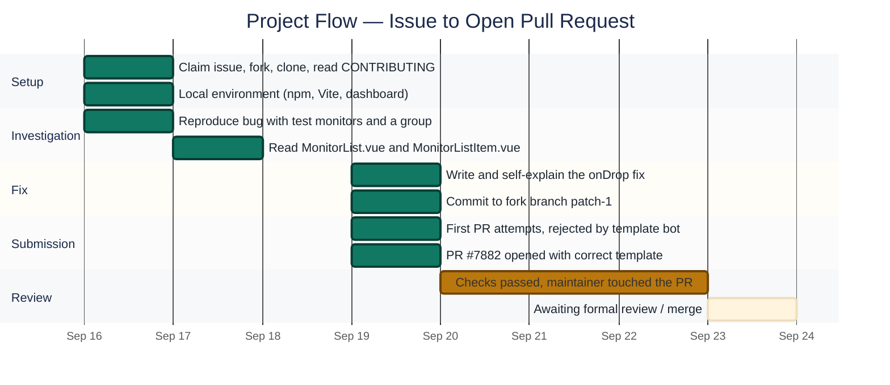
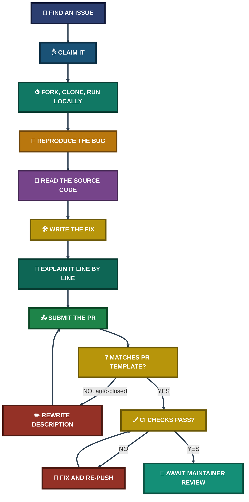

<div align="center">

# 🔧 Open-Source Contribution — Uptime Kuma

**Project 05 of 5 — Tier-2 Support Portfolio**

Open-Source Bug Fix (Vue.js / Node.js)


A real GitHub issue on [louislam/uptime-kuma](https://github.com/louislam/uptime-kuma) — a popular self-hosted uptime monitoring tool — picked up, forked, run locally, debugged, fixed, and submitted as a pull request following the project's own contribution rules.

### [🔗 View the Pull Request (#7882)](https://github.com/louislam/uptime-kuma/pull/7882)

</div>

---

## 📑 Table of Contents

1. [At a Glance](#at-a-glance)
2. [Project Background](#project-background)
3. [Environment](#environment)
4. [Project Flow](#project-flow)
5. [Step 1 — Find and Claim the Issue](#step-1)
6. [Step 2 — Fork, Clone, Read the Rules](#step-2)
7. [Step 3 — Local Environment Setup](#step-3)
8. [Step 4 — Reproduce the Bug](#step-4)
9. [Step 5 — Find the Faulty Code](#step-5)
10. [Step 6 — Write and Understand the Fix](#step-6)
11. [Step 7 — Submit the Pull Request](#step-7)
12. [Step 8 — Checks, Review, Status](#step-8)
13. [Contribution Pipeline](#contribution-pipeline)
14. [The Bug, Plainly](#the-bug)
15. [The Fix, Plainly](#the-fix)
15. [Challenges & Fixes](#challenges-fixes)
16. [Scope & Limitations](#scope-limitations)
17. [What I Learned](#what-i-learned)
18. [Skills Demonstrated](#skills-demonstrated)
19. [Screenshot Index](#screenshot-index)
20. [Repo Structure](#repo-structure)

---

<a id="at-a-glance"></a>
## 📊 At a Glance

| 🐛 Issue Fixed | 🖼️ Screenshots | 📄 Files Changed | ➕ Lines Added | ➖ Lines Removed | 💰 Cost |
|:---:|:---:|:---:|:---:|:---:|:---:|
| **#7062** | **20** | **1** | **14** | **7** | **$0** |

---

<a id="project-background"></a>
## 📖 Project Background

Tier-2 support work isn't only about fixing things for one user — it also means reading someone else's codebase, understanding an existing system without breaking it, and communicating changes clearly to a team that has never met you. Open-source contribution is a direct way to practice exactly that.

**Issue chosen:** [louislam/uptime-kuma #7062 — "Allow a monitor to be dragged on top of the hierarchy"](https://github.com/louislam/uptime-kuma/issues/7062)

**The problem, as reported:** On the Uptime Kuma dashboard, a monitor can be dragged into a group. Once it's inside that group, there is no way to drag it back out — the only workaround is opening the monitor, editing it, and manually clearing its group field.

**The fix, in one line:** the drag-and-drop handler only ever accepted a drop on a *group*. Dropping on anything else silently did nothing. The fix removes that restriction, so dropping on a non-group target un-parents the monitor instead.

> [!NOTE]
> This project follows the pull request from creation through to its current status. As of this write-up, PR **#7882** is **open**, has passed all 18 automated checks, and is awaiting maintainer review. It has not been merged yet — that part of the story is still ongoing at the time of writing.

---

<a id="environment"></a>
## 🖧 Environment

| Item | Value |
|---|---|
| **Repository** | [louislam/uptime-kuma](https://github.com/louislam/uptime-kuma) (forked to `malaika-azhar/uptime-kuma`) |
| **Issue** | [#7062](https://github.com/louislam/uptime-kuma/issues/7062) |
| **Pull Request** | [#7882](https://github.com/louislam/uptime-kuma/pull/7882) |
| **Branch** | `patch-1` (commit `fix-monitor-unparent`) |
| **Stack** | Vue 3, Vite, Node.js, Socket.IO |
| **OS / Shell** | Windows, Git Bash (MINGW64) |
| **Node version** | v24.14.1 (unofficially supported — project asks for `>= 26.2.0`; ran fine anyway) |
| **Dev servers** | Frontend (Vite) on `localhost:3000`, backend on `localhost:3001` |
| **File changed** | `src/components/MonitorListItem.vue` |
| **Work Date** | Sep 16–19, 2026 |

---

<a id="project-flow"></a>
## ⏱️ Project Flow


<p align="center"><em>Everything through PR submission is complete. Review and merge are still in progress as of this write-up.</em></p>

---

<a id="step-1"></a>
## 🔵 Step 1 — Find and Claim the Issue

**Objective:** Pick a real, well-scoped, beginner-friendly issue and signal intent to work on it before writing any code.

<p align="center">
  <br>
  <em>Exhibit 1 — Issue #7062, "Allow a monitor to be dragged on top of the hierarchy," labeled <code>help wanted</code> and <code>feature-request</code></em>
</p>

<p align="center">
  <br>
  <em>Exhibit 2 — Comment posted: "I'd like to work on this, can I be assigned?"</em>
</p>

---

<a id="step-2"></a>
## 🔵 Step 2 — Fork, Clone, Read the Rules

**Objective:** Get a personal copy of the repository, bring it down locally, and read the project's own contribution guide before touching anything.

<p align="center">
  <br>
  <em>Exhibit 3 — Repository forked to <code>malaika-azhar/uptime-kuma</code></em>
</p>

<p align="center">
  <br>
  <em>Exhibit 4 — <code>git clone</code> and <code>cd uptime-kuma</code> completed in Git Bash</em>
</p>

<p align="center">
  <br>
  <em>Exhibit 5 — <code>CONTRIBUTING.md</code> reviewed before making any changes</em>
</p>

---

<a id="step-3"></a>
## 🔵 Step 3 — Local Environment Setup

**Objective:** Get the actual application running locally so the reported bug could be seen firsthand, not just read about.

```
npm run setup
```

<p align="center">
  <br>
  <em>Exhibit 6 — First <code>npm run setup</code> attempt failed on a version pathspec; confirmed local Node version (<code>v24.14.1</code>) instead</em>
</p>

<p align="center">
  <br>
  <em>Exhibit 7 — <code>npm ci --omit dev</code> installed 597 packages, but the pre-built <code>dist</code> bundle wasn't available for a dev checkout</em>
</p>

<p align="center">
  <br>
  <em>Exhibit 8 — <code>npm run dev</code> failed: <code>'concurrently' is not recognized</code>, because dev dependencies had been skipped</em>
</p>

<p align="center">
  <br>
  <em>Exhibit 9 — Re-ran a full <code>npm install</code> (without <code>--omit dev</code>) — 633 packages added</em>
</p>

<p align="center">
  <br>
  <em>Exhibit 10 — <code>npm run dev</code> succeeded: Vite frontend on <code>localhost:3000</code>, backend listening on <code>localhost:3001</code></em>
</p>

<p align="center">
  <br>
  <em>Exhibit 11 — First-time setup completed; the live Uptime Kuma dashboard, empty and ready</em>
</p>

---

<a id="step-4"></a>
## 🔵 Step 4 — Reproduce the Bug

**Objective:** Build the minimum test data needed to see the exact behavior the issue describes, before writing a single line of fix code.

<p align="center">
  <br>
  <em>Exhibit 12 — Three test monitors created (Cloudflare, GitHub, Google) to have something to group and drag</em>
</p>

<p align="center">
  <br>
  <em>Exhibit 13 — A "Group" type monitor, <code>Test Group</code>, created to hold the other monitors</em>
</p>

<p align="center">
  <br>
  <em>Exhibit 14 — All three monitors nested under <code>Test Group</code>, confirmed via the "Monitor Group" field on the edit page</em>
</p>

<p align="center">
  <br>
  <em>Exhibit 15 — Dashboard overview showing the group's live event history while testing continued</em>
</p>

🎯 **Result:** manual drag-and-drop testing in the browser proved unreliable to demonstrate cleanly for documentation purposes, so the investigation moved to reading the actual event-handler code directly — which is where the real proof of the bug turned out to live anyway.

---

<a id="step-5"></a>
## 🔵 Step 5 — Find the Faulty Code

**Objective:** Locate the exact function responsible for drag-and-drop behavior in the Uptime Kuma frontend.

<p align="center">
  <br>
  <em>Exhibit 16 — <code>src/components/MonitorList.vue</code> reviewed first; it renders the top-level list but does not itself contain the drag logic</em>
</p>

The actual handler was found in a sibling file, `src/components/MonitorListItem.vue`, inside a method called `onDrop`. The relevant original code:

```js
async onDrop(event) {
    this.dragOverCount = 0;

    // Only groups accept drops
    if (this.monitor.type !== "group") {
        return;
    }
    // ...rest of the parenting logic
}
```

---

<a id="contribution-pipeline"></a>
## 🧭 Contribution Pipeline

How a reported bug becomes a submitted, checked, reviewed pull request



<p align="center"><em>The template rejection loop happened twice in real life (PRs #7880 and #7881) before the description matched the required structure.</em></p>

---

<a id="the-bug"></a>
## 🐛 The Bug, Plainly

Every monitor stores a `parent` field: the ID of the group it belongs to, or `null` if it's top-level. Dragging a monitor onto a **group** correctly set that field. But `onDrop` returned immediately whenever the drop target **wasn't** a group — so dragging a monitor onto a normal monitor, or anywhere outside a group, did nothing at all. There was no code path that ever set `parent` back to `null`.

---

<a id="step-6"></a>
## 🔵 Step 6 — Write and Understand the Fix

**Objective:** Make the smallest possible change that fixes the reported behavior without touching anything else, and be able to explain every line of it.

<a id="the-fix"></a>
### The Fix, Plainly

The early `return` was removed. In its place, the target's type now decides the new parent:

```js
// If dropped on a group, nest inside it. Otherwise, un-parent it
// so it moves to the top level (fixes #7062).
const newParent = this.monitor.type === "group" ? this.monitor.id : null;
```

- Drop on a **group** → behaves exactly as before, monitor nests inside it.
- Drop on **anything else** → `parent` is set to `null`, un-parenting the monitor.

Everything else in the method — the optimistic UI update, the socket call to save the change, and the rollback on error — was left untouched.

<p align="center">
  <br>
  <em>Exhibit 17 — The full diff: 14 lines added, 7 removed, confined to <code>onDrop</code> in <code>MonitorListItem.vue</code></em>
</p>

---

<a id="step-7"></a>
## 🔵 Step 7 — Submit the Pull Request

**Objective:** Commit the change to the fork, and open a pull request that follows the upstream project's own contribution rules — including its policy on disclosing AI assistance.

The first two PR attempts (#7880, #7881) were auto-closed by a repository bot because their descriptions didn't match the required `PULL_REQUEST_TEMPLATE.md` structure. The description was rewritten to match the template exactly, including an honest, explicit **AI Disclosure** section describing where AI assistance was used (investigating the codebase, drafting the fix) and confirming the change was reviewed and understood before submission.

<p align="center">
  <br>
  <em>Exhibit 18 — PR #7882 opened successfully, status "Open," matching the required template</em>
</p>

---

<a id="step-8"></a>
## 🔵 Step 8 — Checks, Review, Status

**Objective:** Confirm the submission passes the project's automated checks and track what happens next.

<p align="center">
  <br>
  <em>Exhibit 19 — 18 successful checks, 1 neutral, no failures. A maintainer (<code>CommanderStorm</code>) edited the PR title to match the repository's commit-message convention</em>
</p>

<p align="center">
  <br>
  <em>Exhibit 20 — Current status as of this write-up: PR open, all checks passed, no merge conflicts, awaiting formal maintainer review</em>
</p>

🎯 **Result:** the pull request is technically ready to merge (no conflicts, all checks green) and has already had a maintainer's attention. Formal review and a merge decision are still pending — normal for a project of this size.

---

<a id="challenges-fixes"></a>
## ⚠️ Challenges & Fixes

| ❌ Challenge | ✅ Fix |
|---|---|
| `npm run setup` failed on a version pathspec that didn't exist on `master` | Ran `npm ci --omit dev` and later a full `npm install` directly instead |
| `npm run dev` failed — `concurrently` not found, because dev dependencies were skipped | Re-ran `npm install` without `--omit dev` |
| Unsupported Node.js version warning (`v24.14.1` vs required `>= 26.2.0`) | Ignored — confirmed the dev server ran correctly anyway |
| Manual drag-and-drop testing in the browser was unreliable to demonstrate | Verified the bug directly in the source code (`onDrop`) instead, which was more conclusive |
| First two PR submissions (#7880, #7881) auto-closed by a template-enforcement bot | Rewrote the description to match `PULL_REQUEST_TEMPLATE.md` exactly, including the required AI-disclosure checklist item |
| Closed PRs had no "Reopen" option available | Opened a fresh PR (#7882) from the same branch instead of trying to reopen |

---

<a id="scope-limitations"></a>
## 🚧 Scope & Limitations

- **Not merged yet.** As of this write-up, PR #7882 is open and passing checks, but has not received a formal maintainer review or merge decision.
- **Single file changed.** The fix is intentionally scoped to one method in one file; it does not address any other drag-and-drop edge cases that may exist elsewhere in the codebase.
- **No automated test added.** The fix was verified manually (via code review and local testing), not with a new unit or e2e test, since none of the surrounding code had existing test coverage for this component.
- **AI-assisted, human-reviewed.** Investigation and drafting used AI assistance; this is disclosed directly in the PR per the repository's own contribution policy, and the change was reviewed and understood before submission.

---

<a id="what-i-learned"></a>
## 🧠 What I Learned

- **Reproducing a bug in the UI and reproducing it in the code are different things** — manual drag-and-drop testing was inconclusive, but reading the actual event handler gave a definitive answer.
- **An early `return` is often where a missing feature is hiding.** The entire bug came down to one guard clause that silently skipped the un-parenting case.
- **Open-source projects enforce their process, not just their code style.** A technically correct fix was rejected twice for not following the PR description template — process matters as much as the patch itself.
- **Disclosure builds trust.** Being upfront about AI assistance, and being able to explain the change afterward, is what separates a legitimate contribution from what the project explicitly warns against.
- **Checks passing isn't the finish line.** Green CI and "no conflicts" only mean a PR is *mergeable* — a human still has to agree it should be merged.

---

<a id="skills-demonstrated"></a>
## 🛠️ Skills Demonstrated

- Navigating and contributing to an unfamiliar, large-scale open-source codebase (Vue 3 / Node.js)
- Setting up a local development environment from scratch (npm, Vite, Git Bash on Windows)
- Diagnosing and working around environment/setup errors independently
- Reading and understanding existing event-handler logic before modifying it
- Writing a minimal, targeted code fix and being able to explain every line of it
- Following a project's contribution guidelines, including its PR template and AI-disclosure policy
- Using Git and GitHub for forking, branching, committing, and submitting a pull request
- Professional, transparent communication in a public collaborative setting

---

<a id="screenshot-index"></a>
## 🖼️ Screenshot Index

| # | File | Shows |
|:---:|---|---|
| 1 | `01_issue_page_opened.PNG` | Issue #7062 opened on GitHub |
| 2 | `02_comment_posted.PNG` | Assignment request comment |
| 3 | `03_forked_repo.PNG` | Repository forked |
| 4 | `04_git_clone_terminal.PNG` | `git clone` in Git Bash |
| 5 | `05_contributing_md_read.PNG` | `CONTRIBUTING.md` reviewed |
| 6 | `06_node_version_and_setup.PNG` | First setup attempt and Node version check |
| 7 | `07_npm_setup_complete.PNG` | `npm ci --omit dev` output |
| 8 | `08_dev_server_running.PNG` | `concurrently` missing error |
| 9 | `09_npm_install_and_dev_server.PNG` | Full `npm install`, 633 packages |
| 10 | `10_npm_install_output.PNG` | Vite dev server running successfully |
| 11 | `11_local_run_success.PNG` | Dashboard live after first-time setup |
| 12 | `12_three_monitors_created.PNG` | Three test monitors created |
| 13 | `13_group_monitor_created.PNG` | "Test Group" monitor created |
| 14 | `14_monitors_auto_nested_in_group.PNG` | Monitors nested inside the group |
| 15 | `15_dashboard_overview_events.PNG` | Dashboard event history |
| 16 | `16_monitorlist_vue_source_code.PNG` | `MonitorList.vue` reviewed on GitHub |
| 17 | `17_git_diff_pr_comparison.PNG` | Full code diff for the fix |
| 18 | `18_pr_opened_successfully.PNG` | PR #7882 opened, status Open |
| 19 | `19_checks_passed_maintainer_interaction.PNG` | All checks passed, maintainer edit |
| 20 | `20_final_status_awaiting_review.PNG` | Final status: open, mergeable, awaiting review |

---

<a id="repo-structure"></a>
## 📁 Repo Structure

```text
uptime-kuma-contribution-project/
|-- README.md
`-- screenshots/
    |-- 01_issue_page_opened.PNG
    |-- 02_comment_posted.PNG
    |-- 03_forked_repo.PNG
    |-- 04_git_clone_terminal.PNG
    |-- 05_contributing_md_read.PNG
    |-- 06_node_version_and_setup.PNG
    |-- 07_npm_setup_complete.PNG
    |-- 08_dev_server_running.PNG
    |-- 09_npm_install_and_dev_server.PNG
    |-- 10_npm_install_output.PNG
    |-- 11_local_run_success.PNG
    |-- 12_three_monitors_created.PNG
    |-- 13_group_monitor_created.PNG
    |-- 14_monitors_auto_nested_in_group.PNG
    |-- 15_dashboard_overview_events.PNG
    |-- 16_monitorlist_vue_source_code.PNG
    |-- 17_git_diff_pr_comparison.PNG
    |-- 18_pr_opened_successfully.PNG
    |-- 19_checks_passed_maintainer_interaction.PNG
    `-- 20_final_status_awaiting_review.PNG
```

<div align="center">

🔧 **[Uptime Kuma](https://github.com/louislam/uptime-kuma)** · 🐛 **[Issue #7062](https://github.com/louislam/uptime-kuma/issues/7062)** · 🔀 **[Pull Request #7882](https://github.com/louislam/uptime-kuma/pull/7882)**

</div>
