<div align="center">

# 🦈 Wireshark Packet Capture Case Studies
### Project 04 of 5 — Tier-2 Support Portfolio


**Three real network failure scenarios captured, filtered, and analyzed packet-by-packet in Wireshark — DNS failure, TCP retransmission, and an ARP/IP conflict — using nothing but a laptop and free tools.**

</div>

<br>

## 📖 Project Flow at a Glance

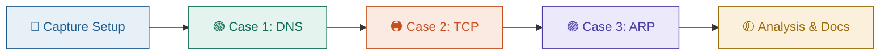

<br>

## 📊 At a Glance

| 🧩 Case Studies | 📦 Packets Analyzed | 🎯 Filters Used | 💰 Total Cost |
|:---:|:---:|:---:|:---:|
| **3** | **860,000+** | **6** | **$0** |

## 🖧 Environment

| Item | Value |
|---|---|
| Tool | Wireshark 4.6.8 |
| Interface | Wi-Fi |
| Local IP | `192.168.100.38` |
| Gateway | `192.168.100.1` |
| OS | Windows |

<p align="center"></p>

## 🌳 Case Structure

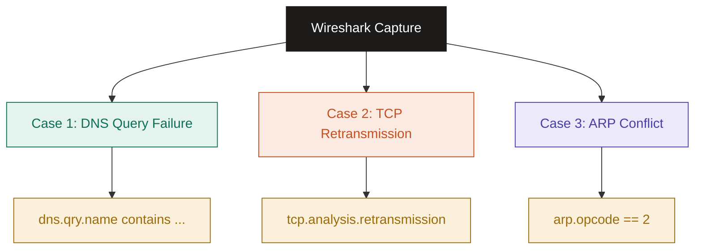

## ⏱️ Case Timeline

```mermaid
gantt
    title Case Studies — Sep 15, 2026
    dateFormat HH:mm
    axisFormat %H:%M
    section Case 1
    DNS Query Failure           :done, 09:00, 15m
    section Case 2
    TCP Retransmission          :done, 09:20, 45m
    section Case 3
    ARP Conflict                :done, 10:10, 20m
```

---

## 🔵 Setup

**Step 1 — Open Wireshark and start a capture** ✅
Selected the active **Wi-Fi** interface and started capturing live traffic.

<p align="center"></p>
<p align="center"></p>

**Step 2 — Confirm local network info** ✅
```
ipconfig
```
Noted the local IPv4 address (`192.168.100.38`), subnet mask, and default gateway before starting any test case.

<p align="center">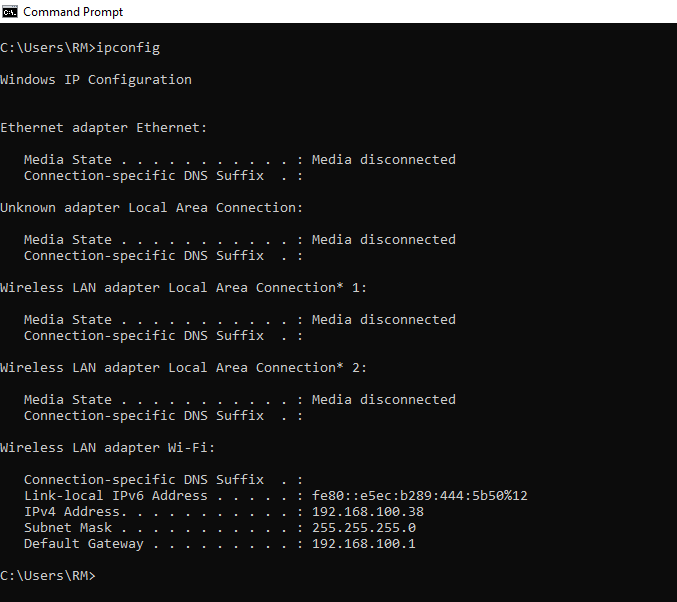</p>

---

## 🟢 Case 1: DNS Query Failure

**Goal:** Resolve a domain that doesn't exist, and use Wireshark to prove the DNS server returned NXDOMAIN.

**Step 3 — Trigger the failure** ✅
```
nslookup nonexistentdomain12345.com
```
The resolver immediately reported a non-existent domain.

<p align="center"></p>

**Step 4 — Filter and isolate the query** ✅
```
dns
dns.qry.name contains "nonexistentdomain"
```
<p align="center">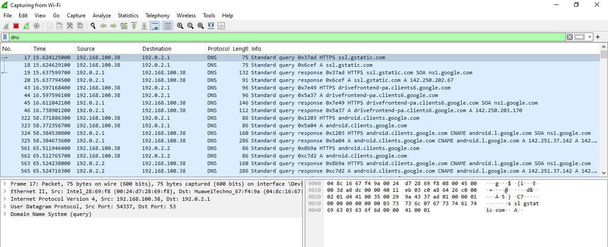</p>

**Step 5 — Inspect query and response packets** ✅
The query packet (`Standard query A/AAAA`) and its matching response were expanded to confirm the reply code.

<p align="center">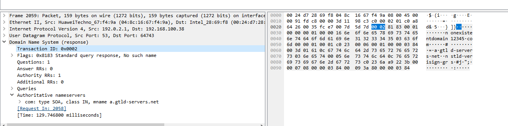</p>

🎯 **Root Cause**
The domain does not exist at the root/TLD level — the resolver's authoritative nameserver check confirmed it.

🔍 **Key Evidence**
| Field | Value |
|---|---|
| Query | `A`/`AAAA nonexistentdomain12345.com` |
| Response flags | `0x8183` — Standard query response, **No such name** |
| Authority section | SOA record from `a.gtld-servers.net` |

<p align="center">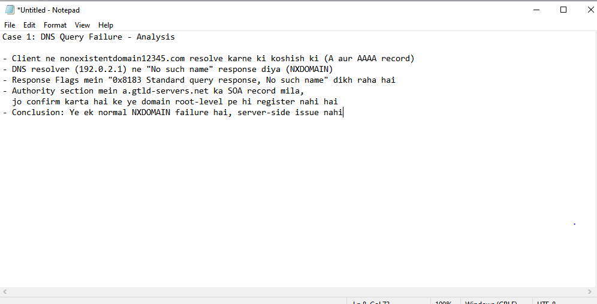</p>

---

## 🟠 Case 2: TCP Retransmission

**Goal:** Download a large file over a slow connection and capture TCP segments being retransmitted due to packet loss.

**Step 6 — Reset the capture** ✅
Restarted the capture (without saving) so Case 2 traffic wasn't mixed with Case 1's DNS packets.

<p align="center">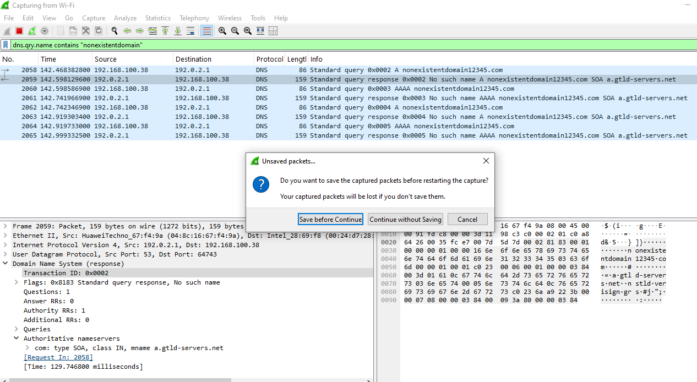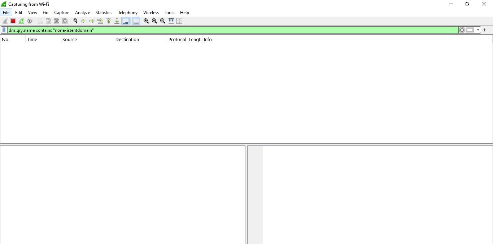</p>

**Step 7 — Generate slow-link traffic** ✅
Downloaded a 1 GB test file (`1Gb.dat`) at a throttled speed (~130 KB/s), giving TCP enough time to detect and retransmit lost segments.

**Step 8 — Filter for retransmissions** ✅
```
tcp.analysis.retransmission
```
Hundreds of `[TCP Fast Retransmission]` packets appeared for the download stream.

<p align="center"></p>

**Step 9 — Inspect a retransmitted segment** ✅
Expanded a flagged packet — the `Retransmitted TCP segment data` field confirms the segment was re-sent.

<p align="center">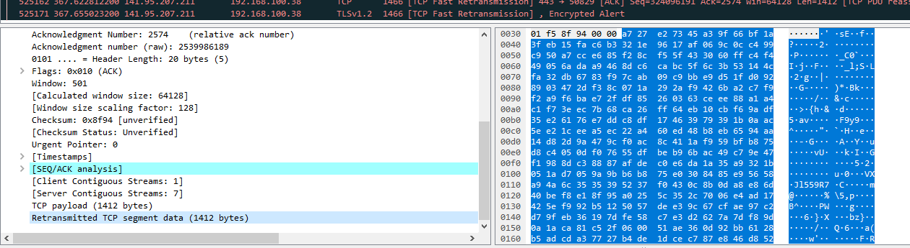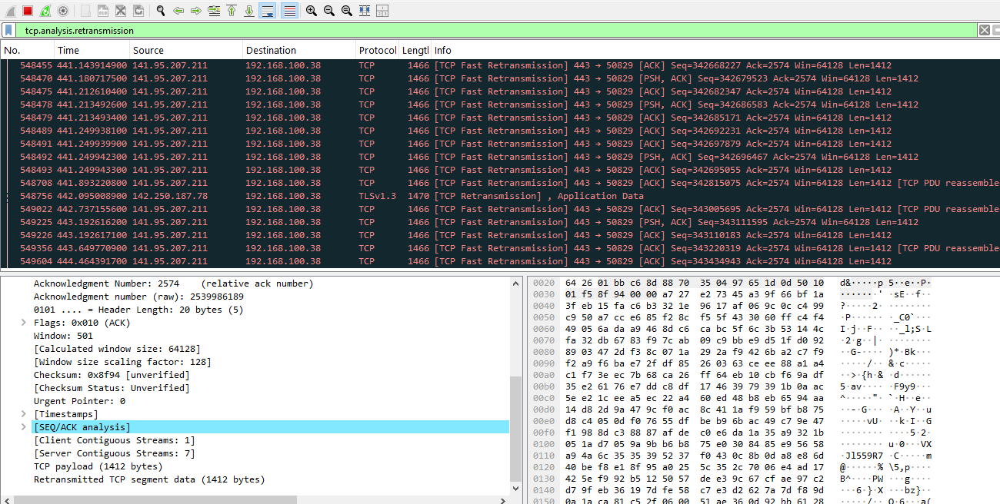</p>

🎯 **Root Cause**
The slow/congested link caused packet loss, so the server (`141.95.207.211:443`) never received timely ACKs and re-sent the same segments.

🔍 **Key Evidence**
| Field | Value |
|---|---|
| Filter | `tcp.analysis.retransmission` |
| Server | `141.95.207.211`, port 443 |
| Segment size | 1412 bytes per retransmitted packet |
| Marker | `Retransmitted TCP segment data` |

<p align="center"></p>

---

## 🟣 Case 3: ARP Conflict

**Goal:** Recreate an IP address conflict and use Wireshark to observe Windows' built-in duplicate-IP detection over ARP.

**Step 10 — Recreate the conflict** ✅
Manually reassigned the PC's own IPv4 address to the same address it already held (`192.168.100.38`) via the network adapter's TCP/IPv4 properties.

<p align="center"></p>

**Step 11 — Filter for ARP activity** ✅
```
arp
```
Windows sent an **ARP Probe** (checking if the address was already in use) followed by an **ARP Announcement** for `192.168.100.38`.

<p align="center">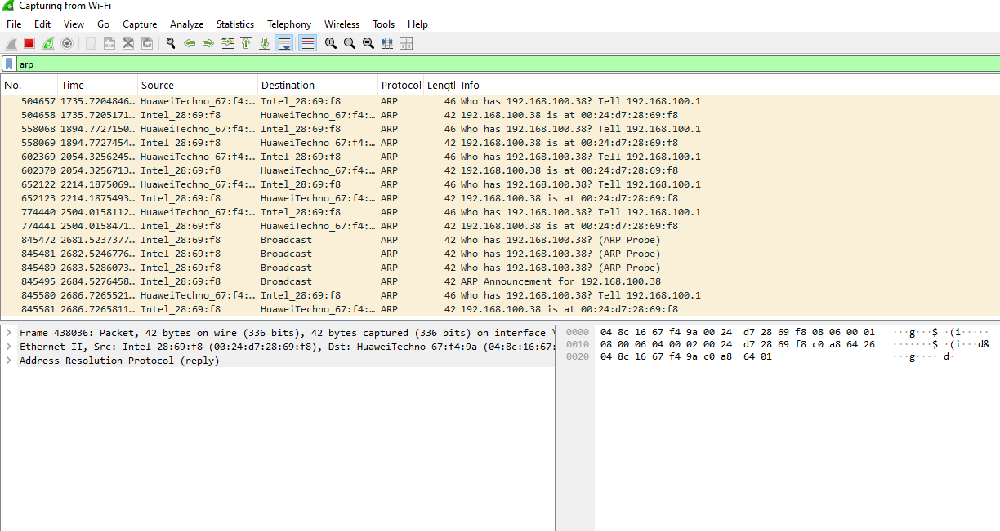</p>

**Step 12 — Check for a conflicting reply** ✅
```
arp.opcode == 2 && arp.src.proto_ipv4 == 192.168.100.38
```
Cross-checked against the live ARP table.

<p align="center">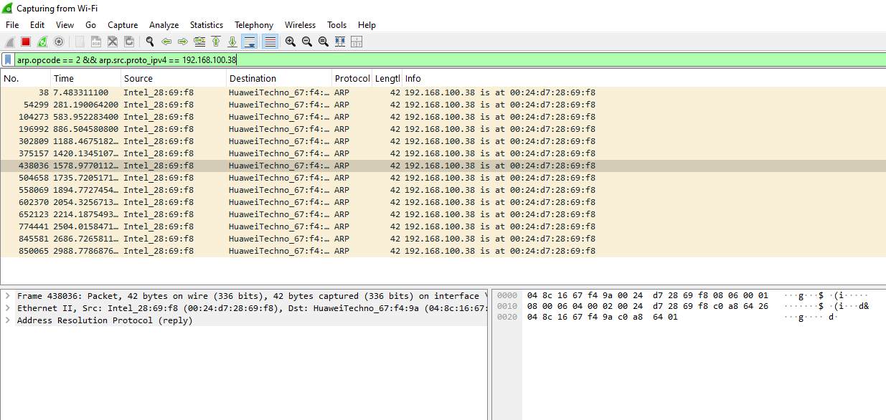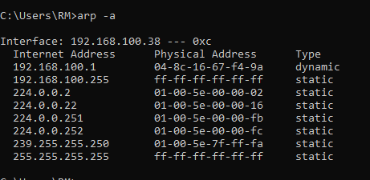</p>

🎯 **Root Cause / Observation**
All ARP replies for `192.168.100.38` came from a single MAC address (`00:24:d7:28:69:f8`) — the conflict was self-induced on one machine, so no cross-device clash appeared in this capture. In a real two-device conflict, this filter would show **two different MAC addresses** replying for the same IP, which is the actual signature of a live IP conflict.

<p align="center"></p>

---

## 📈 Capture-Wide Analysis

Beyond the three cases, the full capture was reviewed at a protocol level to see the overall traffic mix.

<p align="center">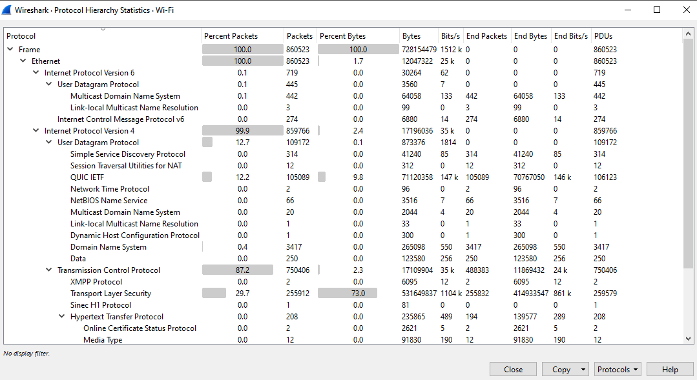</p>
<p align="center">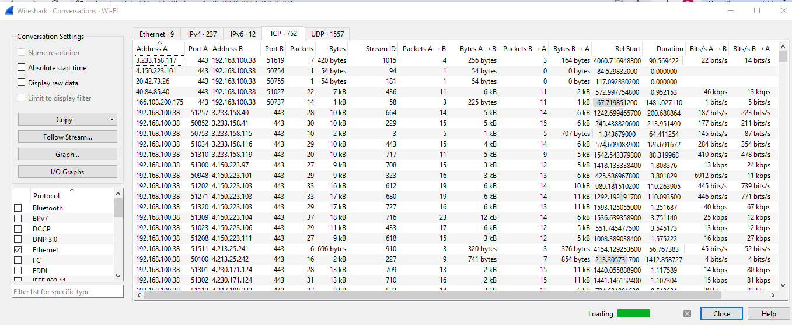</p>
<p align="center">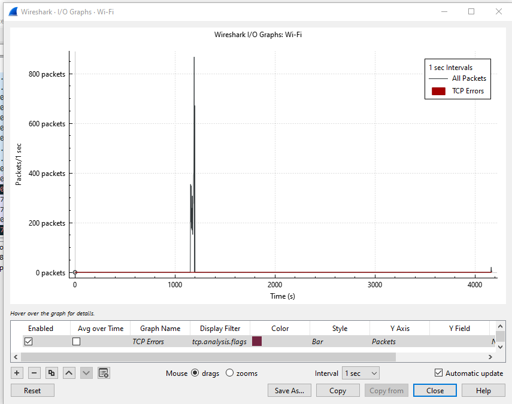</p>

| Tool | Purpose |
|---|---|
| Statistics → Protocol Hierarchy | Traffic breakdown across TCP, DNS, TLS, ARP |
| Statistics → Conversations → TCP | Identify the heaviest download stream |
| Statistics → I/O Graph | Visualize the traffic spike and TCP errors during the Case 2 download |

## 💾 Saved Capture

The live capture (860,000+ packets) was too large to save cleanly after such a long session, so a short verification capture was saved instead to confirm the save/export workflow.

<p align="center">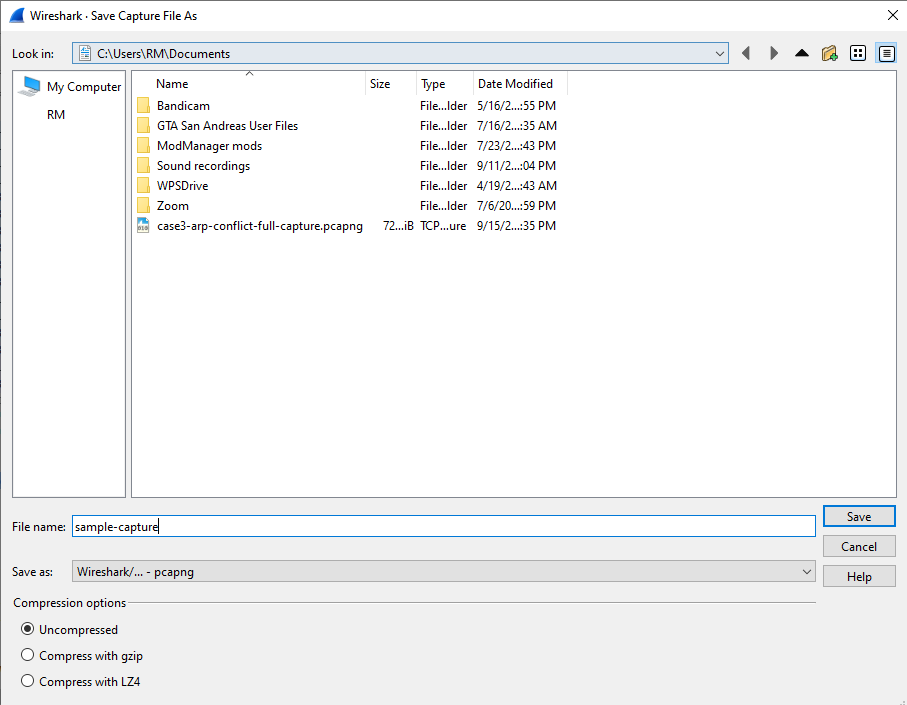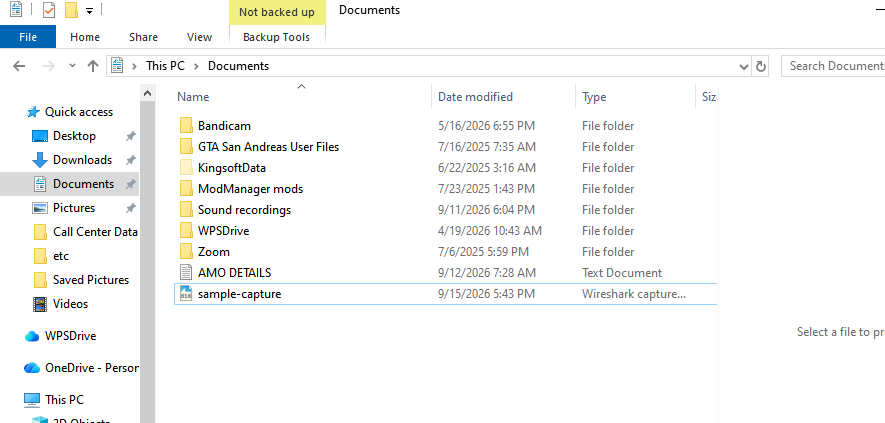</p>

## 📝 Project Summary

<p align="center"></p>

| Case | Filter Used | Finding |
|---|---|---|
| DNS Query Failure | `dns` | NXDOMAIN (`No such name`) confirmed via response flags |
| TCP Retransmission | `tcp.analysis.retransmission` | Slow link → packet loss → repeated segment re-sends |
| ARP Conflict | `arp.opcode == 2` | Windows ARP Probe/Announcement is the built-in duplicate-IP check |

---

## ⚠️ Challenges & Fixes

| ❌ Challenge | ✅ Fix |
|---|---|
| Filter left applied after restarting the capture, list showed 0 packets | Cleared the display filter before starting each new case |
| Large 1 GB test-file link wouldn't open in-browser | Switched to a Free Download Manager download of the same link |
| Saving the full 860k-packet capture produced a corrupt `.pcapng` | Took a short fresh capture and saved that instead to verify the export worked |
| No second device available to fully reproduce an ARP conflict | Documented the same-machine limitation and what a real two-MAC conflict would look like |

## 🧠 What I Learned
Hands-on packet-level troubleshooting for the three failure types Tier-2 support sees most often — DNS resolution failures, congestion-driven TCP retransmissions, and IP/ARP conflicts — including how to isolate the right traffic with display filters and read Wireshark's built-in analysis flags as evidence.

## 📁 Repo Structure
```
wireshark-case-studies-project/
├── README.md
├── index.html
└── screenshots/   (25 files)
```
